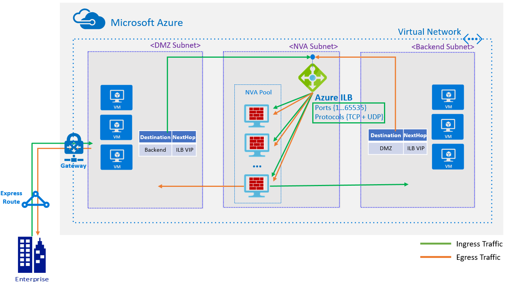
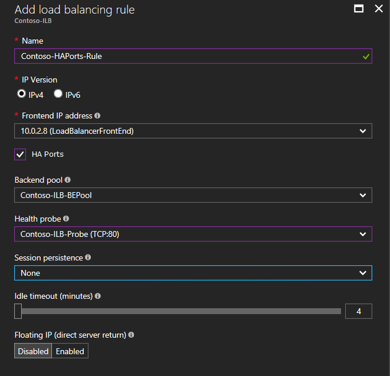

# Configure high-availability ports for an internal load balancer

This article provides an example deployment of high-availability ports on an internal load balancer. For more information on configurations specific to network virtual appliances (NVAs), see the corresponding provider websites.

>[!NOTE]
> The high-availability ports feature is currently in preview. During the preview, the feature might not have the same level of availability and reliability as features that are in general availability release. For more information, see [Microsoft Azure Supplemental Terms of Use for Microsoft Azure Previews](https://azure.microsoft.com/support/legal/preview-supplemental-terms/).

The illustration shows the following configuration of the deployment example described in this article:

- The NVAs are deployed in the back-end pool of an internal load balancer behind the high-availability ports configuration. 
- The UDR applied on the DMZ Subnet routes all traffic to the NVAs by making the next hop as the internal load balancer virtual IP. 
- The internal load balancer distributes the traffic to one of the active NVAs according to the load balancer algorithm.
- The NVA processes the traffic and forwards it to the original destination in the back-end subnet.
- The return path can take the same route if a corresponding UDR is configured in the back-end subnet. 




## Preview sign-up

To participate in the preview of the High-Availability Ports feature in Load Balancer Standard, register your subscription to gain access by using either Azure CLI 2.0 or PowerShell. Register your subscription for [Load Balancer Standard Preview](https://aka.ms/lbpreview#preview-sign-up).

>[!NOTE]
>Registration of the Load Balancer Standard previews can take up to an hour.

## Configure high-availability ports

To configure high-availability ports, set up an internal load balancer with the NVAs in the back-end pool. Set up a corresponding load balancer health probe configuration to detect NVA health and the load balancer rule with high-availability ports. The general load balancer-related configuration is covered in [Get started](load-balancer-get-started-ilb-arm-portal.md). This article highlights the high-availability ports configuration.

The configuration essentially involves setting the front-end port and the back-end port value to **0**. Set the protocol value to **All**. This article describes how to configure high availability ports by using the Azure portal, PowerShell, and Azure CLI 2.0.

### Configure a high-availability ports load balancer rule with the Azure portal

To configure high-availability ports by using the Azure portal, select the **HA Ports** check box. When selected, the related port and protocol configuration is automatically populated. 




### Configure a high-availability ports load-balancing rule via the Resource Manager template

You can configure high-availability ports by using the 2017-08-01 API version for Microsoft.Network/loadBalancers in the load balancer resource. The following JSON snippet illustrates the changes in the load balancer configuration for high-availability ports via the REST API:

```json
    {
        "apiVersion": "2017-08-01",
        "type": "Microsoft.Network/loadBalancers",
        ...
        "sku":
        {
            "name": "Standard"
        },
        ...
        "properties": {
            "frontendIpConfigurations": [...],
            "backendAddressPools": [...],
            "probes": [...],
            "loadBalancingRules": [
             {
                "properties": {
                    ...
                    "protocol": "All",
                    "frontendPort": 0,
                    "backendPort": 0
                }
             }
            ],
       ...
       }
    }
```

### Configure a high-availability ports load balancer rule with PowerShell

Use the following command to create the high-availability ports load balancer rule while you create the internal load balancer with PowerShell:

```powershell
lbrule = New-AzureRmLoadBalancerRuleConfig -Name "HAPortsRule" -FrontendIpConfiguration $frontendIP -BackendAddressPool $beAddressPool -Probe $healthProbe -Protocol "All" -FrontendPort 0 -BackendPort 0
```

### Configure a high-availability ports load balancer rule with Azure CLI 2.0

In step 4 of [Create an internal Load Balancer Set](load-balancer-get-started-ilb-arm-cli.md), use the following command to create the high-availability ports load balancer rule:

```azurecli
azure network lb rule create --resource-group contoso-rg --lb-name contoso-ilb --name haportsrule --protocol all --frontend-port 0 --backend-port 0 --frontend-ip-name feilb --backend-address-pool-name beilb
```

## Next steps

Learn more about [high-availability ports](load-balancer-ha-ports-overview.md).
