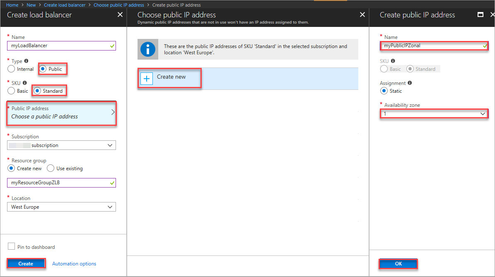

#  Create a public Load Balancer Standard with zonal Public IP address frontend using Azure portal

This article steps through creating a public [Load Balancer Standard](https://aka.ms/azureloadbalancerstandard) with a zonal frontend. 

If you don't have an Azure subscription, create a [free account](https://azure.microsoft.com/free/?WT.mc_id=A261C142F) before you begin.

> [!NOTE]
 Support for Availability Zones is available for select Azure resources and regions, and VM size families. For more information on how to get started, and which Azure resources, regions, and VM size families you can try availability zones with, see [Overview of Availability Zones](https://docs.microsoft.com/azure/availability-zones/az-overview). For support, you can reach out on [StackOverflow](https://stackoverflow.com/questions/tagged/azure-availability-zones) or [open an Azure support ticket](../azure-supportability/how-to-create-azure-support-request.md?toc=%2fazure%2fvirtual-network%2ftoc.json).  

## Log in to Azure 

Log in to the Azure portal at https://portal.azure.com.

## Create a load balancer with zonal frontend IP address

1. From a browser navigate to the Azure portal: [http://portal.azure.com](http://portal.azure.com) and login with your Azure account.
2. On the top left-hand side of the screen, select **Create a resource** > **Networking** > **Load Balancer.**
3. In the **Create load balancer** page, under **Name** type **myLoadBalancer**.
4. Under **Type**, select **Public**.
5. Under SKU, select **Standard**.
6. Click **Choose a Public IP address**, click **Create new**, and in **Create public IP address** page, under name, type **myPublicIPZonal**, for SKU, select **Standard**, for Availability zone, select **1**.
    >[!NOTE] 
    > The public IP created in this step is of Standard SKU by default. 
7. For **Resource group**, click **Create new**, and then type **myResourceGroupZLB** as the name of the resource group.
8. For **Location**, select **West Europe**, and then click **OK**. The load balancer then starts to deploy and takes a few minutes to successfully complete deployment.

    

## Next steps
- Learn more about [Standard Load Balancer and Availability zones](load-balancer-standard-availability-zones.md).

