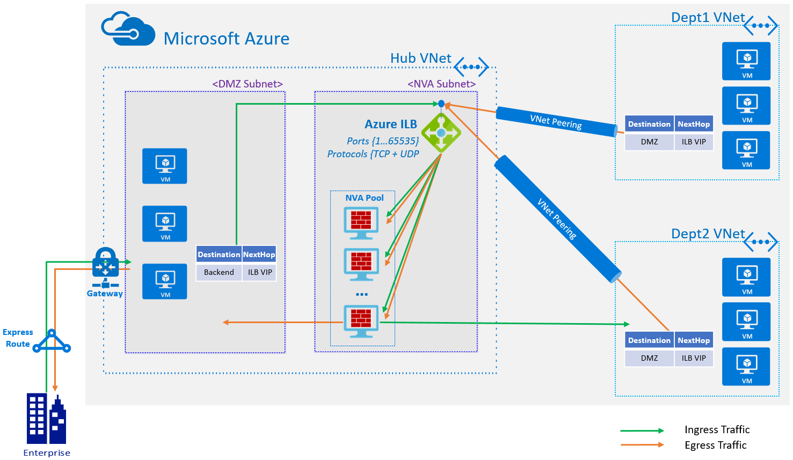

# High Availability Ports overview (Preview)

The Standard SKU of Azure Load Balancer introduces high availability (HA) ports - a capability to distribute traffic from all ports, and for all supported protocols. While configuring an Internal Load Balancer, users can configure an HA Ports rule that can set the frontend and backend ports to **0** and protocol to **all**, and thus allow all the traffic to flow through the Internal Load Balancer.

>[!NOTE]
> High Availability Ports feature is available with Load Balancer Standard and currently in preview. During preview, the feature may not have the same level of availability and reliability as features that are in general availability release. For more information, see [Microsoft Azure Supplemental Terms of Use for Microsoft Azure Previews](https://azure.microsoft.com/support/legal/preview-supplemental-terms/). It is necessary to sign up for the Load Balancer Standard Preview to use HA Ports with Load Balancer Standard resources. Please follow the instructions for sign-up in addition to Load Balancer [Standard Preview](https://aka.ms/lbpreview#preview-sign-up) as well.

The load balancing algorithm still remains the same and the destination is selected based in the five touples <Source IP Address, Source Port, Destination IP Address, Destination Port, Protocol>. But this configuration allows for a single LB rule to process all available traffic, and reduces configuration complexity as well as any limits imposed by the maximum number of Load Balancing rules that one can add.

One of the critical scenarios HA ports enables is the high availability deployment of the Network Virtual Appliances in Azure virtual networks. In addition, another common scenario that HA ports enables is load balancing for a range of ports. 

## Why use high HA ports

Azure customers rely heavily on the network virtual appliances (NVAs) for securing their workloads from multiple types of security threats. In addition, the NVAs must be reliable and highly available.  

HA ports reduce the complexity of NVA HA scenario by eliminating the need for more complex solutions like zookeeper, and increases the reliability by quicker failover and scale-out options. You can now achieve NVA HA by adding NVAs in the backend pool of the Azure internal Load Balancer, and then configuring the HA port Load Balancer rule.

The following example presents a hub-and-spoke virtual network deployment, with the spokes force tunneling their traffic to the hub virtual network and via the NVA before leaving the trusted space. The NVAs are behind an Internal Load Balancer with HA Ports configuration, thus can process all the traffic and forward accordingly. 



Figure 1 - Hub-and-spoke virtual network with NVAs deployed in HA mode


## Region availability

HA ports is currently available in the following regions:
- East US 2
- Central US
- North Europe
- West Central US
- West Europe
- Southeast Asia 

## Preview sign-up

To participate in the Preview of the HA ports feature in Load Balancer Standard SKU, register your subscription to gain access using either Azure CLI 2.0 or PowerShell.  Please follow these 3 steps below:

>[!NOTE]
>To use this feature, you must also sign-up for Load Balancer [Standard Preview](https://aka.ms/lbpreview#preview-sign-up) in addition to HA Ports. Registration of the HA Ports or Load Balancer Standard previews may take up to an hour.


### Sign up using Azure CLI 2.0

1. Register the feature with the provider
    ```cli
    az feature register --name AllowILBAllPortsRule --namespace Microsoft.Network
    ```
    
2. The above operation can take up to 10 minutes to complete.  You can check the status of the operation with the following command:

    ```cli
    az feature show --name AllowILBAllPortsRule --namespace Microsoft.Network
    ```
    
    Please proceed to step 3 when the feature registration state returns 'Registered' as shown below:
   
    ```json
    {
       "id": "/subscriptions/foo/providers/Microsoft.Features/providers/Microsoft.Network/features/AllowLBPreview",
       "name": "Microsoft.Network/AllowILBAllPortsRule",
       "properties": {
          "state": "Registered"
       },
       "type": "Microsoft.Features/providers/features"
    }
    ```
    
3. Please complete the preview sign-up by re-registering your subscription with the resource provider:

    ```cli
    az provider register --namespace Microsoft.Network
    ```
    
### Sign up using PowerShell

1. Register the feature with the provider
    ```powershell
    Register-AzureRmProviderFeature -FeatureName AllowILBAllPortsRule -ProviderNamespace Microsoft.Network
    ```
    
2. The above operation can take up to 10 minutes to complete.  You can check the status of the operation with the following command:

    ```powershell
    Get-AzureRmProviderFeature -FeatureName AllowILBAllPortsRule -ProviderNamespace Microsoft.Network
    ```
    Please proceed to step 3 when the feature registration state returns 'Registered' as shown below:
   
    ```
    FeatureName          ProviderName      RegistrationState
    -----------          ------------      -----------------
    AllowILBAllPortsRule Microsoft.Network Registered
    ```
    
3. Please complete the preview sign-up by re-registering your subscription with the resource provider:

    ```powershell
    Register-AzureRmResourceProvider -ProviderNamespace Microsoft.Network
    ```


## Limitations

Following are the supported configurations or exceptions for HA Ports:

- A single frontend IP Configuration can have a single DSR Load Balancer rule with HA ports (all ports), or it can have a single non-DSR load balancer rule with HA ports (all ports). It cannot have both.
- A single Network Interface IP configuration can only have one non-DSR load balancer rule with HA ports. No other rules can be configured for this ipconfig.
- A single Network Interface IP configuration can have one or more DSR load balancer rules with HA ports, provided all of their respective frontend ip configurations are unique.
- Two (or more) Load Balancer rules pointing to the same backend pool can co-exist if all of the load balancing rules are HA port (DSR only), or, all of the rules are non-HA port (DSR & non-DSR). Two such LB rules cannot co-exist if there is a combination of HA port and non-HA Port rules.
- HA port on IPv6-enabled tenant is not available.


## Next Steps

[Configure HA Ports on an Internal Load balancer](load-balancer-configure-ha-ports.md)

