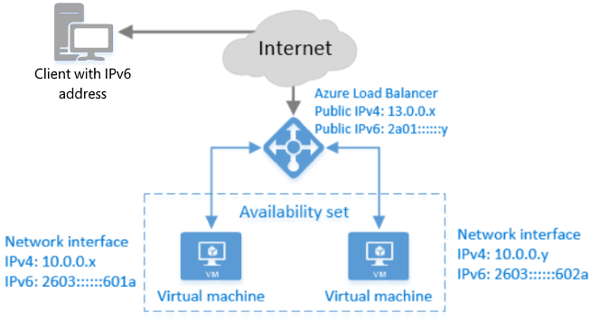

# Overview of IPv6 for Azure Load Balancer

>[!NOTE] 
>This content has been replaced by [IPv6 for Azure VNet Overview](https://docs.microsoft.com/azure/virtual-network/ipv6-overview). New deployments of Azure Load Balancer with IPv6 support should use the new IPv6 features in Azure Virtual Networks.

>[!NOTE]
>Azure Load Balancer supports two different types: Basic and Standard. This article discusses Basic Load Balancer. For more information about Standard Load Balancer, see [Standard Load Balancer overview](load-balancer-standard-overview.md).

Basic SKU Internet-facing load balancers can be deployed with an IPv6 address. In addition to IPv4 connectivity, this enables the following capabilities:

* Native end-to-end IPv6 connectivity between public Internet clients and Azure Virtual Machines (VMs) through the load balancer.
* Native end-to-end IPv6 outbound connectivity between VMs and public Internet IPv6-enabled clients.

The following picture illustrates the IPv6 functionality for Azure Load Balancer.

Once deployed, an IPv4 or IPv6-enabled Internet client can communicate with the public IPv4 or IPv6 addresses (or hostnames) of the Azure Internet-facing Load Balancer. The load balancer routes the IPv6 packets to the private IPv6 addresses of the VMs using network address translation (NAT). The IPv6 Internet client cannot communicate directly with the IPv6 address of the VMs.

## Features

Native IPv6 support for VMs deployed via Azure Resource Manager provides:

1. Load-balanced IPv6 services for IPv6 clients on the Internet
2. Native IPv6 and IPv4 endpoints on VMs ("dual stacked")
3. Inbound and outbound-initiated native IPv6 connections
4. Supported protocols such as TCP, UDP, and HTTP(S) enable a full range of service architectures

## Benefits

This functionality enables the following key benefits:

* Meet government regulations requiring that new applications be accessible to IPv6-only clients
* Enable mobile and Internet of things (IOT) developers to use dual-stacked (IPv4+IPv6) Azure Virtual Machines to address the growing mobile & IOT markets

## Details and limitations

Details

* The Azure DNS service contains both IPv4 A and IPv6 AAAA name records and responds with both records for the load balancer. The client chooses which address (IPv4 or IPv6) to communicate with.
* When a VM initiates a connection to a public Internet IPv6-connected device, the VM's source IPv6 address is network address translated (NAT) to the public IPv6 address of the load balancer.
* VMs running the Linux operating system must be configured to receive an IPv6 IP address via DHCP. Many of the Linux images in the Azure Gallery are already configured to support IPv6 without modification. For more information, see [Configuring DHCPv6 for Linux VMs](load-balancer-ipv6-for-linux.md)
* If you choose to use a health probe with your load balancer, create an IPv4 probe and use it with both the IPv4 and IPv6 endpoints. If the service on your VM goes down, both the IPv4 and IPv6 endpoints are taken out of rotation.

Limitations

* You cannot add IPv6 load balancing rules in the Azure portal. The rules can only be created through the template, CLI, PowerShell.
* You may not upgrade existing VMs to use IPv6 addresses. You must deploy new VMs.
* A single IPv6 address can be assigned to a single network interface in each VM.
* The public IPv6 addresses cannot be assigned to a VM. They can only be assigned to a load balancer.
* You cannot configure the reverse DNS lookup for your public IPv6 addresses.
* The VMs with the IPv6 addresses cannot be members of an Azure Cloud Service. They can be connected to an Azure Virtual Network (VNet) and communicate with each other over their IPv4 addresses.
* Private IPv6 addresses can be deployed on individual VMs in a resource group but cannot be deployed into a resource group via Scale Sets.
* Azure VMs cannot connect over IPv6 to other VMs, other Azure services, or on-premises devices. They can only communicate with the Azure load balancer over IPv6. However, they can communicate with these other resources using IPv4.
* Network Security Group (NSG) protection for IPv4 is supported in dual-stack (IPv4+IPv6) deployments. NSGs do not apply to the IPv6 endpoints.
* The IPv6 endpoint on the VM is not exposed directly to the internet. It is behind a load balancer. Only the ports specified in the load balancer rules are accessible over IPv6.
* Changing the IdleTimeout parameter for IPv6 is **currently not supported**. The default is four minutes.
* Changing the loadDistributionMethod parameter for IPv6 is **currently not supported**.
* Reserved IPv6 IPs (where IPAllocationMethod = static) are **currently not supported**.
* NAT64 (translation of IPv6 to IPv4) is not supported.
* Standard SKU Load Balancers do not currently support IPv6 addresses.

## Next steps

Learn how to deploy a load balancer with IPv6.

* [Availability of IPv6 by region](https://go.microsoft.com/fwlink/?linkid=828357)
* [Deploy a load balancer with IPv6 using a template](load-balancer-ipv6-internet-template.md)
* [Deploy a load balancer with IPv6 using Azure PowerShell](load-balancer-ipv6-internet-ps.md)
* [Deploy a load balancer with IPv6 using Azure CLI](load-balancer-ipv6-internet-cli.md)
