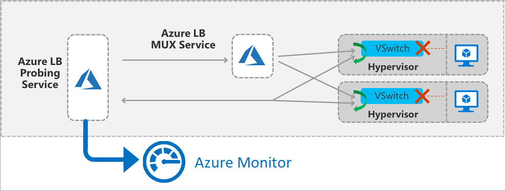
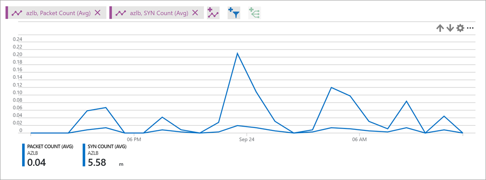
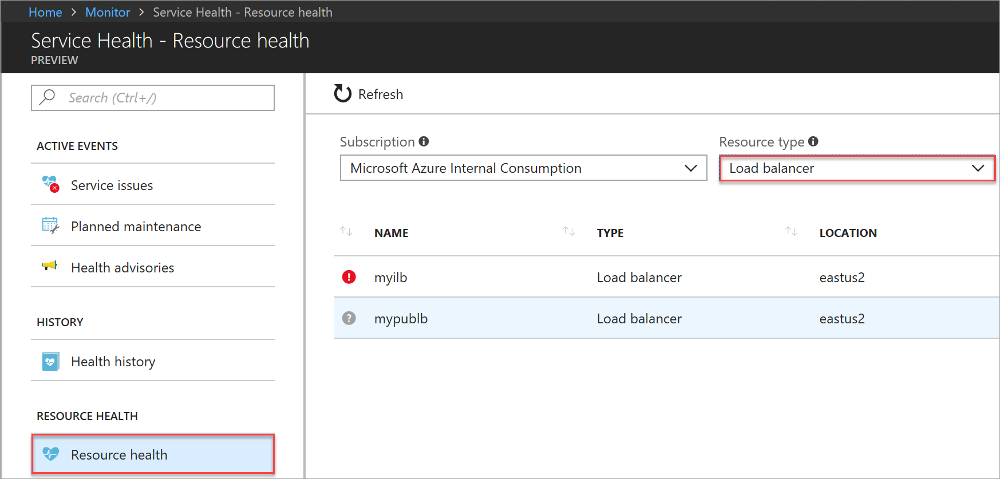
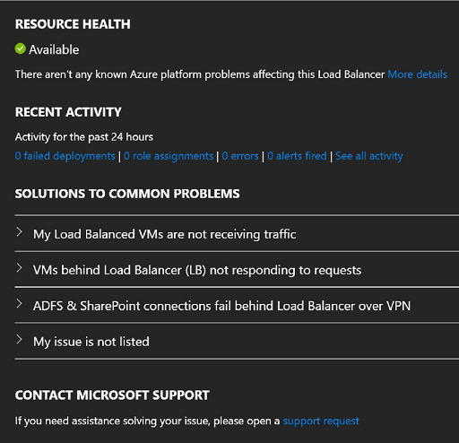

# Metrics and health diagnostics for Standard Load Balancer

Azure Standard Load Balancer provides the following diagnostic capabilities for your resources:
* Multi-Dimensional Metrics: Standard Load Balancer provides new multi-dimensional diagnostic capabilities for both public and internal Load Balancer configurations. This enables you to monitor, manage, and troubleshoot your Load Balancer resources.

* Resource Health: The Load Balancer page in the Azure portal and the Resource Health page (under Monitor) expose the Resource Health for the Public Load Balancer configuration of the Standard Load Balancer.

This article provides a quick tour of these capabilities, and ways to use these for Standard Load Balancer.

## Multi-dimensional metrics

Azure Load Balancer provides the new multi-dimensional metrics via the new Azure Metrics (preview) in portal, and helps you get real-time diagnostic insights into your Load Balancer resources. 

Following metrics are available for different Standard Load Balancer (LB) configurations today:

| Metric | Resource type | Description | Recommended aggregation |
| --- | --- | --- | --- |
| VIP availability (Data path availability) | Public LB | Standard Load Balancer continuously exercises the data path from within a region to the Load Balancer frontend all the way to the SDN stack that supports your VM. As long as healthy instances remain, the measurement follows the same path as your application's load-balanced traffic. The data path that is used by your customers is also validated. The measurement is invisible to your application and does not interfere with other operations.| Average |
| DIP availability (Health probe status) |  Public & Internal LB | Standard Load Balancer uses a distributed health probing service that monitors your application endpoint's health according to your configuration settings. This metric provides an aggregate or per endpoint filtered-view of each individual instance endpoint in the Load Balancer pool.  You can see how Load Balancer views the health of your application as indicated by your health probe configuration. |  Average |
| SYN packets |  Public LB | Standard Load Balancer does not terminate TCP connections or interact with TCP or UDP packet flows. Flows and their handshakes are always between the source and the VM instance. To better troubleshoot your TCP protocol scenarios, you can make use of SYN packets counters to understand how many TCP connection attempts are made. The metric reports the number of TCP SYN packets that were received.| Average |
| SNAT connections |  Public LB |Standard Load Balancer reports the number of outbound flows that are masqueraded to the Public IP address frontend. SNAT ports are an exhaustible resource. This metric can give an indication of how heavily your application is relying on SNAT for outbound originated flows.  Counters for successful and failed outbound SNAT flows are reported and can be used to troubleshoot and understand the health of your outbound flows.| Average |
| Byte counters |  Public & Internal LB | Standard Load Balancer reports the data processed per frontend.| Average |
| Packet counters |  Public & Internal LB | Standard Load Balancer reports the packets processed per frontend.| Average |

### View Load Balancer metrics in the portal

Azure portal exposes the Load Balancer metrics via the Metrics (Preview) page, which is available in the Load Balancer Resource page for a particular Load Balancer resource, and also in the Azure Monitor page. 

To view the metrics for your Standard Load Balancer resources, browse of Metrics (preview) at either of these locations, select the (load balancer resource if under Monitor page) Metric type from the drop-down, set the appropriate Aggregation type, and optionally, configure the required filtering and grouping and you'll be able to see the historical view for the metrics under the provided conditions.

**Figure - DIP Availability / Health probe status metric for Load Balancer**

### Retrieve multi-dimensional metrics programmatically via APIs

API guidance for retrieving the Multi-Dimensional Metric definitions and values is available at [Monitoring REST API Walkthrouh > Multi-Dimensional API](https://docs.microsoft.com/azure/monitoring-and-diagnostics/monitoring-rest-api-walkthrough#retrieve-metric-definitions-multi-dimensional-api)

### Common diagnostic scenarios and recommended views

#### Is the data path up and available for my Load Balancer VIP?

VIP availability metric describes the health of the data path within the region to the compute host where your VMs are located. It's a reflection health of the Azure infrastructure. You can use this metric to:
- Monitor the external availability of your service
- Dig deeper and understand whether the platform on which your service is deployed is healthy or whether your guest OS or application instance are healthy
- Isolate whether an event is related to your service or the underlying data plane. Do not confuse this with the health probe status ("DIP availability").

To get the VIP availability for your Standard Load Balancer resources:
- Make sure the correct Load Balancer resource is selected. 
- Select **VIP Availability** from the **Metric** dropdown. 
- Select **Avg** for **Aggregation**. 
- Additionally, add filter on the VIP address or VIP port as the dimension with the required frontend IP address or frontend port, and group by the selected dimension.

**Figure - Load Balancer VIP probing details**

The metric is generated by an active, in-band measurement. A probing service within the region originates traffic for this measurement and is activated as soon as you create a deployment with a public frontend and continues until you remove the frontend. 

>[!NOTE]
>Internal frontends are not supported at this time. 

A packet matching your deployment's frontend and rule is generated periodically. It traverses the region from the source to the host where a VM in the backend pool is located. The Load Balancer infrastructure will perform the same load balancing and translation operations as it does for all other traffic. This probe is in-band on your load balanced endpoint. Once the probe arrives on the Compute host where a healthy VM in the backend pool is located, the Compute host will generate a response to the probing service. Your VM does not see this traffic.
VIP availability fails for the following reasons:
- Your deployment has no healthy VMs remaining in the backend pool. 
- An infrastructure outage has occurred that causes VIP availability to fail.

You can use the [VIP availability metric together with the health probe status for diagnostic purposes](https://aka.ms/lbdiagnostics#vipavailabilityandhealthprobes).

Use **Average** as the aggregation for most scenarios.

#### Are the backend instances for my VIP responding to probes?

Health probe status metric describes the health of your application deployment as configured by you when you configure the health probe of Load Balancer. Load Balancer uses the status of the health probe to determine where to send new flows. Health probes originate from an Azure infrastructure address and are visible within the guest OS of the VM.

To get the DIP availability for your Standard Load Balancer resources,
- Select the **DIP Availability** Metric with **Avg** aggregation type. 
- Apply a filter on the required VIP IP address or port (or both).

**Figure - VIP availability for Load Balancer**

Health probes fail for the following reasons:
- if you configure a health probe to a port that is not listening or not responding or with the wrong protocol. If your service is using DSR (Floating IP) rules, you need to make sure that your service is listening on the IP address of the NIC's IP configuration and not just on the loopback configured with the frontend IP address.
- if your probe is not permitted by the Network Security Group, the VM's guest OS firewall, or the application layer filters.

Use **Average** as the aggregation for most scenarios.

#### How do I check my outbound connection statistics? 

SNAT Connections metric describes the volume of successful and failed (for [outbound flows](https://aka.ms/lboutbound)).

A failed connections volume greater than zero indicates SNAT port exhaustion. You must investigate further and determine what may be causing these failures. SNAT port exhaustion manifests as failures to establish an [outbound flows](https://aka.ms/lboutbound). Review the article on outbound connections to understand the scenarios, mechanisms at work, and how to mitigate / design to avoid SNAT port exhaustion. 

To get SNAT connection statistics,
- select **SNAT Connections** metric type and **Sum** as aggregation. 
- group by **Connection State** for successful and failed SNAT Connection counts represented by different lines. 

**Figure - SNAT Connection Count for Load Balancer**

#### How do I check inbound / outbound connection attempts for my service?

SYN Packets metric describes the volume of TCP SYN packets, which have arrived or were sent (for [outbound flows](https://aka.ms/lboutbound)) associated with a given frontend. This metric can be used to understand TCP connection attempts to your service.
Use Total as the aggregation for most scenarios.

**Figure - SYN Count for Load Balancer**

#### How do I check my network bandwidth consumption? 

Byte / Packet Counters metric describes the volume of bytes and packets sent or received by your service on a per frontend basis.
Use **Total** as the aggregation for most scenarios.

To get Byte or Packet count statistics
- Select the **Bytes Count** and / or **Packet Count** metric type with **Avg** as the aggregation. 
- Apply filter on a specific frontend IP, frontend port or backend IP or port in question. 
- or get overall statistics for Load Balancer Resource without any filtering.

Some example views for metrics with different configurations -

**Figure - Byte Count for Load Balancer**

#### How do I diagnose my Load Balancer deployment?

The combination of the VIP availability & Health Probes metrics on a single chart can allow you to identify where to look for the problem and resolve the problem. You can gain assurance that Azure is working correctly and use this to conclusively determine the configuration or application is the root cause.

You can use health probe metrics to understand how Azure views the health of your deployment as per the configuration you have provided. Looking at health probes is always a great first step in monitoring or determining a cause.

You can take a step further and use VIP availability metrics to gain insight into how the Azure views the health of the underlying data plane responsible for your specific deployment. When you combine both metrics, you can isolate where the fault may be as illustrated in this example:

**Figure - Combining DIP and VIP availability metrics**

The chart shows the following information:
- The infrastructure itself was healthy, the infrastructure hosting your VMs was reachable, and more than one VM was placed in the backend. This is indicated by the blue trace for VIP availability, which shows at 100%. 
- However, health probe status (DIP Availability) is at 0% at the beginning of the chart as indicated by the orange trace. The circled area in red highlights where health probes (DIP Availability) became healthy, and at which point the customer's deployment was able to accept new flows.

The chart allowed the customer to troubleshoot the deployment on their own without having to guess or ask support whether there were other issues occurring. The customer's service was unavailable because health probes were failing due either a misconfiguration or a failed application.

### Limitations

- VIP availability is currently available only for public frontends.

## Resource Health Status

Health status for the Standard Load Balancer resources is exposed via the existing **Resource Health** under **Monitor > Service Health**.

>[!NOTE]
>The Resource Health for Load Balancer is currently available for Public configuration of the Standard Load Balancer only. Internal Load Balancer resources or Basic SKU of Load Balancer resources do not expose resource health.

To view the health of your Public Standard Load Balancer resources,
 - Browse to  **Monitor > Service Health**.

    

    **Figure - Service health on Azure Monitor**

 - Select **Resource Health** and make sure correct **Subscription ID** and **Resource Type = Load Balancer** is selected.

    

    **Figure  - Resource Health**

   

   **Figure - Select resource for health view**

 - Click on the Load Balancer resource from the list to view their historical health status.

    

   **Figure  - Load Balancer resource heath view**
 
The following table lists the various resource health status and their descriptions. 

| Resource Health Status | Description |
| --- | --- |
| Available | Your Public Standard Load Balancer resource is healthy and available |
| Unavailable | Your Public Standard Load Balancer resource is not healthy. Diagnose the health via Azure Monitor > Metrics. (*This might also mean that Resource is not Public Standard Load Balancer*) |
| Unknown | Resource Health for your Public Standard Load Balancer has not been updated yet. (*This might also mean that Resource is not Public Standard Load Balancer*)  |

## Next Steps

- Learn more about [Standard Load Balancer](load-balancer-standard-overview.md)
- Learn more about [Load Balancer Outbound connectivity](https://aka.ms/lboutbound)

