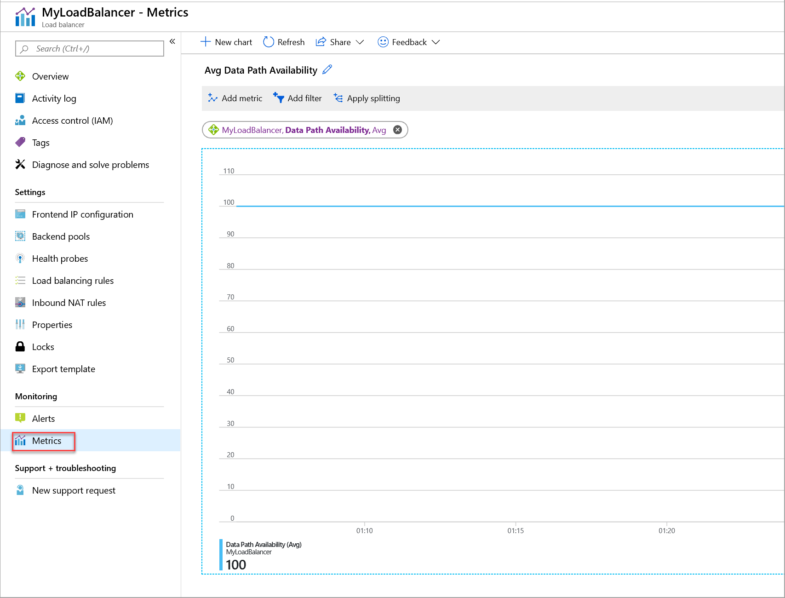
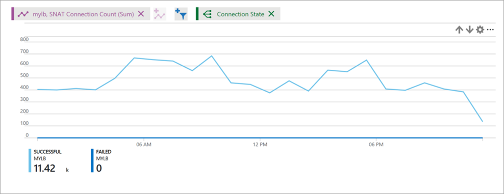
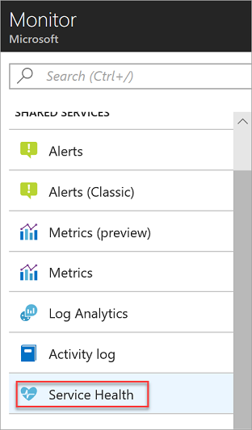

# Standard Load Balancer diagnostics with metrics, alerts and resource health

Azure Standard Load Balancer exposes the following diagnostic capabilities:

* **Multi-dimensional metrics and alerts**: Provides multi-dimensional diagnostic capabilities through [Azure Monitor](https://docs.microsoft.com/azure/azure-monitor/overview) for standard load balancer configurations. You can monitor, manage, and troubleshoot your standard load balancer resources.

* **Resource health**: The Load Balancer page in the Azure portal and the Resource Health page (under Monitor) expose the Resource Health section for Standard Load Balancer. 

This article provides a quick tour of these capabilities, and it offers ways to use them for Standard Load Balancer. 

## Multi-dimensional metrics

Azure Load Balancer provides multi-dimensional metrics via the Azure Metrics in the Azure portal, and it helps you get real-time diagnostic insights into your load balancer resources. 

The various Standard Load Balancer configurations provide the following metrics:

| Metric | Resource type | Description | Recommended aggregation |
| --- | --- | --- | --- |
| Data path availability (VIP availability)| Public and internal load balancer | Standard Load Balancer continuously exercises the data path from within a region to the load balancer front end, all the way to the SDN stack that supports your VM. As long as healthy instances remain, the measurement follows the same path as your application's load-balanced traffic. The data path that your customers use is also validated. The measurement is invisible to your application and does not interfere with other operations.| Average |
| Health probe status(DIP availability) | Public and internal load balancer | Standard Load Balancer uses a distributed health-probing service that monitors your application endpoint's health according to your configuration settings. This metric provides an aggregate or per-endpoint filtered view of each instance endpoint in the load balancer pool. You can see how Load Balancer views the health of your application, as indicated by your health probe configuration. |  Average |
| SYN (synchronize) packets | Public and internal load balancer | Standard Load Balancer does not terminate Transmission Control Protocol (TCP) connections or interact with TCP or UDP packet flows. Flows and their handshakes are always between the source and the VM instance. To better troubleshoot your TCP protocol scenarios, you can make use of SYN packets counters to understand how many TCP connection attempts are made. The metric reports the number of TCP SYN packets that were received.| Average |
| SNAT connections | Public load balancer |Standard Load Balancer reports the number of outbound flows that are masqueraded to the Public IP address front end. Source network address translation (SNAT) ports are an exhaustible resource. This metric can give an indication of how heavily your application is relying on SNAT for outbound originated flows. Counters for successful and failed outbound SNAT flows are reported and can be used to troubleshoot and understand the health of your outbound flows.| Average |
| Allocated SNAT ports | Public load balancer | Standard Load Balancer reports the number of SNAT ports allocated per backend instance | Average. |
| Used SNAT ports | Public load balancer | Standard Load Balancer reports the number of SNAT ports that are utilized per backend instance. | Average | 
| Byte counters |  Public and internal load balancer | Standard Load Balancer reports the data processed per front end. You may notice that the bytes are not distributed equally across the backend instances. This is expected as Azure's Load Balancer algorithm is based on flows | Average |
| Packet counters |  Public and internal load balancer | Standard Load Balancer reports the packets processed per front end.| Average |

### View your load balancer metrics in the Azure portal

The Azure portal exposes the load balancer metrics via the Metrics page, which is available on both the load balancer resource page for a particular resource and the Azure Monitor page. 

To view the metrics for your Standard Load Balancer resources:
1. Go to the Metrics page and do either of the following:
   * On the load balancer resource page, select the metric type in the drop-down list.
   * On the Azure Monitor page, select the load balancer resource.
2. Set the appropriate metric aggregation type.
3. Optionally, configure the required filtering and grouping.
4. Optionally, configure the time range and aggregation. By default time is displayed in UTC.
 * **Note:** time aggregation is important to consider as data is sampled once per minute. Thus, if time aggregation is set to 5 minutes and aggreation type Sum is used for metrics such as SNAT Allocation, your graph will display 5 times the allocated SNAT ports. 

    

    *Figure: Data Path Availability metric for Standard Load Balancer*

### Retrieve multi-dimensional metrics programmatically via APIs

For API guidance for retrieving multi-dimensional metric definitions and values, see [Azure Monitoring REST API walkthrough](https://docs.microsoft.com/azure/monitoring-and-diagnostics/monitoring-rest-api-walkthrough#retrieve-metric-definitions-multi-dimensional-api). These metrics can be written to a storage account via the 'All Metrics' option only. 

### Common diagnostic scenarios and recommended views

#### Is the data path up and available for my load balancer VIP?

The VIP availability metric describes the health of the data path within the region to the compute host where your VMs are located. The metric is a reflection of the health of the Azure infrastructure. You can use the metric to:
- Monitor the external availability of your service
- Dig deeper and understand whether the platform on which your service is deployed is healthy or whether your guest OS or application instance is healthy.
- Isolate whether an event is related to your service or the underlying data plane. Do not confuse this metric with the health probe status ("DIP availability").

To get the Data Path Availability for your Standard Load Balancer resources:
1. Make sure the correct load balancer resource is selected. 
2. In the **Metric** drop-down list, select **Data Path Availability**. 
3. In the **Aggregation** drop-down list, select **Avg**. 
4. Additionally, add a filter on the Frontend IP address or Frontend port as the dimension with the required front-end IP address or front-end port, and then group them by the selected dimension.

*Figure: Load Balancer Frontend probing details*

The metric is generated by an active, in-band measurement. A probing service within the region originates traffic for the measurement. The service is activated as soon as you create a deployment with a public front end, and it continues until you remove the front end. 

A packet matching your deployment's front end and rule is generated periodically. It traverses the region from the source to the host where a VM in the back-end pool is located. The load balancer infrastructure performs the same load balancing and translation operations as it does for all other traffic. This probe is in-band on your load-balanced endpoint. After the probe arrives on the compute host, where a healthy VM in the back-end pool is located, the compute host generates a response to the probing service. Your VM does not see this traffic.

VIP availability fails for the following reasons:
- Your deployment has no healthy VMs remaining in the back-end pool. 
- An infrastructure outage has occurred.

For diagnostic purposes, you can use the [Data Path Availability metric together with the health probe status](#vipavailabilityandhealthprobes).

Use **Average** as the aggregation for most scenarios.

#### Are the back-end instances for my VIP responding to probes?

The health probe status metric describes the health of your application deployment as configured by you when you configure the health probe of your load balancer. The load balancer uses the status of the health probe to determine where to send new flows. Health probes originate from an Azure infrastructure address and are visible within the guest OS of the VM.

To get the health probe status for your Standard Load Balancer resources:
1. Select the **Health Probe Status** metric with **Avg** aggregation type. 
2. Apply a filter on the required Frontend IP address or port (or both).

Health probes fail for the following reasons:
- You configure a health probe to a port that is not listening or not responding or is using the wrong protocol. If your service is using direct server return (DSR, or floating IP) rules, make sure that the service is listening on the IP address of the NIC's IP configuration and not just on the loopback that's configured with the front-end IP address.
- Your probe is not permitted by the Network Security Group, the VM's guest OS firewall, or the application layer filters.

Use **Average** as the aggregation for most scenarios.

#### How do I check my outbound connection statistics? 

The SNAT connections metric describes the volume of successful and failed connections for [outbound flows](https://aka.ms/lboutbound).

A failed connections volume of greater than zero indicates SNAT port exhaustion. You must investigate further to determine what may be causing these failures. SNAT port exhaustion manifests as a failure to establish an [outbound flow](https://aka.ms/lboutbound). Review the article about outbound connections to understand the scenarios and mechanisms at work, and to learn how to mitigate and design to avoid SNAT port exhaustion. 

To get SNAT connection statistics:
1. Select **SNAT Connections** metric type and **Sum** as aggregation. 
2. Group by **Connection State** for successful and failed SNAT connection counts that are represented by different lines. 

*Figure: Load Balancer SNAT connection count*

#### How do I check inbound/outbound connection attempts for my service?

A SYN packets metric describes the volume of TCP SYN packets, which have arrived or were sent (for [outbound flows](https://aka.ms/lboutbound)) that are associated with a specific front end. You can use this metric to understand TCP connection attempts to your service.

Use **Total** as the aggregation for most scenarios.

*Figure: Load Balancer SYN count*

#### How do I check my network bandwidth consumption? 

The bytes and packet counters metric describes the volume of bytes and packets that are sent or received by your service on a per-front-end basis.

Use **Total** as the aggregation for most scenarios.

To get byte or packet count statistics:
1. Select the **Bytes Count** and/or **Packet Count** metric type, with **Avg** as the aggregation. 
2. Do either of the following:
   * Apply a filter on a specific front-end IP, front-end port, back-end IP, or back-end port.
   * Get overall statistics for your load balancer resource without any filtering.

*Figure: Load Balancer byte count*

#### How do I diagnose my load balancer deployment?

By using a combination of the VIP availability and health probe metrics on a single chart you can identify where to look for the problem and resolve the problem. You can gain assurance that Azure is working correctly and use this knowledge to conclusively determine that the configuration or application is the root cause.

You can use health probe metrics to understand how Azure views the health of your deployment as per the configuration you have provided. Looking at health probes is always a great first step in monitoring or determining a cause.

You can take it a step further and use VIP availability metrics to gain insight into how Azure views the health of the underlying data plane that's responsible for your specific deployment. When you combine both metrics, you can isolate where the fault might be, as illustrated in this example:

*Figure: Combining Data Path Availability and Health Probe Status metrics*

The chart displays the following information:
- The infrastructure hosting your VMs was unavailable and at 0 percent at the beginning of the chart. Later, the infrastructure was healthy and the VMs were reachable, and more than one VM was placed in the back end. This information is indicated by the blue trace for data path availability (VIP availability), which was later at 100 percent. 
- The health probe status (DIP availability), indicated by the purple trace, is at 0 percent at the beginning of the chart. The circled area in green highlights where the health probe status (DIP availability) became healthy, and at which point the customer's deployment was able to accept new flows.

The chart allows customers to troubleshoot the deployment on their own without having to guess or ask support whether other issues are occurring. The service was unavailable because health probes were failing due to either a misconfiguration or a failed application.

## Resource health status

Health status for the Standard Load Balancer resources is exposed via the existing **Resource health** under **Monitor > Service Health**.

To view the health of your public Standard Load Balancer resources:
1. Select  **Monitor** > **Service Health**.

   

   *Figure: The Service Health link on Azure Monitor*

2. Select **Resource Health**, and then make sure that **Subscription ID** and **Resource Type = Load Balancer** are selected.

   

   *Figure: Select resource for health view*

3. In the list, select the Load Balancer resource to view its historical health status.

    

   *Figure: Load Balancer resource health view*
 
The various resource health statuses and their descriptions are listed in the following table: 

| Resource health status | Description |
| --- | --- |
| Available | Your standard load balancer resource is healthy and available. |
| Unavailable | Your standard load balancer resource is not healthy. Diagnose the health by selecting **Azure Monitor** > **Metrics**. (*Unavailable* status might also mean that the resource is not connected with your standard load balancer.) |
| Unknown | Resource health status for your standard load balancer resource has not been updated yet. (*Unknown* status might also mean that the resource is not connected with your standard load balancer.)  |

## Next steps

- Learn more about [Standard Load Balancer](load-balancer-standard-overview.md).
- Learn more about your [Load balancer outbound connectivity](https://aka.ms/lboutbound).
- Learn about [Azure Monitor](https://docs.microsoft.com/azure/azure-monitor/overview).
- Learn about the [Azure Monitor REST API](https://docs.microsoft.com/rest/api/monitor/) and [how to retrieve metrics via REST API](/rest/api/monitor/metrics/list).
