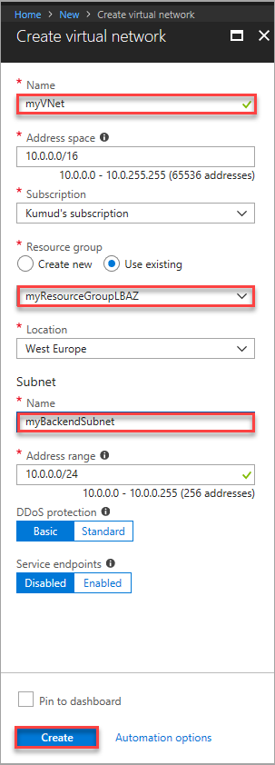
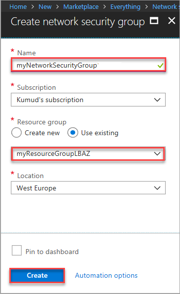
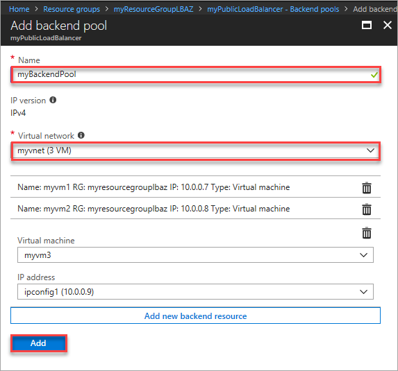
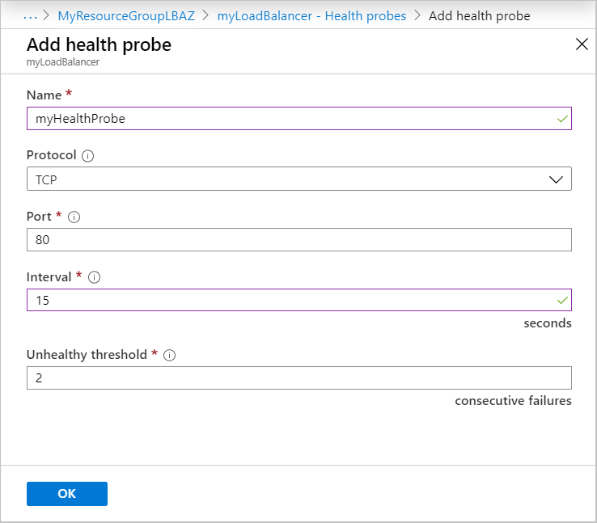
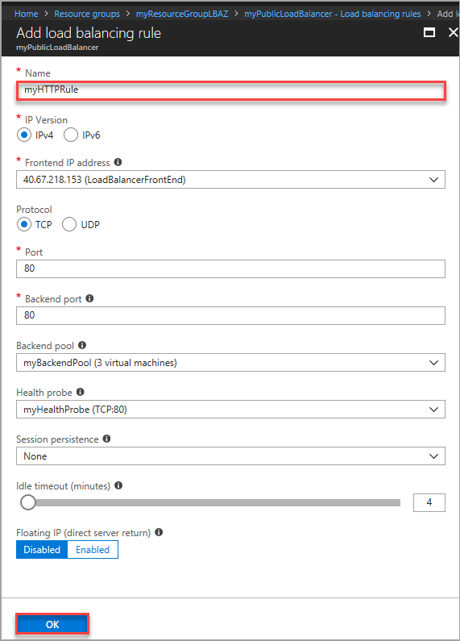

# Create a Standard Load Balancer with zone-redundant frontend using the Azure portal

This article steps through creating a public Load Balancer Standard with a zone redundant frontend to achieve achieve zone-redundancy without dependency on DNS records. A single front-end IP address in a Standard Load Balancer is automatically zone-redundant. Using a zone redundant frontend for your load balancer, with a single IP address you can now reach any VM in a virtual network within a region that is across all Availability Zones. Use availability zones to protect your apps and data from an unlikely failure or loss of an entire datacenter. With zone-redundancy, one or more Availability Zones can fail and the data path survives as long as one zone in the region remains healthy.

If you don't have an Azure subscription, create a [free account](https://azure.microsoft.com/free/?WT.mc_id=A261C142F) before you begin. 

## Log in to Azure

Log in to the Azure portal at [http://portal.azure.com](http://portal.azure.com).

## Create a public Standard Load Balancer

Standard Load Balancer only supports a Standard Public IP address. When you create a new public IP while creating the load balancer, it is automatically configured as a Standard SKU version, and is also automatically zone-redundant.

1. On the top left-hand side of the screen, click **Create a resource** > **Networking** > **Load Balancer**.
2. In the **Create a load balancer** page enter these values for the load balancer:
    - *myLoadBalancer* - for the name of the load balancer.
    - **Public** - for the type of the load balancer.
     - *myPublicIP* - for the new Public IP address that you create. To do so, click Choose a public IP address, and then click Create new.
    - *myResourceGroupLBAZ* -  for the name of the new resource group that you create.
    - **westeurope** - for the location.
3. Click **Create** to create the load balancer.
   
    

## Create backend servers

In this section, you create a virtual network, create virtual machines in different zones (zone 1, zone 2, and zone 3) for the region to add to the the backend pool of your load balancer, and then install IIS on the virtual machines to help test the zone-redudant load balancer. Hence, if VM in one zone fails, then traffic is routed to VMs in the other zones.

### Create a virtual network
1. On the top left-hand side of the screen click **Create a resource** > **Networking** > **Virtual network** and enter these values for the virtual network:
    - *myVnet* - for the name of the virtual network.
    - *myResourceGroupLBAZ* - for the name of the existing resource group
    - *myBackendSubnet* - for the subnet name.
2. Click **Create** to create the virtual network.

    

## Create a network security group

1. On the top left-hand side of the screen, click **Create a resource**, in the search box type *Network Security Group*, and in the network security group page, click **Create**.
2. In the Create network security group page, enter these values:
    - *myNetworkSecurityGroup*  - for the name of the network security group.
    - *myResourceGroupLBAZ* - for the name of the existing resource group.
   

### Create NSG rules

In this section, you create NSG rules to allow inbound connections using HTTP and RDP using the Azure Portal.

1. In the Azure portal, click **All resources** in the left-hand menu, and then search and click **myNetworkSecurityGroup** that is located in the **myResourceGroupLBAZ** resource group.
2. Under **Settings**, click **Inbound security rules**, and then click **Add**.
3. Enter these values for the inbound security rule named *myHTTPRule* to allow for an inbound HTTP connections using port 80:
    - *Service Tag* - for **Source**.
    - *Internet* - for **Source service tag**
    - *80* - for **Destination port ranges**
    - *TCP* - for **Protocol**
    - *Allow* - for **Action**
    - *100* for **Priority**
    - *myHTTPRule* for name
    - *Allow HTTP* - for description
4. Click **OK**.
 
 
5. Repeat steps 2 to 4 to create another rule named *myRDPRule* to allow for an inbound RDP connection using port 3389 with the following values:
    - *Service Tag* - for **Source**.
    - *Internet* - for **Source service tag**
    - *3389* - for **Destination port ranges**
    - *TCP* - for **Protocol**
    - *Allow* - for **Action**
    - *200* for **Priority**
    - *myRDPRule* for name
    - *Allow RDP* - for description
### Create virtual machines

1. On the top left-hand side of the screen, click **Create a resource** > **Compute** > **Windows Server 2016 Datacenter** and enter these values for the virtual machine:
    - *myVM1* - for the name of the virtual machine.        
    - *azureuser* - for the administrator user name.    
    - *myResourceGroupLBAZ* - for **Resource group**, select **Use existing**, and then select *myResourceGroupLBAZ*.
2. Click **OK**.
3. Select **DS1_V2** for the size of the virtual machine, and click **Select**.
4. Enter these values for the VM settings:
    - *zone 1* - for the zone where you place the VM.
    -  *myVNet* - ensure it is selected as the virtual network.
    - *myBackendSubnet* - ensure it is selected as the subnet.
    - *myNetworkSecurityGroup* - for the name of network security group (firewall).
5. Click **Disabled** to disable boot diagnostics.
6. Click **OK**, review the settings on the summary page, and then click **Create**.
  
 

7. Create a second VM, named, *VM2* in Zone 2, and third VM in Zone 3, and with *myVnet* as the virtual network, *myBackendSubnet* as the subnet, and **myNetworkSecurityGroup* as the network security group using steps 1-6.

### Install IIS on VMs

1. Click **All resources** in the left-hand menu, and then from the resources list click **myVM1** that is located in the *myResourceGroupLBAZ* resource group.
2. On the **Overview** page, click **Connect** to RDP into the VM.
3. Log into the VM with username *azureuser*.
4. On the server desktop, navigate to **Windows Administrative Tools**>**Server Manager**.
5. In the Server Manager quickstart page, click **Add Roles and features**.

       

1. In the **Add Roles and Features Wizard**, use the following values:
    - In the **Select installation type** page, click **Role-based or feature-based installation**.
    - In the **Select destination server** page, click **myVM1**.
    - In the **Select server role** page, click **Web Server (IIS)**.
    - Follow instructions to complete the rest of the wizard.
2. Close the RDP session with the virtual machine - *myVM1*.
3. Repeat steps 1 to 7 to install IIS on VMs *myVM2* and *myVM3*.

## Create load balancer resources

In this section, you  configure load balancer settings for a backend address pool and a health probe, and specify load balancer and NAT rules.

### Create a backend address pool

To distribute traffic to the VMs, a back-end address pool contains the IP addresses of the virtual (NICs) connected to the load balancer. Create the backend address pool *myBackendPool* to inlcude *VM1* and *VM2*.

1. Click **All resources** in the left-hand menu, and then click **myLoadBalancer** from the resources list.
2. Under **Settings**, click **Backend pools**, then click **Add**.
3. On the **Add a backend pool** page, do the following:
    - For name, type *myBackEndPool, as the name for your backend pool.
    - For **Virtual network**, in the drop-down menu, click **myVNet**
    - For **Virtual machine**, in the drop-down menu, click, **myVM1**.
    - For **IP address**, in the drop-down menu, click the IP address of myVM1.
4. Click **Add new backend resource** to add each virtual machine (*myVM2* and *myVM3*) to add to the backend pool of the load balancer.
5. Click **Add**.

    

3. Check to make sure your load balancer backend pool setting displays all the three VMs - **myVM1**, **myVM2** and **myVM3**.

### Create a health probe

To allow the load balancer to monitor the status of your app, you use a health probe. The health probe dynamically adds or removes VMs from the load balancer rotation based on their response to health checks. Create a health probe *myHealthProbe* to monitor the health of the VMs.

1. Click **All resources** in the left-hand menu, and then click **myLoadBalancer** from the resources list.
2. Under **Settings**, click **Health probes**, then click **Add**.
3. Use these values to create the health probe:
    - *myHealthProbe* - for the name of the health probe.
    - **HTTP** - for the protocol type.
    - *80* - for the port number.
    - *15* - for number of **Interval** in seconds between probe attempts.
    - *2* - for number of **Unhealthy threshold** or consecutive probe failures that must occur before a VM is considered unhealthy.
4. Click **OK**.

   

### Create a load balancer rule

A load balancer rule is used to define how traffic is distributed to the VMs. You define the front-end IP configuration for the incoming traffic and the back-end IP pool to receive the traffic, along with the required source and destination port. Create a load balancer rule *myLoadBalancerRuleWeb* for listening to port 80 in the frontend *FrontendLoadBalancer* and sending load-balanced network traffic to the backend address pool *myBackEndPool* also using port 80. 

1. Click **All resources** in the left-hand menu, and then click **myLoadBalancer** from the resources list.
2. Under **Settings**, click **Load balancing rules**, then click **Add**.
3. Use these values to configure the load balancing rule:
    - *myHTTPRule* - for the name of the load balancing rule.
    - **TCP** - for the protocol type.
    - *80* - for the port number.
    - *80* - for the backend port.
    - *myBackendPool* - for the name of the backend pool.
    - *myHealthProbe* - for the name of the health probe.
4. Click **OK**.
    
    

## Test the load balancer
1. Find the public IP address for the Load Balancer on the **Overview** screen. Click **All resources** and then click **myPublicIP**.

2. Copy the public IP address, and then paste it into the address bar of your browser. The default page of IIS Web server is displayed on the browser.

      

## Clean up resources

When no longer needed, delete the resource group, load balancer, and all related resources. To do so, select the resource group that contains the load balancer and click **Delete**.

## Next steps

Learn more about [Standard Load Balancer](load-balancer-standard-overview.md).
