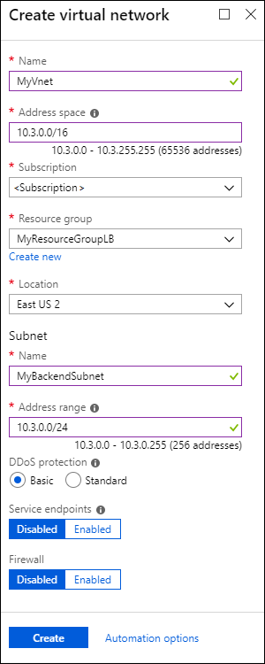
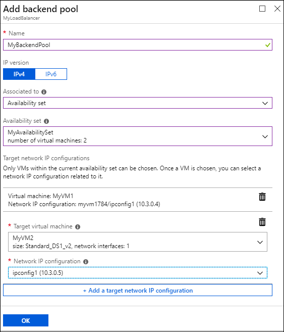

# Create a public Basic load balancer by using the Azure portal

Load balancing provides a higher level of availability and scale by spreading incoming requests across multiple virtual machines (VMs). You can use the Azure portal to create a load balancer that will load balance virtual machines. This quickstart shows you how to create network resources, back-end servers, and a load balancer at the Basic pricing tier.

If you don't have an Azure subscription, create a [free account](https://azure.microsoft.com/free/?WT.mc_id=A261C142F) before you begin. 

## Sign in to the Azure portal

For all the tasks in this quickstart, sign in to the [Azure portal](http://portal.azure.com).

## Create a Basic load balancer

In this section, you create a public Basic load balancer by using the  portal. The public IP address is automatically configured as the load balancer's front end when you create the public IP and the load balancer resource by using the portal. The name of the front end is **LoadBalancerFrontend**.

1. On the upper-left side of the portal, select **Create a resource** > **Networking** > **Load Balancer**.
2. In the **Create load balancer** pane, enter these values:
   - **myLoadBalancer** for the name of the load balancer
   - **Public** for the type of the load balancer 
   - **myPublicIP** for the public IP that you must create, with **SKU** set as **Basic** and **Assignment** set as **Dynamic**
   - **myResourceGroupLB** for the name of the new resource group
3. Select **Create**.
   

## Create back-end servers

In this section, you create a virtual network, and you create two virtual machines for the back-end pool of your Basic load balancer. Then you install Internet Information Services (IIS) on the virtual machines to help test the load balancer.

### Create a virtual network
1. On the upper-left side of the portal, select **New** > **Networking** > **Virtual network**.
2. In the **Create virtual network** pane, enter these values, and then select **Create**:
   - **myVnet** for the name of the virtual network
   - **myResourceGroupLB** for the name of the existing resource group
   - **myBackendSubnet** for the subnet name

   

### Create virtual machines

1. On the upper-left side of the portal, select **New** > **Compute** > **Windows Server 2016 Datacenter**. 
2. Enter these values for the virtual machine, and then select **OK**:
   - **myVM1** for the name of the virtual machine.        
   - **azureuser** for the administrator username.    
   - **myResourceGroupLB** for the resource group. (Under **Resource group**, select **Use existing**, and then select **myResourceGroupLB**.)   
3. Select **DS1_V2** for the size of the virtual machine, and click **Select**.
4. Enter these values for the VM settings:
   - **myAvailabilitySet** for the name of the new availability set that you create.
   - **myVNet** for the name of the virtual network. (Ensure that it's selected.)
   - **myBackendSubnet** for the name of the subnet. (Ensure that it's selected.)
   - **myVM1-ip** for the public IP address.
   - **myNetworkSecurityGroup** for the name of the new network security group (NSG, a type of firewall) that you must create.
5. Select **Disabled** to disable boot diagnostics.
6. Select **OK**, review the settings on the summary page, and then select **Create**.
7. By using steps 1 to 6, create a second VM named **VM2**, with:
   - **myAvailabilityset** as the availability set.
   - **myVnet** as the virtual network.
   - **myBackendSubnet** as the subnet.
   - **myNetworkSecurityGroup** as the network security group. 

### Create NSG rules

In this section, you create NSG rules to allow inbound connections that use HTTP and RDP.

1. Select **All resources** on the left menu. From the resource list, select **myNetworkSecurityGroup** in the **myResourceGroupLB** resource group.
2. Under **Settings**, select **Inbound security rules**, and then select **Add**.
3. Enter the following values for the inbound security rule named **myHTTPRule** to allow for inbound HTTP connections that use port 80. Then select **OK**.
   - **Service Tag** for **Source**
   - **Internet** for **Source service tag**
   - **80** for **Destination port ranges**
   - **TCP** for **Protocol**
   - **Allow** for **Action**
   - **100** for **Priority**
   - **myHTTPRule** for **Name**
   - **Allow HTTP** for **Description**
 
   
4. Repeat steps 2 and 3 to create another rule named **myRDPRule** to allow for an inbound RDP connection through port 3389. Use the following values:
   - **Service Tag** for **Source**
   - **Internet** for **Source service tag**
   - **3389** for **Destination port ranges**
   - **TCP** for **Protocol**
   - **Allow** for **Action**
   - **200** for **Priority**
   - **myRDPRule** for **Name**
   - **Allow RDP** for **Description**

   

### Install IIS

1. Select **All resources** on the left menu. From the resource list, select **myVM1** in the **myResourceGroupLB** resource group.
2. On the **Overview** page, select **Connect** to RDP into the VM.
3. Sign in to the VM with username **azureuser** and password **Azure123456!**.
4. On the server desktop, browse to **Windows Administrative Tools** > **Server Manager**.
5. In Server Manager, select **Manage**, and then select **Add Roles and features**.
   
6. In the Add Roles and Features Wizard, use the following values:
   - On the **Select installation type** page, select **Role-based or feature-based installation**.
   - On the **Select destination server** page, select **myVM1**.
   - On the **Select server role** page, select **Web Server (IIS)**.
   - Follow the instructions to complete the rest of the wizard. 
7. Repeat steps 1 to 6 for the virtual machine **myVM2**.

## Create resources for the Basic load balancer

In this section, you configure load balancer settings for a back-end address pool and a health probe. You also specify load balancer and NAT rules.

### Create a back-end address pool

To distribute traffic to the VMs, a back-end address pool contains the IP addresses of the virtual NICs that are connected to the load balancer. Create the back-end address pool **myBackendPool** to include **VM1** and **VM2**.

1. Select **All resources** on the left menu, and then select **myLoadBalancer** from the resource list.
2. Under **Settings**, select **Backend pools**, and then select **Add**.
3. On the **Add a backend pool** page, do the following, and then select **OK**:
   - For **Name**, enter **myBackEndPool**.
   - For **Associated to**, from the drop-down menu, select **Availability set**.
   - For **Availability set**, select **myAvailabilitySet**.
   - Select **Add a target network IP configuration** to add each virtual machine (**myVM1** and **myVM2**) that you created to the back-end pool.

   

3. Make sure that your load balancer's back-end pool setting displays both the VMs **VM1** and **VM2**.

### Create a health probe

To allow the Basic load balancer to monitor the status of your app, you use a health probe. The health probe dynamically adds or removes VMs from the load balancer rotation based on their response to health checks. Create a health probe named **myHealthProbe** to monitor the health of the VMs.

1. Select **All resources** on the left menu, and then select **myLoadBalancer** from the resource list.
2. Under **Settings**, select **Health probes**, and then select **Add**.
3. Use these values, and then select **OK**:
   - **myHealthProbe** for the name of the health probe
   - **HTTP** for the protocol type
   - **80** for the port number
   - **15** for **Interval**, the number of seconds between probe attempts
   - **2** for **Unhealthy threshold**, the number of consecutive probe failures that must occur before a VM is considered unhealthy

   

### Create a load balancer rule

You use a load balancer rule to define how traffic is distributed to the VMs. You define the front-end IP configuration for the incoming traffic and the back-end IP pool to receive the traffic, along with the required source and destination port. 

Create a load balancer rule named **myLoadBalancerRuleWeb** for listening to port 80 in the front end **LoadBalancerFrontEnd**. The rule is also for sending load-balanced network traffic to the back-end address pool **myBackEndPool**, also by using port 80. 

1. Select **All resources** on the left menu, and then select **myLoadBalancer** from the resource list.
2. Under **Settings**, select **Load balancing rules**, and then select **Add**.
3. Use these values, and then select **OK**:
   - **myHTTPRule** for the name of the load balancer rule
   - **TCP** for the protocol type
   - **80** for the port number
   - **80** for the back-end port
   - **myBackendPool** for the name of the back-end pool
   - **myHealthProbe** for the name of the health probe
    
   

## Test the load balancer
1. Find the public IP address for the load balancer on the **Overview** screen. Select **All resources**, and then select **myPublicIP**.

2. Copy the public IP address, and then paste it into the address bar of your browser. The default page of IIS web server is displayed in the browser.

   

## Clean up resources

You can delete the resource group, load balancer, and all related resources when you no longer need them. Select the resource group that contains the load balancer, and select **Delete**.

## Next steps

In this quickstart, you created a resource group, network resources, and back-end servers. You then used those resources to create a load balancer. To learn more about load balancers and their associated resources, continue to the tutorial articles.