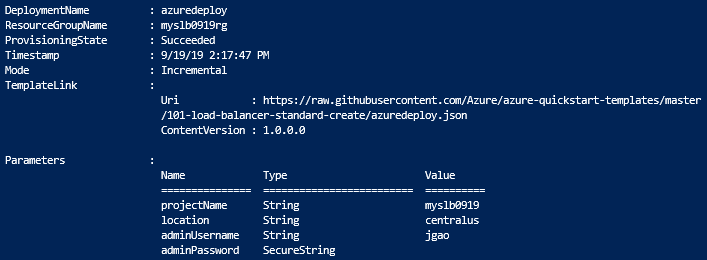

# Quickstart: Create an internal load balancer to load balancer VMs by using an ARM template

This quickstart describes how to use an Azure Resource Manager template (ARM template) to create an internal Azure load balancer.

[!INCLUDE [About Azure Resource Manager](../../includes/resource-manager-quickstart-introduction.md)]

If your environment meets the prerequisites and you're familiar with using ARM templates, select the **Deploy to Azure** button. The template will open in the Azure portal.

[](https://portal.azure.com/#create/Microsoft.Template/uri/https://raw.githubusercontent.com/Azure/azure-quickstart-templates/master/201-2-vms-internal-load-balancer/azuredeploy.json)

## Prerequisites

If you don't have an Azure subscription, create a [free account](https://azure.microsoft.com/free/?WT.mc_id=A261C142F) before you begin.

## Review the template

The template used in this quickstart is from [Azure Quickstart Templates](https://azure.microsoft.com/resources/templates/201-2-vms-internal-load-balancer).

:::code language="json" source="~/quickstart-templates/201-2-vms-internal-load-balancer/azuredeploy.json":::

Multiple Azure resources have been defined in the template:

- [**Microsoft.Storage/storageAccounts**](/azure/templates/microsoft.storage/storageaccounts): Virtual machine storage accounts for boot diagnostics.
- [**Microsoft.Compute/availabilitySets**](/azure/templates/microsoft.compute/availabilitySets): Availability set for virtual machines.
- [**Microsoft.Network/virtualNetworks**](/azure/templates/microsoft.network/virtualNetworks): Virtual network for load balancer and virtual machines.
- [**Microsoft.Network/networkInterfaces**](/azure/templates/microsoft.network/networkInterfaces): Network interfaces for virtual machines.
- [**Microsoft.Network/loadBalancers**](/azure/templates/microsoft.network/loadBalancers): Internal load balancer.
- [**Microsoft.Compute/virtualMachines**](/azure/templates/microsoft.compute/virtualMachines): Virtual machines.

To find more templates that are related to Azure Load Balancer, see [Azure Quickstart Templates](https://azure.microsoft.com/resources/templates/?resourceType=Microsoft.Network&pageNumber=1&sort=Popular).

## Deploy the template

1. Select **Try it** from the following code block to open Azure Cloud Shell, and then follow the instructions to sign in to Azure.

   ```azurepowershell-interactive
   $projectName = Read-Host -Prompt "Enter a project name with 12 or less letters or numbers that is used to generate Azure resource names"
   $location = Read-Host -Prompt "Enter the location (i.e. centralus)"
   $adminUserName = Read-Host -Prompt "Enter the virtual machine administrator account name"
   $adminPassword = Read-Host -Prompt "Enter the virtual machine administrator password" -AsSecureString

   $resourceGroupName = "${projectName}-rg"
   $templateUri = "https://raw.githubusercontent.com/Azure/azure-quickstart-templates/master/201-2-vms-internal-load-balancer/azuredeploy.json"

   New-AzResourceGroup -Name $resourceGroupName -Location $location
   New-AzResourceGroupDeployment -ResourceGroupName $resourceGroupName -TemplateUri $templateUri -location $location -adminUsername $adminUsername -adminPassword $adminPassword

   Write-Host "Press [ENTER] to continue."
   ```

   Wait until you see the prompt from the console.

1. Select **Copy** from the previous code block to copy the PowerShell script.

1. Right-click the shell console pane and then select **Paste**.

1. Enter the values.

   The resource group name is the project name with **rg** appended. You need the resource group name in the next section.

It takes about 10 minutes to deploy the template. When completed, the output is similar to:



Azure PowerShell is used to deploy the template. In addition to Azure PowerShell, you can also use the Azure portal, Azure CLI, and REST API. To learn other deployment methods, see [Deploy templates](../azure-resource-manager/templates/deploy-portal.md).

## Review deployed resources

<!-- This heading must be titled "Review deployed resources" or "Validate the deployment". -->

<!--
Include at least one method that displays the deployed resources. Use a portal screenshot of the resources, or interactive code fences for Azure CLI (`azurecli-interactive`) or Azure PowerShell (`azurepowershell-interactive`).
-->

You can either use the Azure portal to check the deployed resources, or use Azure CLI or Azure PowerShell script to list the deployed resources.

## Clean up resources

<!-- 
The Clean up resources section includes a paragraph that explains how to delete unneeded resources. Include at least one method that shows how to clean up resources. Use a portal screenshot, or interactive code fences for Azure CLI (`azurecli-interactive`) or Azure PowerShell (`azurepowershell-interactive`).
-->

When no longer needed, delete the resource group, which deletes the resources in the resource group.

<!--

Choose Azure CLI, Azure PowerShell, or Azure portal to delete the resource group.

Here are the samples for Azure CLI and Azure PowerShell:

```azurecli-interactive
echo "Enter the Resource Group name:" &&
read resourceGroupName &&
az group delete --name $resourceGroupName &&
echo "Press [ENTER] to continue ..."
```

```azurepowershell-interactive
$resourceGroupName = Read-Host -Prompt "Enter the Resource Group name"
Remove-AzResourceGroup -Name $resourceGroupName
Write-Host "Press [ENTER] to continue..."
```

-->

## Next steps

<!-- 
Make the next steps similar to other quickstarts and use a blue button to link to the next article for your service. Or direct readers to the article: "Tutorial: Create and deploy your first ARM template" to follow the process of creating a template.

To include additional links for more information about the service, it's acceptable to use a paragraph and bullet points.
-->

For a step-by-step tutorial that guides you through the process of creating a template, see:

> [!div class="nextstepaction"]
> [Tutorial: Create and deploy your first ARM template](/azure/azure-resource-manager/templates/template-tutorial-create-first-template)