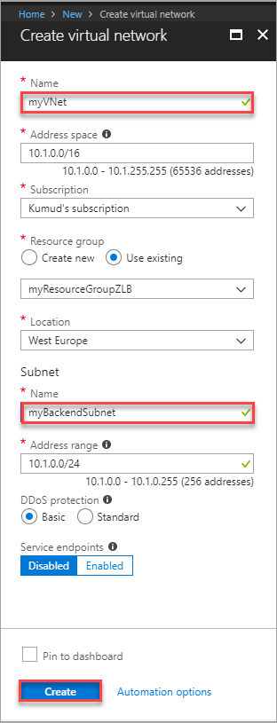
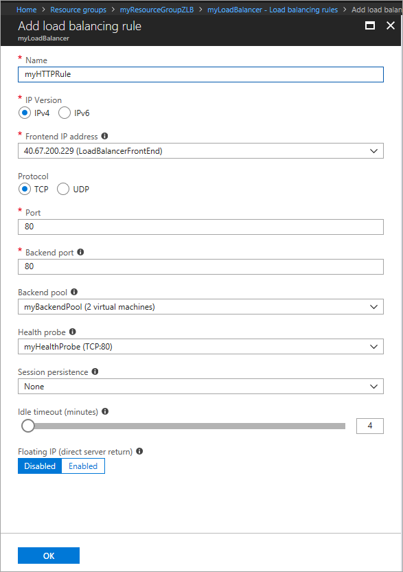
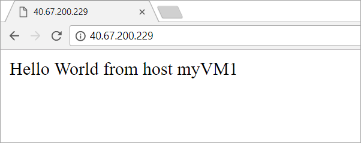

# Tutorial: Load balance VMs within an availability zone with Azure Standard Load Balancer by using the Azure portal

This tutorial creates a public [Standard Load Balancer](https://aka.ms/azureloadbalancerstandard) with a zonal front end that uses a public IP standard address by using the Azure portal. In this scenario, you specify a particular zone for your front-end and back-end instances. This zone aligns your data path and resources with a specific zone. You learn how to perform the following functions:

> [!div class="checklist"]
> * Create Standard Load Balancer with a zonal front end.
> * Create network security groups to define incoming traffic rules.
> * Create zonal virtual machines (VMs) and attach them to a load balancer.
> * Create a load balancer health probe.
> * Create a load balancer traffic rules.
> * Create a basic Internet Information Services (IIS) site.
> * View a load balancer in action.

For more information about using availability zones with Standard Load Balancer, see [Standard Load Balancer and Availability Zones](load-balancer-standard-availability-zones.md).

If you prefer, use the [Azure CLI](load-balancer-standard-public-zonal-cli.md) to complete this tutorial.

## Log in to Azure

Log in to the Azure portal at [http://portal.azure.com](http://portal.azure.com).

## Create a public Standard Load Balancer

Standard Load Balancer only supports a standard public IP address. When you create a new public IP while creating the load balancer, it's automatically configured as a standard SKU version. It's also automatically zone redundant.

1. On the top left-hand side of the screen, select **Create a resource** > **Networking** > **Load Balancer**.
2. In the **Create load balancer** page, enter these values for the load balancer:
    - *myLoadBalancer*, for the name of the load balancer.
    - **Public**, for the type of the load balancer.
     - *myPublicIPZonal*, for the new Public IP address that you create. Select **Choose a public IP address**. Then select **Create new**. For name, enter *myPublicIP*. SKU is standard by default. It selects **Zone 1** for **Availability zone**.
    - *myResourceGroupZLB*, for the name of the new resource group that you create.
    - **westeurope**, for the location.
3. Select **Create** to create the load balancer.
   
    


## Create back-end servers

In this section, you create a virtual network. You also create two virtual machines in same zone (namely, zone 1) for the region to add to the back-end pool of your load balancer. Then you install IIS on the virtual machines to help test the zone-redundant load balancer. If one VM fails, the health probe for the VM in the same zone fails. Traffic continues to be served by other VMs within the same zone.

### Create a virtual network
1. On the top left-hand side of the screen, select **Create a resource** > **Networking** > **Virtual network**.  Enter these values for the virtual network:
    - *myVnet*, for the name of the virtual network.
    - *myResourceGroupZLB*, for the name of the existing resource group.
    - *myBackendSubnet*, for the subnet name.
2. Select **Create** to create the virtual network.

    

## Create a network security group

1. On the top left-hand side of the screen, select **Create a resource**. In the search box, enter *Network Security Group*. In the network security group page, select **Create**.
2. In the **Create network security group** page, enter these values:
    - *myNetworkSecurityGroup*, for the name of the network security group.
    - *myResourceGroupLBAZ*, for the name of the existing resource group.
   
    

### Create NSG rules

In this section, you create NSG rules to allow inbound connections that use HTTP and Microsoft Remote Desktop Protocol (RDP) by using the Azure portal.

1. In the Azure portal, select **All resources** in the left-hand menu. Then search for and select **myNetworkSecurityGroup**. It's located in the **myResourceGroupZLB** resource group.
2. Under **Settings**, select **Inbound security rules**. Then select **Add**.
3. Enter these values for the inbound security rule named *myHTTPRule* to allow for inbound HTTP connections that use port 80:
    - *Service Tag*, for **Source**.
    - *Internet*, for **Source service tag**.
    - *80*, for **Destination port ranges**.
    - *TCP*, for **Protocol**.
    - *Allow*, for **Action**.
    - *100*, for **Priority**.
    - *myHTTPRule*, for **Name**.
    - *Allow HTTP*, for **Description**.
4. Select **OK**.
 
 

5. Repeat steps 2 to 4 to create another rule named *myRDPRule*. This rule allows for an inbound RDP connection that uses port 3389, with the following values:
    - *Service Tag*, for **Source**.
    - *Internet*, for **Source service tag**.
    - *3389*, for **Destination port ranges**.
    - *TCP*, for **Protocol**.
    - *Allow*, for **Action**.
    - *200*, for **Priority**.
    - *myRDPRule*, for name.
    - *Allow RDP*, for description.

    

### Create virtual machines

1. On the top left-hand side of the screen, select **Create a resource** > **Compute** > **Windows Server 2016 Datacenter**. Enter these values for the virtual machine:
    - *myVM1*, for the name of the virtual machine.        
    - *azureuser*, for the administrator user name.    
    - *myResourceGroupZLB*, for **Resource group**. Select **Use existing**, and then select *myResourceGroupZLB*.
2. Select **OK**.
3. Select **DS1_V2** for the size of the virtual machine. Choose **Select**.
4. Enter these values for the VM settings:
    - *zone 1*, for the Availability zone where you place the VM.
    -  *myVNet*. Ensure it's selected as the virtual network.
    - *myVM1PIP*, for the Standard Public IP Address that you create. Select *Create new*. Then for name type, select *myVM1PIP*. For **Zone**, select **1**. The IP address SKU is standard by default.
    - *myBackendSubnet*. Make sure it's selected as the subnet.
    - *myNetworkSecurityGroup*, for the name of the network security group firewall that already exists.
5. Select **Disabled** to disable boot diagnostics.
6. Select **OK**. Review the settings on the summary page. Then select **Create**.
7. Repeat steps 1 to 6 to create a second VM, named *myVM2*, in Zone 1. Make *myVnet* the virtual network. Make *myVM2PIP* the Standard Public IP address. Make *myBackendSubnet* the subnet. And make **myNetworkSecurityGroup** the network security group.

     

### Install IIS on VMs

1. Select **All resources** in the left-hand menu. Then from the resources list, select **myVM1**. It's located in the *myResourceGroupZLB* resource group.
2. On the **Overview** page, select **Connect** to use RDP to go to the VM.
3. Log in to the VM with the user name and password that you specified when you created the VM. To specify the credentials you entered when you created the VM, you might need to select **More choices**. Then select **Use a different account**. And then select **OK**. You might receive a certificate warning during the sign-in process. Select **Yes** to proceed with the connection.
4. On the server desktop, navigate to **Windows Administrative Tools** > **Windows PowerShell**.
6. In the **PowerShell** window, run the following commands to install the IIS server. These commands also remove the default iisstart.htm file and then add a new iisstart.htm file that displays the name of the VM:

   ```azurepowershell-interactive
    # install IIS server role
    Install-WindowsFeature -name Web-Server -IncludeManagementTools
    # remove default htm file
     remove-item  C:\inetpub\wwwroot\iisstart.htm
    # Add a new htm file that displays server name
     Add-Content -Path "C:\inetpub\wwwroot\iisstart.htm" -Value $("Hello World from" + $env:computername)
   ```
7. Close the RDP session with *myVM1*.
8. Repeat steps 1 to 7 to install IIS on *myVM2*.

## Create load balancer resources

In this section, you configure load balancer settings for a back-end address pool and a health probe. You also specify load balancer and network address translation rules.


### Create a back-end address pool

To distribute traffic to the VMs, a back-end address pool contains the IP addresses of the virtual network interface cards that are connected to the load balancer. Create the back-end address pool *myBackendPool* to include *VM1* and *VM2*.

1. Select **All resources** in the left-hand menu. Then select **myLoadBalancer* from the resources list.
2. Under **Settings**, select **Backend pools**. Then select **Add**.
3. On the **Add a backend pool** page, take the following actions:
    - For name, enter *myBackEndPool* as the name for your back-end pool.
    - For **Virtual network**, in the drop-down menu, select *myVNet*. 
    - For **Virtual machine** and **IP address**, add *myVM1* and *myVM2* and their corresponding public IP addresses.
4. Select **Add**.
5. Check to make sure your load balancer back-end pool setting displays both the VMs: **myVM1** and **myVM2**.
 
     

### Create a health probe

Use a health probe so the load balancer can monitor the status of your app. The health probe dynamically adds or removes VMs from the load balancer rotation based on their response to health checks. Create a health probe *myHealthProbe* to monitor the health of the VMs.

1. Select **All resources** in the left-hand menu. Then select **myLoadBalancer** from the resources list.
2. Under **Settings**, select **Health probes**. Then select **Add**.
3. Use these values to create the health probe:
    - *myHealthProbe*, for the name of the health probe.
    - **HTTP**, for the protocol type.
    - *80*, for the port number.
    - *15*, for number of **Interval** in seconds between probe attempts.
    - *2*, for number of **Unhealthy threshold** or consecutive probe failures that must occur before a VM is considered unhealthy.
4. Select **OK**.

   

### Create a load balancer rule

A load balancer rule defines how traffic is distributed to the VMs. You define the front-end IP configuration for the incoming traffic and the back-end IP pool to receive the traffic, along with the required source and destination port. Create a load balancer rule *myLoadBalancerRuleWeb*, for listening to port 80 in the front-end *FrontendLoadBalancer*. The rule sends load-balanced network traffic to the back-end address pool *myBackEndPool*, also by using port 80. 

1. Select **All resources** in the left-hand menu. Then select **myLoadBalancer** from the resources list.
2. Under **Settings**, select **Load balancing rules**. Then select **Add**.
3. Use these values to configure the load balancing rule:
    - *myHTTPRule*, for the name of the load balancing rule.
    - **TCP**, for the protocol type.
    - *80*, for the port number.
    - *80*, for the back-end port.
    - *myBackendPool*, for the name of the back-end pool.
    - *myHealthProbe*, for the name of the health probe.
4. Select **OK**.
    
    

## Test the load balancer
1. Find the public IP address for the load balancer on the **Overview** screen. Select **All resources**. Then select **myPublicIP**. 

2. Copy the public IP address. Then paste it into the address bar of your browser. The default page that includes the name of the web server page is displayed on the browser.

      
3. To see the load balancer in action, force stop the VM that is displayed. Refresh the browser to see the other server name displayed on the browser.

## Clean up resources

When they're no longer needed, delete the resource group, load balancer, and all related resources. Select the resource group that contains the load balancer. Then select **Delete**.

## Next steps

- Learn more about [Standard Load Balancer](load-balancer-standard-overview.md).
- [Load balance VMs across availability zones](tutorial-load-balancer-standard-public-zone-redundant-portal.md).
