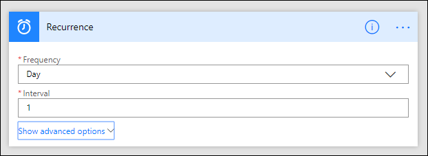
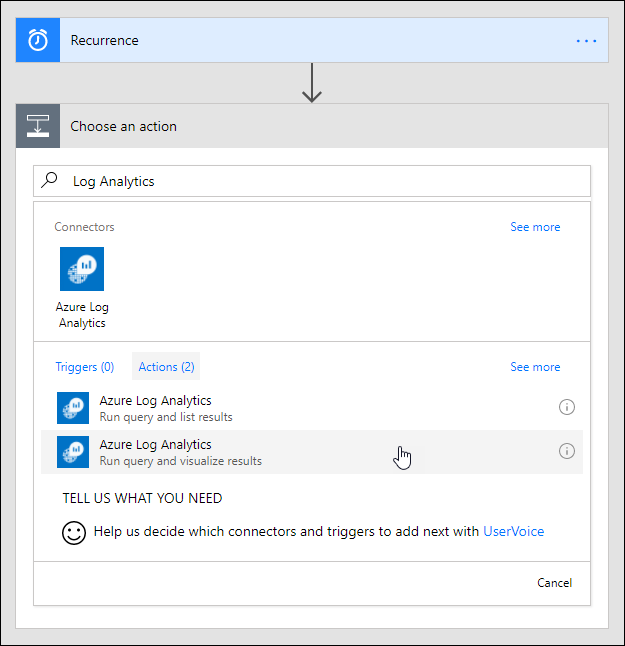
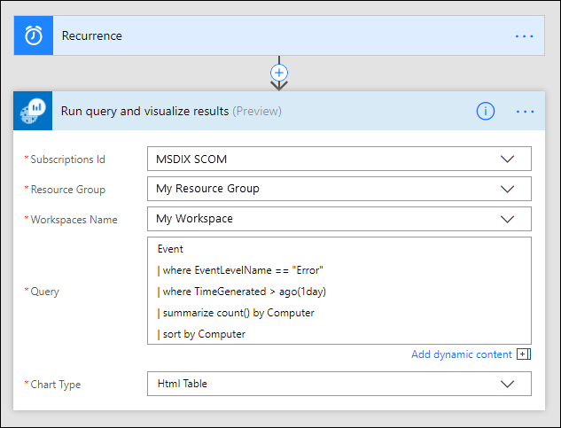
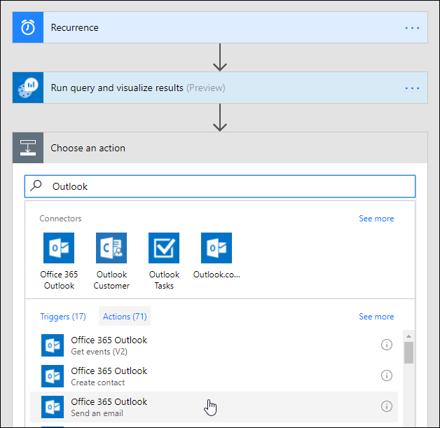
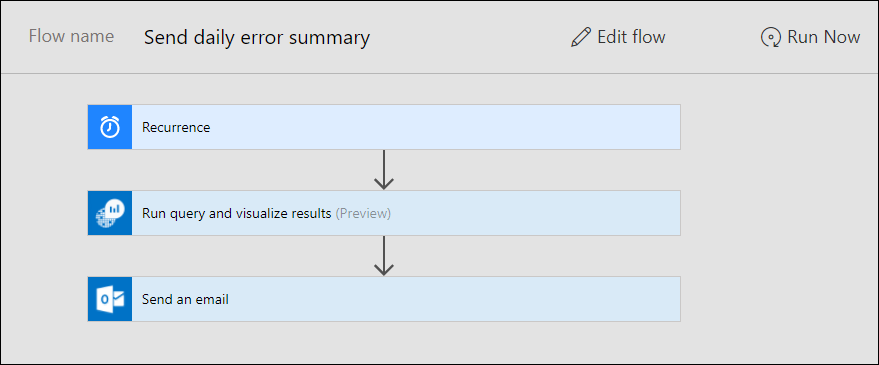

# Automate Log Analytics processes with the connector for Microsoft Flow
[Microsoft Flow](https://ms.flow.microsoft.com) makes hundreds of actions for a variety of services. For example, you can use Microsoft Flow to automatically send an email notification or create a bug in Visual Studio Team Services.  You can trigger a workflow by a simple schedule or from  Workflows can be triggered by a simple schedule or from some action in a connected service.  The Azure Log Analytics connector (preview) for Microsoft Flow allow you to build workflows that include data from Log Analytics log searches.  

This article includes a tutorial to create a flow that automatically sends the results of a Log Analytics log search by email, just one example of how you can use Microsoft Flow and Log Analytics together. 


## Step 1: Create a flow
1. Sign in to [Microsoft Flow](http://flow.microsoft.com), and then select **My Flows**.
2. Click **Create from blank**.

## Step 2: Create a trigger for your flow
1. Click **Search hundreds of connectors and triggers**.
2. Type **Schedule** in the search box.
1. Select **Schedule**, and then select **Schedule - Recurrence**.
2. In the **Frequency** box, select **Day**, and in the **Interval** box, enter **1**.

    


## Step 3: Add a Log Analytics action
1. Click **New step**, and then click **Add an action**.
2. Search for **Log Analytics**.
3. Click **Azure Log Analytics – Run query and visualize results**.

    

## Step 4: Configure the Log Analytics action

1. Select the details for your workspace including the Subscription ID, Resource Group, and Workspace Name.
2. Add the following Analytics query. 
```
Event
| where EventLevelName == "Error" 
| where TimeGenerated > ago(1day)
| summarize count() by Computer
| sort by Computer
```
2. Select **HTML Table** for the **Chart Type**.
	

## Step 5: Configure the flow to send email

1. Click **New step**, and then click **Add an action**.
2. Search for **Office 365 Outlook**.
3. Click **Office 365 Outlook – Send an email**.

    

4. In the **Send an email** window, do the following:
   a. Type the email address of a recipient.
   b. Type a subject for the email.
   c. Click anywhere in the **Body** box and then, on the dynamic content menu that opens at the right, select **Body**.
   d. Click **Show advanced options**.
   e. In the **Is HTML** box, select **Yes**.

    

## Step 6: Save and test your flow
- In the **Flow name** box, add a name for your flow, and then click **Create flow**.

    

You can wait for the trigger to run this action, or you can run the flow immediately by [running the trigger on demand](https://flow.microsoft.com/blog/run-now-and-six-more-services/).

When the flow runs, the recipients you have specified in the email list receive an email message that looks like the following:




## Next steps

- Learn more about [Log Analytics queries](log-analytics-log-search-new.md).
- Learn more about [Microsoft Flow](https://ms.flow.microsoft.com).


