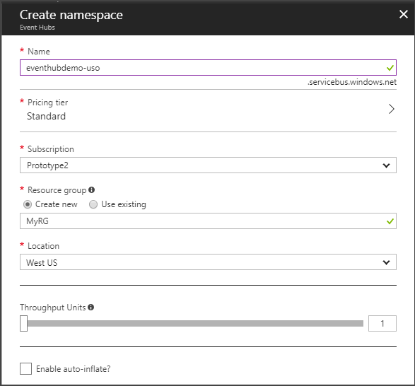
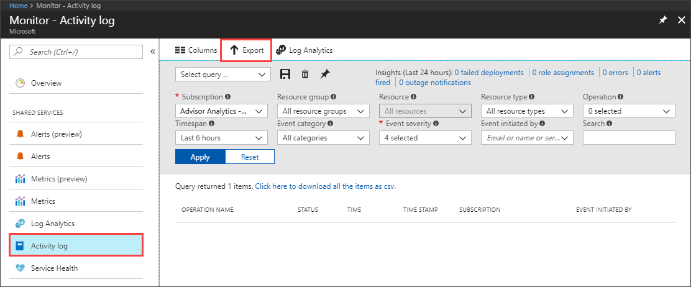
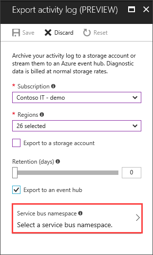
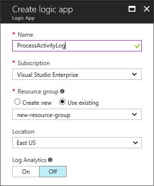
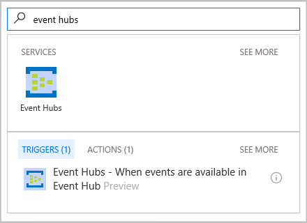
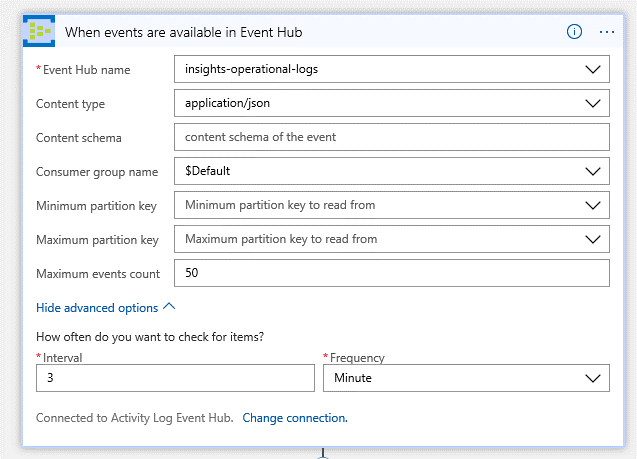
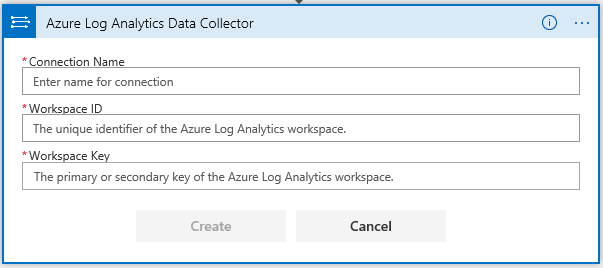
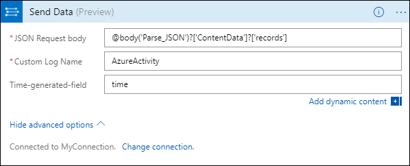
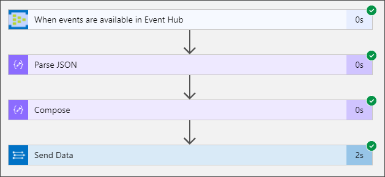

# Send Azure Activity Logs to Log Analytics using Logic Apps

This article steps through how to use the Azure Log Analytics Data Collector connector for Logic Apps to collect Azure Activity Logs and send them to a Log Analytics workspace. 

Use the process in this article when you need to send logs to a workspace that is in a different Azure Active Directory. For example, if you are a managed service provider, you may want to collect activity logs from a customer's subscription and store them in a Log Analytics workspace that in your own subscription.

If the Log Analytics workspace is in the same Azure subscription, or in a different subscription but within the same Azure Active Directory, use the steps in the [Azure activity log solution](../log-analytics/log-analytics-activity.md).

## Overview

The strategy used in this scenario is to have Azure Activity Log send events to an Event Hub where a Logic App sends them to your Log Analytics workspace. 


Advantages of this approach include:
- Low latency since the Azure Activity Log is streamed into the Event Hub.  The Logic App is then triggered and posts the data to Log Analytics. 
- Minimal code is required, and there is no server infrastructure to deploy.

The Event Hub namespace does not have to be in the same subscription as the subscription emitting logs. The user who configures the setting must have appropriate access permissions to both subscriptions. If you have multiple subscriptions in the same Azure Active directory, you can send the activity logs for all subscriptions to a single event hub.

The Logic App can be in a different subscription from the event hub and does not need to be in the same Azure Active Directory. The Logic App reads from the Event Hub using the Event Hub's shared access key.

The Log Analytics workspace can be in a different subscription and Azure Active Directory from the Logic App, but for simplicity we recommend that they are in the same subscription. The Logic App sends to Log Analytics using the Log Analytics workspace ID and key.

This article steps you through how to:
1. Create an Event Hub. 
2. Export activity logs to an Event Hub using Azure Activity Log export profile.
3. Create a Logic App to read from the Event Hub and send events to Log Analytics.

## Log in to the Azure portal

Log in to the [Azure portal](https://portal.azure.com/).

## Step 1 - Create an Event Hub

<!-- Follow the steps in [how to create an Event Hubs namespace and Event Hub](../event-hubs/event-hubs-create.md) to create your event hub. -->

1. In the Azure portal, select **New**> **Internet of Things** > **Event Hubs**.

   

3. Under **Create namespace**, enter a namespace name. The system immediately checks to see if the name is available.

   

4. After making sure the namespace name is available, choose the pricing tier (Basic or Standard), an Azure subscription, resource group, and location in which to create the resource. 
5. Click **Create** to create the namespace. You may have to wait a few minutes for the system to fully provision the resources.
6. In the portal list of namespaces, click the newly created namespace.
7. Click **Shared access policies** and then **RootManageSharedAccessKey**.

   
   
8. Click the copy button to copy the RootManageSharedAccessKey connection string to the clipboard. 

   

9. In a temporary location, such as Notepad, keep a copy the Event Hub name and either the primary or secondary Event Hub connection string. The Logic App requires these values. For the Event Hub connection string, you can use the **RootManageSharedAccessKey** connection string or you can create a separate one.
  - The connection string must be for a policy that has the **Manage** access policy
  - The connection string starts with `Endpoint=sb://`

## Step 2 - Export Activity Logs to Event Hub

You can enable streaming of the Activity Log either programmatically or via the portal. Using either method, you pick an Event Hub Namespace and a shared access policy for that namespace. An Event Hub is created in that namespace when the first new Activity Log event occurs. 

You can use an event hub namespace that is not in the same subscription as the subscription emitting logs, however the subscriptions must be in the same Azure Active Directory. The user who configures the setting must have the appropriate RBAC to access both subscriptions. 

1. In the Azure portal, select **Monitor** > **Activity Log**.
3. Click the **Export** button at the top of the page.

   

4. In the page that appears, select the *Subscription* to export from.
5. Click *Select all* in the **Regions** drop-down to select events for resources in all regions.
6. Click the **Export to an event hub** check box

   

7. Click **Service bus namespace**, and then 
8. In the page that appears, select the *Subscription* with the event hub, the **event hub namespace**, and an **event hub policy name**.

    

11. Click **OK** and then **Save** to save these settings. The settings are immediately be applied to your subscription.

<!-- Follow the steps in [stream the Azure Activity Log to Event Hubs](../monitoring-and-diagnostics/monitoring-stream-activity-logs-event-hubs.md) to configure a log profile that writes activity logs to an event hub. -->

## Step 3 - Create Logic App

The Logic App includes the following:
- An [Event Hub connector](https://docs.microsoft.com/connectors/eventhubs/) trigger to read from the Event Hub
- A [Parse JSON action](../logic-apps/logic-apps-content-type.md) to extract the events
- A [Log Analytics send data connector](https://docs.microsoft.com/connectors/azureloganalyticsdatacollector/) to post the data to Log Analytics

   

### Logic App Requirements
Before creating your Logic App, collect the following information:
- Event Hub name
- Event Hub connection string (either the primary or secondary) for the Event Hub namespace.
- Log Analytics workspace ID
- Log Analytics shared key

To get the event Hub name and connection string, follow the steps in [Check Event Hubs namespace permissions and find the connection string](../connectors/connectors-create-api-azure-event-hubs.md#check-event-hubs-namespace-permissions-and-find-the-connection-string).


### Create the Logic App

1. In the Azure portal, choose **New** > **Enterprise Integration** > **Logic App**.

    

2. Enter the settings in the table
   |Setting        | Suggested Value           | Description  |
   |---------------|---------------------------|--------------|
   |Name           | your-logic-app-name       | Provide a unique logic app name. |
   |Subscription   | your-Azure-subscription   | Select the Azure subscription that you want to use. |
   |Resource Group | your-Azure-resource-group | Create or select an Azure resource group, which helps you organize and manage related Azure resources. |
   |Location       | your-Azure-region         | Select the datacenter region for deploying your logic app.        |

    

3. Select **Create**. When *Deployment Succeeded* notification displays, click on **Go to resource** to open your Logic App.

4. Under **Templates**, choose **Blank Logic App**. 

The Logic Apps Designer now shows you available connectors and their triggers, which you use for starting your logic app workflow.

<!-- Learn [how to create a logic app](../logic-apps/logic-apps-create-a-logic-app.md). -->

### Add Event Hub trigger

1. In the search box for the Logic App Designer, type *event hubs* for your filter. Select the trigger **Event Hubs - When events are available in Event Hub**

   

2. When you're prompted for credentials, connect to your Event Hubs namespace. Give your connection a name, enter the connection string that you copied, and select **Create**.

   

3. After you create the connection, you can edit the settings for the trigger.

   

4. Select *insights-operational-logs* from the **Event Hub name** drop-down.
5. Expand **Show advanced options** and change **Content type** to *application/json*

   

### Add Parse JSON action

The output from the Event Hub contains a JSON payload with an array of records. The [Parse JSON](../logic-apps/logic-apps-content-type.md) action is used to extract just the array of records for sending to Log Analytics.

1. Click **New step** > **Add an action**
2. In the search box, type *parse json* for your filter. Select the action **Data Operations - Parse JSON**.

   

3. Select *Body* for the **Content** field.

4. Copy and paste the following schema into the **Schema** field.

   

``` json-schema
{
    "properties": {
        "ContentData": {
            "properties": {
                "records": {
                    "items": {
                        "type": "object"
                    },
                    "type": "array"
                }
            },
            "type": "object"
        },
        "Properties": {
            "properties": {
                "ProfileName": {
                    "type": "string"
                },
                "x-opt-enqueued-time": {
                    "type": "string"
                },
                "x-opt-offset": {
                    "type": "string"
                },
                "x-opt-sequence-number": {
                    "type": "number"
                }
            },
            "type": "object"
        },
        "SystemProperties": {
            "properties": {
                "EnqueuedTimeUtc": {
                    "type": "string"
                },
                "Offset": {
                    "type": "string"
                },
                "PartitionKey": {
                    "type": "any"
                },
                "SequenceNumber": {
                    "type": "number"
                }
            },
            "type": "object"
        }
    },
    "type": "object"
}
```

>[!TIP]
> You can get a sample payload by clicking **Run** and looking at the **Raw Output** from the Event Hub.


### Add Send Data action

1. Click **New step** and select **Add an action**
2. Type *log analytics* for your filter and then select the action **Azure Log Analytics Data Collector - Send Data**.

   

3. When you're prompted for credentials, connect to your Event Hubs namespace. Give your connection a name, enter the connection string that you copied, and select **Create**.

   

4. After you create the connection, , you can edit the settings for the action.
5. Click on the **...** menu of **Send Data** and select **Peek code**. 
6. Set the **body** property to be `"@body('Parse_JSON')?['ContentData']?['records']"` then click **Done**. After your change, the peek code section looks like this:
```json
{
    "inputs": {
        "host": {
            "connection": {
                "name": "@parameters('$connections')['azureloganalyticsdatacollector']['connectionId']"
            }
        },
        "method": "post",
        "path": "/api/logs",
        "body": "@body('Parse_JSON')?['ContentData']?['records']",
        "headers": {
            "Log-Type": "AzureActivity",
            "time-generated-field": "time"
        },
        "authentication": "@parameters('$authentication')"
    }
}
```
7. You now see the **JSON Request body** is set to *records*

   

1. Specify the **Custom Log Name** as *AzureActivity*. If you prefer, you can specify a different name. Ensure there are no spaces in the name.
2. Click **Show advanced options** and specify *time* for the **Time-generated field**. Setting this property ensures the **Time Generated** field in Log Analytics matches the event time shown in the Azure portal.

>[!WARNING]
> Don't select the JSON field for *time* - just type the word time. If you select the JSON field the designer puts the **Send Data** action into a *For Each* loop, which is not what you want.

10. Click **Save** to save the changes you've made to your Logic App.

## Test and troubleshoot the Logic App
In the Logic App Designer, click **Run** to test the Logic App. 

Each step in the Logic App shows a status icon, with a white check mark in a green circle indicating success.

   

To see detailed information on each step, click on the step name to expand it. 
Click on **Show raw inputs** and **Show raw outputs** to see more information on the data received and sent at each step.

## View Azure Activity Log in Log Analytics

To view the Azure Activity Log events that are now being sent to your Log Analytics workspace, open the Log Search portal.

1. In the Azure portal, click **More services** found on the lower left-hand corner. In the list of resources, type **Log Analytics**. As you begin typing, the list filters based on your input. Select **Log Analytics**.
2. In the Log Analytics subscriptions pane, select your workspace and then select the **Log Search** tile.
3. In the search query bar, type `AzureActivity_CL` and click the search button. If you didn't name your custom log *AzureActivity*, type the name you chose and append `_CL`.

>[!NOTE]
> The first time a new custom log is sent to Log Analytics it may take up to an hour for the custom log to be searchable.

>[!NOTE]
> The activity logs come through as a custom log and do not show in the [Activity Log solution](./log-analytics-activity.md).

## Next steps

In this article, you’ve created a logic app to read Azure Activity Logs from an Event Hub and send them to Log Analytics for analysis. To learn more about visualizing data in Log Analytics, including creating dashboards, review the tutorial for Visualize data.

> [!div class="nextstepaction"]
> [Visualize Log Search data tutorial](./log-analytics-tutorial-dashboards.md)
