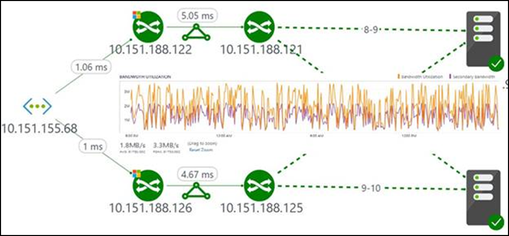
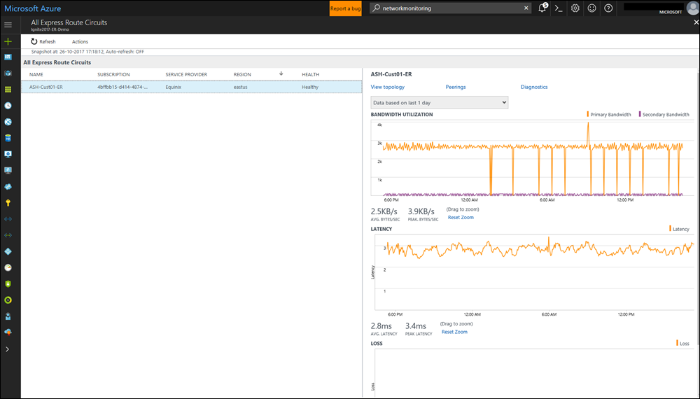
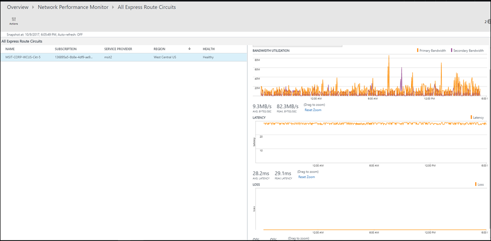
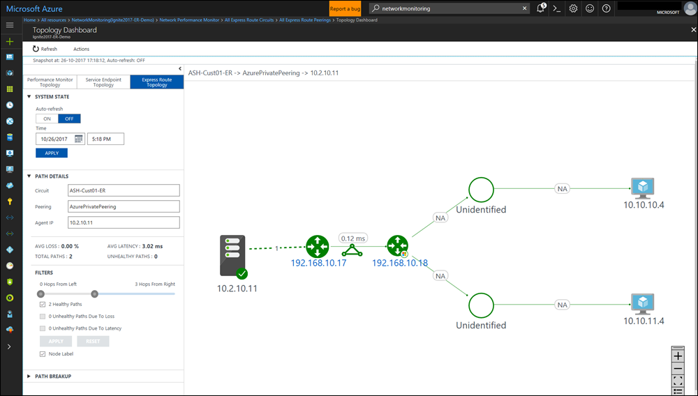
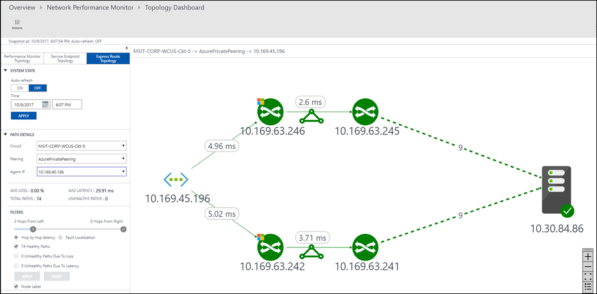
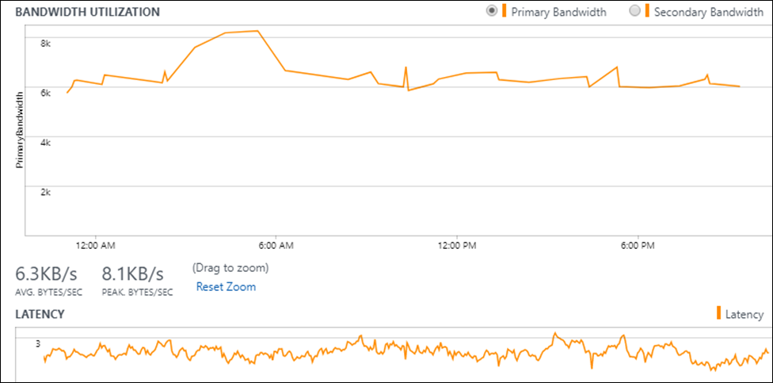

# ExpressRoute Manager

Monitor end-to-end connectivity and performance between your branch offices and Azure, over Azure ExpressRoute. Key advantages: 

- Auto-detection of ExpressRoute circuits associated with your subscription 
- Tracking of bandwidth utilization, loss and latency at the circuit, peering and VNet level for your ExpressRoute 
- Discovery of network topology of your ExpressRoute circuits 

## Configuration 

### Configure NSG rules 
For the servers in Azure that are being used for the monitoring via NPM, you must configure network security group (NSG) rules to allow TCP traffic on the port used by NPM for synthetic transactions. The default port is 8084. This allows the OMS agent installed on Azure VM to communicate with an on-premises monitoring agents. 

For more information about NSG, see [Network Security Groups](../virtual-network/virtual-networks-create-nsg-arm-portal). 

>[!NOTE]
> Make sure that you have installed the agents (both the on-premises server agent and the Azure server agent) and have run the EnableRules.ps1 PowerShell script before proceeding with this step. 

 
### Discover ExpressRoute Peering connections 

Move to NPM’s Configuration page by clicking on the Configuration button located on the upper left side corner of the solution dashboard.  

 
1. Click on the **ExpressRoute Peerings** view.  
2. Click on the **Discover Now** button to discover all the ExpressRoute private peerings that are connected to the VNETs in the Azure subscription linked with this OMS workspace.  

>[!NOTE]  
> The ExpressRoute peering discovery works only in the Azure portal. In case you are accessing the solution from OMS portal, you will need to open the Azure portal and trigger discovery from there. Once the ExpressRoute peerings are discovered, you can continue to use the solution from either of the two portals.  

>[!NOTE]  
> The solution currently discovers only ExpressRoute private peerings. 

>[!NOTE]  
> Only those private peerings are discovered which are connected to the VNETs associated with the subscription linked with this OMS workspace. If your ExpressRoute is connected to VNETs outside of the subscription linked to this workspace, you will need to create an OMS workspace in those subscriptions and use NPM to monitor those peerings. 

 
Once the discovery is complete, the discovered private peering connections will be listed in a table. The monitoring for these peerings will initially be in disabled state. 

### Enable monitoring of the ExpressRoute peering connections 

1. Click on the private peering connecting you are interested in monitoring.  
2. On the RHS pane, click on the checkbox **Monitor this Peering**. 
3. If you intend to create health events for this connection, then check **Enable Health Monitoring for this peering**. 
4. Choose monitoring conditions. You can set custom thresholds for health event generation by typing threshold values. Whenever the value of the condition goes above its selected threshold for the peering connection, a health event will be  generated. 
5. Click on **Add Agents** to choose the monitoring agents you intend to use for monitoring this peering connection. You need to ensure that you add agents on both the ends of the connection, i.e., at least one agent in the Azure VNET connected to this peering as well as at least one on-premises agent connected to this peering. 
6. Click **Save** to save the configuration. 

After enabling the rules and selecting the values and agents you want to monitor, there is a wait of approximately 30-60 minutes for the values to begin populating and the **ExpressRoute Monitoring** tiles to become available. Once you see the monitoring tiles, your ExpressRoute circuits and connection resources are being monitored by NPM. 

>[!NOTE]
> This capability works reliable on workspaces that have upgraded to the new query language.  

## Walkthrough 

The NPM dashboard shows an overview of the health of ExpressRoute circuits and peering connections. 

 

### Circuits list 

To see a list of all monitored ExpressRoute circuits, click on the ExpressRoute circuits tile. You can select a circuit and view its health state, trend charts for packet loss, bandwidth utilization, and latency. The charts are interactive. You can select a custom time window for plotting the charts. You can drag the mouse over an area on the chart to zoom in and see fine-grained data points. 

 

### Trend of Loss, Latency, and Throughput 

The bandwidth, latency, and loss charts are interactive. You can zoom into any section of these charts, using mouse controls. You can also see the bandwidth, latency, and loss data for other intervals by clicking Date/Time, located below the Actions button on the upper left. 

 

### Peerings list 

Clicking on the **Private Peerings** tile on the dashboard brings up a list of all connections to virtual networks over private peering. Here, you can select a virtual network connection and view its health state, trend charts for packet loss, bandwidth utilization, and latency. 

 

### Circuit topology 

To view circuit topology, click on the **Topology** tile. This takes you to the topology view of the selected circuit or peering. The topology diagram provides the latency for each segment on the network and each layer 3 hop is represented by a node of the diagram. Clicking on a hop reveals more details about the hop. You can increase the level of visibility to include on-premises hops by moving the slider bar below Filters. Moving the slider bar to the left or right, increases/decreases the number of hops in the topology graph. The latency across each segment is visible, which allows for faster isolation of high latency segments on your network. 

  

### Detailed Topology view of a circuit 

This view shows VNet connections. 

 

### Diagnostics 

NPM helps you diagnose several circuit connectivity issues. Some of the issues are listed below 

**Circuit is down.** NPM notifies you as soon as the connectivity between your on-premises resources and Azure VNETs is lost. This will help you take proactive action before receiving user escalations and reduce the down time 

 

**Traffic not flowing through intended circuit.** NPM can notify you whenever the traffic is unexpectedly not flowing through the intended ExpressRoute circuit. This can happen if the circuit is down and the traffic is flowing through the backup route, or if there is a routing issue. This information will help you proactively manage any configuration issues in your routing policies and ensure that the most optimal and secure route is used. 

 

**Traffic not flowing through primary circuit.** The capability notifies you when the traffic is flowing through the secondary ExpressRoute circuit. Even though you will not experience any connectivity issues in this case, but proactively troubleshooting the issues with the primary circuit will make you better prepared. 

 

**Degradation due to peak utilization.** You can correlate the bandwidth utilization trend with the latency trend to identify whether the Azure workload degradation is due to a peak in bandwidth utilization or not and take action accordingly.  

 

## Next steps
* [Search logs](log-analytics-log-searches.md) to view detailed network performance data records.
