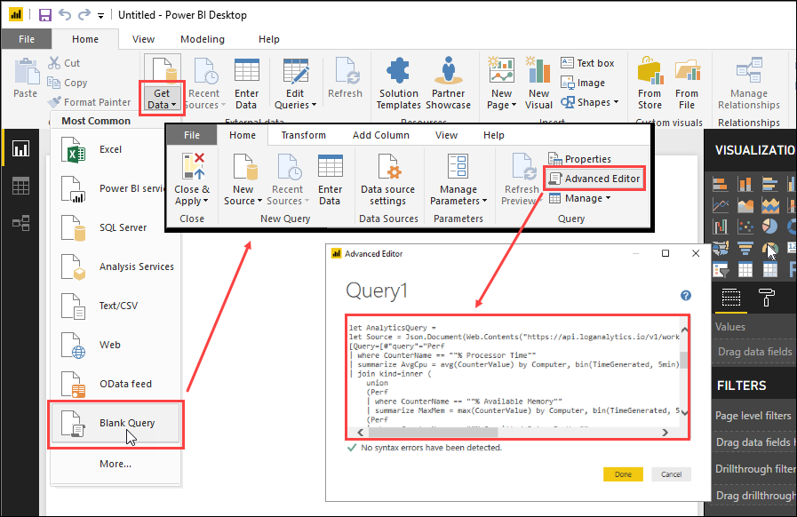
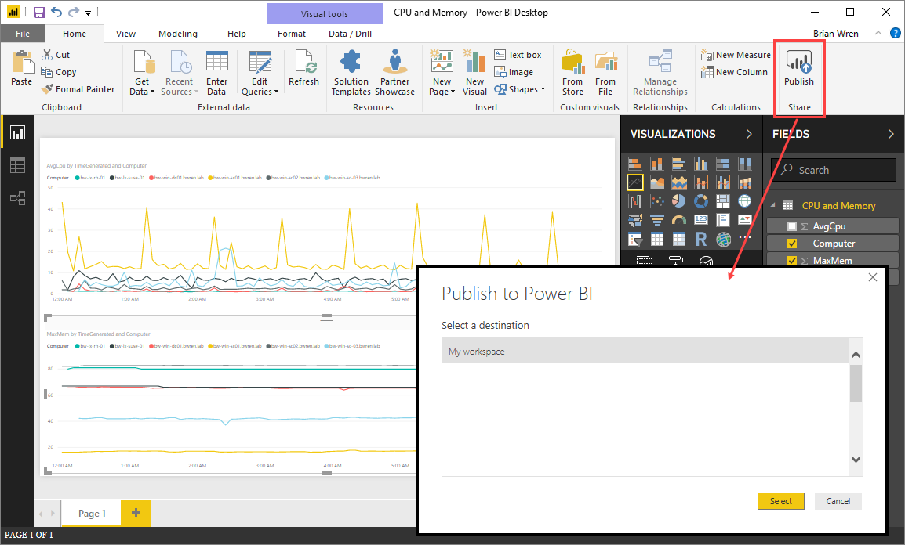

# Import Log Analytics data into Power BI

[Power BI](https://powerbi.microsoft.com/documentation/powerbi-service-get-started/) is a cloud based business analytics service from Microsoft that provides rich visualizations and reports for analysis of different sets of data.  You can import the results of a Log Analytics log search into a Power BI dataset so you can take advantage of its features  suchas combing data from different sources and sharing reports on the web and mobile devices.

This article provides details on importing Log Analytics data into Power BI and scheduling it to automatically refresh.  Different processes are included for an [upgraded](#upgraded-workspace) and a [legacy](#legacy-workspace) workspace.

## Upgraded workspace

To import data from an [upgraded Log Analytics workspace](log-analytics-log-search-upgrade.md) into Power BI, you create a dataset in Power BI based on a log search query in Log Analytics.  The query is run each time the dataset is refreshed.  You can then build Power BI reports that use data from the dataset.  To create the dataset in Power BI, you export your query from Log Analytics to [Power Query (M) language](https://msdn.microsoft.com/en-us/library/mt807488.aspx).  You then use this to create a query in Power BI Desktop and then publish it to Power BI as a dataset.  The details for this process are described below.

### Export query
Start by creating a [log search](log-analytics-log-search-new.md) that returns the data from Log Analytics that you want to populate the Power BI dataset.  You then export that query to [Power Query (M) language](https://msdn.microsoft.com/en-us/library/mt807488.aspx) which can be used by Power BI Desktop.

1. Create the log search in Log Analytics to extract the data for your dataset.
2. If you're using the log search portal, click **Power BI**.  If you're using the Analytics portal, select **Export** > **Power BI Query (M)**.  Both of these options export the query to a text file called **PowerBIQuery.txt**. 

     

3. Open the text file and copy its contents.

### Import query into Power BI Desktop
Power BI Desktop is a desktop application that allows you to create datasets and reports that can be published to Power BI.  You can also use it to create a query using the Power Query language exported from Log Analytics. 

1. Install [Power BI Desktop](https://powerbi.microsoft.com/desktop/) if you don't already have it and then open the application.
2. Select **Get Data** > **Blank Query** to open a new query.  Then select **Advanced Editor** and paste the contents of the exported file into the query. Click **Done**.

    

5. The query runs, and its results are displayed.  You may be prompted for credentials to connect to Azure.  
6. Type in a descriptive name for the query.  The default is **Query1**. Click **Close and Apply** to add the dataset to the report.

    

### Publish to Power BI
When you publish to Power BI, a dataset and a report will be created.  If you create a report in Power BI Desktop, then this will be published with your data.  If not, then a blank report will be created.  You can modify the report in Power BI or create a new one based on the dataset.

8. Create a report based on your data.  Use [Power BI Desktop documentation](https://docs.microsoft.com/power-bi/desktop-report-view) if you're not familiar with it.  When you're ready to send it to Power BI, click **Publish**.  When prompted, select a destination in your Power BI account.  Unless you have a specific destination in mind, use **My workspace**.

    

3. When the publishing completes, click **Open in Power BI** to open Power BI with your new dataset.

### Configure scheduled refresh
The dataset created in Power BI will have the same data that you previously saw in Power BI Desktop.  You need to refresh the dataset periodically to run the query again and populate it with the latest data from Log Analytics.  

1. Click on the workspace where you uploaded your report and select the **Datasets** menu. Select the context menu next to your new dataset and select **Settings**. Under **Data source credentials** you should have a message that the credentials are invalid.  This is because you haven't provided credentials yet for the dataset to use when it refreshes its data.  Click **Edit credentials** and specify credentials with access to Log Analytics.

    

5. Under **Scheduled refresh** turn on the option to **Keep your data up to date**.  You can optionally change the **Refresh frequency** and one or more specific times to run the refresh.

    

## Legacy workspace
When you configure Power BI with a [legacy Log Analytics workspace](log-analytics-powerbi.md), you create log queries that export their results to corresponding datasets in Power BI.  The query and export continues to automatically run on a schedule that you define to keep the dataset up to date with the latest data collected by Log Analytics.

### Power BI Schedules
A *Power BI Schedule* includes a log search that exports a set of data from the OMS repository to a corresponding dataset in Power BI and a schedule that defines how often this search is run to keep the dataset current.

The fields in the dataset will match the properties of the records returned by the log search.  If the search returns records of different types then the dataset will include all of the properties from each of the included record types.  

### Connecting OMS workspace to Power BI
Before you can export from Log Analytics to Power BI, you must connect your OMS workspace to your Power BI account using the following procedure.  

1. In the OMS console click the **Settings** tile.
2. Select **Accounts**.
3. In the **Workspace Information** section click **Connect to Power BI Account**.
4. Enter the credentials for your Power BI account.

### Create a Power BI Schedule
Create a Power BI Schedule for each dataset using the following procedure.

1. In the OMS console click the **Log Search** tile.
2. Type in a new query or select a saved search that returns the data that you want to export to **Power BI**.  
3. Click the **Power BI** button at the top of the page to open the **Power BI** dialog.
4. Provide the information in the following table and click **Save**.

| Property | Description |
|:--- |:--- |
| Name |Name to identify the schedule when you view the list of Power BI schedules. |
| Saved Search |The log search to run.  You can either select the current query or select an existing saved search from the dropdown box. |
| Schedule |How often to run the saved search and export to the Power BI dataset.  The value must be between 15 minutes and 24 hours. |
| Dataset Name |The name of the dataset in Power BI.  It will be created if it doesn’t exist and updated if it does exist. |

### Viewing and Removing Power BI Schedules
View the list of existing Power BI Schedules with the following procedure.

1. In the OMS console click the **Settings** tile.
2. Select **Power BI**.

In addition to the details of the schedule, the number of times that the schedule has run in the past week and the status of the last sync are displayed.  If the sync encountered errors, you can click the link to run a log search for records with details of the error.

You can remove a schedule by clicking on the **X** in the **Remove column**.  You can disable a schedule by selecting **Off**.  To modify a schedule you must remove it and recreate it with the new settings.

### Sample walkthrough
The following section walks through an example of creating a Power BI Schedule and using its dataset to create a simple report.  In this example, all performance data for a set of computers is exported to Power BI and then a line graph is created to display processor utilization.

#### Create log search
We start by creating a log search for the data that we want to send to the dataset.  In this example, we’ll use a query that returns all performance data for computers with a name that starts with *srv*.  

#### Create Power BI Search
We click the **Power BI** button to open the Power BI dialog and provide the required information.  We want this search to run once per hour and create a dataset called *Contoso Perf*.  Since we already have the search open that creates the data we want, we keep the default of *Use current search query* for **Saved Search**.

#### Verify Power BI Search
To verify that we created the schedule correctly, we view the list of Power BI Searches under the **Settings** tile in the OMS dashboard.  We wait several minutes and refresh this view until it reports that the sync has been run.  You'll typically schedule the dataset to refresh automatically.

#### Verify the dataset in Power BI
We log into our account at [powerbi.microsoft.com](http://powerbi.microsoft.com/) and scroll to **Datasets** at the bottom of the left pane.  We can see that the *Contoso Perf* dataset is listed indicating that our export has run successfully.

#### Create report based on dataset
We select the **Contoso Perf** dataset and then click on **Results** in the **Fields** pane on the right to view the fields that are part of this dataset.  To create a line graph showing processor utilization for each computer, we perform the following actions.

1. Select the Line chart visualization.
2. Drag **ObjectName** to **Report level filter** and check **Processor**.
3. Drag **CounterName** to **Report level filter** and check **% Processor Time**.
4. Drag **CounterValue** to **Values**.
5. Drag **Computer** to **Legend**.
6. Drag **TimeGenerated** to **Axis**.

We can see that the resulting line graph is displayed with the data from our dataset.

#### Save the report
We save the report by clicking on the Save button at the top of the screen and validate that it is now listed in the Reports section in the left pane.

## Next steps
* Learn about [log searches](log-analytics-log-searches.md) to build queries that can be exported to Power BI.
* Learn more about [Power BI](http://powerbi.microsoft.com) to build visualizations based on Log Analytics exports.
