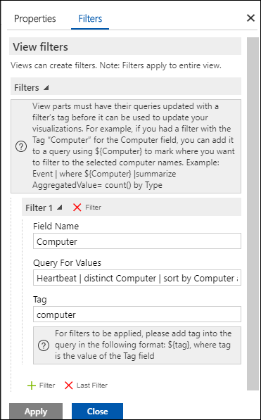

# Filters in Log Analytics views
A **filter** in a [Log Analytics view](log-analytics-view-designer.md) allows users to filter the data in the view by the value of a particular property without modifying the view itself.  For example, you could allow users of your view to filter the view for data only from a particular computer or set of computers.  You can create multiple filters on a single view to allow users to filter by multiple properties.

## Using a filter
Click **Filter** to open the filter pane for a view.  This allows you to select a time range and values for any filters that are available for the view.  When you select a filter, it displays a list of available values.  You can either select one or more values or type them in. The view is automatically updated to filter on the values you specify. 

If no value is selected for a filter, then that filter isn't applied to the view.  If you remove all of the values for a filter, then that filter will no longer be applied.

## Creating a filter

Create a filter from the **Filters** tab when [editing a view](log-analytics-view-designer.md).  The filter is global for the view and applies to all parts in the view.  

The following table describes the settings for a filter.

| Setting | Description |
|:---|:---|
| Field Name | Name of the field used for filtering.  This must match the summarize field in **Query for Values**. |
| Query for Values | Query to run to populate filter dropdown for the user.  This must use either [summarize](https://docs.loganalytics.io/docs/Language-Reference/Tabular-operators/summarize-operator) or [distinct](https://docs.loganalytics.io/docs/Language-Reference/Tabular-operators/distinct-operator) to provide unique values for a particular field, and it must match the **Field Name**.  You can use [sort](https://docs.loganalytics.io/docs/Language-Reference/Tabular-operators/sort-operator) to sort the values that are displayed to the user. |
| Tag | Name for the field that's used in queries supporting the filter and is also displayed to the user. |

#### Examples

The following table includes a few examples of common filters.  

| Field Name | Query for Values | Tag |
|:--|:--|:--|
| Computer   | Heartbeat &#124; distinct Computer &#124; sort by Computer asc | Computers |
| EventLevelName | Event &#124; distinct EventLevelName | Severity |
| SeverityLevel | Syslog &#124; distinct SeverityLevel | Severity |
| SvcChangeType | ConfigurationChange &#124; distinct svcChangeType | ChangeType |

## Modify view queries

For a filter to have any effect, you must modify any queries in the view to filter on the selected values.  If you don't modify any queries in the view then any values the user selects will have no effect.

The syntax for using a filter value in a query is: 

    where ${filter name}  

For example, if your view has a query the returns events and uses a filter called Computers, you could use the following.

    Event | where ${Computers} | summarize count() by EventLevelName

If you added another filter called Severity, you could use the following query to use both filters.

    Event | where ${Computers} | where ${Severity} | summarize count() by EventLevelName

