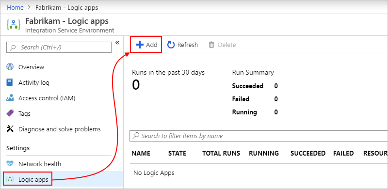
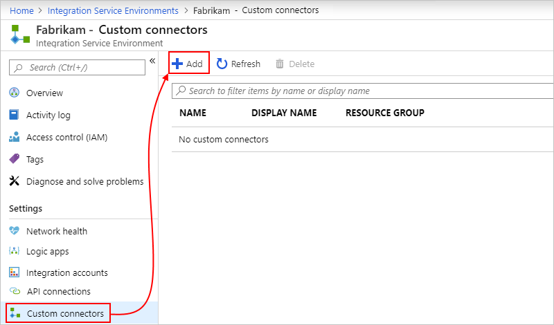
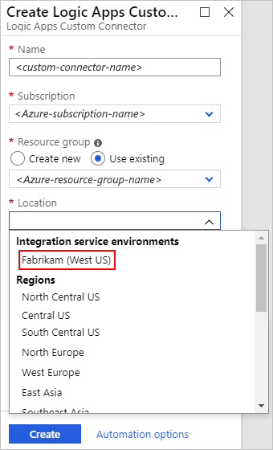
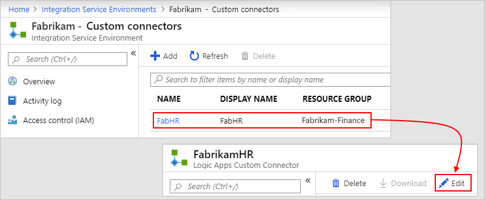

# Add artifacts to your integration service environment (ISE) in Azure Logic Apps

After you create an [integration service environment (ISE)](../logic-apps/connect-virtual-network-vnet-isolated-environment-overview.md), add artifacts such as logic apps, integration accounts, and custom connectors so that they can access the resources in your Azure virtual network.

## Prerequisites

* An Azure subscription. If you don't have an Azure subscription, [sign up for a free Azure account](https://azure.microsoft.com/free/).

* The ISE that you created to run your logic apps. If you don't have an ISE, [create an ISE first](../logic-apps/connect-virtual-network-vnet-isolated-environment.md).

## Create logic apps in an ISE

To build logic apps that run in your integration service environment (ISE), follow these steps:

1. Find and open your ISE, if not already open. From the ISE menu, under **Settings**, select **Logic apps** > **Add**.

   

   -or-

   From the main Azure menu, select **Create a resource** > **Integration** > **Logic App**.

1. Provide the name, Azure subscription, and Azure resource group (new or existing) to use for your logic app.

1. From the **Location** list, under the **Integration service environments** section, select your ISE, for example:

   

   > [!IMPORTANT]
   > If you want to use your logic apps with an integration account, 
   > those logic apps and the integration account must use the same ISE.

1. Continue [creating your logic app in the usual way](../logic-apps/quickstart-create-first-logic-app-workflow.md).

   For differences in how triggers and actions work and how they're labeled when you use an ISE compared to the global Logic Apps service, see [Isolated versus global in the ISE overview](connect-virtual-network-vnet-isolated-environment-overview.md#difference).

1. To manage logic apps and API connections in your ISE, see [Manage your integration service environment](../logic-apps/ise-manage-integration-service-environment.md).

## Create integration accounts in an ISE

Based on the [ISE SKU](../logic-apps/connect-virtual-network-vnet-isolated-environment-overview.md#ise-level) selected at creation, your ISE includes specific integration account usage at no additional cost. Logic apps that exist in an integration service environment (ISE) can reference only integration accounts that exist in the same ISE. So, for an integration account to work with logic apps in an ISE, both the integration account and logic apps must use the *same environment* as their location. For more information about integration accounts and ISEs, see [Integration accounts with ISE](connect-virtual-network-vnet-isolated-environment-overview.md#create-integration-account-environment
).

To create an integration account that uses an ISE, follow these steps:

1. Find and open your ISE, if not already open. From the ISE menu, under **Settings**, select **Integration accounts** > **Add**.

   

   -or-

   From the main Azure menu, select **Create a resource** > **Integration** > **Integration Account**.

1. Provide the name, Azure subscription, Azure resource group (new or existing), and pricing tier to use for your integration account.

1. From the **Location** list, under the **Integration service environments** section, select the same ISE that your logic apps use, for example:

   

1. [Link your logic app to your integration account in the usual way](../logic-apps/logic-apps-enterprise-integration-create-integration-account.md#link-account).

1. Continue by adding artifacts to your integration account, such as [trading partners](../logic-apps/logic-apps-enterprise-integration-partners.md) and [agreements](../logic-apps/logic-apps-enterprise-integration-agreements.md).

1. To manage integration accounts in your ISE, see [Manage your integration service environment](../logic-apps/ise-manage-integration-service-environment.md).

## Create custom connectors in an ISE

To use custom connectors in your ISE, create those custom connectors from directly inside your ISE.

1. Find and open your ISE, if not already open. From the ISE menu, under **Settings**, select **Custom connectors** > **Add**.

   

1. Provide the name, Azure subscription, and Azure resource group (new or existing) to use for your custom connector.

1. From the **Location** list, under the **Integration service environments** section, select the same ISE that your logic apps use, and select **Create**, for example:

   

1. Select your new custom connector, and then select **Edit**, for example:

   

1. Continue by creating the connector in the usual way from an [OpenAPI definition](https://docs.microsoft.com/connectors/custom-connectors/define-openapi-definition#import-the-openapi-definition) or [SOAP](https://docs.microsoft.com/connectors/custom-connectors/create-register-logic-apps-soap-connector#2-define-your-connector).

1. To manage custom connectors in your ISE, see [Manage your integration service environment](../logic-apps/ise-manage-integration-service-environment.md).
