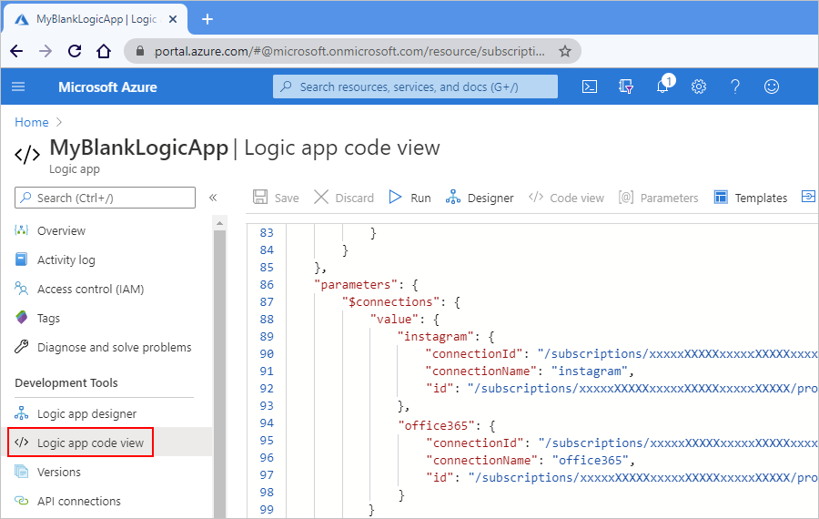
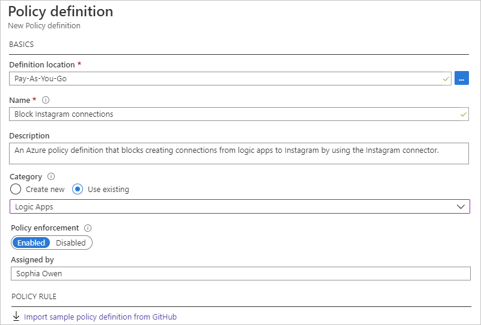
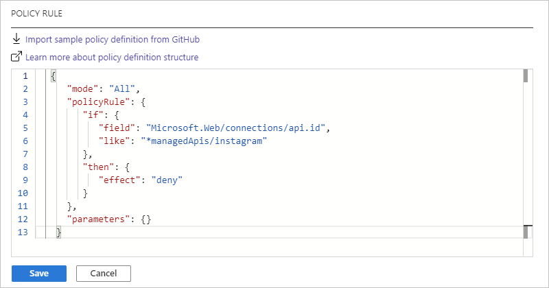
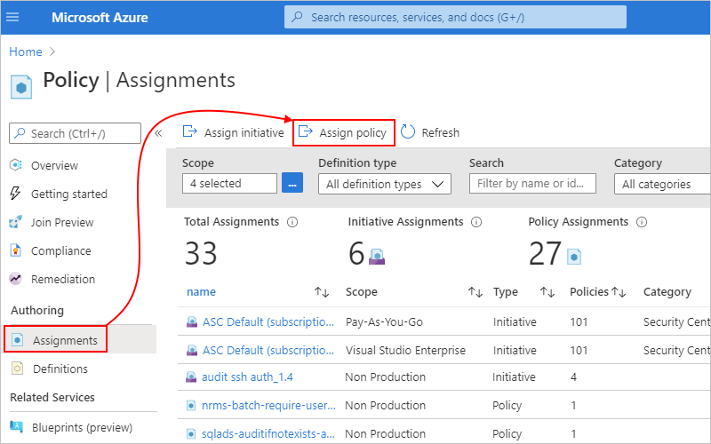
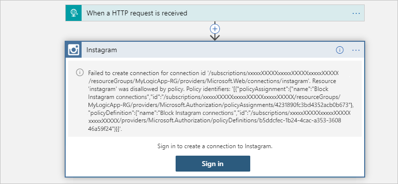

# Block connections created by specific connectors in Azure Logic Apps

If your organization doesn't permit connecting to specific resources by using their connectors in Azure Logic Apps, you can prevent creating those connections in logic app workflows. By using [Azure Policy](../governance/policy/overview.md), you can define and enforce a [policy](../governance/policy/overview.md#policy-definition) that blocks creating connections through those connectors. For example, for security reasons, you might want to prohibit connections to specific social media platforms or other services.

This topic shows how to set up a policy in the Azure portal for blocking specific connections, but you can also create policies in other ways.

## Prerequisites

* An Azure subscription. If you don't have a subscription, [create a free Azure account](https://azure.microsoft.com/free/) before you start.

* The reference ID for the connector that you want to block. For more information, see [Find the connector reference ID](#connector-reference-ID).

<a name="connector-reference-ID"></a>

## Find connector reference ID

If you already have a logic app with the connection that you want to block, follow the steps in this section for the [Azure portal](#connector-ID-portal). Otherwise, follow these steps:

1. Visit the [Logic Apps connectors list](https://docs.microsoft.com/connectors/connector-reference/connector-reference-logicapps-connectors).

1. Find the reference page for the connector that you want to block.

   For example, if you want to block the Instagram connector, go to this page: `"https://docs.microsoft.com/connectors/instagram/"`

1. From the page's URL, copy the connector ID at the end without the forward slash (`/`), for example, `instagram`.

   Later, when you create your policy definition, you use this ID in the definition's condition statement, for example:

   `"like": "*managedApis/instagram"`

<a name="connector-ID-portal"></a>

### Azure portal

1. In the [Azure portal](https://portal.azure.com), find and open your logic app.

1. On the logic app menu, select **Logic app code view** so that you can view your logic app's JSON definition.

   

1. Go to the `parameters` section that has the `$connections` section, which specifies the connections that are in your logic app and follows this format:

   ```json
   {
      "parameters": {
         "$connections": {
            "value" : {
               "{connection-name}": {
                  "connectionId": "/subscriptions/{Azure-subscription-ID}/resourceGroups/{Azure-resource-group-name}/providers/Microsoft.Web/connections/{connection-name}",
                  "connectionName": "{connection-name}",
                  "id": "/subscriptions/{Azure-subscription-ID}/providers/Microsoft.Web/locations/{Azure-region}/managedApis/{connection-name}"
               }
            }
         }
      }
   }
   ```

   For example, the `instagram` section identifies an Instagram connection:

   ```json
   {
      "parameters": {
         "$connections": {
            "value" : {
               "instagram": {
                  "connectionId": "/subscriptions/xxxxxXXXXXxxxxxXXXXXxxxxxXXXXX/resourceGroups/MyLogicApp-RG/providers/Microsoft.Web/connections/instagram",
                  "connectionName": "instagram",
                  "id": "/subscriptions/xxxxxXXXXXxxxxxXXXXXxxxxxXXXXX/providers/Microsoft.Web/locations/westus/managedApis/instagram"
               }
            }
         }
      }
   }
   ```

1. For the connection that you want to block, find the `id` property, which follows this format: 

   `"id": "/subscriptions/{Azure-subscription-ID}/providers/Microsoft.Web/locations/{Azure-region}/managedApis/{connection-name}"`

   For example, here is the `id` property for an Instagram connection:

   `"id": "/subscriptions/xxxxxXXXXXxxxxxXXXXXxxxxxXXXXX/providers/Microsoft.Web/locations/westus/managedApis/instagram"`

<a name="create-policy-definition"></a>

## Create policy definition

1. Sign in to the [Azure portal](https://portal.azure.com). In the portal search box, enter `policy`, and select **Policy**.

   

1. On the **Policy** menu, under **Authoring**, select **Definitions** > **+ Policy definition**.

   

1. Under **Policy definition**, provide the information for your policy definition, based on the properties described under the example:

   

   | Property | Required | Value | Description |
   |----------|----------|-------|-------------|
   | **Definition location** | Yes | <*Azure-subscription-name*> | The Azure subscription to use for the policy definition <p><p>1. To find your subscription, select the ellipses (**...**) button. <br>2. From the **Subscription** list, find and select your subscription. <br>3. When you're done, select **Select**. |
   | **Name** | Yes | <*policy-definition-name*> | The name to use for the policy definition |
   | **Description** | No | <*policy-definition-name*> | A description for the policy definition |
   | **Category** | Yes | **Logic apps** | The name for an existing category or new category for the policy definition |
   | **Policy enforcement** | Yes | **Enabled** | This setting specifies whether to enable or disable the policy definition when you save your work. |
   ||||

1. Under **POLICY RULE**, the JSON edit box is already pre-populated with a sample definition template. Replace this sample with your [policy definition](../governance/policy/concepts/definition-structure.md) by following this syntax and based on the properties described in the table below:

   ```json
   {
      "mode": "All",
      "policyRule": {
         "if": {
            "field": "Microsoft.Web/connections/api.id",
            "like": "*managedApis/{connector-name}"
         },
         "then": {
            "effect": "deny"
         }
      },
      "parameters": {}
    }
    ```

   | Property | Value | Description |
   |----------|-------|-------------|
   | `mode` | `All` | The mode that determines the resource types that the policy evaluates. <p><p>In this scenario, set `mode` to `All`, which applies the policy to Azure resource groups, subscriptions, and all resource types. <p><p>For more information, see [Policy definition structure - mode](../governance/policy/concepts/definition-structure.md#mode). |
   | `if` | `{condition-to-evaluate}` | The condition that determines when to enforce the policy rule <p><p>In this scenario, the `{condition-to-evaluate}` determines whether the `api.id` value in `Microsoft.Web/connections/api.id` matches on `*managedApis/{connector-name}`, which specifies a wildcard (*) value. <p><p>For more information, see [Policy definition structure - Policy rule](../governance/policy/concepts/definition-structure.md#policy-rule). |
   | `field` | `Microsoft.Web/connections/api.id` | The `field` value to compare against the condition <p><p>In this scenario, the `field` is `Microsoft.Web/connections/api.id`, which refers to the connector's `api.id` value. |
   | `like` | `*managedApis/{connector-name}` | The logical operator and value to use for comparing the `field` value <p><p>In this scenario, the `like` operator makes sure that the rule works regardless of region, and `*managedApis/{connector-name}` is the value to match on where `{connector-name}` is the ID for the connector that you want to block. <p><p>For example, suppose that you want to block access to all social media platforms or lock down connections: <p><p>- Twitter: `twitter` <br>- SQL Server or Azure SQL: `sql` <br>- Instagram: `instagram` <br>- Facebook: `facebook` <br>- Pinterest: `pinterest` <p><p>To find these connector IDs, visit the Connectors reference pages and use the connector ID |
   | `then` | `{effect-to-apply}` | The effect to apply when the `if` condition is met <p><p>In this scenario, the `{effect-to-apply}` is to block and fail a resource request that doesn't comply with the policy. <p><p>For more information, see [Policy definition structure - Policy rule](../governance/policy/concepts/definition-structure.md#policy-rule). |
   | `effect` | `deny` | The `effect` is to `deny` or block the request to create the connection <p><p>For more information, see [Understand Azure Policy effects - Deny](../governance/policy/concepts/effects.md#deny). |
   ||||

   For example, suppose that you want to block logic apps from creating connections by using the Instagram connector. Here is the policy definition that you can use:

   ```json
   {
      "mode": "All",
      "policyRule": {
         "if": {
            "field": "Microsoft.Web/connections/api.id",
            "like": "*managedApis/instagram"
         },
         "then": {
            "effect": "deny"
         }
      },
      "parameters": {}
    }
    ```

   

1. When you're done, select **Save**. After you save the policy definition, Azure Policy generates and adds more property values to the policy definition.

For more information about Azure policy definitions, see these topics:

* [Policy structure definition](../governance/policy/concepts/definition-structure.md)
* [Tutorial: Create and manage policies to enforce compliance](../governance/policy/tutorials/create-and-manage.md)
* [Azure Policy built-in policy definitions for Azure Logic Apps](../logic-apps/policy-samples.md)

<a name="create-policy-assignment"></a>

## Create policy assignment

Next, you need to assign the policy definition where you want the policy to apply, for example, to a single resource group, multiple resource groups, Azure Active Directory (Azure AD) tenant, or Azure subscription. For this task, follow these steps to create a policy assignment:

1. If you signed out, sign back in to the [Azure portal](https://portal.azure.com). In the portal search box, enter `policy`, and select **Policy**.

   

1. On the **Policy** menu, under **Authoring**, select **Assignments** > **Assign policy**.

   

1. Under **Basics**, provide this information for the policy assignment:

   | Property | Required | Description |
   |----------|----------|-------------|
   | **Scope** | Yes | The Azure subscription and optional resource group where you want to apply and enforce the policy. <p><p>1. Next to the **Scope** box, select the ellipses (**...**) button. <br>2. From the **Subscription** list, select the Azure subscription. <br>3. Optionally, from the **Resource Group** list, select the resource group. <br>4. When you're done, select **Select**. |
   | **Exclusions** | No | Any Azure resources to exclude from the policy assignment. <p><p>1. Next to the **Exclusions** box, select the ellipses (**...**) button. <br>2. From the **Resource** list, select the resource > **Add to Selected Scope**. <br>3. When you're done, select **Save**. |
   | **Policy definition** | Yes | The name for the policy definition that you want to apply and enforce. <p><p>1. Next to the **Policy definition** box, select the ellipses (**...**) button. <br>2. Find and select the policy definition by using the **Type** filter or **Search** box. <br>3. When you're done, select **Select**. |
   | **Assignment name** | Yes | The name to use for the policy assignment |
   | **Assignment ID** | Yes | The automatically generated ID for the policy assignment |
   | **Description** | No | A description for the policy assignment |
   | **Policy enforcement** | Yes | The setting that enables or disables the policy assignment |
   | **Assigned by** | No | The name for the person who created and applied the policy assignment |
   ||||

   For example:

   

For more information, see [Quickstart: Create a policy assignment to identify non-compliant resources](../governance/policy/assign-policy-portal.md).

## Test the policy

In the Logic App Designer, try to create a connection using the restricted connector. For example, following the Instagram example, when you sign in, you get this error that your logic app failed to create the connection:



The message includes this information:

* Reason for the failure: `"Resource 'instagram' was disallowed by policy."`

* Policy assignment information:

  * Assignment name: `"Block Instagram connections"`

  * Assignment ID: `"/subscriptions/xxxxxXXXXXxxxxxXXXXXxxxxxXXXXX/resourceGroups/MyLogicApp-RG/providers/Microsoft.Authorization/policyAssignments/4231890fc3bd4352acb0b673"`

* Policy definition ID: `"/subscriptions/xxxxxXXXXXxxxxxXXXXXxxxxxXXXXX/providers/Microsoft.Authorization/policyDefinitions/b5ddcfec-1b24-4cac-a353-360846a59f24"`

## Next steps

* Learn more about [Azure Policy](../governance/policy/overview.md)