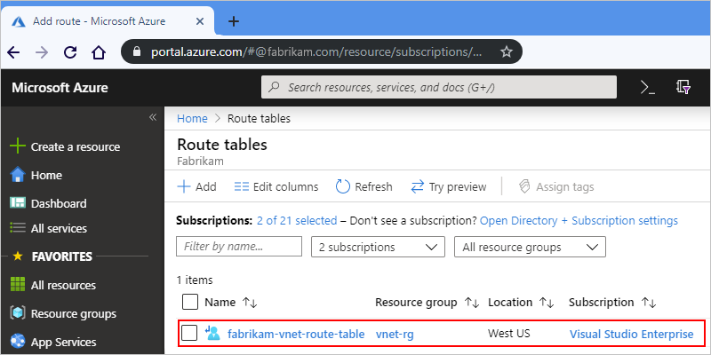
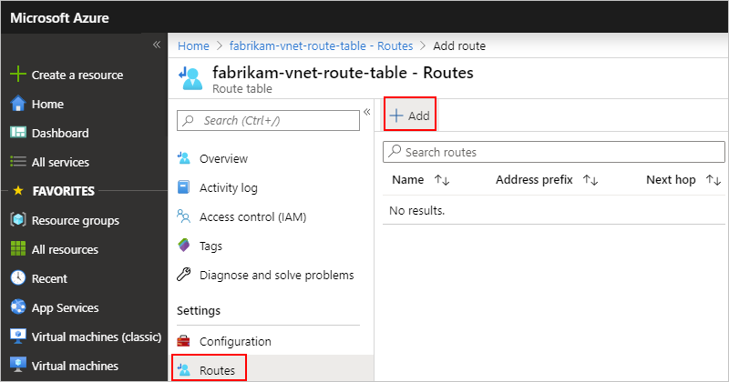
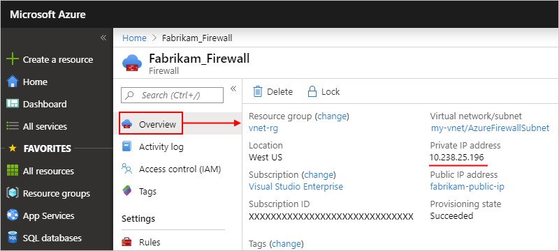
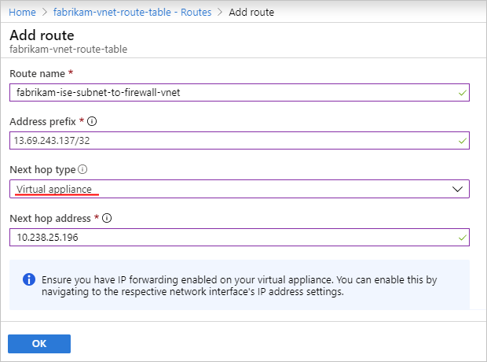
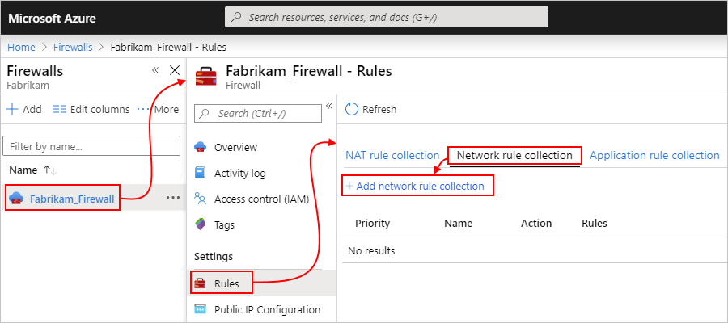

# Set up Azure virtual network access for integration service environments in Azure Logic Apps

When you work with Azure Logic Apps, you can set up an [*integration service environment* (ISE)](../logic-apps/connect-virtual-network-vnet-isolated-environment-overview.md) for hosting logic apps that need to access resources in an [Azure virtual network](../virtual-network/virtual-networks-overview.md). However, a common setup problem is having one or more blocked ports. The connectors that you use for creating connections between your ISE and destination systems might also have their own port requirements. For example, if you communicate with an FTP system by using the FTP connector, the port that you use on your FTP system needs to be available, for example, port 21 for sending commands.

To make sure that the logic apps in your ISE can communicate across the subnets in your virtual network, check whether you need to take additional steps to set up access for your ISE by reviewing these considerations:

* If you created a new Azure virtual network and subnets without any constraints, you don't need to set up [network security groups (NSGs)](../virtual-network/security-overview.md#network-security-groups) in your virtual network to control traffic across subnets.

* On an existing virtual network, you can *optionally* set up NSGs by [filtering network traffic across subnets](../virtual-network/tutorial-filter-network-traffic.md). If you choose this route, on the virtual network where you want to set up the NSGs, make sure that you [open the ports specified by the table below](#network-ports-for-ise). If you use [NSG security rules](../virtual-network/security-overview.md#security-rules), you need both TCP and UDP protocols.

* If you have previously existing NSGs, make sure that you [open the ports specified by the table below](#network-ports-for-ise). If you use [NSG security rules](../virtual-network/security-overview.md#security-rules), you need both TCP and UDP protocols.

* If your virtual network uses [Azure Firewall](../firewall/overview.md) or a [network virtual appliance](../virtual-network/virtual-networks-overview.md#filter-network-traffic), you can [set up a single, outbound, public, and predictable IP address](#predictable-outbound-ip) for one or more ISEs to communicate with destination systems. That way, you don't have to set up additional firewall openings at the destination.

  Otherwise, to make sure that your ISE stays accessible and works correctly, you need to open the ports specified by the table below. If any required ports are unavailable, your ISE won't work correctly.

## Set up public outbound IP address

When your Azure virtual network uses [Azure Firewall](../firewall/overview.md) or a [network virtual appliance](../virtual-network/virtual-networks-overview.md#filter-network-traffic), you can route outbound access through that firewall by setting up a single, outbound, public, and predictable IP address to communicate with destination systems. That way, all the ISEs in the virtual network can use this single IP address to communicate with destination systems, and you don't have to set up additional firewall openings at the destination.

Before you start, you need these items:

* An Azure firewall that runs in the same virtual network as your ISE. If you don't have a firewall, first [add a subnet](../virtual-network/virtual-network-manage-subnet.md#add-a-subnet) that's named `AzureFirewallSubnet` to your virtual network. You can then [create and deploy a firewall](../firewall/tutorial-firewall-deploy-portal.md#deploy-the-firewall) in your virtual network.

* An Azure [route table](../virtual-network/manage-route-table.md). If you don't have one, first [create a route table](../virtual-network/manage-route-table.md#create-a-route-table). For more information about routing, see [Virtual network traffic routing](../virtual-network/virtual-networks-udr-overview.md).

1. In the [Azure portal](https://portal.azure.com), select the route table, for example:

   

1. To [add a new route](../virtual-network/manage-route-table.md#create-a-route), on the route table menu, select **Routes** > **Add**.

   

1. On the **Add route** pane, [set up the new route](../virtual-network/manage-route-table.md#create-a-route) with a rule that specifies that all the outgoing traffic to the destination system follows this behavior:

   * Uses the [**Virtual appliance**](../virtual-network/virtual-networks-udr-overview.md#user-defined) as the next hop type.

   * Goes to the private IP address for the firewall instance as the next hop address.

     To find this IP address, on your firewall menu, select **Overview**, find the address under **Private IP address**, for example:

     

   Here's an example that shows how such a rule might look:

   

   | Property | Value | Description |
   |----------|-------|-------------|
   | **Route name** | <*unique-route-name*> | A unique name for the route in the route table |
   | **Address prefix** | <*destination-address*> | The destination system's address where you want the traffic to go. Make sure that you use [Classless Inter-Domain Routing (CIDR) notation](https://en.wikipedia.org/wiki/Classless_Inter-Domain_Routing) for this address. |
   | **Next hop type** | **Virtual appliance** | The [hop type](../virtual-network/virtual-networks-udr-overview.md#next-hop-types-across-azure-tools) that's used by outbound traffic |
   | **Next hop address** | <*firewall-private-IP-address*> | The private IP address for your firewall |
   |||

1. In the Azure portal, find and select your firewall. On the firewall menu, under **Settings**, select **Rules**. On the rules pane, select **Network rule collection** > **Add network rule collection**.

   

1. In the collection, add a rule that permits traffic to the destination system.

   For example, suppose that you have a logic app that runs in an ISE and needs to communicate with an SFTP system. You create a network rule collection that's named `LogicApp_ISE_SFTP_Outbound`, which contains a network rule named `ISE_SFTP_Outbound`. This rule permits traffic from the IP address of any subnet where your ISE runs in your virtual network to the destination SFTP system by using your firewall's private IP address.

   

   **Network rule collection properties**

   | Property | Value | Description |
   |----------|-------|-------------|
   | **Name** | <*network-rule-collection-name*> | The name for your network rule collection |
   | **Priority** | <*priority-level*> | The order of priority to use for running the rule collection. For more information, see [What are some Azure Firewall concepts](../firewall/firewall-faq.md#what-are-some-azure-firewall-concepts)? |
   | **Action** | **Allow** | The action type to perform for this rule |
   |||

   **Network rule properties**

   | Property | Value | Description |
   |----------|-------|-------------|
   | **Name** | <*network-rule-name*> | The name for your network rule |
   | **Protocol** | <*connection-protocols*> | The connection protocols to use. For example, if you're using NSG rules, select both **TCP** and **UDP**, not only **TCP**. |
   | **Source addresses** | <*ISE-subnet-addresses*> | The subnet IP addresses where your ISE runs and where traffic from your logic app originates |
   | **Destination addresses** | <*destination-IP-address*> | The IP address for your destination system where you want the traffic to go |
   | **Destination ports** | <*destination-ports*> | Any ports that your destination system uses for inbound communication |
   |||

   For more information about network rules, see these articles:

   * [Configure a network rule](../firewall/tutorial-firewall-deploy-portal.md#configure-a-network-rule)
   * [Azure Firewall rule processing logic](../firewall/rule-processing.md#network-rules-and-applications-rules)
   * [Azure Firewall FAQ](../firewall/firewall-faq.md)
   * [Azure PowerShell: New-AzFirewallNetworkRule](https://docs.microsoft.com/powershell/module/az.network/new-azfirewallnetworkrule)
   * [Azure CLI: az network firewall network-rule](https://docs.microsoft.com/cli/azure/ext/azure-firewall/network/firewall/network-rule?view=azure-cli-latest#ext-azure-firewall-az-network-firewall-network-rule-create)

## Network ports used by your ISE

This table describes the ports in your Azure virtual network that your ISE uses and where those ports get used. The [Resource Manager service tags](../virtual-network/security-overview.md#service-tags) represents a group of IP address prefixes that help minimize complexity when creating security rules.

> [!IMPORTANT]
> Source ports are ephemeral, so make sure that you set them to `*` for all rules.
> For internal communication inside your subnets, your ISE requires that you open all ports within those subnets.

| Purpose | Direction | Destination ports | Source service tag | Destination service tag | Notes |
|---------|-----------|-------------------|--------------------|-------------------------|-------|
| Communication from Azure Logic Apps | Outbound | 80, 443 | VirtualNetwork | Internet | The port depends on the external service with which the Logic Apps service communicates |
| Azure Active Directory | Outbound | 80, 443 | VirtualNetwork | AzureActiveDirectory | |
| Azure Storage dependency | Outbound | 80, 443 | VirtualNetwork | Storage | |
| Intersubnet communication | Inbound & Outbound | 80, 443 | VirtualNetwork | VirtualNetwork | For communication between subnets |
| Communication to Azure Logic Apps | Inbound | 443 | Internal access endpoints:  VirtualNetwork 

External access endpoints:  Internet 

**Note**: These endpoints refer to the endpoint setting that was [selected at ISE creation](connect-virtual-network-vnet-isolated-environment.md#create-environment). For more information, see [Endpoint access](../logic-apps/connect-virtual-network-vnet-isolated-environment-overview.md#endpoint-access). | VirtualNetwork | The IP address for the computer or service that calls any request trigger or webhook that exists in your logic app. Closing or blocking this port prevents HTTP calls to logic apps with request triggers. |
| Logic app run history | Inbound | 443 | Internal access endpoints:  VirtualNetwork 

External access endpoints:  Internet 

**Note**: These endpoints refer to the endpoint setting that was [selected at ISE creation](../logic-apps/connect-virtual-network-vnet-isolated-environment.md#create-environment). For more information, see [Endpoint access](../logic-apps/connect-virtual-network-vnet-isolated-environment-overview.md#endpoint-access). | VirtualNetwork | The IP address for the computer from which you view the logic app's run history. Although closing or blocking this port doesn't prevent you from viewing the run history, you can't view the inputs and outputs for each step in that run history. |
| Connection management | Outbound | 443 | VirtualNetwork  | AppService | |
| Publish Diagnostic Logs & Metrics | Outbound | 443 | VirtualNetwork  | AzureMonitor | |
| Communication from Azure Traffic Manager | Inbound | 443 | AzureTrafficManager | VirtualNetwork | |
| Logic Apps Designer - dynamic properties | Inbound | 454 | Internet | VirtualNetwork | Requests come from the Logic Apps [access endpoint inbound IP addresses in that region](../logic-apps/logic-apps-limits-and-config.md#inbound). |
| App Service Management dependency | Inbound | 454, 455 | AppServiceManagement | VirtualNetwork | |
| Connector deployment | Inbound | 454 | AzureConnectors | VirtualNetwork | Necessary for deploying and updating connectors. Closing or blocking this port causes ISE deployments to fail and prevents connector updates or fixes. |
| Connector policy deployment | Inbound | 3443 | Internet | VirtualNetwork | Necessary for deploying and updating connectors. Closing or blocking this port causes ISE deployments to fail and prevents connector updates or fixes. |
| Azure SQL dependency | Outbound | 1433 | VirtualNetwork | SQL | |
| Azure Resource Health | Outbound | 1886 | VirtualNetwork | AzureMonitor | For publishing health status to Resource Health |
| API Management - management endpoint | Inbound | 3443 | APIManagement | VirtualNetwork | |
| Dependency from Log to Event Hub policy and monitoring agent | Outbound | 5672 | VirtualNetwork | EventHub | |
| Access Azure Cache for Redis Instances between Role Instances | Inbound  Outbound | 6379-6383 | VirtualNetwork | VirtualNetwork | Also, for ISE to work with Azure Cache for Redis, you must open these [outbound and inbound ports described in the Azure Cache for Redis FAQ](../azure-cache-for-redis/cache-how-to-premium-vnet.md#outbound-port-requirements). |
| Azure Load Balancer | Inbound | * | AzureLoadBalancer | VirtualNetwork | |
||||||

## Next steps

* [Connect to Azure virtual networks from Azure Logic Apps](../logic-apps/connect-virtual-network-vnet-isolated-environment.md)