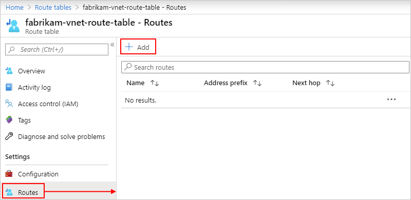
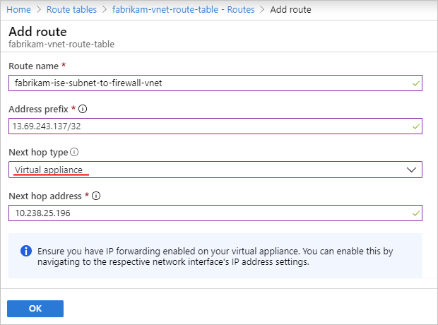
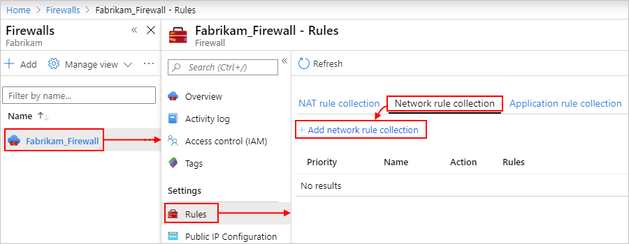
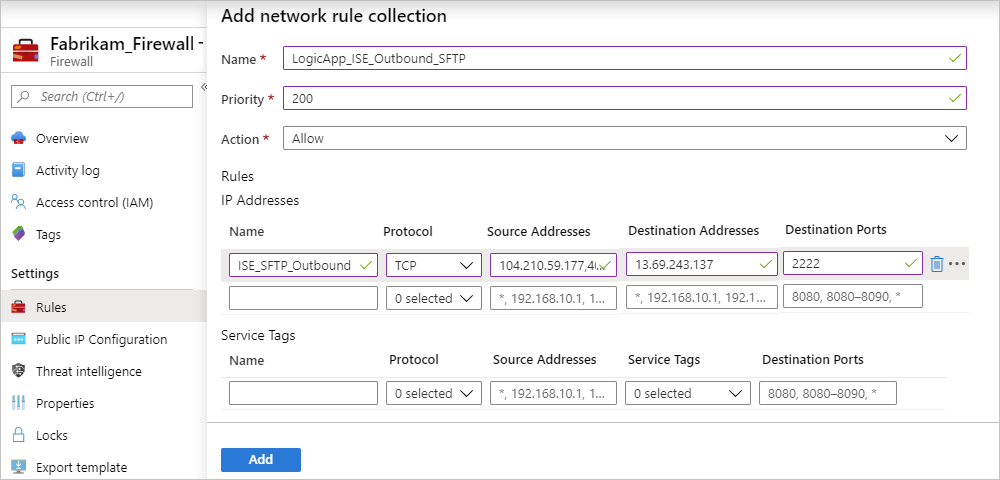

# Set up access for multiple integration service environments in Azure Logic Apps

When you work with Azure Logic Apps, you can set up an [*integration service environment* (ISE)](../logic-apps/connect-virtual-network-vnet-isolated-environment-overview.md) for hosting logic apps that need access to resources in an [Azure virtual network](../virtual-network/virtual-networks-overview.md). If you have multiple ISEs and your virtual network uses [Azure Firewall](../firewall/overview.md) or a [network virtual appliance](../virtual-network/virtual-networks-overview.md#filter-network-traffic), you can route outbound access through that firewall by using a single, predictable, and public IP address to communicate with destination systems. That way, all the ISEs in your virtual network can use this IP address, and you don't have to set up additional firewall openings at the destination for each ISE.

## Prerequisites

* An Azure firewall that runs in the same virtual network as your ISE. If you don't have a firewall, first [add a subnet](../virtual-network/virtual-network-manage-subnet.md#add-a-subnet) that's named `AzureFirewallSubnet` to your virtual network. You can then [create and deploy a firewall](../firewall/tutorial-firewall-deploy-portal.md#deploy-the-firewall) in your virtual network.

* An Azure [route table](../virtual-network/manage-route-table.md). If you don't have one, first [create a route table](../virtual-network/manage-route-table.md#create-a-route-table). For more information about routing, see [Virtual network traffic routing](../virtual-network/virtual-networks-udr-overview.md).

## Set up route table

1. In the [Azure portal](https://portal.azure.com), select the route table, for example:

   

1. To [add a new route](../virtual-network/manage-route-table.md#create-a-route), on the route table menu, select **Routes** > **Add**.

   

1. On the **Add route** pane, [set up the new route](../virtual-network/manage-route-table.md#create-a-route) with a rule that specifies that all the outgoing traffic to the destination system follows this behavior:

   * Uses the [**Virtual appliance**](../virtual-network/virtual-networks-udr-overview.md#user-defined) as the next hop type.

   * Goes to the private IP address for the firewall instance as the next hop address.

     To find this IP address, on your firewall menu, select **Overview**, find the address under **Private IP address**, for example:

     

   Here's an example that shows how such a rule might look:

   

   | Property | Value | Description |
   |----------|-------|-------------|
   | **Route name** | <*unique-route-name*> | A unique name for the route in the route table |
   | **Address prefix** | <*destination-address*> | The destination system's address where you want the traffic to go. Make sure that you use [Classless Inter-Domain Routing (CIDR) notation](https://en.wikipedia.org/wiki/Classless_Inter-Domain_Routing) for this address. |
   | **Next hop type** | **Virtual appliance** | The [hop type](../virtual-network/virtual-networks-udr-overview.md#next-hop-types-across-azure-tools) that's used by outbound traffic |
   | **Next hop address** | <*firewall-private-IP-address*> | The private IP address for your firewall |
   |||

## Set up network rule

1. In the Azure portal, find and select your firewall. On the firewall menu, under **Settings**, select **Rules**. On the rules pane, select **Network rule collection** > **Add network rule collection**.

   

1. In the collection, add a rule that permits traffic to the destination system.

   For example, suppose that you have a logic app that runs in an ISE and needs to communicate with an SFTP system. You create a network rule collection that's named `LogicApp_ISE_SFTP_Outbound`, which contains a network rule named `ISE_SFTP_Outbound`. This rule permits traffic from the IP address of any subnet where your ISE runs in your virtual network to the destination SFTP system by using your firewall's private IP address.

   

   **Network rule collection properties**

   | Property | Value | Description |
   |----------|-------|-------------|
   | **Name** | <*network-rule-collection-name*> | The name for your network rule collection |
   | **Priority** | <*priority-level*> | The order of priority to use for running the rule collection. For more information, see [What are some Azure Firewall concepts](../firewall/firewall-faq.md#what-are-some-azure-firewall-concepts)? |
   | **Action** | **Allow** | The action type to perform for this rule |
   |||

   **Network rule properties**

   | Property | Value | Description |
   |----------|-------|-------------|
   | **Name** | <*network-rule-name*> | The name for your network rule |
   | **Protocol** | <*connection-protocols*> | The connection protocols to use. For example, if you're using NSG rules, select both **TCP** and **UDP**, not only **TCP**. |
   | **Source addresses** | <*ISE-subnet-addresses*> | The subnet IP addresses where your ISE runs and where traffic from your logic app originates |
   | **Destination addresses** | <*destination-IP-address*> | The IP address for your destination system where you want the traffic to go |
   | **Destination ports** | <*destination-ports*> | Any ports that your destination system uses for inbound communication |
   |||

   For more information about network rules, see these articles:

   * [Configure a network rule](../firewall/tutorial-firewall-deploy-portal.md#configure-a-network-rule)
   * [Azure Firewall rule processing logic](../firewall/rule-processing.md#network-rules-and-applications-rules)
   * [Azure Firewall FAQ](../firewall/firewall-faq.md)
   * [Azure PowerShell: New-AzFirewallNetworkRule](https://docs.microsoft.com/powershell/module/az.network/new-azfirewallnetworkrule)
   * [Azure CLI: az network firewall network-rule](https://docs.microsoft.com/cli/azure/ext/azure-firewall/network/firewall/network-rule?view=azure-cli-latest#ext-azure-firewall-az-network-firewall-network-rule-create)

## Next steps

* [Connect to Azure virtual networks from Azure Logic Apps](../logic-apps/connect-virtual-network-vnet-isolated-environment.md)