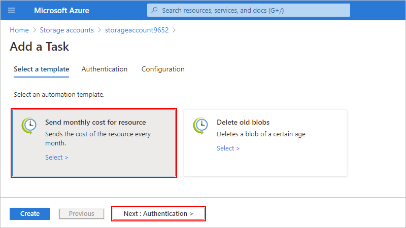
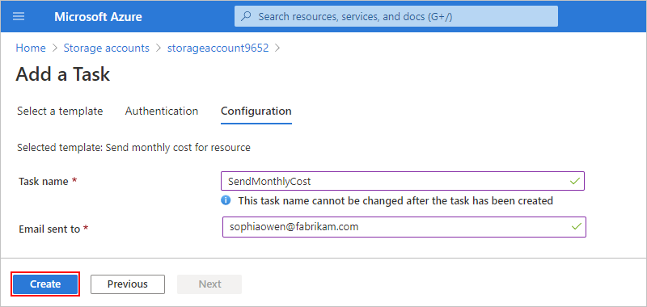

# Manage Azure resources by creating automation tasks (preview)

To help you manage Azure resources more easily, you can create and automate management tasks for a specific resource or resource group by using automation task templates, which vary based on the resource type. For example, for an Azure storage account, you can set up an automation task that sends you the monthly cost for that storage account. For an Azure virtual machine, you can turn on and turn off that virtual machine. Currently, here are the task templates available in this preview:

* All Azure resources and resource groups: **Send monthly cost for resource**

* Azure virtual machines:

  * **Send monthly cost for resource**
  * **Delete old blobs**

* Azure Storage accounts:

  * **Send monthly cost for resource**
  * **Delete old blobs**

When you create an automation task for an Azure resource in the Azure portal, you do so from that specific resource, for example, the actual storage account or virtual machine resource. However, behind the scenes, an automation task is actually run as a workflow by the [Azure Logic Apps](../logic-apps/logic-apps-overview.md) service. After an automation task runs, you can review the status, history, inputs, and outputs for that specific workflow run instance. You can also open and edit the task template in the Logic App Designer so that you can customize the template.

This article shows how to complete the following tasks:

* Create an automation task for a specific Azure resource.

* Review the status, history, inputs, and outputs for a specific run instance.

* Open and edit the task template in the Logic App Designer.

## How do automation tasks differ from Azure Automation?

Currently, you can create automation tasks only at the resource level, view their run history, and edit the task templates.

while [Azure Automation](../automation/automation-intro.md) is a cloud-based automation and configuration service that supports consistent management across your Azure and non-Azure environments. The service comprises [process automation for orchestrating processes](../automation/automation-intro.md#process-automation) by using [runbooks](../automation/automation-runbook-execution.md), configuration management with [change tracking and inventory](../automation/change-tracking.md), update management, shared capabilities, and heterogeneous features. Automation gives you complete control during deployment, operations, and decommissioning of workloads and resources.

## Prerequisites

* An Azure account and subscription. If you don't have a subscription, [sign up for a free Azure account](https://azure.microsoft.com/free/?WT.mc_id=A261C142F).

* The Azure resource that you want to manage. This article uses an Azure storage account as the example.

## Create an automation task

1. In the [Azure portal](https://portal.azure.com), find the resource that you want to manage.

1. On the resource's menu, under **Settings**, select **Automation tasks** > **Add** so that you can select a task template.

   

1. On the **Add a Task** pane, under **Select a template**, select the template for the task that you want to create, and then select **Next: Authentication**.

   This example continues by selecting the **Send monthly cost for resource** task template.

   

1. Under **Authentication**, in the **Connections** section, select **Create** for each connection to the resource required for this task. The types of connections required for each task vary based on the selected task.

   

1. When you're prompted, sign in with your Azure account credentials.

   

   Each successfully created connection looks similar to this example:

   

1. After you create all the necessary connections, select **Next: Configuration**.

1. Under **Configuration**, provide a name for the task and any other information required for the task. When you're done, select **Create**.

   > [!NOTE]
   > You can't change the task name after creation.

   For example, tasks that send you email notifications require you to provide an email address. 

   

   After creation, the task is automatically live and starts running immediately.

## Review the task status and history

## Customize the task

## Next steps