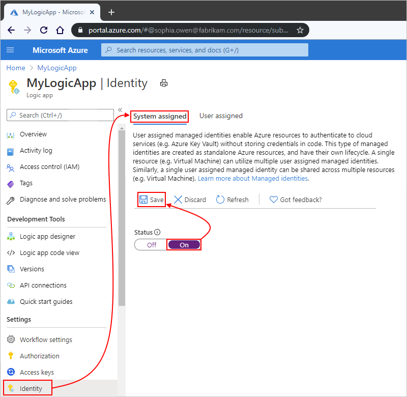
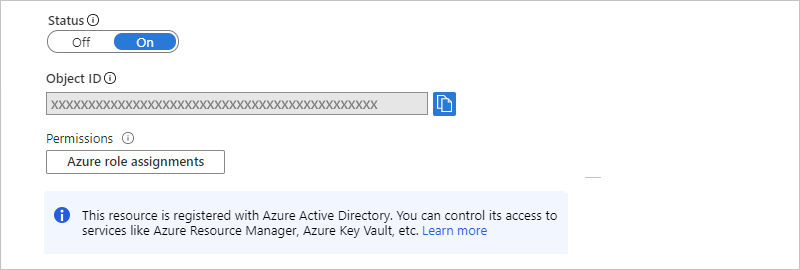
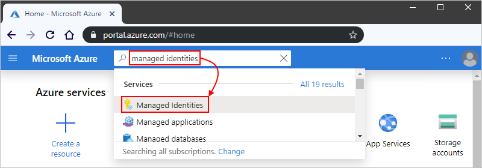
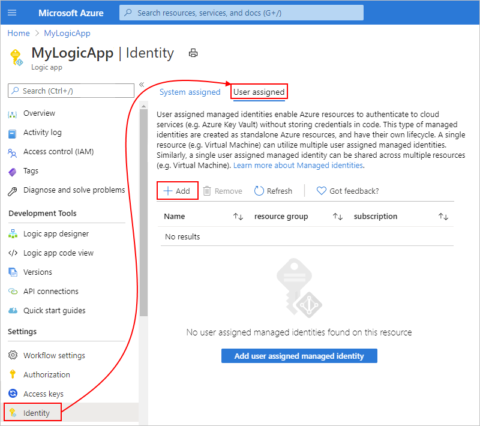
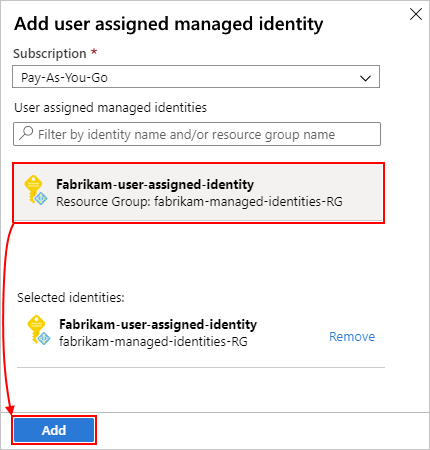

# Authenticate access to Azure resources by using managed identities in Azure Logic Apps

To easily access other resources that are protected by Azure Active Directory (Azure AD) and authenticate your identity without signing in, your logic app can use a [managed identity](../active-directory/managed-identities-azure-resources/overview.md) (formerly Managed Service Identity or MSI), rather than credentials or secrets. Azure manages this identity for you and helps secure your credentials because you don't have to provide or rotate secrets.

Azure Logic Apps supports both [*system-assigned*](../active-directory/managed-identities-azure-resources/overview.md) and [*user-assigned*](../active-directory/managed-identities-azure-resources/overview.md) managed identities. Your logic app can use either the system-assigned identity or a *single* user-assigned identity, which you can share across a group of logic apps, but not both. Currently, only [specific built-in triggers and actions](../logic-apps/logic-apps-securing-a-logic-app.md#add-authentication-outbound) support managed identities, not managed connectors or connections, for example:

* HTTP
* Azure Functions
* Azure API Management
* Azure App Services

This article shows how to set up both kinds of managed identities for your logic app. For more information, see these topics:

* [Triggers and actions that support managed identities](../logic-apps/logic-apps-securing-a-logic-app.md#add-authentication-outbound)
* [Supported authentication types on outbound calls](../logic-apps/logic-apps-securing-a-logic-app.md#add-authentication-outbound)
* [Limits on managed identities for logic apps](../logic-apps/logic-apps-limits-and-config.md#managed-identity)
* [Azure services that support Azure AD authentication with managed identities](../active-directory/managed-identities-azure-resources/services-support-managed-identities.md#azure-services-that-support-azure-ad-authentication)

## Prerequisites

* An Azure account and subscription. If you don't have a subscription, [sign up for a free Azure account](https://azure.microsoft.com/free/). Both the managed identity and the target Azure resource where you need access must use the same Azure subscription.

* To give a managed identity access to an Azure resource, you need to add a role to the target resource for that identity. To add roles, you need [Azure AD administrator permissions](../active-directory/roles/permissions-reference.md) that can assign roles to identities in the corresponding Azure AD tenant.

* The target Azure resource that you want to access. On this resource, you'll add a role for the managed identity, which helps the logic app authenticate access to the target resource.

* The logic app where you want to use the [trigger or actions that support managed identities](../logic-apps/logic-apps-securing-a-logic-app.md#add-authentication-outbound)

## Enable managed identity

To set up the managed identity that you want to use, follow the link for that identity:

* [System-assigned identity](#system-assigned)
* [User-assigned identity](#user-assigned)

<a name="system-assigned"></a>

### Enable system-assigned identity

Unlike user-assigned identities, you don't have to manually create the system-assigned identity. To set up the system-assigned identity for your logic app, here are the options that you can use:

* [Azure portal](#azure-portal-system-logic-app)
* [Azure Resource Manager templates](#template-system-logic-app)

<a name="azure-portal-system-logic-app"></a>

#### Enable system-assigned identity in Azure portal

1. In the [Azure portal](https://portal.azure.com), open your logic app in Logic App Designer.

1. On the logic app menu, under **Settings**, select **Identity**. Select **System assigned** > **On** > **Save**. When Azure prompts you to confirm, select **Yes**.

   

   > [!NOTE]
   > If you get an error that you can have only a single managed identity, your logic app is already 
   > associated with the user-assigned identity. Before you can add the system-assigned identity, 
   > you must first *remove* the user-assigned identity from your logic app.

   Your logic app can now use the system-assigned identity, which is registered with Azure Active Directory and is represented by an object ID.

   

   | Property | Value | Description |
   |----------|-------|-------------|
   | **Object ID** | <*identity-resource-ID*> | A Globally Unique Identifier (GUID) that represents the system-assigned identity for your logic app in an Azure AD tenant |
   ||||

1. Now follow the [steps that give that identity access to the resource](#access-other-resources) later in this topic.

<a name="template-system-logic-app"></a>

#### Enable system-assigned identity in Azure Resource Manager template

To automate creating and deploying Azure resources such as logic apps, you can use [Azure Resource Manager templates](../logic-apps/logic-apps-azure-resource-manager-templates-overview.md). To enable the system-assigned managed identity for your logic app in the template, add the `identity` object and the `type` child property to the logic app's resource definition in the template, for example:

```json
{
   "apiVersion": "2016-06-01",
   "type": "Microsoft.logic/workflows",
   "name": "[variables('logicappName')]",
   "location": "[resourceGroup().location]",
   "identity": {
      "type": "SystemAssigned"
   },
   "properties": {
      "definition": {
         "$schema": "https://schema.management.azure.com/providers/Microsoft.Logic/schemas/2016-06-01/workflowdefinition.json#",
         "actions": {},
         "parameters": {},
         "triggers": {},
         "contentVersion": "1.0.0.0",
         "outputs": {}
   },
   "parameters": {},
   "dependsOn": []
}
```

When Azure creates your logic app resource definition, the `identity` object gets these additional properties:

```json
"identity": {
   "type": "SystemAssigned",
   "principalId": "<principal-ID>",
   "tenantId": "<Azure-AD-tenant-ID>"
}
```

| Property (JSON) | Value | Description |
|-----------------|-------|-------------|
| `principalId` | <*principal-ID*> | The Globally Unique Identifier (GUID) of the service principal object for the managed identity that represents your logic app in the Azure AD tenant. This GUID sometimes appears as an "object ID" or `objectID`. |
| `tenantId` | <*Azure-AD-tenant-ID*> | The Globally Unique Identifier (GUID) that represents the Azure AD tenant where the logic app is now a member. Inside the Azure AD tenant, the service principal has the same name as the logic app instance. |
||||

<a name="user-assigned"></a>

### Enable user-assigned identity

To set up a user-assigned managed identity for your logic app, you must first create that identity as a separate standalone Azure resource. Here are the options that you can use:

* [Azure portal](#azure-portal-user-identity)
* [Azure Resource Manager templates](#template-user-identity)
* Azure PowerShell
  * [Create user-assigned identity](../active-directory/managed-identities-azure-resources/how-to-manage-ua-identity-powershell.md)
  * [Add role assignment](../active-directory/managed-identities-azure-resources/howto-assign-access-powershell.md)
* Azure CLI
  * [Create user-assigned identity](../active-directory/managed-identities-azure-resources/how-to-manage-ua-identity-cli.md)
  * [Add role assignment](../active-directory/managed-identities-azure-resources/howto-assign-access-cli.md)
* Azure REST API
  * [Create user-assigned identity](../active-directory/managed-identities-azure-resources/how-to-manage-ua-identity-rest.md)
  * [Add role assignment](../role-based-access-control/role-assignments-rest.md)

<a name="azure-portal-user-identity"></a>

#### Create user-assigned identity in the Azure portal

1. In the [Azure portal](https://portal.azure.com), in the search box on any page, enter `managed identities`, and select **Managed Identities**.

   

1. Under **Managed Identities**, select **Add**.

   

1. Provide information about your managed identity, and then select **Create**, for example:

   

   | Property | Required | Value | Description |
   |----------|----------|-------|-------------|
   | **Resource Name** | Yes | <*user-assigned-identity-name*> | The name to give your user-assigned identity. This example uses "Fabrikam-user-assigned-identity". |
   | **Subscription** | Yes | <*Azure-subscription-name*> | The name for the Azure subscription to use |
   | **Resource group** | Yes | <*Azure-resource-group-name*> | The name for the resource group to use. Create a new group, or select an existing group. This example creates a new group named "fabrikam-managed-identities-RG". |
   | **Location** | Yes | <*Azure-region*> | The Azure region where to store information about your resource. This example uses "West US". |
   |||||

   Now you can add the user-assigned identity to your logic app. You can't add more than one user-assigned identity to your logic app.

1. In the Azure portal, find and open your logic app in Logic App Designer.

1. On the logic app menu, under **Settings**, select **Identity**, and then select **User assigned** > **Add**.

   

1. On the **Add user assigned managed identity** pane, from the **Subscription** list, select your Azure subscription if not already selected. From the list that shows *all* the managed identities in that subscription, find and select the user-assigned identity that you want. To filter the list, in the **User assigned managed identities** search box, enter the name for the identity or resource group. When you're done, select **Add**.

   

   > [!NOTE]
   > If you get an error that you can have only a single managed identity, your logic app is already 
   > associated with the system-assigned identity. Before you can add the user-assigned identity, 
   > you must first disable the system-assigned identity on your logic app.

   Your logic app is now associated with the user-assigned managed identity.

   

1. Now follow the [steps that give that identity access to the resource](#access-other-resources) later in this topic.

<a name="template-user-identity"></a>

#### Create user-assigned identity in an Azure Resource Manager template

To automate creating and deploying Azure resources such as logic apps, you can use [Azure Resource Manager templates](../logic-apps/logic-apps-azure-resource-manager-templates-overview.md), which support [user-assigned identities for authentication](../active-directory/managed-identities-azure-resources/how-to-manage-ua-identity-arm.md). In your template's `resources` section, your logic app's resource definition requires these items:

* An `identity` object with the `type` property set to `UserAssigned`

* A child `userAssignedIdentities` object that specifies the user-assigned resource and name

This example shows a logic app resource definition for an HTTP PUT request and includes a non-parameterized `identity` object. The response to the PUT request and subsequent GET operation also have this `identity` object:

```json
{
   "$schema": "https://schema.management.azure.com/schemas/2015-01-01/deploymentTemplate.json#",
   "contentVersion": "1.0.0.0",
   "parameters": {<template-parameters>},
   "resources": [
      {
         "apiVersion": "2016-06-01",
         "type": "Microsoft.logic/workflows",
         "name": "[variables('logicappName')]",
         "location": "[resourceGroup().location]",
         "identity": {
            "type": "UserAssigned",
            "userAssignedIdentities": {
               "/subscriptions/<Azure-subscription-ID>/resourceGroups/<Azure-resource-group-name>/providers/Microsoft.ManagedIdentity/userAssignedIdentities/<user-assigned-identity-name>": {}
            }
         },
         "properties": {
            "definition": {<logic-app-workflow-definition>}
         },
         "parameters": {},
         "dependsOn": []
      },
   ],
   "outputs": {}
}
```

If your template also includes the managed identity's resource definition, you can parameterize the `identity` object. This example shows how the child `userAssignedIdentities` object references a `userAssignedIdentity` variable that you define in your template's `variables` section. This variable references the resource ID for your user-assigned identity.

```json
{
   "$schema": "https://schema.management.azure.com/schemas/2015-01-01/deploymentTemplate.json#",
   "contentVersion": "1.0.0.0",
   "parameters": {
      "Template_LogicAppName": {
         "type": "string"
      },
      "Template_UserAssignedIdentityName": {
         "type": "securestring"
      }
   },
   "variables": {
      "logicAppName": "[parameters(`Template_LogicAppName')]",
      "userAssignedIdentityName": "[parameters('Template_UserAssignedIdentityName')]"
   },
   "resources": [
      {
         "apiVersion": "2016-06-01",
         "type": "Microsoft.logic/workflows",
         "name": "[variables('logicAppName')]",
         "location": "[resourceGroup().location]",
         "identity": {
            "type": "UserAssigned",
            "userAssignedIdentities": {
               "[resourceId('Microsoft.ManagedIdentity/userAssignedIdentities/', variables('userAssignedIdentityName'))]": {}
            }
         },
         "properties": {
            "definition": {<logic-app-workflow-definition>}
         },
         "parameters": {},
         "dependsOn": [
            "[resourceId('Microsoft.ManagedIdentity/userAssignedIdentities/', variables('userAssignedIdentityName'))]"
         ]
      },
      {
         "apiVersion": "2018-11-30",
         "type": "Microsoft.ManagedIdentity/userAssignedIdentities",
         "name": "[parameters('Template_UserAssignedIdentityName')]",
         "location": "[resourceGroup().location]",
         "properties": {}
      }
  ]
}
```

<a name="access-other-resources"></a>

## Give identity access to resources

Before you can use your logic app's managed identity for authentication, set up access for that identity on the Azure resource where you plan to use the identity. To complete this task, assign the appropriate role to that identity on the target Azure resource. Here are the options that you can use:

* [Azure portal](#azure-portal-assign-access)
* [Azure Resource Manager template](../role-based-access-control/role-assignments-template.md)
* Azure PowerShell ([New-AzRoleAssignment](/powershell/module/az.resources/new-azroleassignment)) - For more information, see [Add role assignment by using Azure RBAC and Azure PowerShell](../role-based-access-control/role-assignments-powershell.md).
* Azure CLI ([az role assignment create](/cli/azure/role/assignment?view=azure-cli-latest#az-role-assignment-create)) - For more information, see [Add role assignment by using Azure RBAC and Azure CLI](../role-based-access-control/role-assignments-cli.md).
* [Azure REST API](../role-based-access-control/role-assignments-rest.md)

<a name="azure-portal-assign-access"></a>

### Assign access in the Azure portal

1. In the [Azure portal](https://portal.azure.com), go to the Azure resource where you want your managed identity to have access.

1. From the resource's menu, select **Access control (IAM)** > **Role assignments** where you can review the current role assignments for that resource. On the toolbar, select **Add** > **Add role assignment**.

   

   > [!TIP]
   > If the **Add role assignment** option is disabled, you most likely don't have permissions. 
   > For more information about the permissions that let you manage roles for resources, see 
   > [Administrator role permissions in Azure Active Directory](../active-directory/roles/permissions-reference.md).

1. Under **Add role assignment**, select a **Role** that gives your identity the necessary access to the target resource.

   For this topic's example, your identity needs a [role that can access the blob in an Azure Storage container](../storage/common/storage-auth-aad.md#assign-azure-roles-for-access-rights), so select the **Storage Blob Data Contributor** role for the managed identity.

   

1. Follow these steps for your managed identity:

   * **System-assigned identity**

     1. In the **Assign access to** box, select **Logic App**. When the **Subscription** property appears, select the Azure subscription that's associated with your identity.

        

     1. Under the **Select** box, select your logic app from the list. If the list is too long, use the **Select** box to filter the list.

        

   * **User-assigned identity**

     1. In the **Assign access to** box, select **User assigned managed identity**. When the **Subscription** property appears, select the Azure subscription that's associated with your identity.

        For example, to access Azure Blob Storage, you need to assign the **Storage Blob Data Contributor** role to the managed identity.

        

     1. Under the **Select** box, select your identity from the list. If the list is too long, use the **Select** box to filter the list.

        

1. When you're done, select **Save**.

   The target resource's role assignments list now shows the selected managed identity and role. This example shows how you can use the system-assigned identity for one logic app and a user-assigned identity for a group of other logic apps.

   

   For more information, [Assign a managed identity access to a resource by using the Azure portal](../active-directory/managed-identities-azure-resources/howto-assign-access-portal.md).

1. Now follow the [steps to authenticate access with the identity](#authenticate-access-with-identity) in a trigger or action that supports managed identities.

<a name="authenticate-access-with-identity"></a>

## Authenticate access with managed identity

After you [enable the managed identity for your logic app](#azure-portal-system-logic-app) and [give that identity access to the target resource or entity](#access-other-resources), you can use that identity in [triggers and actions that support managed identities](logic-apps-securing-a-logic-app.md#managed-identity-authentication).

> [!IMPORTANT]
> If you have an Azure function where you want to use the system-assigned identity, 
> first [enable authentication for Azure functions](../logic-apps/logic-apps-azure-functions.md#enable-authentication-for-azure-functions).

These steps show how to use the managed identity with a trigger or action through the Azure portal. To specify the managed identity in a trigger or action's underlying JSON definition, see [Managed identity authentication](../logic-apps/logic-apps-securing-a-logic-app.md#managed-identity-authentication).

1. In the [Azure portal](https://portal.azure.com), open your logic app in the Logic App Designer.

1. If you haven't done so yet, add the [trigger or action that supports managed identities](logic-apps-securing-a-logic-app.md#managed-identity-authentication).

   For example, the HTTP trigger or action can use the system-assigned identity that you enabled for your logic app. In general, the HTTP trigger or action uses these properties to specify the resource or entity that you want to access:

   | Property | Required | Description |
   |----------|----------|-------------|
   | **Method** | Yes | The HTTP method that's used by the operation that you want to run |
   | **URI** | Yes | The endpoint URL for accessing the target Azure resource or entity. The URI syntax usually includes the [resource ID](../active-directory/managed-identities-azure-resources/services-support-managed-identities.md#azure-services-that-support-azure-ad-authentication) for the Azure resource or service. |
   | **Headers** | No | Any header values that you need or want to include in the outgoing request, such as the content type |
   | **Queries** | No | Any query parameters that you need or want to include in the request, such as the parameter for a specific operation or the API version for the operation that you want to run |
   | **Authentication** | Yes | The authentication type to use for authenticating access to the target resource or entity |
   ||||

   As a specific example, suppose that you want to run the [Snapshot Blob operation](/rest/api/storageservices/snapshot-blob) on a blob in the Azure Storage account where you previously set up access for your identity. However, the [Azure Blob Storage connector](/connectors/azureblob/) doesn't currently offer this operation. Instead, you can run this operation by using the [HTTP action](../logic-apps/logic-apps-workflow-actions-triggers.md#http-action) or another [Blob Service REST API operation](/rest/api/storageservices/operations-on-blobs).

   > [!IMPORTANT]
   > To access Azure storage accounts behind firewalls by using HTTP requests and managed identities, 
   > make sure that you also set up your storage account with the [exception that allows access by trusted Microsoft services](../connectors/connectors-create-api-azureblobstorage.md#access-trusted-service).

   To run the [Snapshot Blob operation](/rest/api/storageservices/snapshot-blob), the HTTP action specifies these properties:

   | Property | Required | Example value | Description |
   |----------|----------|---------------|-------------|
   | **Method** | Yes | `PUT`| The HTTP method that the Snapshot Blob operation uses |
   | **URI** | Yes | `https://{storage-account-name}.blob.core.windows.net/{blob-container-name}/{folder-name-if-any}/{blob-file-name-with-extension}` | The resource ID for an Azure Blob Storage file in the Azure Global (public) environment, which uses this syntax |
   | **Headers** | For Azure Storage only | `x-ms-blob-type` = `BlockBlob` <p>`x-ms-version` = `2019-02-02` <p>`x-ms-date` = `@{formatDateTime(utcNow(),'r'}` | The `x-ms-blob-type`, `x-ms-version`, and `x-ms-date` header values are required for Azure Storage operations. <p><p>**Important**: In outgoing HTTP trigger and action requests for Azure Storage, the header requires the `x-ms-version` property and the API version for the operation that you want to run. The `x-ms-date` must be the current date. Otherwise, your logic app fails with a `403 FORBIDDEN` error. To get the current date in the required format, you can use the expression in the example value. <p>For more information, see these topics: <p><p>- [Request headers - Snapshot Blob](/rest/api/storageservices/snapshot-blob#request) <br>- [Versioning for Azure Storage services](/rest/api/storageservices/versioning-for-the-azure-storage-services#specifying-service-versions-in-requests) |
   | **Queries** | For the Snapshot Blob operation only | `comp` = `snapshot` | The query parameter name and value for the operation. |
   |||||

   Here is the example HTTP action that shows all these property values:

   

1. Now add the **Authentication** property to the HTTP action. From the **Add new parameter** list, select **Authentication**.

   

   > [!NOTE]
   > Not all triggers and actions support letting you add an authentication type. For more information, see [Add authentication to outbound calls](../logic-apps/logic-apps-securing-a-logic-app.md#add-authentication-outbound).

1. From the **Authentication type** list, select **Managed Identity**.

   

1. From the managed identity list, select from the available options based on your scenario.

   * If you set up the system-assigned identity, select **System Assigned Managed Identity** if not already selected.

     

   * If you set up a user-assigned identity, select that identity if not already selected.

     

   This example continues with the **System Assigned Managed Identity**.

1. On some triggers and actions, the **Audience** property also appears for you to set the target resource ID. Set the **Audience** property to the [resource ID for the target resource or service](../active-directory/managed-identities-azure-resources/services-support-managed-identities.md#azure-services-that-support-azure-ad-authentication). Otherwise, by default, the **Audience** property uses the `https://management.azure.com/` resource ID, which is the resource ID for Azure Resource Manager.

   > [!IMPORTANT]
   > Make sure that the target resource ID *exactly matches* the value that Azure Active Directory (AD) expects, 
   > including any required trailing slashes. For example, the resource ID for all Azure Blob Storage accounts requires 
   > a trailing slash. However, the resource ID for a specific storage account doesn't require a trailing slash. Check the 
   > [resource IDs for the Azure services that support Azure AD](../active-directory/managed-identities-azure-resources/services-support-managed-identities.md#azure-services-that-support-azure-ad-authentication).

   This example sets the **Audience** property to `https://storage.azure.com/` so that the access tokens used for authentication are valid for all storage accounts. However, you can also specify the root service URL, `https://fabrikamstorageaccount.blob.core.windows.net`, for a specific storage account.

   

   For more information about authorizing access with Azure AD for Azure Storage, see these topics:

   * [Authorize access to Azure blobs and queues by using Azure Active Directory](../storage/common/storage-auth-aad.md)
   * [Authorize access to Azure Storage with Azure Active Directory](/rest/api/storageservices/authorize-with-azure-active-directory#use-oauth-access-tokens-for-authentication)

1. Continue building the logic app the way that you want.

<a name="remove-identity"></a>

## Disable managed identity

To stop using a managed identity for your logic app, you have these options:

* [Azure portal](#azure-portal-disable)
* [Azure Resource Manager templates](#template-disable)
* Azure PowerShell
  * [Remove role assignment](../role-based-access-control/role-assignments-powershell.md)
  * [Delete user-assigned identity](../active-directory/managed-identities-azure-resources/how-to-manage-ua-identity-powershell.md)
* Azure CLI
  * [Remove role assignment](../role-based-access-control/role-assignments-cli.md)
  * [Delete user-assigned identity](../active-directory/managed-identities-azure-resources/how-to-manage-ua-identity-cli.md)
* Azure REST API
  * [Remove role assignment](../role-based-access-control/role-assignments-rest.md)
  * [Delete user-assigned identity](../active-directory/managed-identities-azure-resources/how-to-manage-ua-identity-rest.md)

If you delete your logic app, Azure automatically removes the managed identity from Azure AD.

<a name="azure-portal-disable"></a>

### Disable managed identity in the Azure portal

In the Azure portal, first remove the identity's access to [your target resource](#disable-identity-target-resource). Next, turn off the system-assigned identity or remove the user-assigned identity from [your logic app](#disable-identity-logic-app).

<a name="disable-identity-target-resource"></a>

#### Remove identity access from resources

1. In the [Azure portal](https://portal.azure.com), go to the target Azure resource where you want to remove access for the managed identity.

1. From the target resource's menu, select **Access control (IAM)**. Under the toolbar, select **Role assignments**.

1. In the roles list, select the managed identities that you want to remove. On the toolbar, select **Remove**.

   > [!TIP]
   > If the **Remove** option is disabled, you most likely don't have permissions. 
   > For more information about the permissions that let you manage roles for resources, see 
   > [Administrator role permissions in Azure Active Directory](../active-directory/roles/permissions-reference.md).

The managed identity is now removed and no longer has access to the target resource.

<a name="disable-identity-logic-app"></a>

#### Disable managed identity on logic app

1. In the [Azure portal](https://portal.azure.com), open your logic app in Logic App Designer.

1. On the logic app menu, under **Settings**, select **Identity**, and then follow the steps for your identity:

   * Select **System assigned** > **On** > **Save**. When Azure prompts you to confirm, select **Yes**.

     

   * Select **User assigned** and the managed identity, and then select **Remove**. When Azure prompts you to confirm, select **Yes**.

     

The managed identity is now disabled on your logic app.

<a name="template-disable"></a>

### Disable managed identity in Azure Resource Manager template

If you created the logic app's managed identity by using an Azure Resource Manager template, set the `identity` object's `type` child property to `None`.

```json
"identity": {
   "type": "None"
}
```

## Next steps

* [Secure access and data in Azure Logic Apps](../logic-apps/logic-apps-securing-a-logic-app.md)
