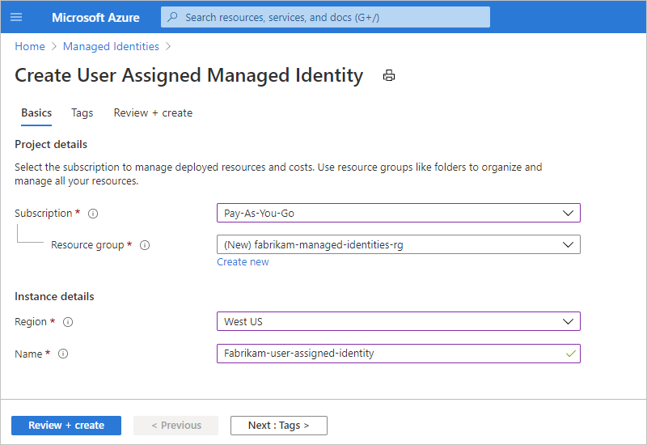
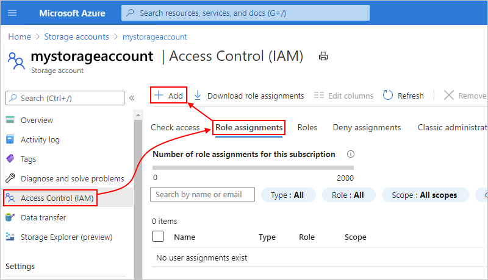
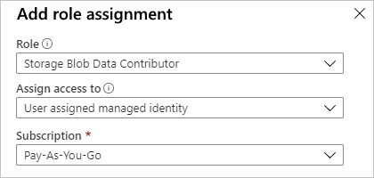
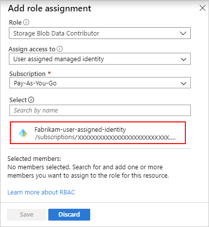

# Authenticate access to resources with managed identities in Azure Logic Apps

To access resources in other Azure Active Directory (Azure AD) tenants and authenticate your identity without signing in, your logic app can use a [managed identity](../active-directory/managed-identities-azure-resources/overview.md) (formerly known as Managed Service Identity or MSI), rather than credentials or secrets. Azure manages this identity for you and helps secure your credentials because you don't have to provide or rotate secrets. Azure Logic Apps currently supports both [*system-assigned*](../active-directory/managed-identities-azure-resources/overview.md#how-does-it-work) and [*user-assigned*](../active-directory/managed-identities-azure-resources/overview.md#how-does-it-work) managed identities but only when using these built-in triggers and actions:

* HTTP
* Azure Functions
* Azure API Management

This article shows how to set up and use both kinds of managed identities for authenticating your logic app. For limits on the managed identities that you can have per logic app, region, and Azure subscription, see [Managed identity limits](../logic-apps/logic-apps-limits-and-config.md#managed-identity).

## Prerequisites

* An Azure subscription, or if you don't have a subscription, [sign up for a free Azure account](https://azure.microsoft.com/free/). The managed identity and the target Azure resource must use the same Azure subscription.

* To give a managed identity access to an Azure resource, you need to add a role to the target resource for that identity. To add roles, you need [Azure AD administrator permissions](../active-directory/users-groups-roles/directory-assign-admin-roles.md) that can assign roles to identities in the corresponding Azure AD tenant.

* The logic app where you want to enable the managed identity, either system-assigned or user-assigned. If you don't have a logic app, see [Create your first logic app workflow](../logic-apps/quickstart-create-first-logic-app-workflow.md).

* The target resource where you want to add a role for the managed identity, which helps the logic app authenticate access to the target resource

<a name="enable-identity"></a>

## Enable a managed identity

Choose the following steps for enabling either the [system-assigned identity](#system-assigned) or [user-assigned identity](#user-assigned).

<a name="system-assigned"></a>

### Enable a system-assigned identity

You don't have to manually create a system-assigned managed identity. To set up a system-assigned managed identity for your logic app, you have these options:

* [Azure portal](#azure-portal-system)
* [Azure Resource Manager templates](#template-system)
* [Azure PowerShell](../active-directory/managed-identities-azure-resources/howto-assign-access-powershell.md)

<a name="azure-portal-system"></a>

#### Enable system-assigned identity in the Azure portal

1. In the [Azure portal](https://portal.azure.com), open your logic app in Logic App Designer.

1. On the logic app menu, under **Settings**, select **Identity**. Under **System assigned** > **Status**, select **On** > **Save** > **Yes**.

   

   Your logic app now has a system-assigned managed identity registered in Azure Active Directory:

   

   | Property | Value | Description |
   |----------|-------|-------------|
   | **Object ID** | <*identity-resource-ID*> | A Globally Unique Identifier (GUID) that represents the system-assigned managed identity for your logic app in an Azure AD tenant |
   ||||

1. To set up this managed identity with access to other resources, see [Set up access to other resources](#access-other-resources) later in this topic.

<a name="template-system"></a>

#### Enable system-assigned identity in an Azure Resource Manager template

To automate creating and deploying Azure resources such as logic apps, you can use [Azure Resource Manager templates](../logic-apps/logic-apps-azure-resource-manager-templates-overview.md). To create a system-assigned managed identity for your logic app by using a template, add the `"identity"` element and `"type"` property to your logic app's resource definition in your deployment template, for example:

```json
{
   "apiVersion": "2016-06-01", 
   "type": "Microsoft.logic/workflows", 
   "name": "[variables('logicappName')]", 
   "location": "[resourceGroup().location]", 
   "identity": { 
      "type": "SystemAssigned" 
   }, 
   "properties": { 
      "definition": { 
         "$schema": "https://schema.management.azure.com/providers/Microsoft.Logic/schemas/2016-06-01/workflowdefinition.json#", 
         "actions": {}, 
         "parameters": {}, 
         "triggers": {}, 
         "contentVersion": "1.0.0.0", 
         "outputs": {} 
   }, 
   "parameters": {}, 
   "dependsOn": [] 
}
```

When Azure creates your logic app, the `"identity"` object includes these additional properties:

```json
"identity": {
   "type": "SystemAssigned",
   "principalId": "<principal-ID>",
   "tenantId": "<Azure-AD-tenant-ID>"
}
```

| Property | Value | Description |
|----------|-------|-------------|
| **principalId** | <*principal-ID*> | A Globally Unique Identifier (GUID) that represents the logic app in the Azure AD tenant and sometimes appears as an "object ID" or `objectID` |
| **tenantId** | <*Azure-AD-tenant-ID*> | A Globally Unique Identifier (GUID) that represents the Azure AD tenant where the logic app is now a member. Inside the Azure AD tenant, the service principal has the same name as the logic app instance. |
||||

<a name="user-assigned"></a>

### Enable a user-assigned identity

To set up a user-assigned managed identity for your logic app, you must first create a user-assigned managed identity resource in Azure. You have these options:

* [Azure portal](#azure-portal-user)
* [Azure Resource Manager templates](#template-user)
* [Azure PowerShell](../active-directory/managed-identities-azure-resources/howto-assign-access-powershell.md)

<a name="azure-portal-user"></a>

#### Enable user-assigned identity in the Azure portal

1. In the [Azure portal](https://portal.azure.com), on the main Azure menu, select **Create a resource**. In the search box, enter "user assigned managed identity", and select **User Assigned Managed Identity**. On the next page, select **Create**.

   

1. Provide information about your user-assigned managed identity, and then select **Create**, for example:

   

   | Property | Required | Value | Description |
   |----------|----------|-------|-------------|
   | **Resource Name** | Yes | <*user-assigned-identity-name*> | The name to give the user-assigned identity. This example uses "Fabrikam-user-assigned-identity". |
   | **Subscription** | Yes | <*Azure-subscription-name*> | The name for the Azure subscription to use |
   | **Resource group** | Yes | <*Azure-resource-group-name*> | The name for the resource group to use. Create a new group, or select an existing group. This example creates a new group named "fabrikam-managed-identities-RG". |
   | **Location** | Yes | <*Azure-region*> | The Azure region where to store information about your resource. This example uses "West US". |
   |||||

1. In the Azure portal, find and open your logic app in Logic App Designer.

1. On the logic app menu, under **Settings**, select **Identity**. Select **User assigned** > **Add**.

   

1. Under **Add user assigned managed identity**, in the **Subscription** list, if the Azure subscription that you want isn't selected, select that subscription. From the list that shows *all* the managed identities in that subscription, select the user-assigned identity that you want, and then select **Add**.

   > [!TIP]
   > In the **User assigned managed identities** search box, you can filter 
   > by the name for the identity or the resource group.

   

   Your logic app is now associated with a user-assigned managed identity:

   

1. To set up this managed identity with access to other resources, see [Set up access to other resources](#access-other-resources) later in this topic.

<a name="template-user"></a>

#### Enable user-assigned identity in an Azure Resource Manager template

To automate creating and deploying Azure resources such as logic apps, you can use [Azure Resource Manager templates](../logic-apps/logic-apps-azure-resource-manager-templates-overview.md). To create a user-assigned managed identity for your logic app in your template, add the `"identity"` element and `"type"` child property to your logic app's resource definition in your template. Set the `"type"` property to `"UserAssigned"`, for example:

```json
{
   "apiVersion": "2016-06-01", 
   "type": "Microsoft.logic/workflows", 
   "name": "[variables('logicappName')]", 
   "location": "[resourceGroup().location]", 
   "identity": { 
      "type": "UserAssigned" 
   }, 
   "properties": { 
      "definition": { 
         "$schema": "https://schema.management.azure.com/providers/Microsoft.Logic/schemas/2016-06-01/workflowdefinition.json#", 
         "actions": {}, 
         "parameters": {}, 
         "triggers": {}, 
         "contentVersion": "1.0.0.0", 
         "outputs": {} 
   }, 
   "parameters": {}, 
   "dependsOn": [] 
}
```

When Azure creates your logic app, the `"identity"` object includes a child `"userAssignedIdentities"` object, which includes a child object with information about the user-assigned identity:

```json
"identity": {
   "type": "UserAssigned",
   "userAssignedIdentities": {
      "/subscriptions/<Azure-subscription-ID>/resourcegroups/<user-assigned-managed-identity-resource-group>/providers/Microsoft.ManagedIdentity/userAssignedIdentities/<user-assigned-managed-identity-resource-name>": {
         "principalId": "<principal-ID>",
         "clientId": "<client-ID>"
      }
   }
}
```

<!--- Double-check these property descriptions ---->
| Property | Value | Description |
|----------|-------|-------------|
| **principalId** | <*principal-ID*> | A Globally Unique Identifier (GUID) that represents the logic app in the Azure AD tenant |
| **clientId** | <*cilent-ID*> | A Globally Unique Identifier (GUID) that represents the Azure resource in the Azure AD tenant |
||||

<a name="access-other-resources"></a>

## Set up access to other resources

After you create either a system-assigned or user-assigned managed identity for your logic app, you can [give that identity access to other Azure resources](../active-directory/managed-identities-azure-resources/howto-assign-access-portal.md). You can then use that identity for authentication, just like any other [service principal](../active-directory/develop/app-objects-and-service-principals.md).

### Assign access to managed identity

To give a managed identity (system-assigned or user-assigned) access to another Azure resource, follow these steps:

1. In the Azure portal, go to the Azure resource where you want your managed identity to have access.

1. From the resource's menu, select **Access control (IAM)** > **Role assignments** where you can view the current role assignments for that resource. On the toolbar, select **Add** > **Add role assignment**.

   

   > [!TIP]
   > If the **Add role assignment** option is disabled, you most likely don't have permissions. 
   > For more information about the permissions that let you manage roles for resources, see [Administrator role permissions in Azure Active Directory](../active-directory/users-groups-roles/directory-assign-admin-roles.md).

1. Under **Add role assignment**, select the **Role** for the identity. Learn more about [role-based access control (RBAC) roles](../role-based-access-control/rbac-and-directory-admin-roles.md#azure-rbac-roles).

   

1. For the **Assign access to** property, follow these steps based on your managed identity:

   * System-assigned: Select **Azure AD user, group, or service principal**.

     

   * User-assigned: Select **User assigned managed identity**. In the **Subscription** property, select the Azure subscription that's associated with your identity.

     

1. In the **Select** box, follow the steps based on your managed identity:

   * System-assigned: Find and select your logic app.

     

   * User-assigned: Find and select your identity.

     

1. When you're done, select **Save**.

   The managed identity and the role that you selected now appear in the role assignments list.

   

### Authenticate with managed identity from logic app

After you set up your logic app with a managed identity and set up that identity with access to the target resource, you can now use that identity for authentication. For example, you can use an HTTP action so that your logic app can send an HTTP request or call to that resource.

1. In your logic app, add the **HTTP** action.

1. Provide the necessary details for that action, such as the request **Method** and **URI** location for the resource you want to call.

   For example, suppose you're using Azure Active Directory (Azure AD) authentication with [one of these Azure services that support Azure AD](../active-directory/managed-identities-azure-resources/services-support-managed-identities.md#azure-services-that-support-azure-ad-authentication). In the **URI** box, enter the endpoint URL for that Azure service. So, if you're using Azure Resource Manager, enter this value in the **URI** property:

   `https://management.azure.com/subscriptions/<Azure-subscription-ID>?api-version=2016-06-01`

1. Open the **Authentication** list, and select **Managed Identity**. 

1. Open the **Add new parameter** list, and select **Audience**.

   The **Audience** property now appears as a row in the HTTP action and shows the default resource ID value:

   

   > [!IMPORTANT]
   > 
   > In the **Audience** property, the resource ID value must exactly match the value that Azure AD expects, 
   > including any required trailing slashes. You can find these resource ID values in this 
   > [table that describes the Azure services that support Azure AD](../active-directory/managed-identities-azure-resources/services-support-managed-identities.md#azure-services-that-support-azure-ad-authentication). 
   > For example, if you're using the Azure Resource Manager resource ID, make sure that the URI has a trailing slash.

1. Continue building the logic app the way you want.

<a name="remove-identity"></a>

## Disable managed identity

To turn off a managed identity for your logic app, you can follow the steps similar to how you set up the identity by using the Azure portal, Azure Resource Manager deployment templates, or Azure PowerShell. If you delete your logic app, Azure automatically removes the managed identity from Azure AD.

* [Azure portal](#azure-portal-disable)
* [Azure Resource Manager templates](#template-disable)
* [Azure PowerShell](../active-directory/managed-identities-azure-resources/howto-assign-access-powershell.md)

<a name="azure-portal-disable"></a>

### Disable managed identity in the Azure portal

#### Disable managed identity for logic app

1. In the [Azure portal](https://portal.azure.com), open your logic app in Logic App Designer.

1. On the logic app menu, under **Settings**, select **Identity**.

   * System-assigned: Select **System assigned** > **Status** > **Off** > **Save** > **Yes**.

     

   * User-assigned: Select **User assigned** and the managed identity that you want to remove. Select **Remove**.

     

The managed identity is now disabled on your logic app.

#### Disable managed identity on target resource

To remove the managed identity's access from an Azure resource, go to that resource.

1. From the resource's menu, select **Access control (IAM)**. Under the toolbar, select **Role assignments**.

1. In the roles list, select the managed identities that you want to remove. On the toolbar, select **Remove**.

   > [!TIP]
   > If the **Remove** option is disabled, you most likely don't have permissions. 
   > For more information about the permissions that let you manage roles for resources, see [Administrator role permissions in Azure Active Directory](../active-directory/users-groups-roles/directory-assign-admin-roles.md).

The managed identity is now removed and no longer has access to the target resource.

<a name="template-disable"></a>

### Disable managed identity in Azure Resource Manager deployment template

If you created the logic app's managed identity with an Azure Resource Manager deployment template, set the `"identity"` element's `"type"` property to `"None"`. For a system-managed identity, this action also deletes the principal ID from Azure AD.

```json
"identity": {
   "type": "None"
}
```

## Next steps

* [Secure access and data in Azure Logic Apps](../logic-apps/logic-apps-securing-a-logic-app.md)
