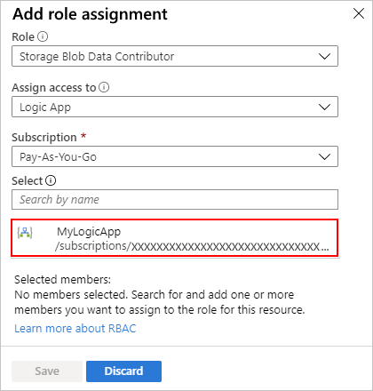
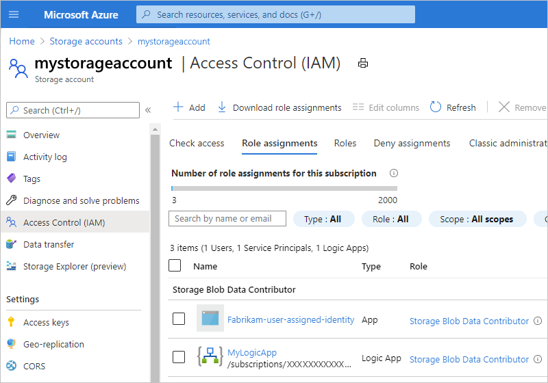
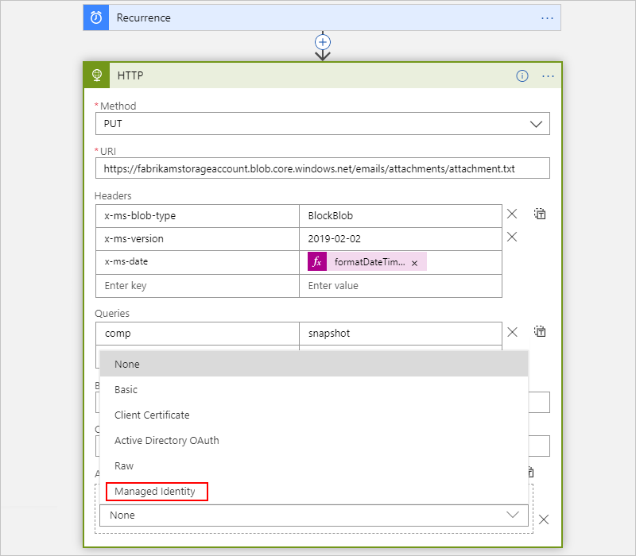
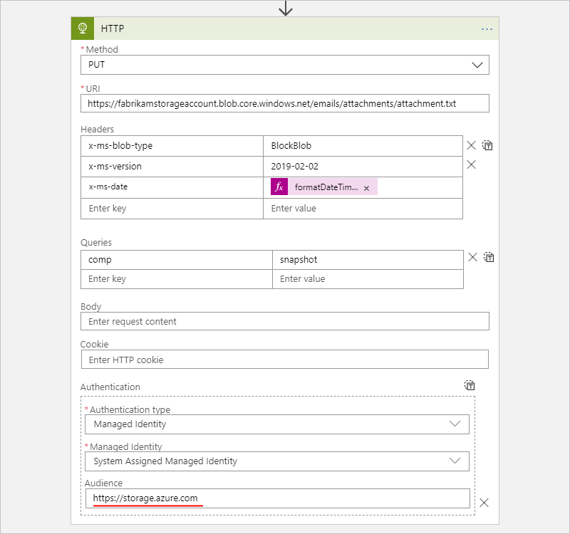

# Authenticate access to Azure resources by using managed identities in Azure Logic Apps

To access resources in other Azure Active Directory (Azure AD) tenants and authenticate your identity without signing in, your logic app can use a [managed identity](../active-directory/managed-identities-azure-resources/overview.md) (formerly known as Managed Service Identity or MSI), rather than credentials or secrets. Azure manages this identity for you and helps secure your credentials because you don't have to provide or rotate secrets. Learn more about [Azure services that support managed identities for Azure AD authentication](../active-directory/managed-identities-azure-resources/services-support-managed-identities.md#azure-services-that-support-azure-ad-authentication).

Your logic app can use managed identities only in [triggers and actions that support managed identities](logic-apps-securing-a-logic-app.md#authenticate-access-outbound). This article shows how to set up and use the system-assigned managed identity for your logic app. For limits on managed identities in logic apps, see [Managed identity limits](../logic-apps/logic-apps-limits-and-config.md#managed-identity). For more information about the authentication types where available in triggers and actions, see [Authenticate access for outbound requests](logic-apps-securing-a-logic-app.md#authenticate-access-outbound).

## Prerequisites

* An Azure subscription, or if you don't have a subscription, [sign up for a free Azure account](https://azure.microsoft.com/free/). The managed identity and the target Azure resource that you want to access have to exist in the same Azure subscription.

* To give a managed identity access to an Azure resource, you need to add a role to the target resource for that identity. To add roles, you need [Azure AD administrator permissions](../active-directory/users-groups-roles/directory-assign-admin-roles.md) that can assign roles to identities in the corresponding Azure AD tenant.

* The target Azure resource that you want to access by using the managed identity that represents your logic app

* The logic app where you want to use the managed identity

<a name="system-assigned"></a>

## Enable system-assigned identity

Unlike user-assigned identities, you don't have to manually create the system-assigned identity. To set up your logic app's system-assigned identity, here are the options that you can use:

* [Azure portal](#azure-portal-system-logic-app)
* [Azure Resource Manager templates](#template-system-logic-app)
* [Azure PowerShell](../active-directory/managed-identities-azure-resources/howto-assign-access-powershell.md)
* [Azure CLI](../active-directory/managed-identities-azure-resources/howto-assign-access-cli.md)

<a name="azure-portal-system-logic-app"></a>

### Enable system-assigned identity in Azure portal

1. In the [Azure portal](https://portal.azure.com), open your logic app in Logic App Designer.

1. On the logic app menu, under **Settings**, select **Identity** > **System assigned**. Under **Status**, select **On** > **Save** > **Yes**.

   

   Your logic app can now use the system-assigned identity, which is registered with Azure Active Directory and is represented by an object ID.

   

   | Property | Value | Description |
   |----------|-------|-------------|
   | **Object ID** | <*identity-resource-ID*> | A Globally Unique Identifier (GUID) that represents the system-assigned identity for your logic app in your Azure AD tenant |
   ||||

<a name="template-system-logic-app"></a>

### Enable system-assigned identity in Azure Resource Manager template

To automate creating and deploying Azure resources such as logic apps, you can use [Azure Resource Manager templates](../logic-apps/logic-apps-azure-resource-manager-templates-overview.md). To set up the system-assigned managed identity for your logic app in the template, add the `identity` object and the `type` child property to the corresponding resource definition in the template. Here is an example for a logic app resource definition:

```json
{
   "apiVersion": "2016-06-01",
   "type": "Microsoft.logic/workflows",
   "name": "[variables('logicappName')]",
   "location": "[resourceGroup().location]",
   "identity": {
      "type": "SystemAssigned"
   },
   "properties": {
      "definition": {
         "$schema": "https://schema.management.azure.com/providers/Microsoft.Logic/schemas/2016-06-01/workflowdefinition.json#",
         "actions": {},
         "parameters": {},
         "triggers": {},
         "contentVersion": "1.0.0.0",
         "outputs": {}
   },
   "parameters": {},
   "dependsOn": []
}
```

When Azure creates your logic app, the `identity` object gets these additional properties:

```json
"identity": {
   "type": "SystemAssigned",
   "principalId": "<principal-ID>",
   "tenantId": "<Azure-AD-tenant-ID>"
}
```

| Property | Value | Description |
|----------|-------|-------------|
| **principalId** | <*principal-ID*> | The Globally Unique Identifier (GUID) of the service principal object for the managed identity that represents your logic app in the Azure AD tenant. This GUID sometimes appears as an "object ID" or `objectID`. |
| **tenantId** | <*Azure-AD-tenant-ID*> | The Globally Unique Identifier (GUID) that represents the Azure AD tenant where the logic app is now a member. Inside the Azure AD tenant, the service principal has the same name as the logic app instance. |
||||

<a name="access-other-resources"></a>

## Give identity access to resources

After you set up a managed identity for your logic app, you can [give that identity access to other Azure resources](../active-directory/managed-identities-azure-resources/howto-assign-access-portal.md). You can then use that identity for authentication.

1. In the Azure portal, go to the Azure resource where you want your managed identity to have access.

1. From the resource's menu, select **Access control (IAM)** > **Role assignments**, which lists the current role assignments for that resource. On the toolbar, select **Add** > **Add role assignment**.

   

   > [!TIP]
   > If the **Add role assignment** option is disabled, you most likely don't have permissions. 
   > For more information about the permissions that let you manage roles for resources, see 
   > [Administrator role permissions in Azure Active Directory](../active-directory/users-groups-roles/directory-assign-admin-roles.md).

1. Under **Add role assignment**, select the **Role** for the identity. Learn more about [role-based access control (RBAC) roles](../role-based-access-control/rbac-and-directory-admin-roles.md#azure-rbac-roles).

   

1. In the **Assign access to** box, select **Azure AD user, group, or service principal**.

   

1. In the **Select** box, find and select your logic app.

   

1. When you're done, select **Save**.

   The target resource's role assignments list now shows the selected managed identity and role.

   

For more information, see [Assign a managed identity access to a resource](../active-directory/managed-identities-azure-resources/howto-assign-access-portal.md).

<a name="authenticate-access-with-identity"></a>

## Authenticate access with managed identity

After your logic app is [set up with a managed identity](#azure-portal-system-logic-app) and that [identity has access to the target resource](#access-other-resources), you can use that identity for authentication in [triggers and actions that support managed identities](logic-apps-securing-a-logic-app.md#managed-identity-authentication).

1. In the trigger or action, open the **Authentication** list, and select **Managed Identity**.

   > [!NOTE]
   > The Authentication property is hidden in some triggers and actions where you can 
   > optionally select an authentication type. To make the property visible in these cases, 
   > in the trigger or action, open the **Add new parameter** list, and select **Authentication**.

   For example, suppose you want to call an [Azure service that supports managed identities for Azure AD authentication](../active-directory/managed-identities-azure-resources/services-support-managed-identities.md#azure-services-that-support-azure-ad-authentication) by using an HTTP action. You want your logic app to use its system-assigned identity when authenticating outbound requests to the target service. The **URI** property specifies the resource ID for the target service, your Azure subscription ID, and the API version to use. In this case, the resource ID is for Azure Resource Manager in the Azure Global environment.

   

1. After you select **Managed Identity**, the **Audience** property appears. The default property value is `https://management.azure.com/`. If necessary, change this value to the target resource ID that you want.

   > [!NOTE]
   > If the **Audience** property doesn't appear, open the **Add new parameter** list, and select **Audience**.

   

   > [!IMPORTANT]
   > Make sure that the target resource ID *exactly matches* the value that Azure Active Directory expects, 
   > including any required trailing slashes. For example, the Azure Resource Manager resource ID usually requires 
   > a trailing slash. Check the [resource IDs for the Azure services that support Azure AD](../active-directory/managed-identities-azure-resources/services-support-managed-identities.md#azure-services-that-support-azure-ad-authentication).

<a name="remove-identity"></a>

## Remove system-assigned identity

To stop using the system-assigned identity for your logic app, you have these options:

* [Azure portal](#azure-portal-disable)
* [Azure Resource Manager templates](#template-disable)
* [Azure PowerShell](https://docs.microsoft.com/powershell/module/az.resources/remove-azroleassignment)
* [Azure CLI](https://docs.microsoft.com/cli/azure/role/assignment?view=azure-cli-latest#az-role-assignment-delete)

If you delete your logic app, Azure automatically removes the managed identity from Azure AD.

<a name="azure-portal-disable"></a>

### Remove system-assigned identity in the Azure portal

In the Azure portal, remove the system-assigned identity [from your logic app](#disable-identity-logic-app) and that identity's access [from your target resource](#disable-identity-target-resource).

<a name="disable-identity-logic-app"></a>

#### Remove system-assigned identity from logic app

1. In the [Azure portal](https://portal.azure.com), open your logic app in Logic App Designer.

1. On the logic app menu, under **Settings**, select **Identity** > **System assigned**. Under **Status**, select **Off** > **Save** > **Yes**.

   

<a name="disable-identity-target-resource"></a>

#### Remove identity access from resources

1. In the [Azure portal](https://portal.azure.com), go to the target Azure resource where you want to remove access for a managed identity.

1. From the target resource's menu, select **Access control (IAM)**. Under the toolbar, select **Role assignments**.

1. In the roles list, select the managed identities that you want to remove. On the toolbar, select **Remove**.

   > [!TIP]
   > If the **Remove** option is disabled, you most likely don't have permissions. 
   > For more information about the permissions that let you manage roles for resources, see [Administrator role permissions in Azure Active Directory](../active-directory/users-groups-roles/directory-assign-admin-roles.md).

The managed identity is now removed and no longer has access to the target resource.

<a name="template-disable"></a>

### Disable managed identity in Azure Resource Manager template

If you enabled the logic app's system-managed identity by using an Azure Resource Manager template, set the `identity` object's `type` child property to `None`. This action also deletes the principal ID for the system-managed identity from Azure AD.

```json
"identity": {
   "type": "None"
}
```

## Next steps

* [Secure access and data in Azure Logic Apps](../logic-apps/logic-apps-securing-a-logic-app.md)
