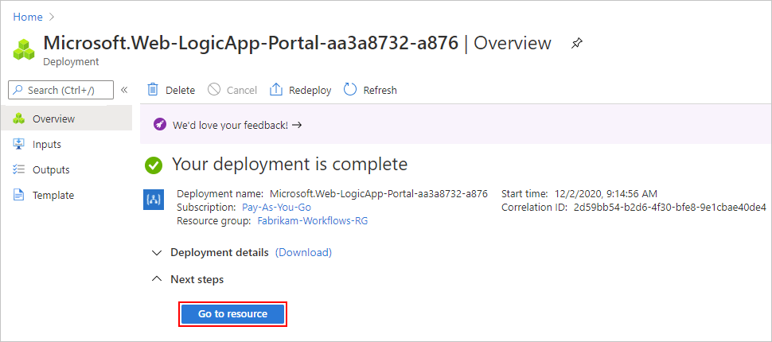
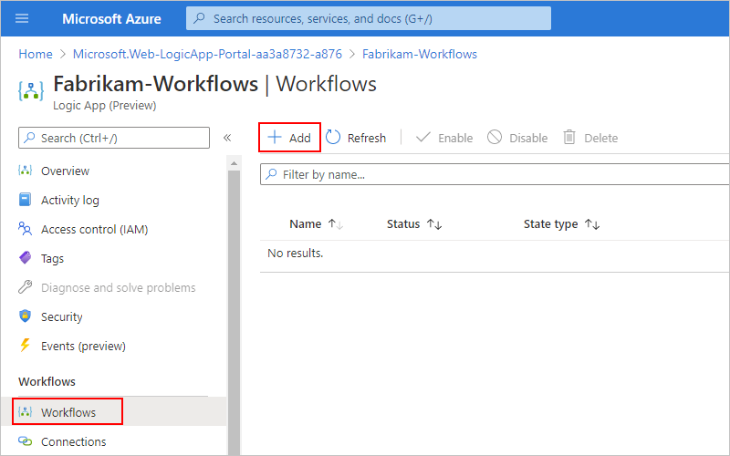
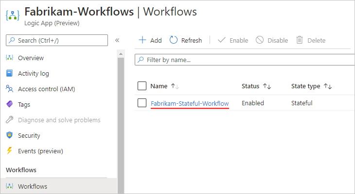
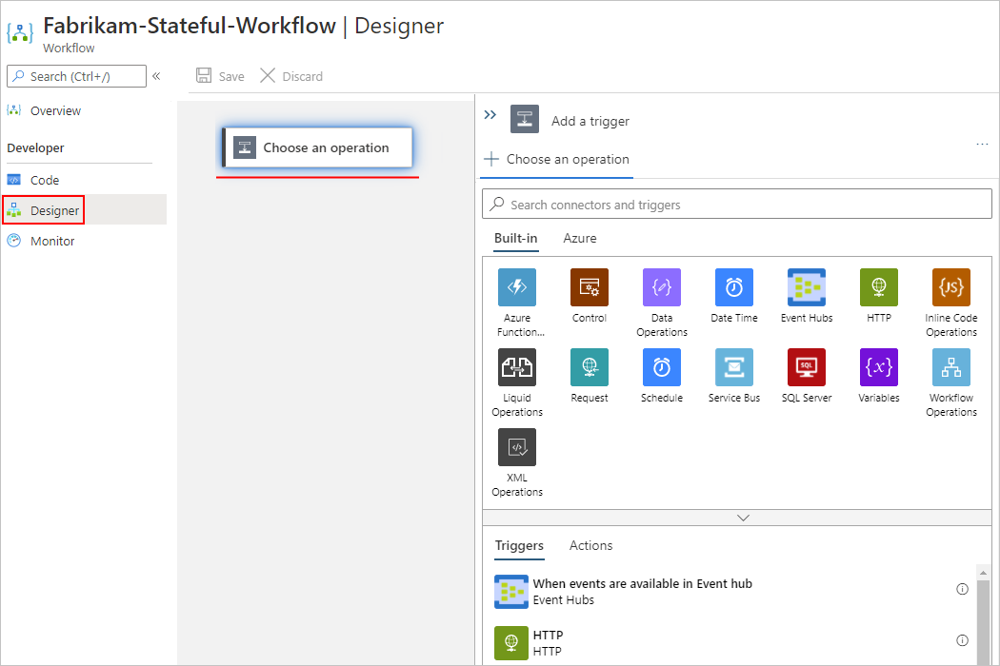
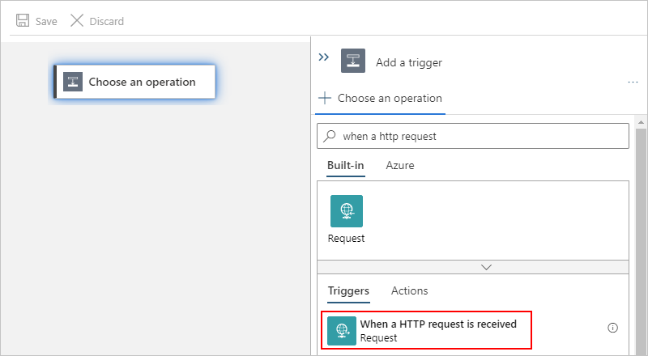
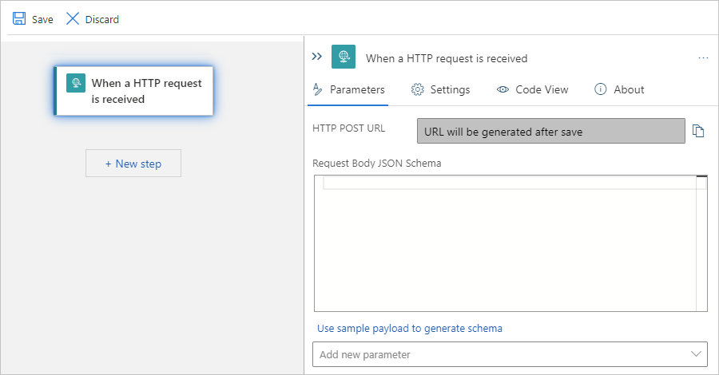

# Create stateful or stateless workflows with Azure Logic Apps (Preview) - Azure portal

> [!IMPORTANT]
> This capability is in public preview, is provided without a service level agreement, and 
> is not recommended for production workloads. Certain features might not be supported or might 
> have constrained capabilities. For more information, see 
> [Supplemental Terms of Use for Microsoft Azure Previews](https://azure.microsoft.com/support/legal/preview-supplemental-terms/).

To create logic app workflows that integrate across apps, data, cloud services, and systems, you can build and run [*stateful* and *stateless* logic app workflows](logic-apps-overview-preview.md#stateful-stateless) by using the Azure portal. The logic apps that you create with the new **Logic App (Preview)** resource type, which is powered by [Azure Functions](../azure-functions/functions-overview.md). This new resource type can include multiple workflows and is similar in some ways to the **Function App** resource type, which can include multiple functions.

Meanwhile, the original **Logic Apps** resource type still exists for you to create and use in the Azure portal. The experiences to create the new resource type are separate and different from the original resource type, but you can have both the **Logic Apps** and **Logic App (Preview)** resource types in your Azure subscription. You can view and access all the deployed logic apps in your subscription, but they appear and are kept separately in their own categories and sections. To learn more about the **Logic App (Preview)** resource type, see [Overview for Azure Logic Apps (Preview)](logic-apps-overview-preview.md#whats-new).

This article shows how to build a **Logic App (Preview)** resource by using the Azure portal. To build this resource in Visual Studio Code, see [Create stateful or stateless workflows in Visual Studio Code](create-stateful-stateless-workflows-visual-studio-code.md).

## Prerequisites

* An Azure account and subscription. If you don't have a subscription, [sign up for a free Azure account](https://azure.microsoft.com/free/?WT.mc_id=A261C142F).

* An [Azure Storage account](../storage/common/storage-account-overview.md) because the **Logic App (Preview)** resource is powered by Azure Functions and has [storage requirements that are similar to function apps](../azure-functions/storage-considerations.md). You can use an existing storage account, or you can create a storage account in advance or during logic app creation.

  > [!NOTE]
  > [Stateful logic apps](logic-apps-overview-preview.md#stateful-stateless) perform storage transactions, such as using queues for 
  > scheduling and storing workflow states in tables and blobs. These transactions incur [Azure Storage charges](https://azure.microsoft.com/pricing/details/storage/). For more information about how stateful logic apps store data in external storage, see [Stateful versus stateless](logic-apps-overview-preview.md#stateful-stateless).

* To build the same example logic app in this article, you need an Office 365 Outlook email account that uses a Microsoft work or school account to sign in.

  If you choose to use a different [email connector that's supported by Azure Logic Apps](/connectors/), such as Outlook.com or [Gmail](../connectors/connectors-google-data-security-privacy-policy.md), you can still follow the example, and the general overall steps are the same, but your user interface and options might differ in some ways. For example, if you use the Outlook.com connector, use your personal Microsoft account instead to sign in.

* To test the example logic app that you create in this article, you need a tool that can send calls to the Request trigger, which is the first step in example logic app. If you don't have such a tool, you can download, install, and use [Postman](https://www.postman.com/downloads/).

* For easier diagnostics logging and tracing capability, you can add and use an [Application Insights](../azure-monitor/app/app-insights-overview.md) resource. You can create this resource in advance or when you create your logic app.

## Create the logic app resource

1. Sign in to the [Azure portal](https://portal.azure.com) with your Azure account credentials.

1. In the Azure portal search box, enter `logic app preview`, and select **Logic App (Preview)**.

   

1. On the **Logic App (Preview)** page, select **Add**.

1. On the **Create Logic App (Preview)** page, on the **Basics** tab, provide this information about your logic app.

   | Property | Required | Value | Description |
   |----------|----------|-------|-------------|
   | **Subscription** | Yes | <*Azure-subscription-name*> | The Azure subscription to use for your logic app. |
   | **Resource group** | Yes | <*Azure-resource-group-name*> | The Azure resource group where you create your logic app and related resources. This resource name must be unique across regions and can contain only letters, numbers, hyphens ( **-** ), underscores ( **_** ), parentheses ( **()** ), and periods ( **.** ). 

This example creates a resource group named `Fabrikam-Workflows-RG`. |
   | **Logic app name** | Yes | <*logic-app-name*> | The name to use for your logic app. This resource name must be unique across regions and can contain only letters, numbers, hyphens ( **-** ), underscores ( **_** ), parentheses ( **()** ), and periods ( **.** ). 

This example creates a logic app named `Fabrikam-Workflows`. 

**Note**: Your logic app's name automatically gets the suffix, `.azurewebsites.net`, because the **Logic App (Preview)** resource is powered by Azure Functions, which uses the same app naming convention. |
   | **Publish** | Yes | <*deployment-environment*> | The deployment destination for your logic app. You can deploy to Azure by selecting **Workflow** or to a Docker container. 

This example uses **Workflow**. |
   | **Region** | Yes | <*Azure-region*> | The Azure region to use when creating your resource group and resources. 

This example uses **West US**. |
   |||||

   Here's an example:

   

1. Next, on the **Hosting** tab, provide this information about the storage solution and hosting plan to use for your logic app.

   | Property | Required | Value | Description |
   |----------|----------|-------|-------------|
   | **Storage account** | Yes | <*Azure-storage-account-name*> | The [Azure Storage account](../storage/common/storage-account-overview.md) to use for storage transactions. This resource name must be unique across regions and have 3-24 characters with only numbers and lowercase letters. Either select an existing account or create a new account. 

This example creates a storage account named `fabrikamstorageacct`. |
   | **Plan type** | Yes | <*Azure-hosting-plan*> | The [hosting plan](../app-service/overview-hosting-plans.md) to use for deploying your logic app, which is either [**Premium**](../azure-functions/functions-scale.md#premium-plan) or [**App service plan**](../azure-functions/functions-scale.md#app-service-plan). Your choice affects the pricing tiers that you can choose later. 

This example uses the **App service plan**. 

**Note**: Similar to Azure Functions, the **Logic App (Preview)** resource type requires a hosting plan and pricing tier. Consumption hosting plans aren't supported nor available for this resource type. For more information, review these topics: 

- [Azure Functions scale and hosting](../azure-functions/functions-scale.md)  - [App Service pricing details](https://azure.microsoft.com/pricing/details/app-service/) 

 |
   | **Windows Plan** | Yes | <*plan-name*> | The plan name to use. Either select an existing plan or create a new plan. 

This example creates a plan named `fabrikam-service-plan`. |
   | **SKU and size** | Yes | <*pricing-tier*> | The [pricing tier](../app-service/overview-hosting-plans.md) to use for hosting your logic app. Your choices are affected by the plan type that you previously chose. To change the default tier, select **Change size**. You can then select other pricing tiers, based on the workload that you need. 

This example uses the free **F1 pricing tier** for **Dev / Test** workloads. For more information, review [App Service pricing details](https://azure.microsoft.com/pricing/details/app-service/). |
   |||||

1. Next, if your selected subscription, runtime stack, OS, publish type, region, resource group, or hosting plan supports [Application Insights](../azure-monitor/app/app-insights-overview.md), you can optionally enable diagnostics logging and tracing capability for your logic app. On the **Monitoring** tab, under **Application Insights**, set **Enable Application Insights** to **Yes** if not already selected.

1. After Azure validates your logic app's settings, on the **Review + create** tab, select **Create**.

   For example:

   

   After Azure finishes deployment, your logic app is automatically live and running but doesn't do anything yet because no workflows exist.

1. On the deployment completion page, select **Go to resource** so that you can start building a workflow.

   

## Add a blank workflow

1. After Azure opens the resource, on your logic app's menu, select **Workflows**. On the **Workflows** toolbar, select **Add**.

   

1. After the **New workflow** pane opens, provide a name for your workflow, and choose either the [**Stateful** or **Stateless**](logic-apps-overview-preview.md#stateful-stateless) workflow type. When you're done, select **Create**.

   This example adds a blank stateful workflow named `Fabrikam-Stateful-Workflow`. By default, the workflow is enabled but doesn't do anything yet until you add a trigger and actions.

   

1. Next, open the blank workflow in the designer so that you can add a trigger and actions.

   1. From the workflow list, select the blank workflow.

   1. On the workflow menu, under **Developer**, select **Designer**.

      On the designer surface, the **Choose an operation** prompt already appears and is selected by default so that the **Add a trigger** pane also appears open.

      

## Add a trigger and actions

This example builds a workflow that has these steps:

* The built-in [Request trigger](../connectors/connectors-native-reqres.md), **When a HTTP request is received**, which receives inbound calls or requests and creates an endpoint that other services or logic apps can call.

* The [Office 365 Outlook action](../connectors/connectors-create-api-office365-outlook.md), **Send an email**.

* The built-in [Response action](../connectors/connectors-native-reqres.md), which you use to send a reply and return data back to the caller.

### Add the Request trigger

Before you can add a trigger to a blank workflow, make sure that the workflow designer is open and that the **Choose an operation** prompt is selected on the designer surface.

1. Next to the designer surface, in the **Add a trigger** pane, under the **Choose an operation** search box, check that the **Built-in** tab is selected. This tab shows triggers that run natively in Azure Logic Apps.

1. In the **Choose an operation** search box, enter `when a http request`, and select the built-in Request trigger that's named **When a HTTP request is received**.

   

   When the trigger appears on the designer, the trigger's details pane opens to show the trigger's properties, settings, and other actions.

   

   > [!TIP]
   > If the details pane doesn't appear, makes sure that the trigger is selected on the designer.

1. If you have to delete an item on the designer, follow these steps:

   1. On the designer, select the item, which opens the item's details pane to the right side.

   1. Expand your browser window widely enough so that next to the trigger or action name, the ellipses (**...**) button appears in the upper right corner.

   1. Open the ellipses (**...**) menu, and select **Delete**. To confirm the deletion, select **OK**.

      

1. To save your work, on the designer toolbar, select **Save**.

   When you save a workflow for the first time, and that workflow starts with a Request trigger, the Logic Apps service automatically generates a URL for an endpoint that's created by the Request trigger. Later, when you test your workflow, you send a request to this URL, which fires the trigger and starts the workflow run.

### Add the Office 365 Outlook action

1. On the designer, under the trigger that you added, select **New step**.

   The **Choose an operation** prompt appears on the designer, and the **Add an action** pane reopens so that you can select the next action.

   > [!NOTE]
   > If the **Add an action** pane shows the error message, 'Cannot read property 'filter' of undefined`, 
   > save your workflow, reload the page, reopen your workflow, and try again.

1. In the **Add an action** pane, under the **Choose an operation** search box, select **Azure**. This tab shows the managed connectors that are available and deployed in Azure.

   > [!NOTE]
   > If the **Add an action** pane shows the error message, `The access token expiry UTC time '{token-expiration-date-time}' is earlier than current UTC time '{current-date-time}'`, 
   > save your workflow, reload the page, reopen your workflow, and try adding the action again.

   This example uses the Office 365 Outlook action named **Send an email (V2)**.

   

1. In the action's details pane, on the **Create Connection** tab, select **Sign in** so that you can create a connection to your email account.

   

1. When you're prompted for consent to access your email account, sign in with your account credentials.

   > [!NOTE]
   > If you get the error message, `Failed with error: 'The browser is closed.'. Please sign in again`, 
   > check whether your browser blocks third-party cookies. If these cookies are blocked, 
   > try adding `https://portal.azure.com` to the list of sites that can use cookies. 
   > If you're using incognito mode, make sure that third-party cookies aren't blocked while working in that mode.
   > 
   > If necessary, reload the page, open your workflow, add the email action again, and try creating the connection.

   After Azure creates the connection, the **Send an email** action appears on the designer and is selected by default. If the action isn't selected, select the action so that its details pane is also open.

1. In the action's details pane, on the **Parameters** tab, provide the required information for the action, for example:

   

   | Property | Required | Value | Description |
   |----------|----------|-------|-------------|
   | **To** | Yes | <*your-email-address*> | The email recipient, which can be your email address for test purposes. This example uses the fictitious email, `sophiaowen@fabrikam.com`. |
   | **Subject** | Yes | `An email from your example workflow` | The email subject |
   | **Body** | Yes | `Hello from your example workflow!` | The email body content |
   ||||

   > [!NOTE]
   > When making any changes in the details pane on the **Settings**, **Static Result**, or **Run After** tabs, 
   > make sure that you select **Done** to commit those changes before you switch tabs or change focus to the designer. 
   > Otherwise, the designer won't keep your changes.

1. Save your work. On the designer toolbar, select **Save**.

Next, to test your workflow, manually trigger a run.

## Trigger the workflow

In this example, the workflow runs when the Request trigger receives an inbound request, which is sent to the URL for the endpoint that's created by the trigger. When you saved the workflow for the first time, the Logic Apps service automatically generated this URL. So, before you can send this request to trigger the workflow, you need to find this URL.

1. On the workflow designer, select the Request trigger that's named **When a HTTP request is received**.

1. After the details pane opens, on the **Parameters** tab, find the **HTTP POST URL** property. To copy the generated URL, select the **Copy Url** (copy file icon), and save the URL somewhere else for now. The URL follows this format:

   `http://<logic-app-name>.azurewebsites.net:443/api/<workflow-name>/triggers/manual/invoke?api-version=2020-05-01-preview&sp=%2Ftriggers%2Fmanual%2Frun&sv=1.0&sig=<shared-access-signature>`

   

   For this example, the URL looks like this:

   `https://fabrikam-workflows.azurewebsites.net:443/api/Fabrikam-Stateful-Workflow/triggers/manual/invoke?api-version=2020-05-01-preview&sp=%2Ftriggers%2Fmanual%2Frun&sv=1.0&sig=xxxxxXXXXxxxxxXXXXxxxXXXXxxxxXXXX`

   > [!TIP]
   > You can also find the endpoint URL on your logic app's **Overview** pane in the **Workflow URL** property.
   >
   > 1. On the resource menu, select **Overview**.
   > 1. On the **Overview** pane, find the **Workflow URL** property.
   > 1. To copy the endpoint URL, move your pointer over the end of the endpoint URL text, 
   >    and select **Copy to clipboard** (copy file icon).

1. To test the URL by sending a request, open [Postman](https://www.postman.com/downloads/) or your preferred tool for creating and sending requests.

   This example continues by using Postman. For more information, see [Postman Getting Started](https://learning.postman.com/docs/getting-started/introduction/).

   1. On the Postman toolbar, select **New**.

      

   1. On the **Create New** pane, under **Building Blocks**, select **Request**.

   1. In the **Save Request** window, under **Request name**, provide a name for the request, for example, `Test workflow trigger`.

   1. Under **Select a collection or folder to save to**, select **Create Collection**.

   1. Under **All Collections**, provide a name for the collection to create for organizing your requests, press Enter, and select **Save to <*collection-name*>**. This example uses `Logic Apps requests` as the collection name.

      Postman's request pane opens so that you can send a request to the endpoint URL for the Request trigger.

      

   1. On the request pane, in the address box that's next to the method list, which currently shows **GET** as the default request method, paste the URL that you previously copied, and select **Send**.

      

      When the trigger fires, the example workflow runs and sends an email that appears similar to this example:

      

## Review run history

For a stateful workflow, after each workflow run, you can view the run history, including the status for the overall run, for the trigger, and for each action along with their inputs and outputs.

1. In the Azure portal, on your workflow's menu, select **Monitor**.

   The **Monitor** pane shows the run history for that workflow.

   

   > [!TIP]
   > If the most recent run status doesn't appear, on the **Monitor** pane toolbar, select **Refresh**. 
   > No run happens for a trigger that's skipped due to unmet criteria or finding no data.

   | Run status | Description |
   |------------|-------------|
   | **Aborted** | The run stopped or didn't finish due to external problems, for example, a system outage or lapsed Azure subscription. |
   | **Cancelled** | The run was triggered and started but received a cancellation request. |
   | **Failed** | At least one action in the run failed. No subsequent actions in the workflow were set up to handle the failure. |
   | **Running** | The run was triggered and is in progress, but this status can also appear for a run that is throttled due to [action limits](logic-apps-limits-and-config.md) or the [current pricing plan](https://azure.microsoft.com/pricing/details/logic-apps/). 

**Tip**: If you set up [diagnostics logging](monitor-logic-apps-log-analytics.md), you can get information about any throttle events that happen. |
   | **Succeeded** | The run succeeded. If any action failed, a subsequent action in the workflow handled that failure. |
   | **Timed out** | The run timed out because the current duration exceeded the run duration limit, which is controlled by the [**Run history retention in days** setting](logic-apps-limits-and-config.md#run-duration-retention-limits). A run's duration is calculated by using the run's start time and run duration limit at that start time. 

**Note**: If the run's duration also exceeds the current *run history retention limit*, which is also controlled by the [**Run history retention in days** setting](logic-apps-limits-and-config.md#run-duration-retention-limits), the run is cleared from the runs history by a daily cleanup job. Whether the run times out or completes, the retention period is always calculated by using the run's start time and *current* retention limit. So, if you reduce the duration limit for an in-flight run, the run times out. However, the run either stays or is cleared from the runs history based on whether the run's duration exceeded the retention limit. |
   | **Waiting** | The run hasn't started or is paused, for example, due to an earlier workflow instance that's still running. |
   |||

1. To review the status for each step in a run, select the run that you want to review.

   The run details view opens and shows the status for each step in the run.

   

   Here are the possible statuses that each step in the workflow can have:

   | Action status | Icon | Description |
   |---------------|------|-------------|
   | Aborted | ![Icon for "Aborted" action status][aborted-icon] | The action stopped or didn't finish due to external problems, for example, a system outage or lapsed Azure subscription. |
   | Cancelled | ![Icon for "Cancelled" action status][cancelled-icon] | The action was running but received a cancellation request. |
   | Failed | ![Icon for "Failed" action status][failed-icon] | The action failed. |
   | Running | ![Icon for "Running" action status][running-icon] | The action is currently running. |
   | Skipped | ![Icon for "Skipped" action status][skipped-icon] | The action was skipped because the immediately preceding action failed. An action has a `runAfter` condition that requires that the preceding action finishes successfully before the current action can run. |
   | Succeeded | ![Icon for "Succeeded" action status][succeeded-icon] | The action succeeded. |
   | Succeeded with retries | ![Icon for "Succeeded with retries" action status][succeeded-with-retries-icon] | The action succeeded but only after one or more retries. To review the retry history, in the run history details view, select that action so that you can view the inputs and outputs. |
   | Timed out | ![Icon for "Timed out" action status][timed-out-icon] | The action stopped due to the timeout limit specified by that action's settings. |
   | Waiting | ![Icon for "Waiting" action status][waiting-icon] | Applies to a webhook action that's waiting for an inbound request from a caller. |
   ||||

   [aborted-icon]: ./media/create-stateful-stateless-workflows-azure-portal/aborted.png
   [cancelled-icon]: ./media/create-stateful-stateless-workflows-azure-portal/cancelled.png
   [failed-icon]: ./media/create-stateful-stateless-workflows-azure-portal/failed.png
   [running-icon]: ./media/create-stateful-stateless-workflows-azure-portal/running.png
   [skipped-icon]: ./media/create-stateful-stateless-workflows-azure-portal/skipped.png
   [succeeded-icon]: ./media/create-stateful-stateless-workflows-azure-portal/succeeded.png
   [succeeded-with-retries-icon]: ./media/create-stateful-stateless-workflows-azure-portal/succeeded-with-retries.png
   [timed-out-icon]: ./media/create-stateful-stateless-workflows-azure-portal/timed-out.png
   [waiting-icon]: ./media/create-stateful-stateless-workflows-azure-portal/waiting.png

1. To review the inputs and outputs for a specific step, select that step.

   

1. To further review the raw inputs and outputs for that step, select **Show raw inputs** or **Show raw outputs**.

## Enable run history for stateless workflows

To more easily debug a stateless workflow, you can enable the run history for that workflow, and then disable the run history when you're done. Follow these steps for the Azure portal, or if you're working in Visual Studio Code, see [Create stateful or stateless workflows in Visual Studio Code](create-stateful-stateless-workflows-visual-studio-code.md#enable-run-history-stateless).

1. In the [Azure portal](https://portal.azure.com), find and open your **Logic App (Preview)** resource.

1. On the logic app's menu, under **Settings**, select **Configuration**.

1. On the **Application Settings** tab, select **New application setting**.

1. On the **Add/Edit application setting** pane, in the **Name** box, enter this operation option name: 

   `Workflows.{yourWorkflowName}.OperationOptions`

1. In the **Value** box, enter the following value: `WithStatelessRunHistory`

   For example:

   

1. To finish this task, select **OK**. On the **Configuration** pane toolbar, select **Save**.

1. To disable the run history when you're done, either set the `Workflows.{yourWorkflowName}.OperationOptions`property to `None`, or delete the property and its value.

## Next steps

We'd like to hear from you about your experiences with this public preview!

* For bugs or problems, [create your issues in GitHub](https://github.com/Azure/logicapps/issues).
* For questions, requests, comments, and other feedback, [use this feedback form](https://aka.ms/lafeedback).
