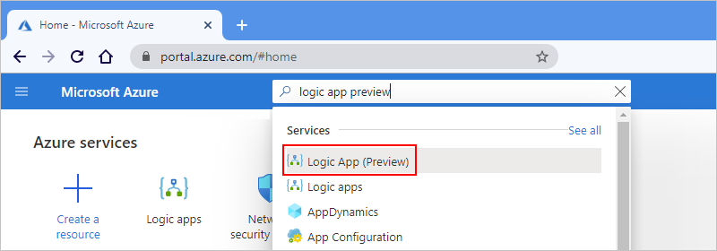
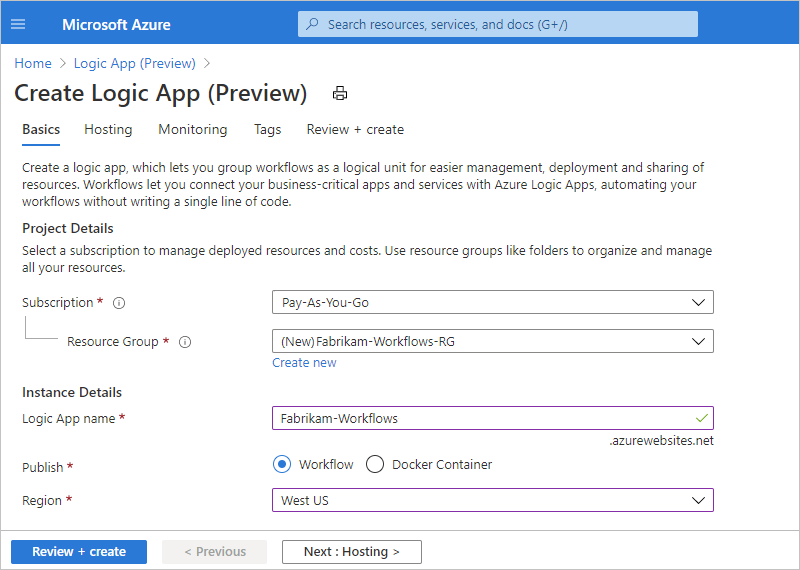
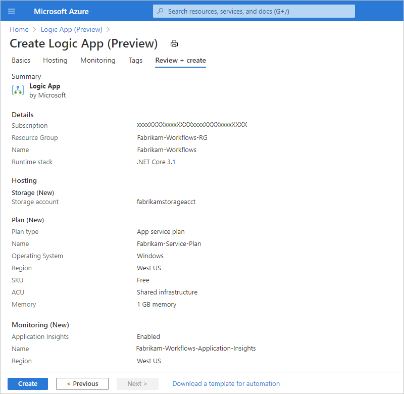

# Create stateful or stateless workflows with Azure Logic Apps (Preview) - Azure portal

> [!IMPORTANT]
> This capability is in public preview, is provided without a service level agreement, and 
> is not recommended for production workloads. Certain features might not be supported or might 
> have constrained capabilities. For more information, see 
> [Supplemental Terms of Use for Microsoft Azure Previews](https://azure.microsoft.com/support/legal/preview-supplemental-terms/).

To create logic app workflows that integrate across apps, data, cloud services, and systems, you can build and run [*stateful* and *stateless* logic app workflows](logic-apps-overview-preview.md#stateful-stateless) by using the Azure portal. The logic apps that you create with the new **Logic App (Preview)** resource type, which is powered by [Azure Functions](../azure-functions/functions-overview.md). This new resource type can include multiple workflows and is similar in some ways to the **Function App** resource type, which can include multiple functions.

Meanwhile, the original **Logic Apps** resource type still exists for you to create and use in the Azure portal. The experiences to create the new resource type are separate and different from the original resource type, but you can have both the **Logic Apps** and **Logic App (Preview)** resource types in your Azure subscription. You can view and access all the deployed logic apps in your subscription, but they appear and are kept separately in their own categories and sections. To learn more about the **Logic App (Preview)** resource type, see [Overview for Azure Logic Apps (Preview)](logic-apps-overview-preview.md#whats-new).

This article shows how to build a **Logic App (Preview)** resource by using the Azure portal.

## Prerequisites

* An Azure account and subscription. If you don't have a subscription, [sign up for a free Azure account](https://azure.microsoft.com/free/?WT.mc_id=A261C142F).

* An [Azure Storage account](../storage/common/storage-account-overview.md) because the **Logic App (Preview)** resource is powered by Azure Functions and has [storage requirements that are similar to function apps](../azure-functions/storage-considerations.md). You can use an existing storage account, or you can create a storage account in advance or during logic app creation.

  > [!NOTE]
  > [Stateful logic apps](logic-apps-overview-preview.md#stateful-stateless) perform storage transactions, such as using queues for 
  > scheduling and storing workflow states in tables and blobs. These transactions incur [Azure Storage charges](https://azure.microsoft.com/pricing/details/storage/). For more information about how stateful logic apps store data in external storage, see [Stateful versus stateless](logic-apps-overview-preview.md#stateful-stateless).

* To build the same example logic app in this article, you need an Office 365 Outlook email account that uses a Microsoft work or school account to sign in.

  If you choose to use a different [email connector that's supported by Azure Logic Apps](/connectors/), such as Outlook.com or [Gmail](../connectors/connectors-google-data-security-privacy-policy.md), you can still follow the example, and the general overall steps are the same, but your user interface and options might differ in some ways. For example, if you use the Outlook.com connector, use your personal Microsoft account instead to sign in.

* To test the example logic app that you create in this article, you need a tool that can send calls to the Request trigger, which is the first step in example logic app. If you don't have such a tool, you can download, install, and use [Postman](https://www.postman.com/downloads/).

## Create the logic app resource

1. Sign in to the [Azure portal](https://portal.azure.com) with your Azure account credentials.

1. In the Azure portal search box, enter `logic app preview`, and select **Logic App (Preview)**.

   

1. On the **Logic App (Preview)** page, select **Add**.

1. On the **Create Logic App (Preview)** page, on the **Basics** tab, provide this information about your logic app.

   | Property | Required | Value | Description |
   |----------|----------|-------|-------------|
   | **Subscription** | Yes | <*Azure-subscription-name*> | The Azure subscription to use for your logic app. |
   | **Resource group** | Yes | <*Azure-resource-group-name*> | The Azure resource group where you create your logic app. This resource name must be unique across regions and can contain only letters, numbers, hyphens ( **-** ), underscores ( **_** ), parentheses ( **()** ), and periods ( **.** ). 

This example creates a resource group named `Fabrikam-Workflows-RG`. |
   | **Logic app name** | Yes | <*logic-app-name*> | The name to use for your logic app. This resource name must be unique across regions and can contain only letters, numbers, hyphens ( **-** ), underscores ( **_** ), parentheses ( **()** ), and periods ( **.** ). 

This example creates a logic app named `Fabrikam-Workflows`. 

**Note**: Your logic app's name automatically gets the suffix, `.azurewebsites.net`, because the **Logic App (Preview)** resource is powered by Azure Functions, which uses the same app naming convention. |
   | **Publish** | Yes | <*deployment-environment*> | The deployment destination for your logic app. You can deploy to Azure by selecting **Workflow** or to a Docker container. 

This example uses **Workflow**. |
   | **Region** | Yes | <*Azure-region*> | The Azure region where to store information about your app. 

This example uses **West US**. |
   |||||

   Here's an example:

   

1. Next, on the **Hosting** tab, provide this information about the storage solution and hosting plan to use for your logic app.

   | Property | Required | Value | Description |
   |----------|----------|-------|-------------|
   | **Storage account** | Yes | <*Azure-storage-account-name*> | The [Azure Storage account](../storage/common/storage-account-overview.md) to use for storage transactions. This resource name must be unique across regions and have 3-24 characters with only numbers and lowercase letters. Either select an existing account or create a new account. 

This example creates a storage account named `fabrikamstorageacct`. |
   | **Plan type** | Yes | <*Azure-hosting-plan*> | The [hosting plan](../app-service/overview-hosting-plans.md) to use for deploying your logic app, which is either [**Premium**](../azure-functions/functions-scale.md#premium-plan) or [**App service plan**](../azure-functions/functions-scale.md#app-service-plan). Your choice affects the pricing tiers that you can choose later. 

This example uses the **App service plan**. 

**Note**: Similar to Azure Functions, the **Logic App (Preview)** resource type requires a hosting plan and pricing tier. Consumption hosting plans aren't supported nor available for this resource type. For more information, review these topics: 

- [Azure Functions scale and hosting](../azure-functions/functions-scale.md)  - [App Service pricing details](https://azure.microsoft.com/pricing/details/app-service/) 

 |
   | **Windows Plan** | Yes | <*plan-name*> | The plan name to use. Either select an existing plan or create a new plan. 

This example creates a plan named `fabrikam-service-plan`. |
   | **SKU and size** | Yes | <*pricing-tier*> | The [pricing tier](../app-service/overview-hosting-plans.md) to use for hosting your logic app. Your choices are affected by the plan type that you previously chose. To change the default tier, select **Change size**. You can then select other pricing tiers, based on the workload that you need. 

This example uses the free **F1 pricing tier** for **Dev / Test** workloads. For more information, review [App Service pricing details](https://azure.microsoft.com/pricing/details/app-service/). |
   |||||

1. Next, on the **Monitoring** tab, based on your selected hosting plan and pricing tier, [Application Insights](../azure-monitor/app/app-insights-overview.md), which makes diagnostics logging and tracing capability, You can either 

1. After Azure validates your logic app's settings, on the **Review + create** tab, confirm these settings, and select **Create**.

   For example:

   

## Monitoring

