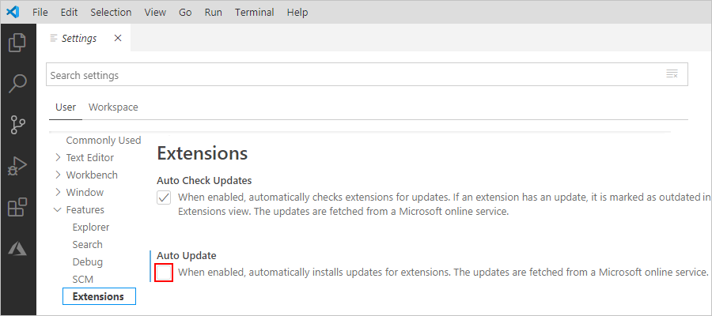
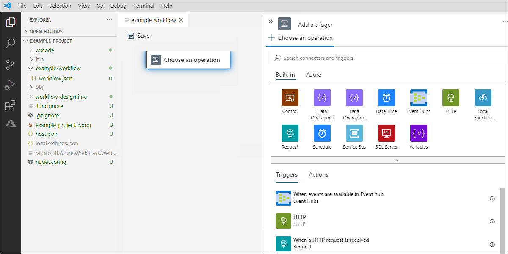
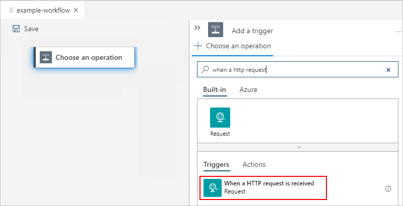
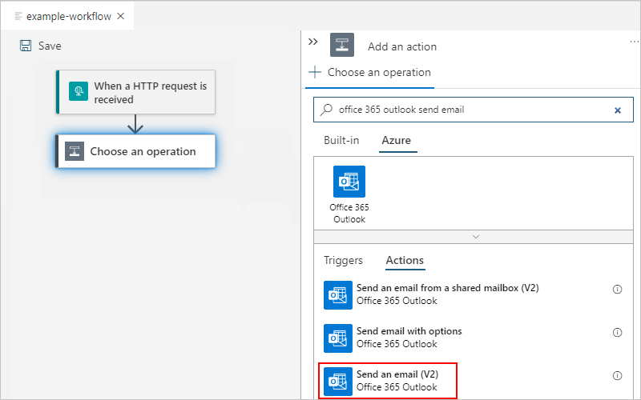
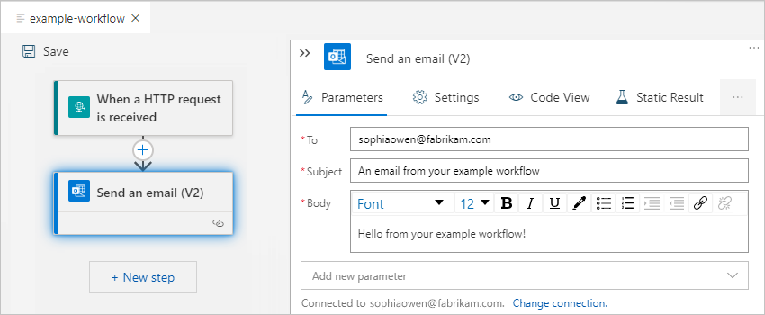
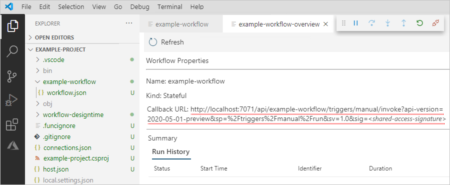
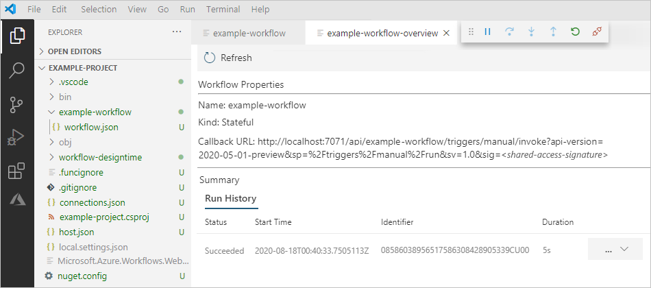
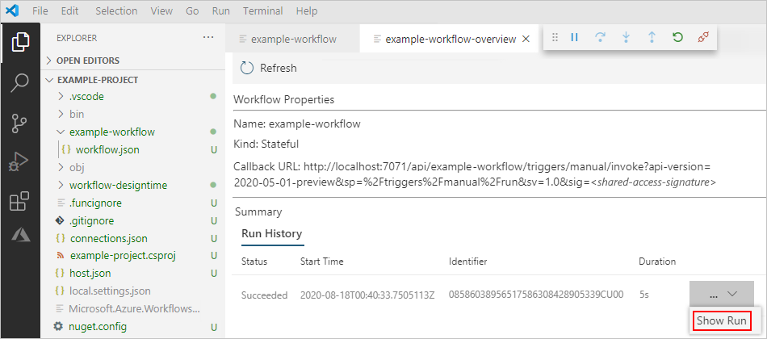
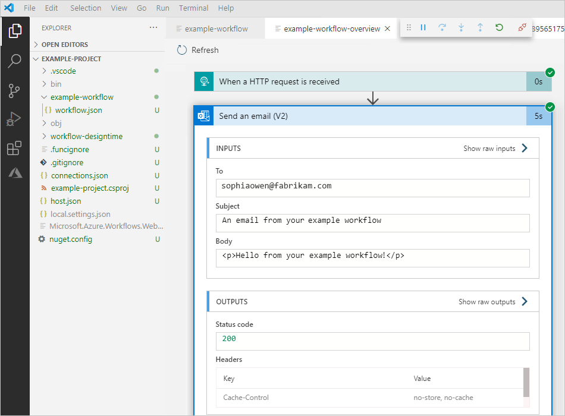

# Create stateful and stateless workflows by using Azure Logic Apps and Visual Studio Code - Public Preview

When you use Visual Studio Code and the preview extension, Azure Functions for Visual Studio Code, you can build stateful or stateless workflow apps that are powered by [Azure Functions](../azure-functions/functions-overview.md). You can test your workflow apps on your local computer and deploy to multiple hosting environments, such as Azure App Service, Azure function apps, or as Docker containers that can run anywhere that you want. The preview extension brings many Azure Logic Apps capabilities to your local development experience and provides additional capabilities, for example:

<a name="stateful-stateless"></a>

## What are stateful and stateless?

* *Stateful*

  Create stateful workflow apps when you need to keep, review, or reference data from previous events. These workflows save the input and output for each action in external storage, which makes run details and history review possible after each run finishes. Stateful workflows provide high resiliency if or when outages happen. After services and systems are restored, you can reconstruct interrupted workflow runs from the saved state and rerun the workflows to completion.

* *Stateless*

  Create stateless workflow apps when you don't need to keep, review, or reference data from previous events. These workflows save the input and output for each action only in memory, rather than in external storage. Stateless workflows provide faster performance with quicker response times, higher throughput, and reduced running costs because run details and history aren't kept. However, if or when outages happen, interrupted runs aren't automatically restored, so the caller needs to manually resubmit interrupted runs. For easier debugging, you can [enable run history](#enable-run-history) for stateless workflows.

  Currently, stateless workflows support only actions, not triggers, for [managed connectors](../connectors/apis-list.md#connector-types). For more information, see [Azure Triggers - GitHub Issue #136](https://github.com/Azure/logicapps/issues/136).

<a name="nested-workflow-behavior"></a>

### Nested workflow behavior

You can [make a workflow callable](../logic-apps/logic-apps-http-endpoint.md) by other workflows by using the [Request](../connectors/connectors-native-reqres.md) trigger, [HTTP Webhook](../connectors/connectors-native-webhook.md) trigger, or managed connector triggers that have the [ApiConnectionWehook type](../logic-apps/logic-apps-workflow-actions-triggers.md#apiconnectionwebhook-trigger) and can receive HTTPS requests.

Here are the behavior patterns that nested workflows can follow after a parent workflow calls a child workflow:

* Asynchronous polling pattern

  The parent doesn't wait for a response to their initial call, but continually checks the child's run history until the child finishes running. By default, stateful workflows follow this pattern, which is ideal for long-running child workflows that might exceed [request timeout limits](../logic-apps/logic-apps-limits-and-config.md).

* Synchronous pattern ("fire and forget")

  The child acknowledges the call by immediately returning a `202 ACCEPTED` response, and the parent continues to the next action without waiting for the results from the child. Instead, the parent receives the results when the child finishes running. Child stateful workflows that don't include a Response action always follow the synchronous pattern. For child stateful workflows, the run history is available for you to review.

  To enable this behavior, in the workflow's JSON definition, set the `OperationOptions` property to `DisableAsyncPattern`. For more information, see [Trigger and action types - Operation options](../logic-apps/logic-apps-workflow-actions-triggers.md#operation-options).

* Trigger and wait

  For a child stateless workflow, the parent waits for a response that returns the results from the child. This pattern works similar to using the built-in [HTTP trigger or action](../connectors/connectors-native-http.md) to call a child workflow. Child stateless workflows that don't include a Response action immediately return a `202 ACCEPTED` response, but the parent waits for the child to finish before continuing to the next action. These behaviors apply only to child stateless workflows.

This table specifies the child workflow's behavior based on whether the parent and child are stateful, stateless, or are mixed workflow types:

| Parent workflow | Child workflow | Child behavior |
|-----------------|----------------|----------------|
| Stateful | Stateful | Asynchronous or synchronous with `operationOptions=DisableSynPattern` setting |
| Stateful | Stateless | Trigger and wait |
| Stateless | Stateful | Synchronous |
| Stateless | Stateless | Trigger and wait |
||||

## Prerequisites

* An Azure account and subscription. If you don't have a subscription, [sign up for a free Azure account](https://azure.microsoft.com/free/?WT.mc_id=A261C142F).

* Access to the internet so that you can download the requirements and sign in to your Azure account

* [Visual Studio Code version 1.25.1 or later](https://code.visualstudio.com/), which is free, along with these tools for Visual Studio Code:

  * [C# for Visual Studio Code extension](https://marketplace.visualstudio.com/items?itemName=ms-dotnettools.csharp), which enables F5 functionality to run your workflow

  * [Azure Functions Core Tools](../azure-functions/functions-run-local.md) 3.0.2569. If you have an earlier installation, uninstall that version first, or make sure that the PATH environment variable points at the appropriate version specified here after you download and install the core tools:

    * [Win x64 (MSI)](https://functionscdn.azureedge.net/public/3.0.2569/func-cli-3.0.2569-x64.msi)

    * [Win x86 (MSI)](https://functionscdn.azureedge.net/public/3.0.2569/func-cli-3.0.2569-x86.msi)

  * [Azure Storage Emulator 5.10](https://go.microsoft.com/fwlink/?LinkId=717179&clcid=0x409). The emulator also requires that you have a local SQL DB installation, such as the free [SQL Server 2019 Express Edition](https://go.microsoft.com/fwlink/?linkid=866658), for the emulator to use. For more information, see [Use the Azure Storage emulator for development and testing](../storage/common/storage-use-emulator.md).

    > [!IMPORTANT]
    > Before you create your workflow, make sure that you start the emulator. Otherwise, you later get a message that the 
    > `Workflow design time could not be started` when you try to open your workflow app in the Logic App Designer. For more 
    > information, see [Azure Storage Emulator Dependency - GitHub Issue #96](https://github.com/Azure/logicapps/issues/96).
    >
    > 

  * [Azure Functions for Visual Studio Code 0.22.1-alpha (ZIP)](https://workflowscdn.azureedge.net/2020-05-preview/VsExtension/LogicAppsVSCodeExtension-0.22.1-alpha.zip)

    This public preview extension provides the capability for you to create stateless and stateful workflow apps and replaces any currently installed Azure Functions extension but preserves the capability to author Azure Functions. For other information about the Azure Functions extension for Visual Studio Code.

    1. Download the ZIP file to your local computer and extract file.

    1. In Visual Studio Code, on the left toolbar, select **Extensions**. From the **Extensions** menu, select the ellipses (**...**) button > **Install from VSIX**.

       

* Before you can connect to any services or systems in workflow apps that you build with Visual Studio Code, you have to first create these connections by using the Logic App Designer in [Azure portal](https://portal.azure.com).

  > [!IMPORTANT]
  > For these connections, make sure that you create a logic app that uses the same Azure subscription and 
  > region as the workflow app that you plan to build in Visual Studio Code. After you create these connections, 
  > you can delete the logic app. Connections are Azure resources that exist separately from the logic app.

* To test the example workflow app that you create in this doc, you need a tool that can send calls to the Request trigger that starts the example workflow. If you don't have such a tool, you can download and install [Postman](https://www.postman.com/downloads/).

## Set up development environment

After you install all the extensions, disable automatic extension updates for Visual Studio Code so that the preview extension isn't overwritten by the public extension when you restart Visual Studio Code.

1. In Visual Studio Code, on the **File** menu, select **Preferences** > **Settings**.

1. Under **User**, expand **Features**, and select **Extensions**.

1. Under **Auto Update**, clear **When enabled, automatically installs updates for extensions. The updates are fetched from a Microsoft online service**.

   

1. To make sure that all the extensions are correctly installed, reload or restart Visual Studio Code.

1. Set Visual Studio Code to use Azure Functions Project Runtime version 3.

   1. On the **File** menu, select **Preferences** > **Settings**.

   1. Under **User**, expand **Extensions**, and select **Azure Functions**.

   1. Under **Azure Functions Project Runtime**, select **~3**.

      

      For more information, see [Azure Functions runtime versions overview](../azure-functions/functions-versions.md).

1. If you have a previous version of the extension bundle, clean up any existing bundle binaries in this location:

   `%TEMP%\Functions\ExtensionBundles\Microsoft.Azure.Functions.ExtensionBundle.Workflows*`

1. For deployment to Azure, check that you can browse for your app in the Azure portal by using the [preview URL](https://portal.azure.com/?websitesextension_workflowspreview=true).

## Connect to your Azure account

1. On the Visual Studio Code toolbar, select the Azure icon.

   

1. In the Azure pane, under **Azure: Functions**, select **Sign in to Azure**. When the Microsoft sign-in page prompts you, sign in with your Azure account.

   

   After you sign in, the Azure pane shows your account's Azure subscriptions. If the expected subscriptions don't appear, or you want to view only specific subscriptions, follow these steps:

   1. Move your pointer over the first subscription in the list so that the **Select subscriptions** filter icon appears. Select the filter icon.

      

   1. From the list that appears, select the subscriptions that you want to appear, and select **OK**.

   > [!TIP]
   > Later, if Visual Studio Code signs you out from Azure, you're prompted to sign back in when necessary.

## Create an Azure Functions project

Before you create your workflow, create an Azure Functions project ([function app project](../azure-functions/functions-develop-vs-code.md#create-an-azure-functions-project)) for deploying and managing your workflow app using Visual Studio Code. This project is similar to the function app that you'd create in the Azure portal to use for organizing and managing functions. For more information, see [Develop Azure functions by using Visual Studio Code](../azure-functions/functions-develop-vs-code.md).

1. Before you start, make sure that you close any open folders or files in Visual Studio Code.

1. In the Azure pane, next to **Azure: Functions**, select **Create new project** (folder with lightning bolt icon).

   

1. Browse to the location where you want to save your project. Create a folder for your project, select that folder, and select **Select**.

   

1. From the languages list that appears, select **C#** for this example.

   

1. From the templates list that appears, select **Skip for now** so that you can continue without having to create a function at this time. You'll create a function later.

   <!--
   
   -->

1. From the locations list, select **Open in current window**.

   <!--
   
   -->

   After Visual Studio Code reloads, the Explorer pane opens and shows your function app project.

   

Now, continue creating your workflow app.

<a name="create-blank-workflow"></a>

## Create a blank workflow app

1. On the Visual Studio Code toolbar, select the Azure icon to reopen the Azure pane.

1. In the Azure pane, next to **Azure: Functions**, select **Create workflow**.

   

1. From the templates list that appears, select either **Stateful Workflow** or **Stateless Workflow**. Provide a name for your workflow app.

   This example selects **Stateful Workflow** and uses `example-workflow` as the name.

   

   In your project folder, Visual Studio Code adds a workflow app folder that has the specified name and a `workflow.json` file, which stores your workflow's JSON definition.

   

1. From the `workflow.json` file's shortcut menu, select **Open in Designer**.

   

   If Windows Defender Firewall prompts you to grant access for the `func.exe`, which is the Azure Functions Core Tools, select **Private networks, such as my home or work network** > **Allow access**.

   

   > [!NOTE]
   > If you get the message that `Workflow design time could not be started`, try these steps:
   >
   > * Make sure that Azure Storage Emulator is running. For more information, see 
   > [Azure Storage Emulator Dependency - GitHub Issue #96](https://github.com/Azure/logicapps/issues/96).
   >
   > * Close everything, restart your computer, reopen your workflow project, and retry opening the `workflow.json` file in the designer.
   >
   > * Delete the `ExtensionBundles` folder at this location `...\Users\<your-username>\AppData\Local\Temp\Functions\ExtensionBundles`, and retry opening the `workflow.json` file in the designer.

1. From the **Enable connectors in Azure** list, select **Use connectors from Azure**, which applies to all managed connectors that are available in the Azure portal, not only connectors for Azure services.

   

   > [!NOTE]
   > Currently, stateless workflows support only actions, not triggers, for managed connectors. For more information, see [Azure Triggers - GitHub Issue #136](https://github.com/Azure/logicapps/issues/136).

1. From the resource groups list, select **Create new resource group**.

   

1. From the locations list, select the Azure region to use for your resource group and resources. This example uses **West Central US**.

   

   When Visual Studio Code starts the workflow design-time API, a message appears that startup might take a few seconds. You can ignore this message or select **OK**.

1. After the Logic App Designer appears, [add a trigger and actions](#add-trigger-actions) to your workflow app.

   

<a name="add-trigger-actions"></a>

## Add a trigger and actions

The workflow in this example adds this trigger and these actions:

* The built-in Request trigger, **When a HTTP request is received**

* The Office 365 Outlook action, **Send an email**

  > [!IMPORTANT]
  > For connections that you want to use in workflow apps built with Visual Studio Code, you have 
  > to first create these connections by using the Logic App Designer in Azure portal. Make sure that 
  > you create these connections in a logic app that uses the same Azure subscription and region as 
  > the workflow app that you build in Visual Studio Code. After you create the connections, you can 
  > delete the logic app. Connections are Azure resources that exist separately from the logic app.

* The built-in Local Function Operations action, **Invoke a function in this function app**

1. Under the designer search box, make sure that **Built-in** is selected. Find and select the built-in Request trigger that's named **When a HTTP request is received**.

   

1. Under the trigger, select **Next step**.

1. Under the **Choose an action** search box, select **Azure** so that you can find and select a managed connector. For this example, select the Office 365 Outlook action, **Send an email (V2)**.

   

1. Provide the required information for the email action, for example:

   

   | Property | Required | Value | Description |
   |----------|----------|-------|-------------|
   | **To** | Yes | <*your-email-address*> | The email recipient, which can be your email address for test purposes |
   | **Subject** | Yes | `An email from your workflow app` | The email subject |
   | **Body** | Yes | `Hello from your example workflow app!` | The email body content |
   ||||

1. On the designer toolbar, select **Save**.

1. Continue by following one of these paths:

   * [Debug and test your workflow app on your local computer](#debug-test-workflow-locally).

   * Create an Azure function that you can directly call from your workflow app.

<a name="create-call-azure-function"></a>

## Create and call an Azure function

To add your own code that you can directly call and run from your workflow app, add an Azure function to your project. For more information, see [Add a function to your project](../azure-functions/functions-develop-vs-code.md#add-a-function-to-your-project).

1. On the Visual Studio Code toolbar, select the Azure icon to reopen the Azure pane.

1. In the Azure pane, next to **Azure: Functions**, select **Create Function** (lightning icon).

   

1. From the templates list, select **Workflow Action Trigger**, which currently supports only C#. For more information, see [Workflow Action Trigger Function Template - GitHub Issue #92](https://github.com/Azure/logicapps/issues/92).

   

1. Provide a name for the function, for example, `MyExampleFunction`.

1. Provide a namespace for the function, for example, `MyExampleFunctionNamespace`.

   Visual Studio Code opens a `MyExampleFunction.cs` file, which is a new C# class library (.cs) file that is now included in your function app project. Currently, this .cs file contains sample code that you replace with your own code.

   

1. Save your function's class library file.

1. Return to your workflow app in the Logic App Designer. Under the **Send an email action**, select **Next step**.

1. Under the **Choose an action** search box, select **Built-in** so that you can select a built-in action. In the designer search box, find and select the Local Function Operations action, **Invoke a function in this function app**.

   

1. Provide the required information for the function, for example:

   | Property | Required | Value | Description |
   |----------|----------|-------|-------------|
   | **Function Name** | Yes | `<namespace-myfunction>` | The name for your previously created function |
   ||||
   ||||

<a name="debug-test-workflow-locally"></a>

## Debug and test your workflow

1. To help you more easily debug stateless workflows, you can [enable the run history capability on the workflow](#enable-run-history).

1. On the Visual Studio Code toolbar, on the **Run** menu, select **Start Debugging** (F5).

   The **Terminal** window opens so that you can monitor the debugging session.

1. After the debugging process completes, find the callback URL for the endpoint on the Request trigger.

   1. Open the `workflow.json` file's shortcut menu, and select **Overview**.

   1. Find the **Callback URL** value, which looks similar to this URL for the example Request trigger:

      `http://localhost:7071/api/<workflow-name>/triggers/manual/invoke?api-version=2020-05-01-preview&sp=%2Ftriggers%2Fmanual%2Frun&sv=1.0&sig=<shared-access-signature>`

      

1. To test the callback URL by triggering the workflow, open [Postman](https://www.postman.com/downloads/) or your preferred tool for creating and sending requests.

   This example continues by using Postman. For more information, see [Postman Getting Started](https://learning.postman.com/docs/getting-started/introduction/).

   1. On the Postman toolbar, select **New**.

      

   1. On the **Create New** pane, under **Building Blocks**, select **Request**.

   1. In the **Save Request** window, under **Request name**, provide a name for the request, for example, `Test workflow app trigger`.

   1. Under **Select a collection or folder to save to**, select **Create Collection**.

   1. Under **All Collections**, provide a name for the collection to create for organizing your requests, press Enter, and select **Save to <*collection-name*>**. This example uses `Logic Apps requests` as the collection name.

      Postman's request pane opens so that you can send a request to the callback URL for the Request trigger.

      

   1. Return to Visual Studio Code. from the workflow's overview page, copy the **Callback URL** property value.

   1. Return to Postman. On the request pane, next the method list, which currently shows **GET** as the default request method, paste the callback URL that you previously copied in the address box, and select **Send**.

      

      The example workflow sends an email that appears similar to this example:

      

1. In Visual Studio Code, return to your workflow app's overview page.

   After the request that you sent triggers the workflow, the overview page shows the workflow's run history.

   

1. To view the run history details, open the ellipses (**...**) list, and select **Show Run**.

   

   Visual Studio Code shows the run history details for each action.

1. To view the raw inputs and outputs for a trigger or action, expand the step that you want to inspect, and select **Show raw inputs** or **Show raw outputs**.

   

1. To stop the debugging session, on the **Run** menu, select **Stop Debugging** (Shift + F5).

<a name="enable-run-history"></a>

## Enable run history for stateless workflows

In your workflow app's JSON definition (`workflow.json`) file, you can change the trigger's default behavior by adding the [**`operationOptions`** property](../logic-apps/logic-apps-workflow-actions-triggers.md#operation-options) to the [trigger's JSON definition](../logic-apps/logic-apps-workflow-actions-triggers.md#triggers-overview). To enable run history for a stateless workflow, set the `operationOptions` property value to `WithStatelessRunHistory`, for example:

```json
"triggers": {
   "manual": {
      "kind": "Http",
      "type": "Request",
      "inputs": {
         "schema": {},
      },
      "operationOptions": "WithStatelessRunHistory"
   }
},
```

## Deploy to Docker container

By using the .NET Core command-line interface (CLI), you can build a Docker container for deploying your workflow app.

1. To build your project, open a command-line prompt, and run this command:

   `dotnet build -c release`

1. Publish your build by running this command:

   `dotnet publish`

1. Build a Docker container with a workflow by running this command:

   `docker build --tag local/workflowcontainer .`

   For example, here's a sample Docker file for a .NET workflow, but replace the <*storage-connection-string*> value with your connection string to Azure Storage:

   ```text
   FROM mcr.microsoft.com/azure-functions/dotnet:3.0.13614-appservice
   ENV AzureWebJobsStorage <storage-connection-string>
   ENV AzureWebJobsScriptRoot=/home/site/wwwroot \ AzureFunctionsJobHost__Logging__Console__IsEnabled=true
   COPY ./bin/Release/netcoreapp3.1/publish/ /home/site/wwwroot
   ```

1. Start the container by locally running this command:

   `docker run -p 8080:80 local/workflowcontainer`

1. To get the callback URL for the Request trigger, send this request:

   `POST /runtime/webhooks/flow/api/management/workflows/<workflow-name>/triggers/<trigger-name>/listCallbackUrl?api-version=2019-10-01-edge-preview&code={master-key}`

   The <*master-key*> value is defined in the storage account that you set for `AzureWebJobsStorage` in the file, `azure-webjobs-secrets/<deployment-name>/host.json`, where you can find the value in this section:

   ```json
   {
     <...>
     "masterKey": {
        "name": "master",
        "value": "<master-key>",
        "encrypted": false
     },
     <...>
   }
   ```

   For more information about the master key value, see [Using Docker Compose - GitHub Issue #84](https://github.com/Azure/azure-functions-docker/issues/84).

## Deploy to function app in Azure

You can publish your Functions project directly to Azure from Visual Studio Code. This process creates a function app and the related resources in your Azure subscription.

* If you publish to a new function app in Azure, you're offered both a quick creation path and an advanced creation path for your function app. 

* If you publish to an existing function app in Azure, you overwrite the contents for that app in Azure.

## Next steps

For more information, bugs, questions, or suggestions about the preview extension, please [post them on the issues board in the GitHub repo for Logic Apps Preview](https://github.com/Azure/logicapps/issues) by using the `preview` label plus these labels as appropriate: `bug`, `question`, or `enhancement`
