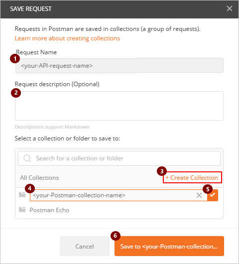

# Describe custom APIs and custom connectors with Postman

To make developing [custom APIs](../logic-apps/logic-apps-create-api-app.md) 
and [custom connectors](../logic-apps/custom-connector-overview.md) 
faster and easier, you can create [Postman](https://www.getpostman.com/) collections, 
rather OpenAPI documents, for describing your APIs and connectors. 
Postman collections help you organize and group related API requests. 
For example, you can use Postman when creating connectors 
for Azure Logic Apps, Microsoft Flow, or Microsoft PowerApps. 

This tutorial shows how to create a [Postman collection](https://www.getpostman.com/docs/postman/collections/creating_collections) 
by using the [Detect Language API](https://westus.dev.cognitive.microsoft.com/docs/services/TextAnalytics.V2.0/operations/56f30ceeeda5650db055a3c7) 
in [Azure Cognitive Services Text Analytics](https://azure.microsoft.com/services/cognitive-services/text-analytics/) 
as the example. This API identifies the language, sentiment, 
and key phrases in text that you pass to the API.

## Prerequisites

* If you're new to Postman, 
[install the Postman app](https://www.getpostman.com/apps).

* An Azure subscription. If you don't have a subscription, 
you can start with a [free Azure account](https://azure.microsoft.com/free/). 
Otherwise, sign up for a [Pay-As-You-Go subscription](https://azure.microsoft.com/pricing/purchase-options/).

* If you have an Azure subscription, sign up for the Text Analytics APIs by completing 
[Task 1 here](../cognitive-services/text-analytics/quick-start.md). 

## Create a Postman collection

Before you can create a collection, 
create an HTTP request for your API endpoint. 

### Create an HTTP request for your API

1. Open the Postman app so that you can create an 
[HTTP request](https://www.getpostman.com/docs/postman/sending_api_requests/requests) 
for your API endpoint. For more information, see the Postman's 
[Requests documentation](https://www.getpostman.com/docs/postman/sending_api_requests/requests).

   1. On the **Builder** tab, select the HTTP method, 
   enter the request URL for your API endpoint, 
   and select an authorization protocol, if any. 
   When you're ready, choose **Params**.

      For this tutorial, you can use these settings in this example:

      

      | Parameter | Suggested value | 
      | :-------- | :-------------- | 
      | **HTTP method** | POST | 
      | **Request URL** | `https://westus.api.cognitive.microsoft.com/text/analytics/v2.0/languages` | | 
      | **Authorization** | "No Auth" | | 
      ||| 

   2. Now you can enter key-value pairs to use as query or path parameters 
   in the request URL. Postman combines these items together into a query string.
   When you're done, choose **Headers**.

      

      | Parameter | Suggested value | 
      | :-------- | :-------------- | 
      | **Params** | **Key**: "numberOfLanguagesToDetect" </br>**Value**: "1" | 
      ||| 

   3. Enter key-value pairs for the request header. 
   For the header name, enter any string you want. For common HTTP headers, 
   you can select from the dropdown list. When you're done, choose **Body**. 
   
      

      | Parameter | Value | 
      | :-------- | :---- | 
      | **Headers** | **Key**: "Ocp-Apim-Subscription-Key" </br>**Value**: *your-API-subscription-key*, which you can find in your Cognitive Services account <p>**Key**: "Content-Type" </br> **Value**: "application/json" | 
      ||| 

   4. Enter content that you want to send in the request body. 
   To check that the request works by getting a response back, choose **Send**. 
   
      

      | Parameter | Suggested value | 
      |:--------|:----|    
      | **Body** |```{"documents": [{ "id": "1", "text": "Hello World"}]}``` | | 
      ||| 

      The response field contains the full response from the API, 
      including the result or an error, if any occurred.

      

2. After you've checked that your request works, 
save your request to a Postman collection. 

   1. Under **Save Request**, provide a **Request Name** 
   and optionally, a **Request description**. 

      > [!NOTE]
      > Your custom connector uses these values later. 
      > So, make sure that you provide the same values that 
      > you later use for your custom API's operation summary and description.

   2. Choose **+ Create Collection** and provide a collection name. 
   Choose the check mark, which creates a collection folder, 
   then choose **Save to *your-Postman-collection-name***.

      

### Save the request response

After you've saved your request, you can save the response. 
That way, the response appears as an example when you load the request later.

1. Above the response window, choose **Save Response**. 

   

   Custom connectors support only one response per request. 
   If you save multiple responses per request, only the first one is used.

2. Provide a name for your example, and choose **Save Example**.

3. Continue building your Postman collection with 
any additional requests and responses.

### Export your Postman collection

1. When you're done, export your collection to a JSON file.

   

2. Choose the **Collection v1** export format, 
and browse to the location where you want to save the JSON file.

   
   
You can now use this Postman collection for creating custom APIs and connectors. 
After you export the collection, you can import the JSON file into Logic Apps, 
Flow, or PowerApps.

> [!IMPORTANT]
> If you create a custom connector from a Postman collection, 
> make sure that you remove the `Content-type` header from actions and triggers. 
> The target service, for example, Flow, automatically adds this header. 
> Also, remove authentication headers that you defined in the `Security` section, 
> from actions and triggers.

## Next steps

* [Logic Apps: Register custom connectors](../logic-apps/logic-apps-custom-connector-register.md)
* [Flow: Register your connector](https://ms.flow.microsoft.com/documentation/register-custom-api/#register-your-custom-connector)
* [PowerApps: Register your connector](https://powerapps.microsoft.com/tutorials/register-custom-api/#register-your-custom-connector)


