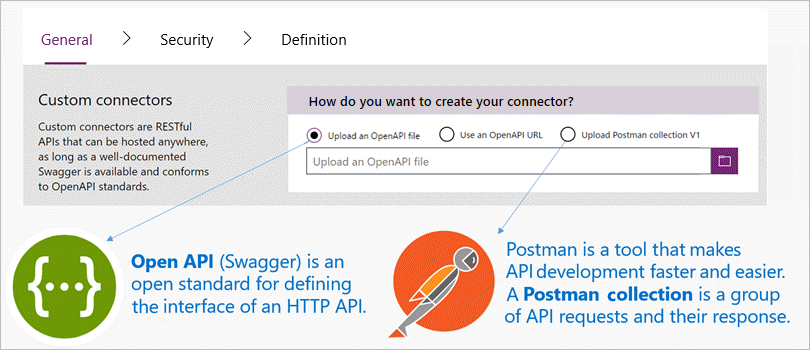
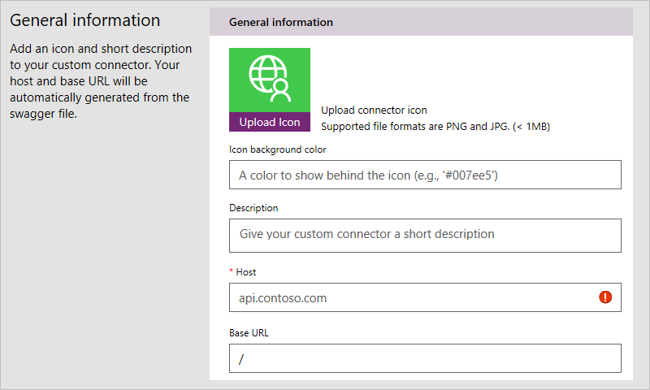
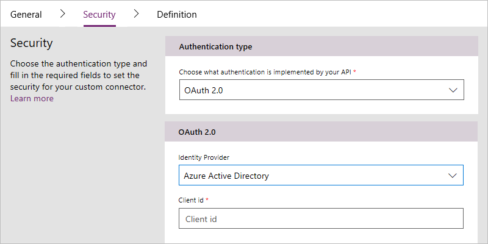
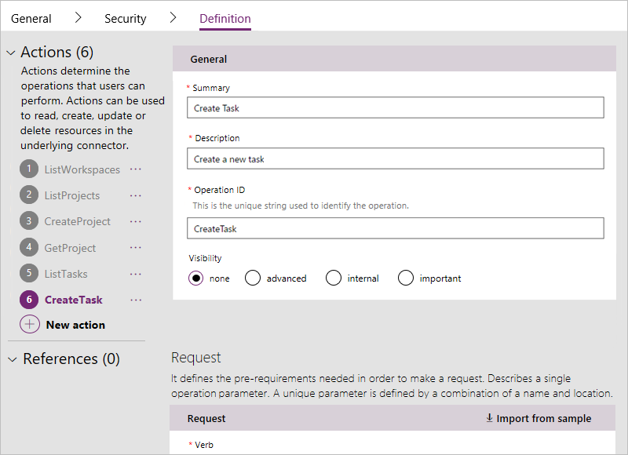

# Custom connectors overview

Azure Logic Apps, Microsoft Flow, and Microsoft PowerApps  
help you build workflows or apps without code. 
But sometimes, you might need to extend extend these services' capabilites, 
so that they can support and extend your customers' business and productivity scenarios. 
For these use cases, you can build *custom connectors* so users can connect to your service or product, 
and build workflows or apps that integrate their data and business processes. 
Connectors expand the integrations, reach, discoverability, and use for your service or product, 
which can help increase and accelerate customer adoption.

This overview outlines the high-level general steps for creating, 
registering, and optionally certifying, custom connectors 
that work with these services:

* [Azure Logic Apps](https://docs.microsoft.com/azure/logic-apps/), 
* [Microsoft Flow](https://flow.microsoft.com), 
* [Microsoft PowerApps](https://powerapps.microsoft.com) 

## Build your API

Technically, a connector is a wrapper around a REST API 
that's based on an OpenAPI (formerly Swagger) specification 
and lets your underlying service talk to Logic Apps, Flow, or PowerApps. 
So first, you need a fully functioning API before creating your custom connector. 

Registered, but not certified, custom connectors work like 
Microsoft-managed connectors, but are only visible and available 
to the connector's author and users who have the same 
Azure Active Directory tenant and Azure subscription 
for apps in the region where that connector is deployed.

For example, this tutorial shows 
[how to build a custom connector from a Web API](../logic-apps/custom-connector-build-web-api-app-tutorial.md).

## Describe your API

To describe your API's interface and operations, 
use the [OpenAPI specification](https://swagger.io/). 
You can start by building with an existing OpenAPI file, 
or you can import a [Postman collection](https://www.getpostman.com/docs/collections), 
which automatically generates the OpenAPI file for you.

### Register your custom connector

The registration process helps Logic Apps, Flow, or PowerApps understand 
your API's characteristics, including the required authentication, 
supported operations, and the parameters and outputs for each operation. 
When you start the registration wizard, you can provide either an 
OpenAPI file or a Postman collection, which automatically populates the 
metadata fields in the wizard. You can edit these fields' values at any time.

### Provide connector details

To identify your connector, add an icon and description. 

### Choose the authentication type for your connector

To make sure that user identities flow appropriately between 
your service and any clients, select the authentication type 
that your service supports. Then provide additional 
details for that authentication type.

Learn [how to secure your APIs](../logic-apps/custom-connector-security-authentication-overview.md) 
and [how to choose authentication](../logic-apps/logic-apps-custom-connector-register.md) for your connector.

### Define triggers and actions

To describe the triggers and actions that users can 
use in their flows, you can edit your connector's schema 
and response for existing operations, or add new operations.
You can specify each operation's properties so that you can 
control your connector's end-user experience. 

To learn more about the different operation types:

* [Triggers](customapi-webhooks.md) (not available for PowerApps)
* [Actions](register-custom-api.md)

Learn [how to add triggers and actions for connectors](../logic-apps/logic-apps-custom-connector-register.md). 
For advanced connector functionality in Logic Apps and Microsoft Flow, 
see [OpenAPI extensions for connectors](**NEED LINK**). 

To request features that aren't available in the wizard, 
please contact [condevhelp@microsoft.com](mailto:condevhelp@microsoft.com).

## Submit your connector for Microsoft certification

To optionally share your connector with all users in Logic Apps, Flow, 
and PowerApps, submit the connector for Microsoft certification. 
This process reviews and validates your connector's functionality for Logic Apps, 
Flow, and PowerApps, and checks for technical and content compliance 
before Microsoft can publish your connector.

Learn more about the [submission process](../logic-apps/custom-connector-submit-certification.md) 
for certifying and publishing your connector.

## Get support

For support with onboarding and development, please email 
[condevhelp@microsoft.com](mailto:condevhelp@microsoft.com). 
Microsoft actively monitors and manages this account, 
routing developer questions and incidents to the appropriate team.

## Next steps

* [Workflow: Create custom connectors](../logic-apps/custom-connector-overview-workflow.md)
