# Export flows from Power Automate and deploy to Azure Logic Apps

To extend and expand your flow's capabilities, you can migrate that flow from [Power Automate](https://flow.microsoft.com) to [Azure Logic Apps](../logic-apps/logic-apps-overview.md). You can export your flow as an Azure Resource Manager template for a logic app, deploy that logic app template to an Azure resource group, and then open that logic app in the Logic App Designer.

> [!NOTE]
> Not all Power Automate connectors are available in Azure Logic Apps. 
> You can import flows that have [equivalent connectors](../connectors/apis-list.md) 
> in Azure Logic Apps. For example, the Button trigger, the Approval connector, 
> and Notification connector are specific to Power Automate.
>
> OpenAPI-based flows exported from Power Automate are currently not supported for deployment as logic app templates. 

## Prerequisites

* An Azure subscription. If you don't have an Azure subscription, [sign up for a free Azure account](https://azure.microsoft.com/free/).

* The flow that you want to export from Power Automate

## Export a flow

1. Sign in to [Power Automate](https://flow.microsoft.com), and select **My flows**. Find and select your flow. On the toolbar, select the ellipses (**...**) button. Select **Export** > **Logic Apps template (.json)**.

   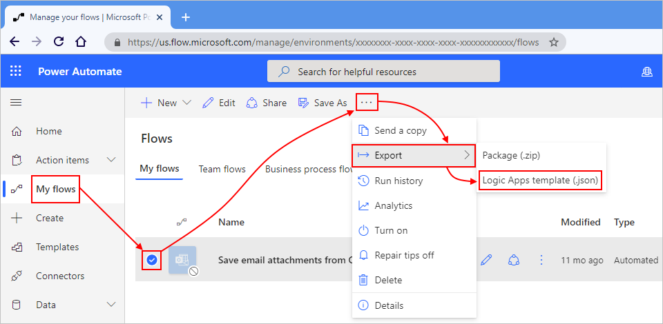

1. Save your template to the location that you want.

For more information, see [Grow up to Azure Logic Apps](https://flow.microsoft.com/blog/grow-up-to-logic-apps/).

## Deploy template by using the Azure portal

1. Sign in the [Azure portal](https://portal.azure.com) with your Azure account.

1. On the main Azure menu, select **Create a resource**. In the search box, enter "template deployment". Select **Template deployment (deploy using custom templates)**, and then select **Create**.

   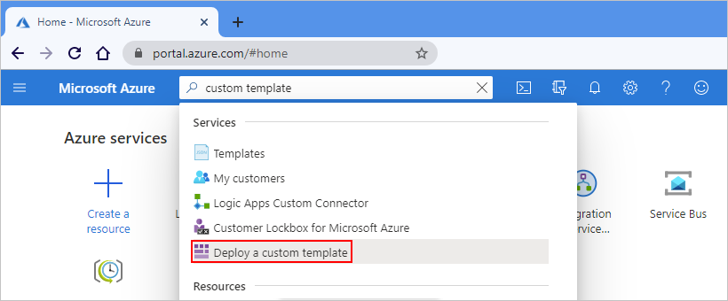

1. Under **Custom deployment**, select **Build your own template in the editor**.

   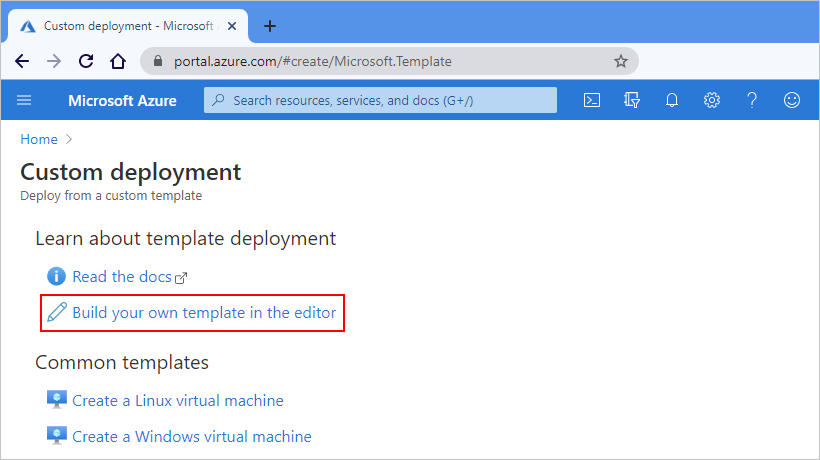

1. From the **Edit template** toolbar, select **Load file**. Find and select the JSON template that you exported from Power Automate, and select **Open**.

   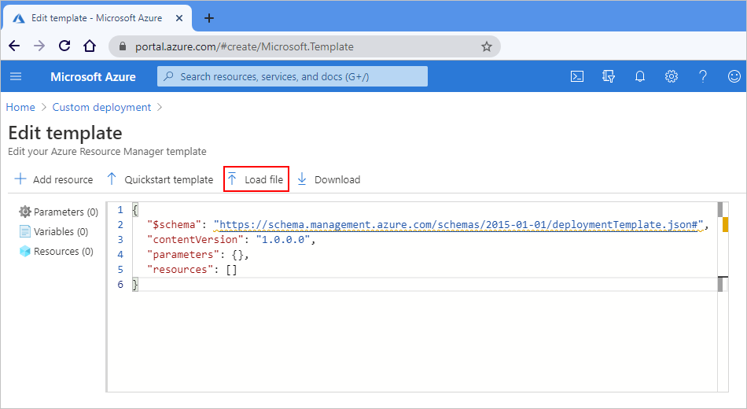

1. After the editor shows the JSON, parameters, and resources in your template, select **Save**.
  
   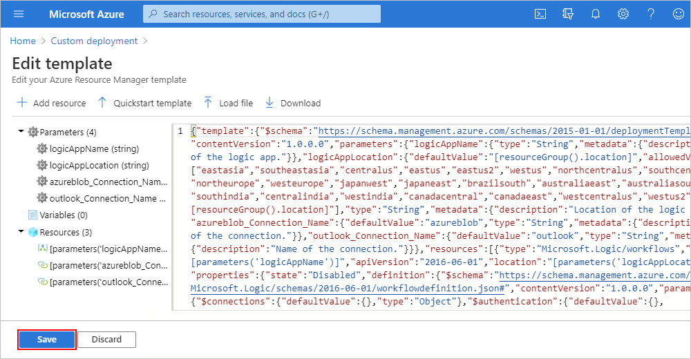

1. Now specify these input parameters for the template:

   * Azure subscription to use for billing
   * Azure resource group
   * Location for the Azure resource group
   * Name for the logic app resource
   * Location for the logic app resource, if different from the Azure resource group
   * The name for any previously created connections that the logic app can reuse

      If you're creating your first logic app, all connections are created as new, so you can accept the default names. Otherwise, you can specify the names for previously created connections, which you can use across multiple logic apps.

   After you provide this information for the template, review and agree to the Azure Marketplace Terms and Conditions for creating the necessary Azure resources and billing your Azure subscription accordingly, and then select **Purchase**.
  
   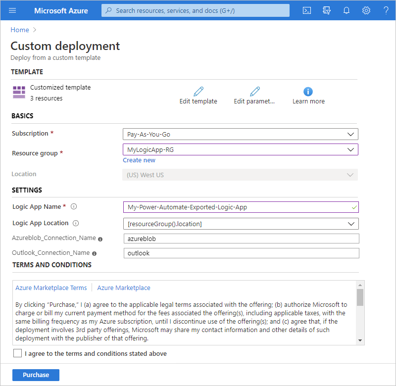

   Azure deploys your template as a logic app to your specified resource group. All logic apps that you migrate from Power Automate are deployed in a disabled state.

1. Before you activate your logic app, authorize any new connections by following these steps:

   1. Open the logic app that you created. On the logic app's menu, select **Logic app designer**.

      Each connection that requires authorization shows a warning icon:

      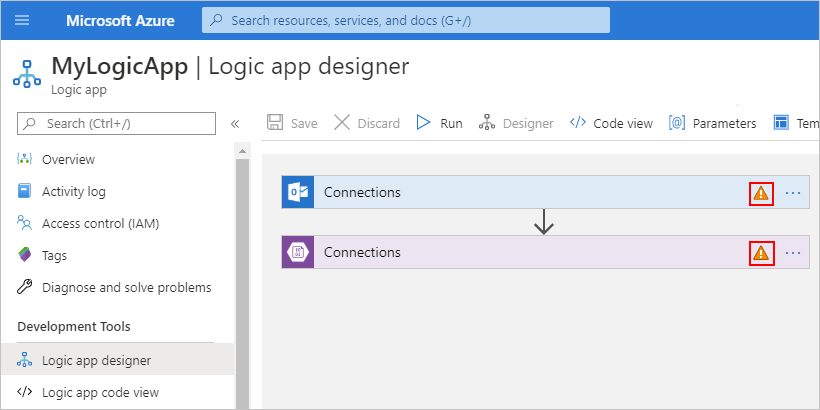

   1. For each step that requires an authorized connection, expand that step, and select **Add new**.

      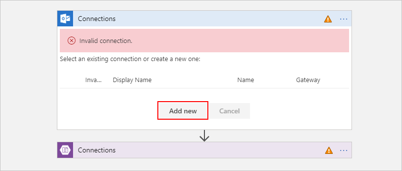

   1. Sign in to each service or provide the necessary credentials to authorize the connection.

1. Save your logic app. When you're ready to activate your logic app, on the logic app's menu, select **Overview**, and then select **Enable**.

   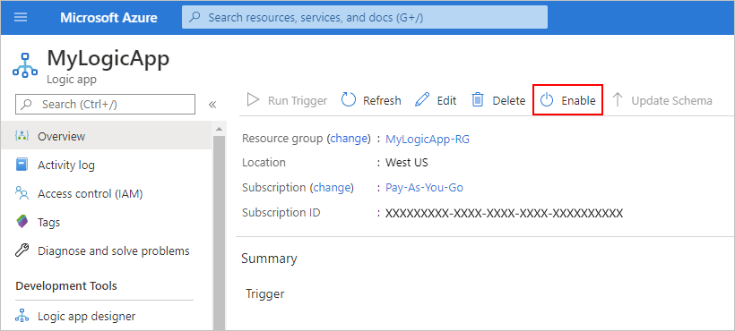

1. To avoid running duplicate workflows, make sure that you deactivate or delete your original flow.

## Deploy template by using Visual Studio

If you've set up Visual Studio with the [prerequisites](../logic-apps/quickstart-create-logic-apps-with-visual-studio.md#prerequisites) for creating logic apps, you can deploy your exported template from Visual Studio to Azure Logic Apps.

1. In Visual Studio, open the template file that you exported from Power Automate.

1. In Visual Studio, create an Azure Resource Group project and select the **Logic App** template by following the steps in [Quickstart: Create automated tasks, processes, and workflows with Azure Logic Apps - Visual Studio](../logic-apps/quickstart-create-logic-apps-with-visual-studio.md), for example:

   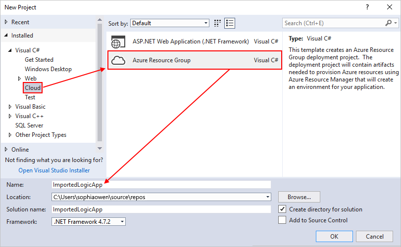

1. From Solution Explorer, open the **LogicApp.json** file, if the file isn't already open.

1. Copy the contents from the exported template and overwrite the contents in the **LogicApp.json** file.

1. Before you deploy your logic app, authorize any new connections by following these steps:

   1. Open the **LogicApp.json** shortcut menu, and then select **Open With Logic App Designer**.

      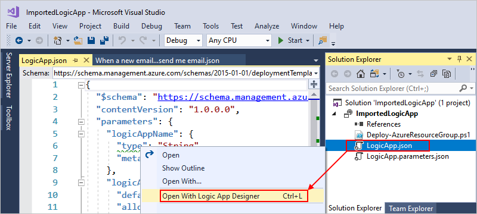

   1. If prompted, select the Azure subscription and resource group that you want to use for deploying your logic app.

      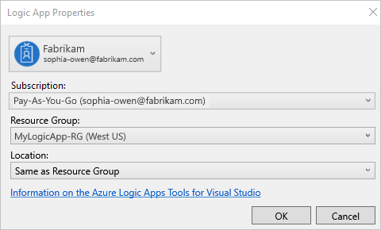

      After your logic app appears in the designer, any connections that require authorization show warning icons:

      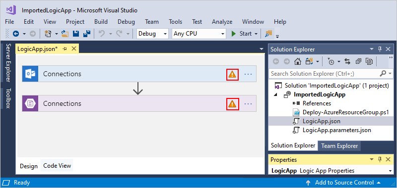

   1. For each step that requires an authorized connection, expand that step, and select **Add new**.

      

   1. Sign in to each service or provide the necessary credentials to authorize the connection.

   1. Save your solution before you deploy the logic app.

1. In Solution Explorer, open the project shortcut menu, and select **Deploy** > **New**. If prompted, sign in with your Azure account.

1. When prompted, confirm the Azure subscription, Azure resource group, and any other settings that you want to use for deployment, such as a [parameters file](../azure-resource-manager/resource-group-template-deploy.md#parameter-files) to use for passing template parameter values, and then select **Deploy**.

   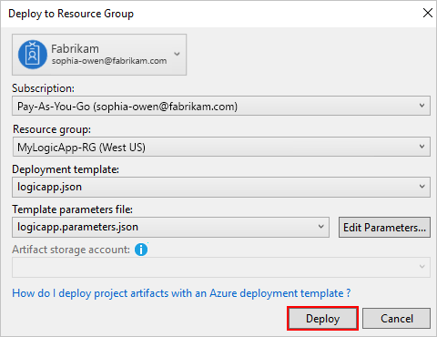

1. If the **Edit Parameters** box appears, provide the name for your logic app resource in Azure, and select **Save**.  

   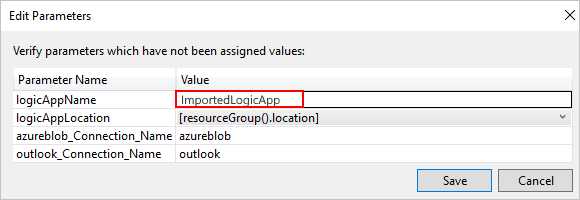

   When deployment starts, your app's deployment status appears in the Visual Studio **Output** window. If the status doesn't appear, open the **Show output from** list, and select your Azure resource group. For example:

   

   If any connections in your logic app need input from you, a PowerShell window opens in the background and prompts for any necessary passwords or secret keys. After you enter this information, deployment continues.

   

   After deployment finishes, your logic app is published but isn't activated in the Azure portal.

1. When you're ready to activate your logic app in the Azure portal, find and open your logic app in the Logic App Designer. On the logic app's menu, select **Overview**, and then select **Enable**.

1. To avoid running duplicate workflows, make sure that you deactivate or delete your original flow.

For more information about these deployment steps, see [Quickstart: Create automated tasks, processes, and workflows with Azure Logic Apps - Visual Studio](../logic-apps/quickstart-create-logic-apps-with-visual-studio.md#deploy-to-Azure)

## Next steps

* Learn more about [Connectors for Azure Logic Apps](../connectors/apis-list.md)
* Learn more about [Azure Logic Apps](../logic-apps/logic-apps-overview.md)
