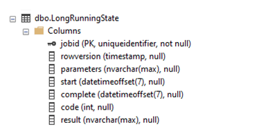

# Handle stored procedure execution timeout for the SQL connector in Azure Logic Apps

When your logic app works with result sets so large that the [SQL connector](connectors-create-api-sqlazure.md) doesn't return all the results at the same time, or you want better control over the size and structure for your result sets, you can create a [stored procedure](/sql/relational-databases/stored-procedures/stored-procedures-database-engine) that organizes the results the way that you want. The SQL connector provides many backend features that you can access by using Azure Logic Apps so that you can more easily automate business tasks that work with SQL database tables.

For example, when getting or inserting multiple rows, your logic app can iterate through these rows by using an [**Until** loop](../logic-apps/logic-apps-control-flow-loops.md#until-loop) within these [limits](../logic-apps/logic-apps-limits-and-config.md). However, when your logic app has to work with record sets so large, for example, thousands or millions of rows, that you want to minimize the costs resulting from calls to the database. For more information, see [Handle bulk data using the SQL connector](../connectors/connectors-create-api-sqlazure.md#handle-bulk-data).

## Timeout limit on stored procedure execution

The SQL connector has a stored procedure timeout limit that's [less than 2-minutes](/connectors/sql/#known-issues-and-limitations). Some stored procedures might take longer than this limit to run and finish, generating a `504 TIMEOUT` error. Actually, some long-running processes are coded as stored procedures explicitly for this purpose. Due to the timeout limit, calling these procedures from Azure Logic Apps might create problems. Although the SQL connector doesn't natively support an asynchronous mode, you can simulate this mode by using a SQL completion trigger, native SQL pass-through query, a state table, and server-side jobs by using the [Azure Elastic Job Agent](../azure-sql/database/elastic-jobs-overview.md) for [Azure SQL Database](../azure-sql/database/sql-database-paas-overview.md). For [SQL Server on premises](/sql/sql-server/sql-server-technical-documentation) and [Azure SQL Managed Instance](../azure-sql/managed-instance/sql-managed-instance-paas-overview.md), you can use the [SQL Server Agent](/sql/ssms/agent/sql-server-agent).

For example, suppose that you have the following long-running stored procedure, which takes longer than the timeout limit to finish running. If you run this stored procedure from a logic app by using the SQL connector, you get an `HTTP 504 Gateway Timeout` error as the result.

```sql
CREATE PROCEDURE [dbo].[WaitForIt]
   @delay char(8) = '00:03:00'
AS
BEGIN
   SET NOCOUNT ON;
   WAITFOR DELAY @delay
END
```

Rather than directly call the stored procedure, you can run the procedure asynchronously in the background by using a job agent. You can store the inputs and outputs in a state table that you can then interact with by using a trigger in your logic app. If you don't need the inputs and outputs, or if you're already writing the results to a table in the stored procedure, you can simplify this approach.

> [!IMPORTANT]
> Make sure that your stored procedure can run multiple times without affecting the results. 
> If the asynchronous processing fails or times out, the job agent might have to retry your 
> stored procedure multiple times. To avoid duplicating output, before you create any objects, 
> make sure that you check for their existence.

<a name="azure-sql-database"></a>

## Job agent for Azure SQL Database

To create a job that can run the stored procedure for [Azure SQL Database](../azure-sql/database/sql-database-paas-overview.md), you can use the [Azure Elastic Job Agent](../azure-sql/database/elastic-jobs-overview.md). Create this job agent in the Azure portal, which adds several stored procedures to a database that the agent uses, also known as the *agent database*. You can then create a job that runs your stored procedure in the target database and captures the output when finished. You need to set up permissions, groups, and targets as described by the [full documentation for the Azure Elastic Job Agent](../azure-sql/database/elastic-jobs-overview.md).

Also, you also need to create certain supporting tables and procedures in the agent database requires certain supporting tables and procedures that you'll create in the following steps.

### Create state table for registering stored procedure parameters

SQL Agent Jobs doesn't accept input parameters for calling stored procedures, so instead, create a state table 

store the inputs as a state table in the target database.

create a state table that registers the parameters you use for calling your stored procedure.

All agent job steps run against the target database, but job stored procedures run against the agent database.

```sql
CREATE TABLE [dbo].[LongRunningState](
   [jobid] [uniqueidentifier] NOT NULL,
   [rowversion] [timestamp] NULL,
   [parameters] [nvarchar](max) NULL,
   [start] [datetimeoffset](7) NULL,
   [complete] [datetimeoffset](7) NULL,
   [code] [int] NULL,
   [result] [nvarchar](max) NULL,
   CONSTRAINT [PK_LongRunningState] PRIMARY KEY CLUSTERED
      (   [jobid] ASC
      )WITH (STATISTICS_NORECOMPUTE = OFF, IGNORE_DUP_KEY = OFF) ON [PRIMARY]
      ) ON [PRIMARY] TEXTIMAGE_ON [PRIMARY]
```

Here's how the resulting table looks in [SQL Server Management Studio (SMSS)](/sql/ssms/download-sql-server-management-studio-ssms):



To ensure good performance and that the agent job can locate the associated record, the table uses the job execution ID as the primary key. If you want, you add individual columns for input parameters. 

<a name="sql-on-premises-or-managed-instance"></a>

## Job agent for SQL Server or Azure SQL Managed Instance

For [SQL Server on premises](/sql/sql-server/sql-server-technical-documentation) and [Azure SQL Managed Instance](../azure-sql/managed-instance/sql-managed-instance-paas-overview.md), you can use the [SQL Server Agent](/sql/ssms/agent/sql-server-agent). Although some management details differ, the fundamental steps remain the same.

## Next steps

