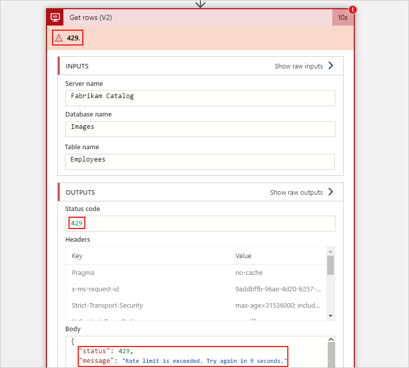
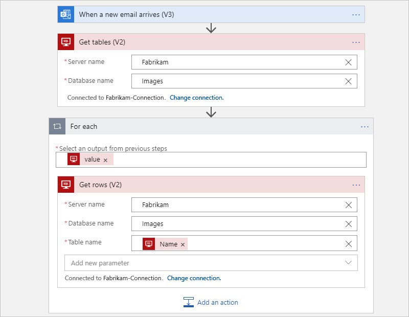
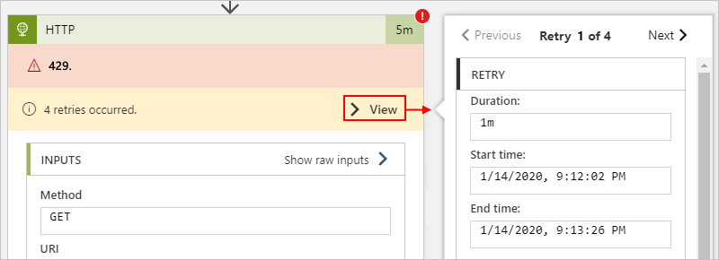
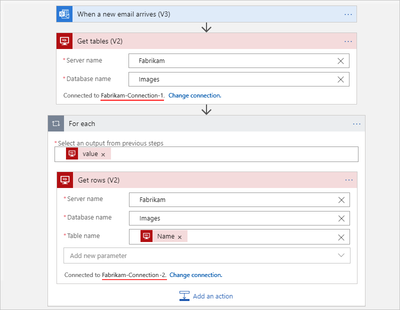

# Handle throttling problems (429 - "Too many requests" errors) in Azure Logic Apps

In [Azure Logic Apps](../logic-apps/logic-apps-overview.md), your logic app returns an ["HTTP 429 Too many requests" error](https://developer.mozilla.org/docs/Web/HTTP/Status/429) when experiencing throttling, which happens when the number of requests exceed the rate at which the destination can handle over a specific amount of time. Throttling can create problems such as delayed data processing, reduced performance speed, and errors such as exceeding the specified retry policy.

Here are some common types of throttling that your logic app might experience:

* [Logic app](#logic-app-throttling)
* [Connector](#connector-throttling)
* [Destination service or system](#destination-throttling)

## Logic app throttling

The Azure Logic Apps service has its own [throughput limits](../logic-apps/logic-apps-limits-and-config.md#throughput-limits). So, if your logic app exceeds these limits, your logic app resource gets throttled, not just a specific instance or run.

To find throttling events at this level, check your logic app's **Metrics** pane in the Azure portal.

1. In the [Azure portal](https://portal.azure.com), open your logic app in the Logic App Designer.

1. On the logic app menu, under **Monitoring**, select **Metrics**.

1. Under **Chart Title**, select **Add Metric** so that you add another metric to the existing.

1. In the first metric bar, from the **METRIC** list, select **Action Throttled Events**. In the second metric bar, from the **METRIC** list, select **Trigger Throttled Events**.

To handle throttling at this level, you have these options:

* Limit the number of logic app instances that can run at the same time.

  By default, if your logic app's trigger condition is met more than once at the same time, multiple trigger instances for your logic app run concurrently or *in parallel*. This behavior means that each trigger instance fires before the preceding workflow instance finishes running.

  Although the default number of trigger instances that can concurrently run is [unlimited](../logic-apps/logic-apps-limits-and-config.md#concurrency-looping-and-debatching-limits), you can limit this number by [turning on the trigger's concurrency setting](../logic-apps/logic-apps-workflow-actions-triggers.md#change-trigger-concurrency), and if necessary, select a limit other than the default value.

* Enable high throughput mode.

  A logic app has a [default limit for the number of actions that can run over a 5-minute rolling interval](../logic-apps/logic-apps-limits-and-config.md#throughput-limits). To raise this limit to the maximum number of actions, turn on [high throughput mode](../logic-apps/logic-apps-workflow-actions-triggers.md#run-high-throughput-mode) on your logic app.

* Disable array debatching ("split on") behavior in triggers.

  If a trigger returns an array for the remaining workflow actions to process, the trigger's [**Split On** setting](../logic-apps/logic-apps-workflow-actions-triggers.md#split-on-debatch) splits up the array items and starts a workflow instance for each array item, effectively triggering multiple concurrent runs up to the [**Split On** limit](../logic-apps/logic-apps-limits-and-config.md#concurrency-looping-and-debatching-limits). To control throttling, turn off the **Split On** behavior and have your logic app process the entire array with a single call, rather than handle a single item per call.

* Refactor actions into smaller logic apps.

  As mentioned earlier, a logic app is limited to a [default number of actions that can run over a 5-minute period](../logic-apps/logic-apps-limits-and-config.md#throughput-limits). Although you can increase this limit by enabling [high throughput mode](../logic-apps/logic-apps-workflow-actions-triggers.md#run-high-throughput-mode), you might also consider whether you want to break down your logic app's actions into smaller logic apps so that the number of actions that run in each logic app remains under the limit. That way, you reduce the burden on a single logic app resource and distribute the load across multiple logic apps. This solution works better for actions that handle large data sets or spin up so many concurrently running actions, loop iterations, or actions inside each loop iteration that they exceed action execution limit.

  For example, this logic app does all the work to get tables from a SQL Server database and gets the rows from each table. The **For each** loop concurrently iterates through each table so that the **Get rows** action returns the rows for each table. Based on the amounts of data in those tables, these actions might exceed the limit on action executions.

  

  After refactoring, the logic app is now a parent and child logic app. The parent gets the tables from SQL Server and then calls a child logic app for each table to get the rows:

  

  Here's the child logic app that's called by the parent logic app to get the rows for each table:

  

## Connector throttling

Each connector has its own throttling limits, which you can find on the connector's technical reference page. For example, the [Azure Service Bus connector](https://docs.microsoft.com/connectors/servicebus/) has a throttling limit that permits up to 6,000 calls per minute, while the SQL Server connector has [throttling limits that vary based on the operation type](https://docs.microsoft.com/connectors/sql/).

Some triggers and actions, such as HTTP, have a ["retry policy"](../logic-apps/logic-apps-exception-handling.md#retry-policies) that you can customize based on the [retry policy limits](../logic-apps/logic-apps-limits-and-config.md#retry-policy-limits) to implement exception handling. This policy specifies whether and how often a trigger or action retries a request when the original request fails or times out and results in a 408, 429, or 5xx response. So, when throttling starts and returns a 429 error, Logic Apps follows the retry policy where supported.

To learn whether a trigger or action supports retry policies, check the trigger or action's settings. To view a trigger or action's retry attempts, go to your logic app's runs history, select the run that you want to review, and expand that trigger or action to view details about inputs, outputs, and any retries, for example:

Although the retry history provides error information, you might have trouble differentiating between connector throttling and [destination throttling](#destination-throttling). In this case, you might have to review the response's details or perform some throttling interval calculations to identify the source.

For logic apps in the public, multi-tenant Azure Logic Apps service, throttling happens at the *connection* level. So, for example, for logic apps that run in an [integration service environment (ISE)](../logic-apps/connect-virtual-network-vnet-isolated-environment-overview.md), throttling still happens for non-ISE connections because they run in the public, multi-tenant Logic Apps service. However, ISE connections, which are created by ISE connectors, aren't throttled because they run in your ISE.

To handle throttling at this level, you have these options:

* Set up multiple connections for a single action.

  Consider whether you can distribute the workload by spreading an action's requests across multiple connections to the same service or system using the same credentials.

  For example, suppose your logic app gets the tables from a SQL Server database and for each table, gets the rows from each table. Based on the number of rows that you have to process, you use multiple but separate connections to get those rows. After the first branch reaches the limit, the second branch can continue the work.

  

* Set up a different connection for each action.

  Consider whether you can distribute the workload by spreading each action's requests over their own connection, even when actions connect to the same service or system and use the same credentials.

  For example, suppose your logic app gets the tables from a SQL Server database and gets each row in each table. You can use separate connections so that the getting the tables use one connection, while the getting each row uses another connection.

  

## Destination service or system throttling

While a connector has its own throttling limits, the destination service or system that's called by the connector might also have throttling limits. For example, some APIs in Microsoft Exchange Server have stricter throttling limits than the Office 365 Outlook connector.

By default, a logic app's instances and any loops or branches inside those instances, run *in parallel*. This behavior means that multiple instances can call the same endpoint at the same time. Each instance don't know about the other's existence, so attempts to retry failed actions can create [race conditions](https://en.wikipedia.org/wiki/Race_condition) where multiple calls try to run at same time, but to succeed, those calls must arrive at the destination service or system before throttling starts to happen.

For example, suppose you have an array that has 100 items. You use a "for each" loop to iterate through the array and turn on the loop's concurrency control so that you can restrict the number of parallel iterations to 20, which is the [default limit](../logic-apps/logic-apps-limits-and-config.md#concurrency-looping-and-debatching-limits). Inside that loop, an action inserts an item from the array into a SQL Server database, which permits only 15 calls per second. This scenario results in a throttling problem because a backlog of retries build up and never get to run.

This table describes the timeline for what happens in the loop when the action's retry interval is 1 second:

| Point in time | Number of actions that run | Number of actions that fail | Number of retries waiting |
|---------------|----------------------------|-----------------------------|---------------------------|
| T + 0 seconds | 20 inserts | 5 fail, due to SQL limit | 5 retries |
| T + 0.5 seconds | 15 inserts, due to previous 5 retries waiting | All 15 fail, due to previous SQL limit still in effect for another 0.5 seconds | 20 retries  (previous 5 + 15 new) |
| T + 1 second | 20 inserts | 5 fail plus previous 20 retries, due to SQL limit | 25 retries (previous 20 + 5 new)
|||||

To handle throttling at this level, you have these options:

* Create logic apps that handle single operations.

  Continuing with the example SQL Server scenario in this section, here are options for this solution:

  * Have a logic app that puts the array items into a queue, such as an [Azure Service Bus queue](../connectors/connectors-create-api-servicebus.md), and have another a logic app that performs only the insert operation for each item in that queue. That way, only one logic app instance runs at any specific time, which either completes the insert operation and moves on to the next item in the queue, or the instance gets 429 errors but doesn't attempt unproductive retries.

  * Create a parent logic app that calls a child or nested logic app for each action. That way, you have one parent logic app that controls the main workflow, a child logic app that iterates through the array items, and another child logic app that inserts the item.

    If the parent app has to call different child apps based on the parent's outcome, you can use a condition action or switch action to determine which child app to call.

* Set up batch processing.

  If the destination service supports batch operations, you can address throttling by processing items in groups or batches, rather than individually. To implement the batch processing solution, you create a "batch receiver" logic app and a "batch sender" logic app. The batch sender collects messages or items until your specified criteria is met, and then sends those messages or items in a single group. The batch receiver accepts that group and processes those messages or items. For more information, see [Batch process messages in groups](../logic-apps/logic-apps-batch-process-send-receive-messages.md).

* Use the webhook versions for triggers and actions, rather than the polling versions.

  When your logic app uses a webhook trigger or action, such as the [HTTP Webhook trigger](../connectors/connectors-native-webhook.md) or a connector's webhook version if available, your logic app *subscribes* to the destination service or system and waits until the specified event happens without having to periodically check for the event. If the destination service or system supports webhooks and provides a connector that has a webhook version, this option is better than using the polling version, which always runs on a specified frequency and interval, or recurrence.

  To identify webhook triggers and actions, confirm that they have the `ApiConnectionWebhook` type or that they don't require that you specify a recurrence. For more information, see [APIConnectionWebhook trigger](../logic-apps/logic-apps-workflow-actions-triggers.md#apiconnectionwebhook-trigger) and [APIConnectionWebhook action](../logic-apps/logic-apps-workflow-actions-triggers.md#apiconnectionwebhook-action).

## Next steps

* Learn more about [Logic Apps limits and configuration](../logic-apps/logic-apps-limits-and-config.md)