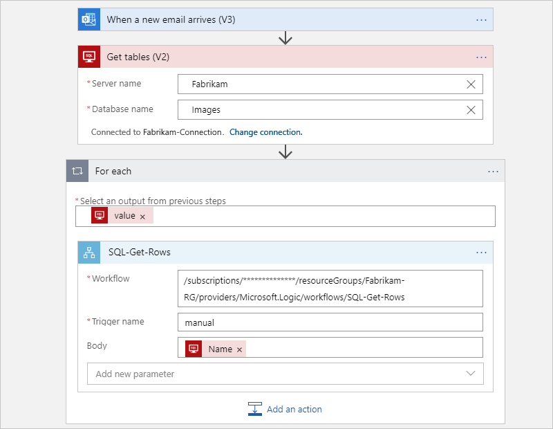
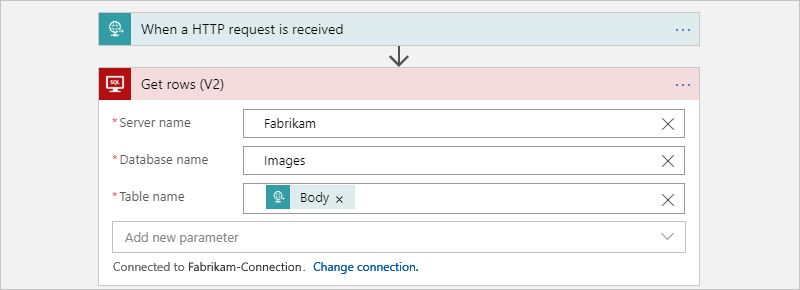
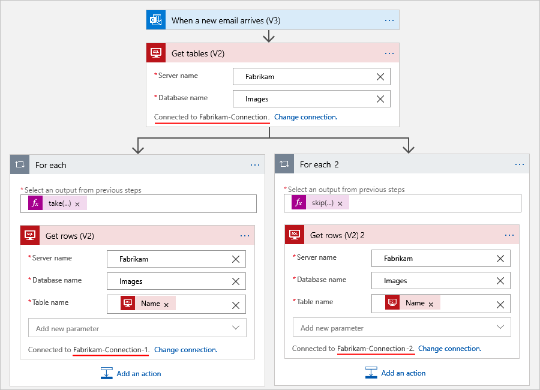

# Handle throttling problems (429 - "Too many requests" errors) in Azure Logic Apps

In [Azure Logic Apps](../logic-apps/logic-apps-overview.md), your logic app returns an ["HTTP 429 Too many requests" error](https://developer.mozilla.org/docs/Web/HTTP/Status/429) when experiencing throttling, which happens when the number of requests exceed a specific limit, such as an amount of time. Throttling can create problems such as delayed data processing and reduced performance speed.

Here are some common types of throttling that your logic app might experience:

* [Logic app](#logic-app-throttling)
* [Connector](#connector-throttling)
* [Destination service or system](#destination-throttling)

## Logic app throttling

The Azure Logic Apps service has its own [throughput limits](../logic-apps/logic-apps-limits-and-config.md#throughput-limits). If your logic app exceeds these limits, throttling happens at the logic app's level, not the logic app's run level, Azure subscription level, or Azure resource group level.

To find throttling errors at this level, check your logic app's **Metrics** pane in the Azure portal.

1. In the [Azure portal](https://portal.azure.com), open your logic app in the Logic App Designer.

1. On the logic app menu, under **Monitoring**, select **Metrics**.

1. Under **Chart Title**, select **Add Metric** so that you add another metric to the existing.

1. In the first metric bar, from the **METRIC** list, select **Action Throttled Events**. In the second metric bar, from the **METRIC** list, select **Trigger Throttled Events**.

To handle throttling at this level, you have these options:

* Limit the number of logic app instances that can run at the same time.

  By default, if your logic app's trigger condition is met more than once at the same time, multiple trigger instances for your logic app run concurrently or *in parallel*. This behavior means that each trigger instance fires before the preceding workflow instance finishes running.

  Although the default number of trigger instances that can concurrently run is [unlimited](../logic-apps/logic-apps-limits-and-config.md#concurrency-looping-and-debatching-limits), you can limit this number by [turning on the trigger's concurrency setting](../logic-apps/logic-apps-workflow-actions-triggers.md#change-trigger-concurrency), and if necessary, select a limit other than the default value.

* Enable high throughput mode.

  Your logic app has a default limit on the number of actions that can run in a 5-minute rolling interval. To raise this limit to the maximum number of actions, turn on [high throughput mode](../logic-apps/logic-apps-workflow-actions-triggers.md#run-high-throughput-mode) on your logic app.

* Refactor actions into multiple logic apps.

  Consider whether you can break down your logic app's actions into smaller logic apps so that each logic app runs a number of actions below the limit.

  Here's the first logic app that gets the tables and then calls another logic app for each table to get the rows:

  

  Here's the second logic app that's called by the first logic app to get the rows for each table:

  

## Connector throttling

Each connector has its own throttling limits, which you can find on the connector's technical reference page. For example, the [Azure Service Bus connector](https://docs.microsoft.com/connectors/servicebus/) has a throttling limit that permits up to 6,000 calls per minute, while the SQL Server connector has [throttling limits that vary based on the operation type](https://docs.microsoft.com/connectors/sql/).

To find throttling errors at this level, check the action's "retry" history. After a connector starts throttling and returns the HTTP 429 error, Logic Apps follows the connector's "retry policy" to attempt the action again based on the [retry policy limits](../logic-apps/logic-apps-limits-and-config.md#retry-policy-limits). This behavior means that you might have trouble differentiating between connector throttling and [destination throttling](#destination-throttling). In this case, you might have to review the response details or perform some calculations to identify the source.

For logic apps that run in the public, multi-tenant Azure Logic Apps service, versus an [integration service environment (ISE)](../logic-apps/connect-virtual-network-vnet-isolated-environment-overview.md), throttling happens at the *connection* level, not connector level.

To handle throttling at this level, you have these options:

* Distribute the work for a single action across multiple connections.

  Consider whether you can spread the workload for a single action across multiple connections that communicate with the same service or system and use the same credentials.

  For example, suppose your logic app gets the tables from a SQL Server database and for each table, gets the rows from each table. Based on the number of rows that you have to process, you use multiple but separate connections to get those rows. After the first branch reaches the limit, the second branch can continue the work.

  

* Distribute the work for each action across its own connection.

  Consider whether you can spread the workload for each action across its own connection, even when those connections communicate with same service or system and use the same credentials.

  For example, suppose your logic app gets the tables from a SQL Server database and gets each row in each table. You can use separate connections so that the getting the tables use one connection, while the getting each row uses another connection.

  

## Destination service or system throttling

While a connector has its own throttling limits, the destination service or system that's called by the connector might also have throttling limits. For example, some APIs in Microsoft Exchange Server have stricter throttling limits than the Office 365 Outlook connector.

By default, a logic app's instances and any loops or branches inside those instances, run *in parallel*. This behavior means that multiple instances can call the same endpoint at the same time. Each instance don't know about the other's existence, so attempts to retry failed actions can create [race conditions](https://en.wikipedia.org/wiki/Race_condition) where multiple calls try to run at same time, but to succeed, the destination service or system requires that those calls happen in a specific order.

For example, suppose you have an array that has 100 items. You use a "for each" loop to iterate through the array and turn on the loop's concurrency control so that you can restrict the number of parallel iterations to 20, which is the [default limit](../logic-apps/logic-apps-limits-and-config.md#concurrency-looping-and-debatching-limits). Inside that loop, an action inserts an item from the array into a SQL Server database, which permits only 15 calls per second. This scenario results in a throttling problem because a backlog of retries build up and never get to run.

This table describes the timeline for what happens in the loop when the action's retry interval is 1 second:

| Point in time | Number of actions that run | Number of actions that fail | Number of retries waiting |
|---------------|----------------------------|-----------------------------|---------------------------|
| T + 0 seconds | 20 inserts | 5 fail, due to SQL limit | 5 retries |
| T + 0.5 seconds | 15 inserts, due to previous 5 retries waiting | All 15 fail, due to previous SQL limit still in effect for another 0.5 seconds | 20 retries  (previous 5 + 15 new) |
| T + 1 second | 20 inserts | 5 fail plus previous 20 retries, due to SQL limit | 25 retries (previous 20 + 5 new)
|||||

To handle throttling at this level, you have these options:

* Set up another logic app as a "singleton" worker.

  Continuing with the example SQL Server scenario in this section, you have these options for this solution:

  * Queue up the array items and use another logic app that just performs the insert operation. That way, only one logic app instance runs at any specific time and either completes the insert operation and moves on to the next item in the queue. Or, the instance waits for 429 errors without unproductive retries.

  * Create a parent logic app that calls a child or nested logic app for each action. That way, you have one parent logic app that controls the main workflow, a child logic app that iterates through the array items, and another child logic app that inserts the item.

* Set up and run batch operations.

  If a connector supports batch operations, 

* Set up a webhook subscription.

## Next steps
