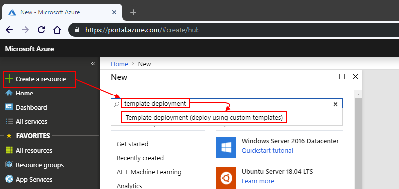
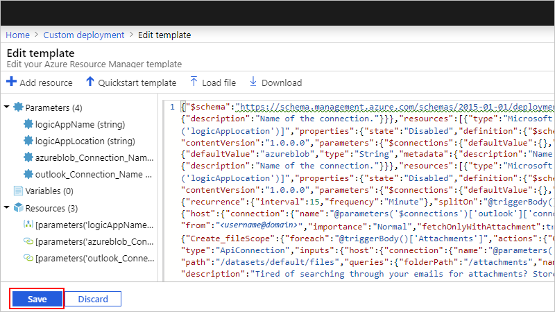

# Import flows into Azure Logic Apps from Microsoft Flow

To extend and expand the capabilities for a flow that you created with [Microsoft Flow](https://flow.microsoft.com), export that flow as a Azure Resource Manager template and open that template in Azure Logic Apps.

## Prerequisites

* An Azure subscription. If you don't have an Azure subscription, [sign up for a free Azure account](https://azure.microsoft.com/free/).

* 

## Export from Microsoft Flow

1. Sign in to [Microsoft Flow](https://flow.microsoft.com), and select **My flows**. Find and select your flow. On the toolbar, choose the ellipses (**...**) button. Select **Export** > **Logic Apps template (.json)**.

   

1. Save your template to the location that you want.

For more information, see [Grow up to Azure Logic Apps](https://flow.microsoft.com/blog/grow-up-to-logic-apps/).

## Import into Azure portal

1. Sign in the [Azure portal](https://portal.azure.com) with your Azure account.

1. On the main Azure menu, select **Create a resource**. In the search box, enter "template deployment". Select **Template deployment (deploy using custom templates)**, and choose **Create**.

   

1. From the actions list, select **Build your own template in the editor**.

   

1. From the **Edit template** toolbar, choose **Load file**. Find and select the JSON template that you exported from Microsoft Flow, and choose **Open**.

   

1. Edit the template so that you can deploy the flow as a logic app. In the template editor, after your template's contents appear, remove *only* the `template` attribute and enclosing curly braces and not the content within that attribute.

   

1. After the template editor correctly shows the parameters and resources in your template, choose **Save**.
  
   

1. Now specify these input parameters for the template, review and agree to the Azure Marketplace Terms and Conditions for creating the necessary Azure resources and billing your Azure subscription accordingly, and choose **Purchase**.

   * Azure subscription to use for billing
   * Azure resource group
   * Location for the Azure resource group
   * Name for the logic app resource
   * Location for the logic app resource, if different from the Azure resource group
   * The name for any previously created connections that the logic app can reuse

     If you're creating your first logic app, all connections are created as new, so you can accept the default names. Otherwise, you can specify the names for previously created connections, which you can use across multiple logic apps.
  
   

