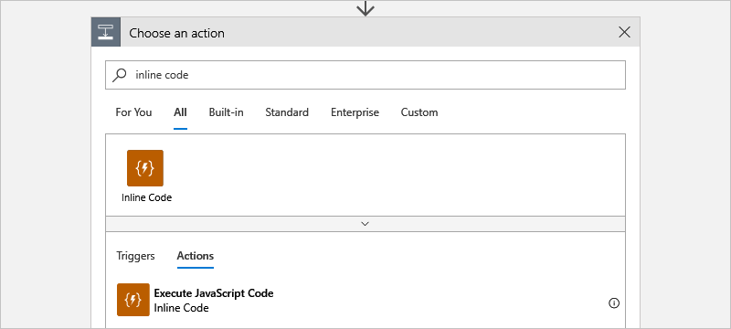
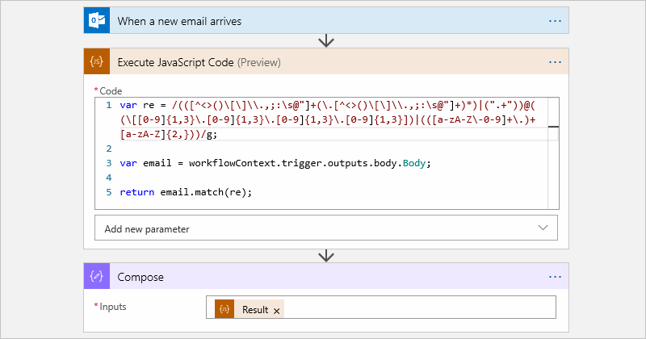

# Add and run code snippets by using inline code in Azure Logic Apps

When you want to run a piece of code inside your logic app, 
you can add the **Inline Code** action as a step in your logic 
app's workflow. This action works best when you want to run code 
that fits this scenario:

* Runs in JavaScript with later support for other languages.
* Finishes running in five seconds or fewer.
* Handles data within a specific limit.
* Uses the same libraries that Azure Functions supports.

This action returns just one output named **Result**, 
which you can use in subsequent actions in your logic app. 
For other scenarios where you want to create a function for your code, try 
[creating and calling an Azure function](../logic-apps/logic-apps-azure-functions.md) 
in your logic app. If you're new to Azure Logic Apps, see 
[What is Azure Logic Apps?](../logic-apps/logic-apps-overview.md)

## Prerequisites

* An Azure subscription. If you don't have an Azure subscription, 
<a href="https://azure.microsoft.com/free/" target="_blank">sign up for a free Azure account</a>.

* The logic app where you want run your code snippet. 
Your logic app must include at least a trigger 
before you can add the **Inline Code** action. 
If you don't have a logic app, see [Quickstart: Create your first logic app](../logic-apps/quickstart-create-first-logic-app-workflow.md). 

* An [integration account](../logic-apps/logic-apps-enterprise-integration-create-integration-account.md) 
that's linked to your logic app

## Add inline code

1. If you haven't already, in the [Azure portal](https://portal.azure.com), 
open your logic app in the Logic App Designer.

1. In the designer, follow either step to add the **Inline Code** action:

   * To add the action at the end of your workflow, choose **Next step**.

   * To add the action between existing steps, move your mouse pointer over 
   the arrow that connects those steps. Choose the plus sign (**+**), 
   and select **Add an action**.

1. Under **Choose an action** and the search box, 
choose **All** or **Built-in**.

1. In the search box, enter "inline code" as your filter. 
From the actions list, select this action: 
**Execute JavaScript Code**

   

1. In the **Code** editor, enter the code you want to run. 
To reference outputs from previous steps, 
you can select those values from the dynamic content list. 
You can also select outputs from previous 

   For example, this logic app triggers when a new email 
   arrives in an Office 365 Outlook account. The code 
   snippet extracts any email addresses from the email body. 
   The **Compose** action takes in the result and creates 
   a single output.

   

1. Optionally, you can reference outputs from the trigger 
and previous actions in your code by adding parameters. 
To add parameters, open the **Add new parameter** list, 
and select the parameters you want. For example:

   

   | Parameter | Description |
   |-----------|-------------|
   | **Actions** | Include an array with outputs from previous actions. See [Include action outputs](#action-outputs). |
   | **Trigger** | Include outputs from the trigger. See [Include trigger outputs](#trigger-outputs). |
   |||

1. When you're done, save your logic app.

### Include action outputs

If you select **Actions**, you're prompted for the action outputs that you want.

1. To add the first action, click in the **Actions Item - 1** box.

1. From the dynamic content list that opens, select the output you want.

   > [!NOTE]
   > The dynamic content list shows action outputs only if any are available.

1. To add another output, choose **Add new item**.

## Include trigger outputs

When you select **Triggers**, you're prompted whether to include trigger outputs.

1. From the **Trigger** list, select **Yes**.

## Next steps
