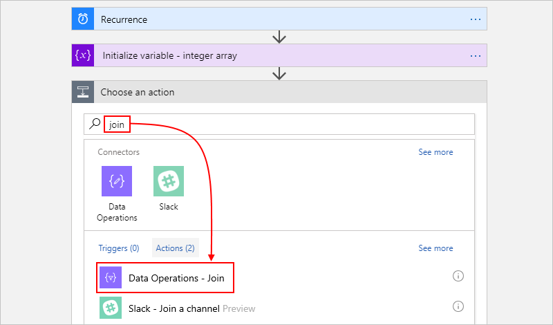
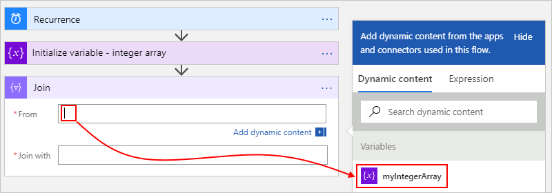

---
# required metadata
title: Change or manage data outputs and formats - Azure Logic Apps | Microsoft Docs
description: Convert, transform, and manage data outputs and formats in Azure Logic Apps
services: logic-apps
author: ecfan
manager: cfowler
ms.author: estfan
ms.topic: article
ms.date: 06/05/2018
ms.service: logic-apps

# optional metadata
ms.reviewer: klam, LADocs
ms.suite: integration
---

# Change or manage data outputs and formats in Azure Logic Apps

This article shows how you can perform various operations on data 
outputs from the triggers and actions in your logic apps. 
Azure Logic Apps provides these operations as built-in actions 
that you can use in your logic apps.

**Array actions** 

These actions help you work with data in arrays.

| Action | Description | 
|--------|-------------| 
| [**Filter array**](#filter-array-action) | Get the items from an array based on the specified filter or condition. | 
| [**Join**](#join-action) | Create a string from all the items in an array and separate each item with the specified character. | 
| [**Select**](#select-action) | Create an array from the specified properties for all the items in a different array. | 
||| 

**JSON actions**

These actions help you work with data in JavaScript Object Notation (JSON) format.

| Action | Description | 
|--------|-------------| 
| [**Compose**](#compose-action) | Create a JSON object from the specified inputs. | 
| [**Parse JSON**](#parse-json-action) | Create user-friendly data tokens, which you can use in logic apps, from JSON content by providing or generating a JSON schema.  | 
||| 

To create more complex JSON transformations, see 
[Perform advanced JSON transformations with Liquid templates](../logic-apps/logic-apps-enterprise-integration-liquid-transform.md).

**Table actions**

These actions help you create tables from various data sources.

| Action | Description | 
|--------|-------------| 
| [**Create CSV table**](#create-csv-table-action) | Create a comma-separated value (CSV) table from an array or output from an expression. | 
| [**Create HTML table**](#create-html-table-action) | Create an HTML table with output from an array or output from an expression. | 
||| 

## Prerequisites

To follow the examples in this article, you need these items:

* An Azure subscription. If you don't have an Azure subscription yet, 
<a href="https://azure.microsoft.com/free/" target="_blank">sign up for a free Azure account</a>.

* The logic app where you need the operation for working with data 

  If you're new to logic apps, review 
  [What is Azure Logic Apps](../logic-apps/logic-apps-overview.md) 
  and [Quickstart: Create your first logic app](../logic-apps/quickstart-create-first-logic-app-workflow.md).

* A [trigger](../logic-apps/logic-apps-overview.md#logic-app-concepts) 
as the first step in your logic app 

  Data operations are currently available only as actions. 
  Before you can use these actions, your logic app 
  must start with a trigger and include any other actions 
  required for creating the outputs you want.

## Compose action

You can create output such as arrays, JSON objects, 
and any other native type that Azure Logic Apps supports, 
for example, binary and XML, by using the **Data Operations - Compose** action.

To create a JavaScript Object Notation (JSON) object from any output, 
follow these steps:

1. In the <a href="https://portal.azure.com" target="_blank">Azure portal</a> 
or Visual Studio, open your logic app in Logic App Designer. 

   This example uses the Azure portal 
   and a logic app with an existing trigger.

2. In your logic app where you want to create the JSON object, 
follow one of these steps: 

   * To add an action under the last step, 
   choose **New step** > **Add an action**.

     

   * To add an action between steps, move your mouse 
   over the connecting arrow so the plus sign (+) appears. 
   Choose the plus sign, and then select **Add an action**.

3. In the search box, enter "compose" as your filter. 
From the actions list, select **Data Operations - Compose**.

4. Now select the inputs to use for creating the JSON object.

## Create CSV table action

To create a CSV table from an array or outputs from an expression, 
follow these steps:

1. In the <a href="https://portal.azure.com" target="_blank">Azure portal</a> 
or Visual Studio, open your logic app in Logic App Designer. 

   This example uses the Azure portal and a logic app with a 
   **Recurrence** trigger and an **Initialize variable** action. 
   The action is set up for creating a variable whose initial 
   value is an array that has some properties and values in 
   JavaScript Object Notation (JSON) format. When you test 
   your logic app later, you can manually run your app 
   without waiting for the trigger to fire.

2. In your logic app where you want to create the CSV table, 
follow one of these steps: 

   * To add an action under the last step, 
   choose **New step** > **Add an action**.

     

   * To add an action between steps, move your mouse 
   over the connecting arrow so the plus sign (+) appears. 
   Choose the plus sign, and then select **Add an action**.

3. In the search box, enter "create csv table" as your filter. 
From the actions list, select **Data Operations - Create CSV table**.

4. In the **Create CSV table** action, click inside the **From** box. 
When the dynamic content list opens, select the source data for the CSV table.

   By default, this action automatically creates the column headers 
   and values from the selected source data. 
   To manually override these default column headers and values, 
   choose **Show advanced options**. 

For more information about this action in your underlying workflow definition, 
see [Table action](../logic-apps/logic-apps-workflow-actions-triggers.md#table-action).

## Create HTML table action

To create an HTML table from an array or outputs from an expression, 
follow these steps:

1. In the <a href="https://portal.azure.com" target="_blank">Azure portal</a> 
or Visual Studio, open your logic app in Logic App Designer. 

   This example uses the Azure portal and a 
   logic app that already has a trigger.

2. In your logic app where you want to create an HTML table, 
follow one of these steps: 

   * To add an action under the last step, 
   choose **New step** > **Add an action**.

     

   * To add an action between steps, move your mouse 
   over the connecting arrow so the plus sign (+) appears. 
   Choose the plus sign, and then select **Add an action**.

3. In the search box, enter "create html table" as your filter. 
From the actions list, select **Data Operations - Create HTML table**.

4. In the **Create HTML table** action, click inside the **From** box. 
When the dynamic content list opens, select the item to use as the 
source for the HTML table. 

   To manually create columns and column headers from the properties 
   in the JSON content, choose **Show advanced options**.

For more information about this action in your underlying workflow definition, 
see [Table action](../logic-apps/logic-apps-workflow-actions-triggers.md#table-action).

## Filter array action

To get items from an array based on a specified filter or condition, 
follow these steps:

1. In the <a href="https://portal.azure.com" target="_blank">Azure portal</a> 
or Visual Studio, open your logic app in Logic App Designer. 

   This example uses the Azure portal and a 
   logic app that already has a trigger.

2. In your logic app where you want to get the array items, 
follow one of these steps: 

   * To add an action under the last step, 
   choose **New step** > **Add an action**.

     

   * To add an action between steps, move your mouse 
   over the connecting arrow so the plus sign (+) appears. 
   Choose the plus sign, and then select **Add an action**.

3. In the search box, enter "filter array" as your filter. 
From the actions list, select **Data Operations - Filter array**.

4. In the **Filter array** action, click inside the **From** box. 
In the dynamic content list that appears, under the action 
that provides the array output you want, select that output.

5. Save your logic app. On the designer toolbar, choose **Save**.

For more information about this action in your underlying workflow definition, 
see [Query action](../logic-apps/logic-apps-workflow-actions-triggers.md#query-action).

## Join action

To create a string that has all the items from an array and separates 
those items with a specified delimiter character, follow these steps:

1. In the <a href="https://portal.azure.com" target="_blank">Azure portal</a> 
or Visual Studio, open your logic app in Logic App Designer. 

   This example uses the Azure portal and a logic app with a 
   **Recurrence** trigger and an **Initialize variable** action. 
   This action is set up for creating a variable whose initial 
   value is an array that has some sample integers. 
   When you test your logic app later, you can manually 
   run your app without waiting for the trigger to fire.

   

2. In your logic app where you want to create the string from an array, 
follow one of these steps: 

   * To add an action under the last step, 
   choose **New step** > **Add an action**.

     

   * To add an action between steps, move your mouse 
   over the connecting arrow so the plus sign (+) appears. 
   Choose the plus sign, and then select **Add an action**.

3. In the search box, enter "join" as your filter. 
From the actions list, select this action: 
**Data Operations - Join**

   

4. In the **Join** action, click inside the **From** box. 
In the dynamic content list that appears, under the action 
that provides the array output you want, select that output. 

   This example selects the **myIntegerArray** variable 
   created by the **Initialize variable** action.

   

5. In the **Join with** box, enter the character 
you want for separating each array item. 

   This example uses a comma as the separator.

   

6. Save your logic app. On the designer toolbar, choose **Save**.

For more information about this action in your underlying workflow definition, 
see [Join action](../logic-apps/logic-apps-workflow-actions-triggers.md#join-action).

### Test your logic app

To check that the **Join** action creates the expected results, 
send yourself a notification that includes output from the join operation. 

1. In your logic app, add an action that can send you 
the results from the join operation.

2. In that action, click anywhere you want the results to appear. 
When the dynamic content list opens, under the **Join** action, 
select **Output**. 

   This example uses the **Office 365 Outlook - Send an email** action 
   and includes **Output** fields in the email's body and subject:

   

3. Now, manually run your logic app. 
On the designer toolbar, choose **Run**. 

   After your logic app finishes running, 

   For example, the logic app finishes successfully, 

## Parse JSON action

To use properties from JSON content in your logic app, 
you can create fields or tokens for those properties. 
That way, you can select those fields from the dynamic 
content list when providing input for your logic app. 
For this action, you can either provide a JSON schema 
or generate a JSON schema from your sample JSON content or payload.

## Select action

## Get support

* For questions, visit the [Azure Logic Apps forum](https://social.msdn.microsoft.com/Forums/en-US/home?forum=azurelogicapps).
* To submit or vote on feature ideas, visit the [Logic Apps user feedback site](http://aka.ms/logicapps-wish).

## Next steps

* Learn about [Logic Apps connectors](../connectors/apis-list.md)