---
# required metadata
title: Add loops that repeat actions or process arrays - Azure Logic Apps | Microsoft Docs
description: How to create loops that repeat workflow actions or process arrays in Azure Logic Apps
services: logic-apps
ms.service: logic-apps
ms.suite: integration
author: ecfan
ms.author: estfan
ms.reviewer: klam, LADocs
manager: jeconnoc
ms.date: 03/05/2018
ms.topic: article
---

# Create loops that repeat workflow actions or process arrays in Azure Logic Apps

To cycle through arrays in your logic app, 
you can use a ["Foreach" loop](#foreach-loop) or a 
[sequential "Foreach" loop](#sequential-foreach-loop). 
By default, the iterations in a "Foreach" loop run in parallel, 
while the iterations in a sequential "Foreach" loop run one at a time. 
For example, when you increment or decrement values by setting a variable 
in a "Foreach" loop, run the loop sequentially so the correct values get assigned. 
For the maximum number of array items that "Foreach" loops 
can process in a single logic app run, see 
[Limits and configuration](../logic-apps/logic-apps-limits-and-config.md). 

> [!TIP] 
> If you have a trigger that receives an array 
> and want to run a workflow for each array item, 
> you can *debatch* that array with the 
> [**SplitOn** trigger property](../logic-apps/logic-apps-workflow-actions-triggers.md#split-on-debatch). 
  
To repeat actions until a condition is met or some state has changed, 
use an ["Until" loop](#until-loop). Your logic app first performs all 
the actions inside the loop and then checks the condition as the last step. 
If the condition is met, the loop stops. Otherwise, the loop repeats. 
For the maximum number of "Until" loops in a single logic app run, see 
[Limits and configuration](../logic-apps/logic-apps-limits-and-config.md). 

## Prerequisites

* An Azure subscription. If you don't have a subscription, 
[sign up for a free Azure account](https://azure.microsoft.com/free/). 

* Basic knowledge about [how to create logic apps](../logic-apps/quickstart-create-first-logic-app-workflow.md)

<a name="foreach-loop"></a>

## "Foreach" loop

To repeat actions for each item in an array, 
use a "Foreach" loop in your logic app workflow. 
You can include multiple actions in a "Foreach" loop, 
and you can nest "Foreach" loops inside each other. 
By default, cycles in a standard "Foreach" loop run in parallel. 
For the maximum number of parallel cycles that 
"Foreach" loops can run, see [Limits and config](../logic-apps/logic-apps-limits-and-config.md).

> [!NOTE] 
> A "Foreach" loop works only with an array, 
> and actions in the loop use the `@item()` 
> reference to process each item in the array. 
> If you specify data that's not in an array, 
> the logic app workflow fails. 

For example, this logic app sends you a 
daily summary from a website's RSS feed. 
The app uses a "Foreach" loop that sends 
an email for each new item found.

1. [Create this sample logic app](../logic-apps/quickstart-create-first-logic-app-workflow.md) 
with an Outlook.com or Office 365 Outlook account.

2. Between the RSS trigger and send email action, 
add a "Foreach" loop. 

   To add a loop between steps, move the pointer over 
   the arrow where you want to add the loop. 
   Choose the **plus sign** (**+**) that appears, 
   then choose **Add a for each**.

   

3. Now build the loop. Under **Select an output from previous steps** 
after the **Add dynamic content** list appears, 
select the **Feed links** array, which is output from the RSS trigger. 

   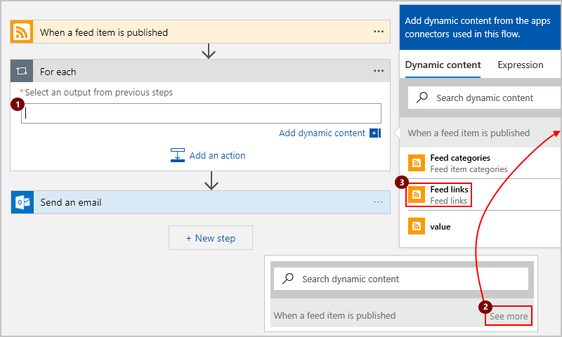

   > [!NOTE] 
   > You can select *only* array outputs from the previous step.

   The selected array now appears here:

   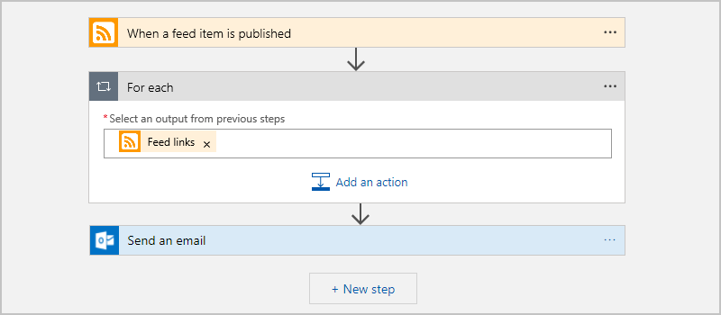

4. To perform an action on each array item, 
drag the **Send an email** action into the **For each** loop. 

   Your logic app might look something like this example:

   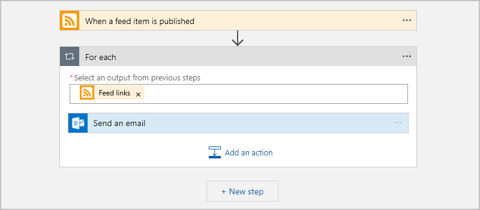

5. Save your logic app. To manually test your logic app, 
on the designer toolbar, choose **Run**.

<a name="for-each-json"></a>

## "Foreach" loop definition (JSON)

If you're working in code view for your logic app, 
you can define the `Foreach` loop in your 
logic app's JSON definition instead, for example:

``` json
"actions": {
    "myForEachLoopName": {
        "type": "Foreach",
        "actions": {
            "Send_an_email": {
                "type": "ApiConnection",
                "inputs": {
                    "body": {
                        "Body": "@{item()}",
                        "Subject": "New CNN post @{triggerBody()?['publishDate']}",
                        "To": "me@contoso.com"
                    },
                    "host": {
                        "api": {
                            "runtimeUrl": "https://logic-apis-westus.azure-apim.net/apim/office365"
                        },
                        "connection": {
                            "name": "@parameters('$connections')['office365']['connectionId']"
                        }
                    },
                    "method": "post",
                    "path": "/Mail"
                },
                "runAfter": {}
            }
        },
        "foreach": "@triggerBody()?['links']",
        "runAfter": {},
    }
},
```

<a name="sequential-foreach-loop"></a>

## "Foreach" loop: Sequential

By default, each cycle in a "Foreach" loop runs in parallel for each array item. 
To run each cycle sequentially, set the **Sequential** option in your "Foreach" loop. 
For example, suppose you use a variable in a "Foreach" loop that increments or decrements a value during each cycle. 
To get that value assigned correctly and predictably, run that loop sequentially.

1. In the loop's upper right corner, choose **ellipses** (**...**) > **Settings**.

   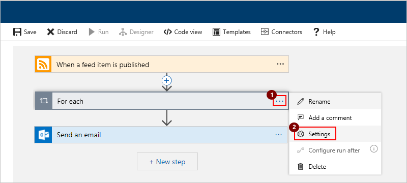

1. Turn on the **Sequential** setting, then choose **Done**.

   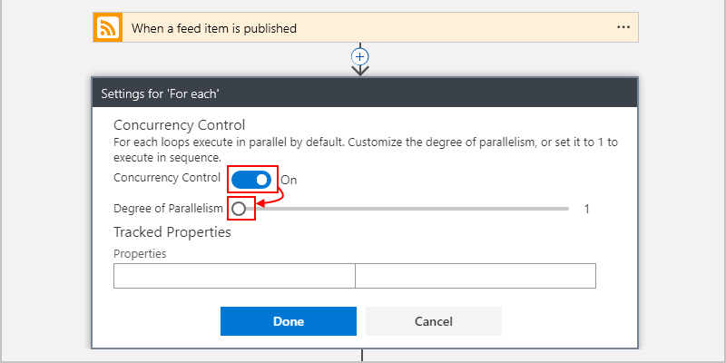

If you're working with your logic app's JSON definition, 
you can use the `Sequential` option by adding the 
`operationOptions` parameter, for example:

``` json
"actions": {
    "myForEachLoopName": {
        "type": "Foreach",
        "actions": {
            "Send_an_email": {               
            }
        },
        "foreach": "@triggerBody()?['links']",
        "runAfter": {},
        "operationOptions": "Sequential"
    }
},
```

<a name="until-loop"></a>

## "Until" loop
  
To repeat actions until a condition is met or some state has changed, 
use an "Until" loop in your logic app workflow. Here are some 
common use cases where you can use an "Until" loop:

* Call an endpoint until you get the response that you want.
* Create a record in a database, 
wait until a specific field in that record gets approved, 
and continue processing. 

For example, at 8:00 AM each day, this logic app increments a variable 
until the variable's value equals 10. Then, the logic app sends an email 
that confirms the current value. Although this example uses Office 365 Outlook, 
you can use any email provider supported by Logic Apps ([review the connectors list here](https://docs.microsoft.com/connectors/)). 
If you use another email account, the overall steps are the same, 
but your UI might slightly differ. 

1. Create a blank logic app. 
In Logic App Designer, search for "recurrence", 
and select this trigger: **Schedule - Recurrence** 

   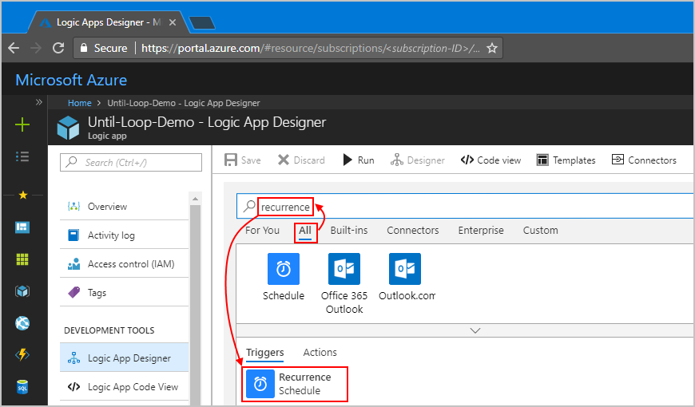

2. Specify when the trigger fires by setting the interval, frequency, 
and hour of the day. To set the hour, choose **Show advanced options**.

   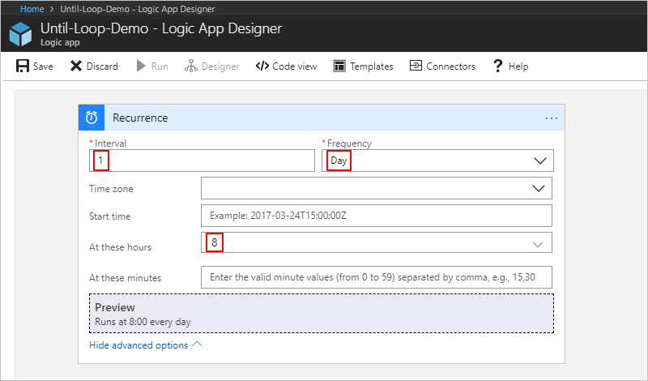

   | Property | Value |
   | -------- | ----- |
   | **Interval** | 1 | 
   | **Frequency** | Day |
   | **At these hours** | 8 |
   ||| 

3. Under the trigger, choose **New step** > **Add an action**. 
Search for "variables", and then select this action: **Variables - Initialize variable**

   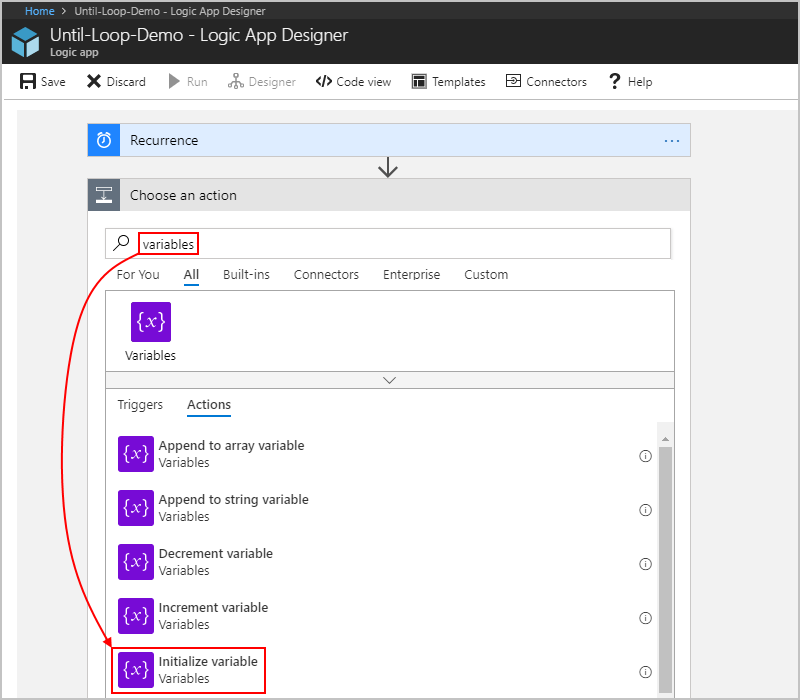

4. Set up your variable with these values:

   

   | Property | Value | Description |
   | -------- | ----- | ----------- |
   | **Name** | Limit | Your variable's name | 
   | **Type** | Integer | Your variable's data type | 
   | **Value** | 0 | Your variable's starting value | 
   |||| 

5. Under the **Initialize variable** action, 
choose **New step** > **More**. Select this loop: **Add a do until**

   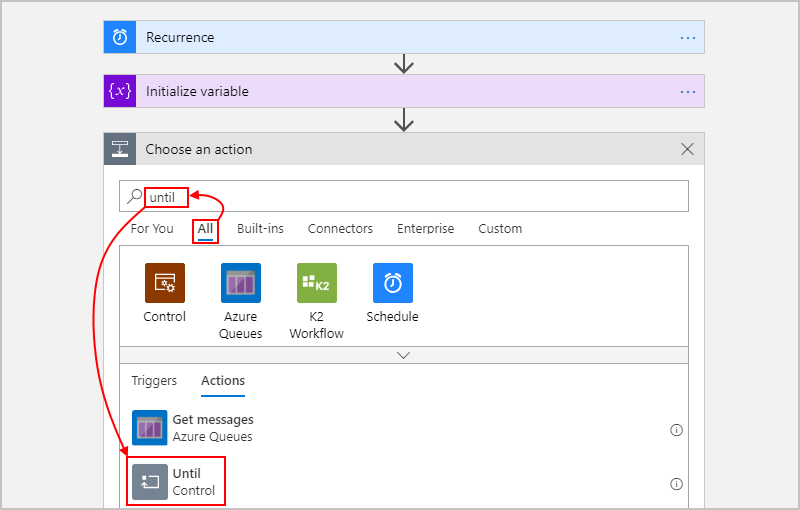

6. Build the loop's exit condition by selecting 
the **Limit** variable and the **is equal** operator. 
Enter **10** as the comparison value.

   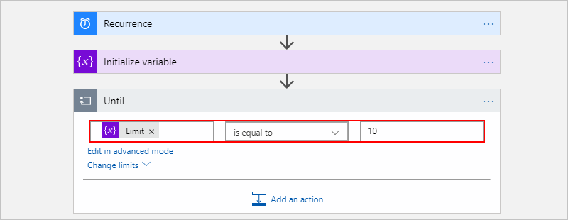

7. Inside the loop, choose **Add an action**. 
Search for "variables", and then add this action: 
**Variables - Increment variable**

   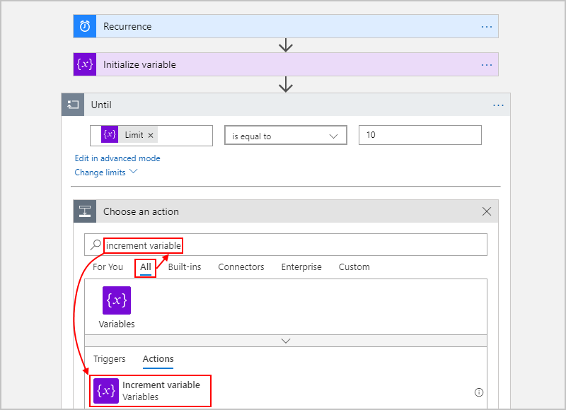

8. For **Name**, select the **Limit** variable. For **Value**, 
enter "1". 

   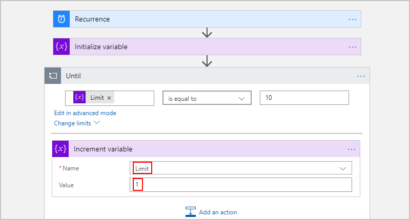

9. Under but outside the loop, add an action that sends email. 
If prompted, sign in to your email account.

   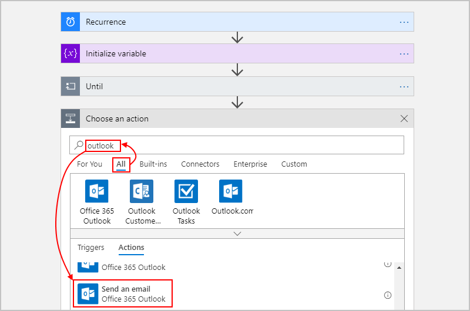

10. Set the email's properties. Add the **Limit** 
variable to the subject. That way, you can confirm the 
variable's current value meets your specified condition, 
for example:

    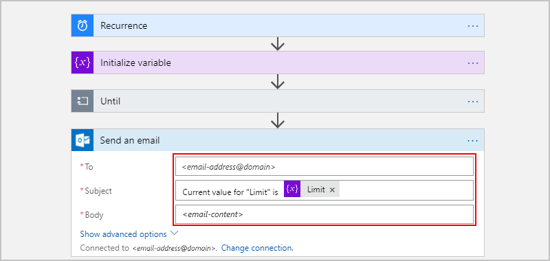

    | Property | Value | Description |
    | -------- | ----- | ----------- | 
    | **To** | *<email-address@domain>* | The recipient's email address. For testing, use your own email address. | 
    | **Subject** | Current value for "Limit" is **Limit** | Specify the email subject. For this example, make sure that you include the **Limit** variable. | 
    | **Body** | <*email-content*> | Specify the email message content you want to send. For this example, enter whatever text you like. | 
    |||| 

11. Save your logic app. To manually test your logic app, 
on the designer toolbar, choose **Run**.

    After your logic starts running, you get an email with the content that you specified:

    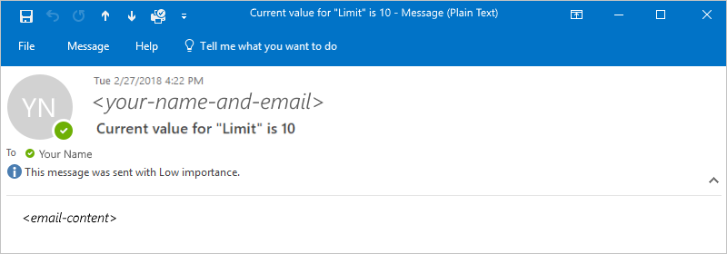

## Prevent endless loops

An "Until" loop has default limits that stop execution 
if any of these conditions happen:

| Property | Default value | Description | 
| -------- | ------------- | ----------- | 
| **Count** | 60 | The maximum number of loops that run before the loop exits. The default is 60 cycles. | 
| **Timeout** | PT1H | The maximum amount of time to run a loop before the loop exits. The default is one hour and is specified in ISO 8601 format. <p>The timeout value is evaluated for each loop cycle. If any action in the loop takes longer than the timeout limit, the current cycle doesn't stop, but the next cycle doesn't start because the limit condition isn't met. | 
|||| 

To change these default limits, 
choose **Show advanced options** in the loop action shape.

<a name="until-json"></a>

## "Until" definition (JSON)

If you're working in code view for your logic app, 
you can define an `Until` loop in your logic app's 
JSON definition instead, for example:

``` json
"actions": {
    "Initialize_variable": {
        // Definition for initialize variable action
    },
    "Send_an_email": {
        // Definition for send email action
    },
    "Until": {
        "type": "Until",
        "actions": {
            "Increment_variable": {
                "type": "IncrementVariable",
                "inputs": {
                    "name": "Limit",
                    "value": 1
                },
                "runAfter": {}
            }
        },
        "expression": "@equals(variables('Limit'), 10)",
        // To prevent endless loops, an "Until" loop 
        // includes these default limits that stop the loop. 
        "limit": { 
            "count": 60,
            "timeout": "PT1H"
        },
        "runAfter": {
            "Initialize_variable": [
                "Succeeded"
            ]
        },
    }
},
```

In another example, this "Until" loop calls an HTTP 
endpoint that creates a resource and stops when the 
HTTP response body returns with "Completed" status. 
To prevent endless loops, the loop also stops 
if any of these conditions happen:

* The loop has run 10 times as specified by the `count` attribute. 
The default is 60 times. 
* The loop has tried to run for two hours 
as specified by the `timeout` attribute in ISO 8601 format. 
The default is one hour.
  
``` json
"actions": {
    "myUntilLoopName": {
        "type": "Until",
        "actions": {
            "Create_new_resource": {
                "type": "Http",
                "inputs": {
                    "body": {
                        "resourceId": "@triggerBody()"
                    },
                    "url": "https://domain.com/provisionResource/create-resource",
                    "body": {
                        "resourceId": "@triggerBody()"
                    }
                },
                "runAfter": {},
                "type": "ApiConnection"
            }
        },
        "expression": "@equals(triggerBody(), 'Completed')",
        "limit": {
            "count": 10,
            "timeout": "PT2H"
        },
        "runAfter": {}
    }
},
```

## Get support

* For questions, visit the 
[Azure Logic Apps forum](https://social.msdn.microsoft.com/Forums/en-US/home?forum=azurelogicapps).
* To submit or vote on features and suggestions, 
[Azure Logic Apps user feedback site](https://aka.ms/logicapps-wish).

## Next steps

* [Run steps based on a condition (conditional statements)](../logic-apps/logic-apps-control-flow-conditional-statement.md)
* [Run steps based on different values (switch statements)](../logic-apps/logic-apps-control-flow-switch-statement.md)
* [Run or merge parallel steps (branches)](../logic-apps/logic-apps-control-flow-branches.md)
* [Run steps based on grouped action status (scopes)](../logic-apps/logic-apps-control-flow-run-steps-group-scopes.md)
