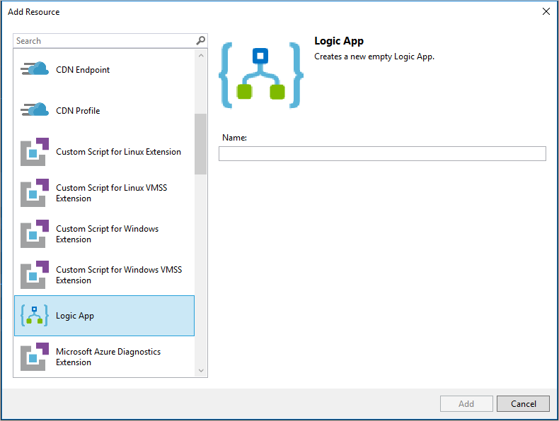

# Create Azure Resource Manager templates for deploying logic apps

To help you automate creating and deploying your logic app, 
this article describes the ways that you can create an 
[Azure Resource Manager template](../azure-resource-manager/resource-group-overview.md) 
for your logic app. For an overview about logic apps, 
Resource Manager templates, and their structure, see 
[Overview: Automate deployment for logic apps with Azure Resource Manager templates](logic-apps-azure-resource-manager-templates-overview.md).

Azure Logic Apps provides a 
[prebuilt logic apps Azure Resource Manager template](https://github.com/Azure/azure-quickstart-templates/blob/master/101-logic-app-create/azuredeploy.json) 
that you can reuse, not only for creating logic apps,
but also to define the resources and parameters to use for deployment. 
You can use this template for your own business scenarios or
customize the template to meet your requirements. 

For more about Azure Resource Manager templates, 
see these articles:

* [Azure Resource Manager template structure and syntax](../azure-resource-manager/resource-group-authoring-templates.md)
* [Author Azure Resource Manager templates](../azure-resource-manager/resource-group-authoring-templates.md)
* [Develop Azure Resource Manager templates for cloud consistency](../azure-resource-manager/templates-cloud-consistency.md)

## Create templates with Visual Studio

For the easiest way to create a valid logic app deployment template, 
use Visual Studio and the Azure Logic Apps Tools for Visual Studio extension. 
By downloading your logic app from the Azure portal into Visual Studio, 
you get a valid deployment template that you can use with any Azure 
subscription and location. Also, downloading your logic app automatically 
parameterizes the logic app definition that's embedded in the template.
For more information about creating and managing logic apps in Visual Studio, 
see [Create logic apps with Visual Studio](../logic-apps/quickstart-create-logic-apps-with-visual-studio.md) 
and [Manage logic apps with Visual Studio](../logic-apps/manage-logic-apps-with-visual-studio.md).

### Add to existing resource group project

If you have an existing Azure Resource Group project, 
you can add a new logic app to that project by using 
the JSON Outline window. You can also add a blank 
logic app to a previously same project you previously created.

1. In Solution Explorer, open the `<template>.json` file.

1. From the **View** menu, select **Other Windows** > **JSON Outline**.

1. To add a resource to the template file, 
choose **Add Resource** at the top of the JSON Outline window. 
Or in the JSON Outline window, 
right-click **resources**, and select **Add New Resource**.

   

1. In the **Add Resource** dialog box, find and select **Logic App**. 
Name your logic app, and choose **Add**.

   

## Create templates with Azure PowerShell

You can create logic app templates by using the 
[PowerShell module for logic app templates](https://github.com/jeffhollan/LogicAppTemplateCreator). 
This open-source module first evaluates your logic app 
and any connections that the logic app uses. The module 
then generates template resources with the necessary 
parameters for deployment. For example, suppose you 
have a logic app that receives a message from an Azure 
Service Bus queue and adds data to an Azure SQL database. 
The module tool preserves all the orchestration logic 
and parameterizes the SQL and Service Bus connection 
strings so that you can set those values at deployment.

> [!IMPORTANT]
> Connections must exist in the same Azure resource group as the logic app.
> For the PowerShell module to work with any Azure tenant and subscription access token, 
> use the module with the [Azure Resource Manager client tool](https://github.com/projectkudu/ARMClient). 
> For more information, see this 
> [article about the Azure Resource Manager client tool](https://blog.davidebbo.com/2015/01/azure-resource-manager-client.html) 
> discusses ARMClient in more detail.

### Install PowerShell module for logic app templates

For the easiest way to install the module from the 
[PowerShell Gallery](https://www.powershellgallery.com/packages/LogicAppTemplate/0.1), 
use this command:

`Install-Module -Name LogicAppTemplate`

You can also manually install the PowerShell module:

1. Download the latest [Logic App Template Creator](https://github.com/jeffhollan/LogicAppTemplateCreator/releases).

1. Extract the folder in your PowerShell module folder, 
which is usually `%UserProfile%\Documents\WindowsPowerShell\Modules`.

### Generate template with PowerShell

After PowerShell is installed, you can generate a template by using the following command:

`armclient token $SubscriptionId | Get-LogicAppTemplate -LogicApp <your-logic-app> -ResourceGroup <your-Azure-resource-group> -SubscriptionId $SubscriptionId -Verbose | Out-File C:\template.json`

`$SubscriptionId` is the Azure subscription ID. This command 
first gets an access token through the ARMClient tool, 
then pipes the token through to the PowerShell script, 
and then creates the template in a JSON file.

## Next steps

> [!div class="nextstepaction"]
> [Deploy logic app templates](../logic-apps/logic-apps-deploy-azure-resource-manager-templates.md)
