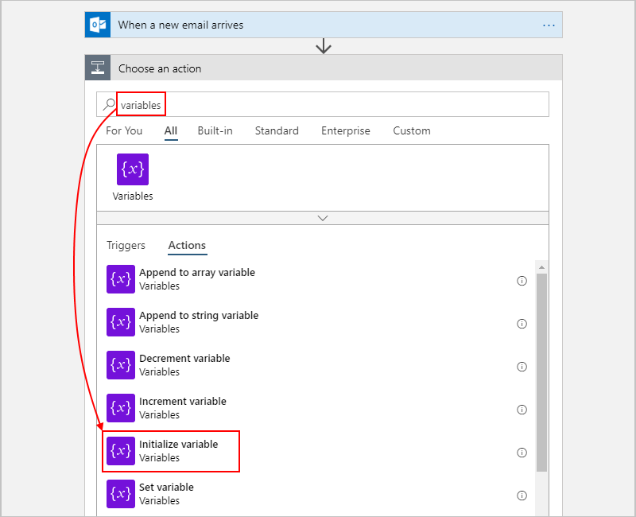
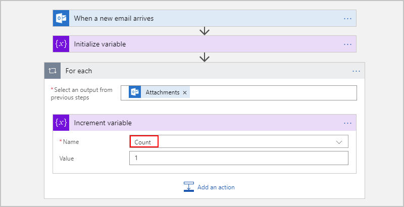
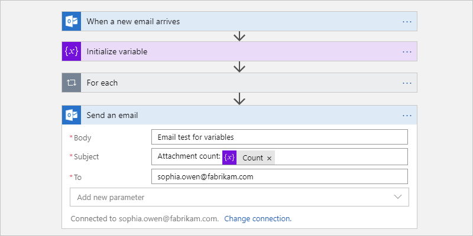

--
# required metadata
title: Create variables for saving values - Azure Logic Apps | Microsoft Docs
description: How to save and manage values by creating variables in Azure Logic Apps
services: logic-apps
author: ecfan
manager: cfowler
ms.author: estfan
ms.topic: article
ms.date: 05/30/2018
ms.service: logic-apps

# optional metadata
ms.reviewer: klam, LADocs
ms.suite: integration
---

# Create variables for saving and managing values in Azure Logic Apps

This article shows how you can store and work with values 
throughout your logic app by creating variables. 
For example, variables can help you count the number 
of times that a loop runs. When iterating over an array 
or checking an array for a specific item, you can use a 
variable to reference the index number for each array item. 

You can create variables for data types such as 
integer, float, boolean, string, array, and object. 
After you create a variable, you can perform other tasks, 
for example:

* Get or reference the variable's value.
* Increase or decrease the variable by a constant value, 
also known as *increment* and *decrement*.
* Assign a different value to the variable.
* Insert or *append* the variable's value as the last time in a string or array.

Variables exist and are global only within the logic app instance that creates them. 
Also, they persist across any loop iterations inside a logic app instance. 
When referencing a variable, use the variable's name as the token, 
not the action's name, which is the usual way to reference an action's outputs.

If you don't have an Azure subscription yet, 
<a href="https://azure.microsoft.com/free/" target="_blank">sign up for a free Azure account</a>. 

## Prerequisites

To follow this article, here are the items you need:

* The logic app where you want to create a variable 

  If you're new to logic apps, review 
  [What is Azure Logic Apps](../logic-apps/logic-apps-overview.md) 
  and [Quickstart: Create your first logic app](../logic-apps/quickstart-create-first-logic-app-workflow.md).

* A [trigger](../logic-apps/logic-apps-overview.md#logic-app-concepts) as the first step in your logic app 

  Before you can add actions for creating and working with variables, 
  your logic app must start with a trigger.

<a name="create-variable"></a>

## Initialize variable

You can create a variable and declare its data type and initial 
value - all within one action in your logic app. You can only 
declare variables at the global level, not within scopes, conditions, and loops. 

1. In the <a href="https://portal.azure.com" target="_blank">Azure portal</a> 
or Visual Studio, open your logic app in Logic App Designer. 

   This example uses the Azure portal 
   and a logic app with an existing trigger.

2. In your logic app, under the step where you want to add a variable, 
follow one of these steps: 

   * To add an action under the last step, 
   choose **New step** > **Add an action**.

     

   * To add an action between steps, move your mouse 
   over the connecting arrow so the plus sign (+) appears. 
   Choose the plus sign, and then choose **Add an action**.

3. In the search box, enter "variables" as your filter. 
From the actions list, select **Variables - Initialize variable**.

   

4. Provide this information for your variable:

   | Property | Required | Value |  Description |
   |----------|----------|-------|--------------|
   | Name | Yes | <*variable-name*> | The name for the variable to increment | 
   | Type | Yes | <*variable-type*> | The data type for the variable | 
   | Value | No | <*start-value*> | The initial value for your variable <p><p>**Tip**: Although optional, set this value as a best practice so you always know the start value for your variable. | 
   ||||| 

   

5. Now continue adding the actions you want. 
When you're done, on the designer toolbar, choose **Save**.

If you switch from the designer to the code view editor, 
here is the way the **Initialize variable** action 
appears inside your logic app definition, 
which is in JavaScript Object Notation (JSON) format:

```json
"actions": {
   "Initialize_variable": {
      "type": "InitializeVariable",
      "inputs": {
         "variables": [ {
               "name": "Count",
               "type": "Integer",
               "value": 0
          } ]
      },
      "runAfter": {}
   }
},
```

Here are examples for some other variable types:

*String variable*

```json
"actions": {
   "Initialize_variable": {
      "type": "InitializeVariable",
      "inputs": {
         "variables": [ {
               "name": "myStringVariable",
               "type": "String",
               "value": "lorem ipsum"
          } ]
      },
      "runAfter": {}
   }
},
```

*Boolean variable*

```json
"actions": {
   "Initialize_variable": {
      "type": "InitializeVariable",
      "inputs": {
         "variables": [ {
               "name": "myBooleanVariable",
               "type": "Boolean",
               "value": false
          } ]
      },
      "runAfter": {}
   }
},
```

*Array with integers*

```json
"actions": {
   "Initialize_variable": {
      "type": "InitializeVariable",
      "inputs": {
         "variables": [ {
               "name": "myArrayVariable",
               "type": "Array",
               "value": [1, 2, 3]
          } ]
      },
      "runAfter": {}
   }
},
```

*Array with strings*

```json
"actions": {
   "Initialize_variable": {
      "type": "InitializeVariable",
      "inputs": {
         "variables": [ {
               "name": "myArrayVariable",
               "type": "Array",
               "value": ["red", "orange", "yellow"]
          } ]
      },
      "runAfter": {}
   }
},
```

<a name="get-value"></a>

## Get the variable's value

To retrieve or reference a variable's contents, you can also use the 
[variables() function](../logic-apps/workflow-definition-language-functions-reference.md#variables) 
in the Logic App Designer and the code view editor.
When referencing a variable, use the variable's name as the token, 
not the action's name, which is the usual way to reference an action's outputs. 

For example, this expression gets the items from the array variable 
[created previously in this article](#append-value) by using the **variables()** function. 
The **string()** function returns the variable's contents in string format: `"1, 2, 3, red"`

```json
@{string(variables('myArrayVariable'))}
```

<a name="increment-value"></a>

## Increment variable 

To increase or *increment* a variable by a constant value, 
add the **Variables - Increment variable** action to your logic app. 
This action works only with integer and float variables.

1. In Logic App Designer, under the step where 
you want to increase an existing variable, 
choose **New step** > **Add an action**. 

   For example, this logic app already has a trigger 
   and an action that created a variable. So, 
   add a new action under these steps:

   

   To add an action between existing steps, 
   move your mouse over the connecting arrow 
   so that the plus sign (+) appears. Choose 
   the plus sign, and then choose **Add an action**.

2. In the search box, enter "increment variable" as your filter. 
In the actions list, select **Variables - Increment variable**.

   

3. Provide this information for incrementing your variable:

   | Property | Required | Value |  Description |
   |----------|----------|-------|--------------|
   | Name | Yes | <*variable-name*> | The name for the variable to increment | 
   | Value | No | <*increment-value*> | The value used for incrementing the variable. The default value is one. <p><p>**Tip**: Although optional, set this value as a best practice so you always know the specific value for incrementing your variable. | 
   |||| 

   For example: 
   
   

4. When you're done, on the designer toolbar, choose **Save**. 

If you switch from the designer to the code view editor, 
here is the way the **Increment variable** action appears 
inside your logic app definition, which is in JSON format:

```json
"actions": {
   "Increment_variable": {
      "type": "IncrementVariable",
      "inputs": {
         "name": "Count",
         "value": 1
      },
      "runAfter": {}
   }
},
```

## Example: Create loop counter

Variables are commonly used for counting the number of times that a loop runs. 
This example shows how you create and use variables for this task 
by creating a loop that counts the attachments in an email.

1. In the Azure portal, create a blank logic app. 
Add a trigger that checks for new email and any attachments. 

   This example uses the Office 365 Outlook 
   trigger for **When a new email arrives**. 
   You can set up this trigger to fire 
   only when the email has attachments.
   However, you can use any connector that 
   checks for new emails with attachments, 
   such as the Outlook.com connector.

2. In the trigger, choose **Show advanced options**. 
To have the trigger check for attachments and pass 
those attachments into your logic app's workflow, 
select **Yes** for these properties:
   
   * **Has Attachment** 
   * **Include Attachments** 

   

3. Add the [**Initialize variable** action](#create-variable). 
Create an integer variable named **Count** with a zero start value.

   

4. To cycle through each attachment, add a *for each* loop 
by choosing **New step** > **More** > **Add a for each**.

   

5. In the loop, click inside the **Select an output from previous steps** box. 
When the dynamic content list appears, select **Attachments**. 

   

   The **Attachments** field passes an array that has the 
   email attachments from the trigger's output into your loop.

6. In the "for each" loop, select **Add an action**. 

   

7. In the search box, enter "increment variable" as your filter. 
From the actions list, select **Variables - Increment variable**.

   > [!NOTE]
   > Make sure the **Increment variable** action appears inside the loop. 
   > If the action appears outside the loop, drag the action into the loop.

8. In the **Increment variable** action, 
from the **Name** list, select the **Count** variable. 

   

9. Under the loop, add any action that sends you the number of attachments. 
In your action, include the value from the **Count** variable, for example: 

   

10. Save your logic app. On the designer toolbar, choose **Save**. 

### Test your logic app

1. If your logic app isn't enabled, on your logic app menu, 
choose **Overview**. On the toolbar, choose **Enable**. 

2. On the Logic App Designer toolbar, choose **Run**. 
This step manually starts your logic app.

3. Send an email with one or more attachments 
to the email account you used in this example.

   This step fires the logic app's trigger, which creates 
   and runs an instance for your logic app's workflow.
   As a result, the logic app sends you a message or email 
   that shows the number of attachments in the email you sent.

If you switch from the designer to the code view editor, 
here is the way the "for each" loop appears with the 
**Increment variable** action inside your logic app definition, 
which is in JSON format.

```json
"actions": {
   "For_each": {
      "type": "Foreach",
      "actions": {
         "Increment_variable": {
           "type": "IncrementVariable",
            "inputs": {
               "name": "Count",
               "value": 1
            },
            "runAfter": {}
         }
      },
      "foreach": "@triggerBody()?['Attachments']",
      "runAfter": {
         "Initialize_variable": [ "Succeeded" ]
      }
   }
},
```

<a name="decrement-value"></a>

## Decrement variable

To decrease or *decrement* a variable by a constant value, follow the 
steps for [increasing a variable](#increment-value) except that you 
find and select the **Variables - Decrement variable** action instead. 
This action works only with integer and float variables.

Here are the properties for the **Decrement variable** action:

| Property | Required | Value |  Description |
|----------|----------|-------|--------------|
| Name | Yes | <*variable-name*> | The name for the variable to decrement | 
| Value | No | <*increment-value*> | The value for decrementing the variable. The default value is one. <p><p>**Tip**: Although optional, set this value as a best practice so you always know the specific value for decrementing your variable. | 
||||| 

If you switch from the designer to the code view editor, 
here is the way the **Decrement variable** action appears 
inside your logic app definition, which is in JSON format.

```json
"actions": {
   "Decrement_variable": {
      "type": "DecrementVariable",
      "inputs": {
         "name": "Count",
         "value": 1
      },
      "runAfter": {}
   }
},
```


<a name="assign-value"></a>

## Set variable

To assign a different value to an existing variable, 
follow the steps for [increasing a variable](#increment-value) 
except that you: 

1. Find and select the **Variables - Set variable** action instead. 

2. Provide the variable name and value you want to assign. 
Both the new value and the variable must have the same data type.
The value is required because this action doesn't have a default value. 

Here are the properties for the **Set variable** action:

| Property | Required | Value |  Description | 
|----------|----------|-------|--------------| 
| Name | Yes | <*variable-name*> | The name for the variable to change | 
| Value | Yes | <*new-value*> | The value you want to assign the variable. Both must have the same data type. | 
||||| 

> [!NOTE]
> Unless you're incrementing or decrementing variables, changing variables 
> inside loops *might* create unexpected results because loops run in parallel, 
> or concurrently, by default. For these cases, try setting your loop to run sequentially. 
> For example, when you want to reference the variable value inside the loop and expect 
> same value at the start and end of that loop instance, follow these steps to change how the loop runs: 
>
> 1. In your loop's upper-right corner, choose the ellipsis (...) button, 
> and then choose **Settings**.
> 
> 2. Under **Concurrency Control**, change the **Override Default** setting to **On**.
>
> 3. Drag the **Degree of Parallelism** slider to **1**.

If you switch from the designer to the code view editor, 
here is the way the **Set variable** action appears 
inside your logic app definition, which is in JSON format. 
This example changes the "Count" variable's current value to another value. 

```json
"actions": {
   "Initialize_variable": {
      "type": "InitializeVariable",
      "inputs": {
         "variables": [ {
               "name": "Count",
               "type": "Integer",
               "value": 0
          } ]
      },
      "runAfter": {}
   },
   "Set_variable": {
      "type": "SetVariable",
      "inputs": {
         "name": "Count",
         "value": 100
      },
      "runAfter": {
         "Initialize_variable": [ "Succeeded" ]
      }
   }
},
```

<a name="append-value"></a>

## Append to variable

For variables that store strings or arrays, you can insert or 
*append* a variable's value as the last item in those strings or arrays. 
You can follow the steps for [increasing a variable](#increment-value) 
except that you follow these steps instead: 

1. Find and select one of these actions based on 
whether your variable is a string or an array: 

  * **Variables - Append to string variable**
  * **Variables - Append to array variable** 

2. Provide the value to append as the last item in the string or array. 
This value is required. 

Here are the properties for the **Append to...** actions:

| Property | Required | Value |  Description | 
|----------|----------|-------|--------------| 
| Name | Yes | <*variable-name*> | The name for the variable to change | 
| Value | Yes | <*append-value*> | The value you want to append, which can have any type | 
|||||  

If you switch from the designer to the code view editor, 
here is the way the **Append to array variable** action appears 
inside your logic app definition, which is in JSON format.
This example creates an array variable, and adds another 
value as the last item in the array. Your result is an updated 
variable that contains this array: `[1,2,3,"red"]` 

```json
"actions": {
   "Initialize_variable": {
      "type": "InitializeVariable",
      "inputs": {
         "variables": [ {
            "name": "myArrayVariable",
            "type": "Array",
            "value": [1, 2, 3]
         } ]
      },
      "runAfter": {}
   },
   "Append_to_array_variable": {
      "type": "AppendToArrayVariable",
      "inputs": {
         "name": "myArrayVariable",
         "value": "red"
      },
      "runAfter": {
        "Initialize_variable": [ "Succeeded" ]
      }
   }
},
```

## Get support

* For questions, visit the [Azure Logic Apps forum](https://social.msdn.microsoft.com/Forums/en-US/home?forum=azurelogicapps).
* To submit or vote on feature ideas, visit the [Logic Apps user feedback site](http://aka.ms/logicapps-wish).

## Next steps

* Learn about [Logic Apps connectors](../connectors/apis-list.md)
