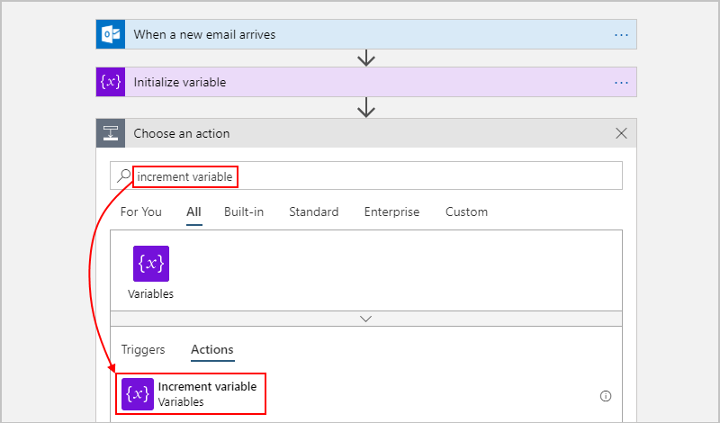
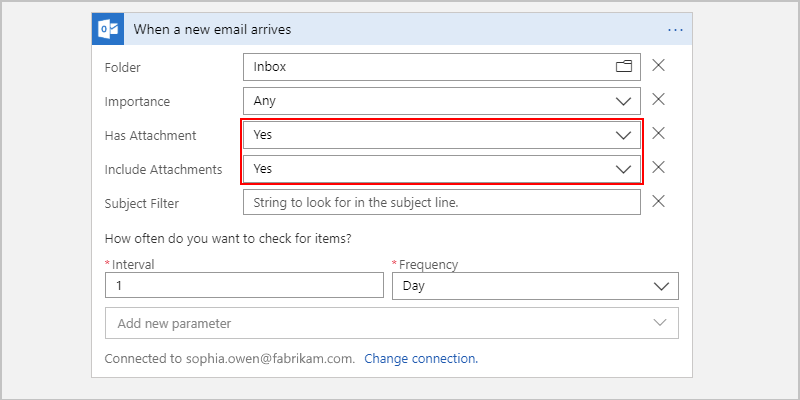
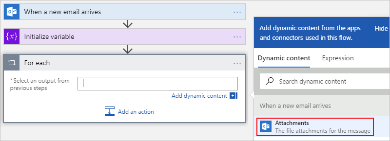

---
# required metadata
title: Save values as variables - Azure Logic Apps | Microsoft Docs
description: Create variables for saving and changing values in Azure Logic Apps
services: logic-apps
author: ecfan
manager: cfowler
ms.author: estfan
ms.topic: article
ms.date: 05/26/2018
ms.service: logic-apps

# optional metadata
ms.reviewer: klam, LADocs
ms.suite: integration
---

# Save and manage values as variables in Azure Logic Apps

This article shows how you can store and use values 
throughout your logic app by creating variables. 
For example, variables can help you count 
how often a loop runs, or find an array item 
by referencing that item's index value. 
Variables exist globally and only within the 
logic app instance where you create them. 
They are also shared across loops in the same instance. 

When you have an existing variable, 
you can perform other tasks, for example:

* Increase or decrease the value in an integer or float variable.
* Assign a value with the same data type to a variable.
* Add a value at the end of an array or string variable.

If you don't have an Azure subscription yet, 
<a href="https://azure.microsoft.com/free/" target="_blank">sign up for a free Azure account</a>. 

## Prerequisites

* The logic app where you want to create the variable. 
If you're new to logic apps, review 
[What is Azure Logic Apps](../logic-apps/logic-apps-overview.md) and [Quickstart: Create your first logic app](../logic-apps/quickstart-create-first-logic-app-workflow.md).

* A [trigger](../logic-apps/logic-apps-overview.md#logic-app-concepts) 
as the first step in your logic app. Before you can add actions 
for creating and working with variables, 
your logic app must start with a trigger.

## Create a variable

You can declare a variable and its data type 
plus a starting value - all at the same time 
in your logic app. 

1. In the Azure portal or Visual Studio, 
open your logic app in Logic App Designer. 

   This example uses the Azure portal 
   and a logic app with an existing trigger.

2. In Logic App Designer, under the step in your logic app 
where you want to add a variable, add an action.

   To add an action under the last step, 
   choose **New step** > **Add an action**.

     

   To add an action between existing steps, 
   move your mouse over the connecting arrow 
   so that the plus sign (+) appears. Choose 
   the plus sign, and then choose **Add an action**.

3. In the search box, enter "variables" as your filter. 
From the actions list, select this action: 
**Variables - Initialize variable** 

   

4. Provide this information for the variable you want to create.

   | Property | Required | Value |  Description |
   |----------|----------|-------|--------------|
   | Name | Yes | <*variable-name*> | The name for the variable to increment | 
   | Type | Yes | <*variable-type*> | The data type for the variable | 
   | Value | No | <*start-value*> | The initial value for your variable | 
   |||| 

   For example: 

   

5. Now continue adding the actions you want. 
When you're done, on the designer toolbar, choose **Save**.

## Change values in variables

In Logic App Designer, you have a few ways that you 
can change the value in an existing variable. 

* [*Increment*](#increment-value) or add a value to the variable. 
Works only for integer or float variables.

* [*Decrement*](#decrement-value) or subtract a value from the variable.
Works only for integer or float variables.

* [Assign a new value](#assign-value) to the variable. 
This new value must have the same the data type as the variable.

* [*Append*](#append-value) or add a value that has the 
same data type to the end of a string or array variable.

If you don't have an existing variable yet, 
[create that variable now](#create-variable).

### Increment variable 

To increase a variable by a specific value, add the 
**Variables - Increment variable** action to your logic app. 
This action works only for variables with integer or float data types.

1. In Logic App Designer, under the step where 
you want to increase an existing variable, 
choose **New step** > **Add an action**. For example:

   

   To add an action between existing steps, 
   move your mouse over the connecting arrow 
   so that the plus sign (+) appears. Choose 
   the plus sign, and then choose **Add an action**.

2. In the search box, enter "increment variable" as your filter. 
In the actions list, select this action: 
**Variables - Increment variable**

   

3. Provide the information for incrementing your variable. 
Here are the properties for the **Increment variable** action:

   | Property | Required | Value |  Description |
   |----------|----------|-------|--------------|
   | Name | Yes | <*variable-name*> | The name for the variable to increment | 
   | Value | No | <*increment-value*> | The value used for incrementing the variable. The default value is one. | 
   |||| 

   For example: 
   
   

4. When you're done, on the designer toolbar, choose **Save**.

#### Example: Count loop cycles

Variables often perform the work for 
counting how many times a loop runs. 
This example shows how you can use variables 
for this task by following these steps: 

1. Create a blank logic app, and add a trigger 
that checks for new email and fires only when the 
email has one or more attachments. 

   This example uses the Office 365 Outlook trigger 
   for **When a new email arrives**. However, 
   you can use any connector that checks 
   for new email with attachments, 
   such as the Outlook.com connector.

2. Set up the trigger to check for attachments 
and include those attachments as inputs 
in the workflow. 

   1. In this example, inside the trigger, 
   choose **Show advanced options**. 

   2. Set these properties to **Yes**: 
   
      * **Has Attachment** 
      * **Include Attachments** 

      

3. Add the [**Initialize variable**](#create-variable) 
action so that you can create an integer variable that 
tracks the number of attachments, for example:

   

4. Under the previous action, add a "for each" 
loop that cycles through each attachment. 
(Choose **New step** > **More** > **Add a for each**)

   

5. In the **For each** loop, 
click inside the **Select an output from previous steps** box. 
When the dynamic content list appears, 
select **Attachments**. 

   

   The **Attachments** field represents an array that 
   has the email attachments as output from the trigger.

6. In the "for each" loop, select **Add an action**. 

   

7. In the search box, enter "increment variable" as your filter. 
From the actions list, select the **Increment variable** action.

   > Make sure the **Increment variable** 
   > action appears inside the loop. 
   > If the action appears outside the loop,
   > drag the action into the loop.

8. In the **Increment variable** action, 
select the **Count** variable from the **Name** list. 

   

   The default incremental value is one, 
   so you don't have to specify a value for this example. 

9. Outside the loop, add an action that 
sends you the total number of attachments. 
This example sends an email with the results.

   

10. Save your logic app. On the designer toolbar, choose **Save**. 

*Test your logic app*

1. If your logic app isn't running already, on the logic app menu, 
choose **Overview**, and on the **Overview** page, choose **Enable**. 

2. Send an email that has one or more attachments 
to the email account that you used in this example.

3. On the Logic App Designer, choose **Run**. 
This step manually and immediately starts your logic app.

After your logic app finishes running, 
you get an email with the number of attachments 
for the email that you sent to yourself. 

### Decrement variable

To decrease an existing variable by a specific value, you can follow 
the steps for [increasing a variable](#increment-value) 
except that you use the **Variables - Decrement variable** action instead. 
This action subtracts the specified value from the variable's current value,
and works only for variables with integer or float data types. 

Here are the properties for the **Decrement variable** action:

| Property | Required | Value |  Description |
|----------|----------|-------|--------------|
| Name | Yes | <*variable-name*> | The name for the variable to decrement | 
| Value | No | <*increment-value*> | The value for decrementing the variable. The default value is one. | 
|||| 

### Assign a specific value 

To assign a different value to an existing variable, 
you can follow the steps for [increasing a variable](#increment-value) 
except for these steps: 

* Select the **Variables - Set variable** action instead. 

* Provide the value you want to assign the variable. 
This value is required because this action doesn't have a default value. 

  Here are the properties for the **Set variable** action:

  | Property | Required | Value |  Description | 
  |----------|----------|-------|--------------| 
  | Name | Yes | <*variable-name*> | The name for the variable to change | 
  | Value | Yes | <*new-value*> | The value you want to assign the variable. This new value must have the same data type as the variable. | 
  ||||| 

## Append value to variable

For variables that store either strings or arrays, you can add 
values with the same type at the ends of those strings or arrays. 
You can follow steps similar to [increasing a variable](#increment-value) 
except for these steps: 

* Select the action based on whether you have a string or array variable: 

  * **Variables - Append to string variable**
  * **Variables - Append to array variable** 

* Provide the value you want to append to the variable. 
This value is required because this action doesn't have a default value. 

  Here are the properties for the **Append to...** actions:

  | Property | Required | Value |  Description | 
  |----------|----------|-------|--------------| 
  | Name | Yes | <*variable-name*> | The name for the variable to change | 
  | Value | Yes | <*append-value*> | The value you want to append. This new value must have the same data type as the variable. | 
  |||||  

## Get support

* For questions, visit the [Azure Logic Apps forum](https://social.msdn.microsoft.com/Forums/en-US/home?forum=azurelogicapps).
* To submit or vote on feature ideas, visit the [Logic Apps user feedback site](http://aka.ms/logicapps-wish).

## Next steps

* Learn about other [Logic Apps connectors](../connectors/apis-list.md)
