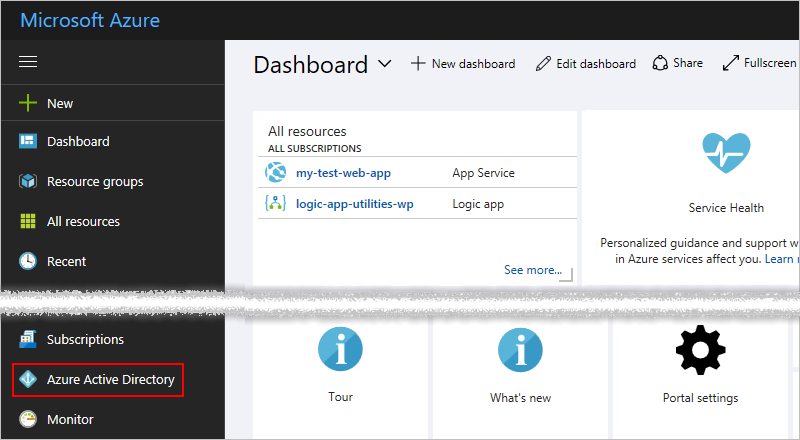
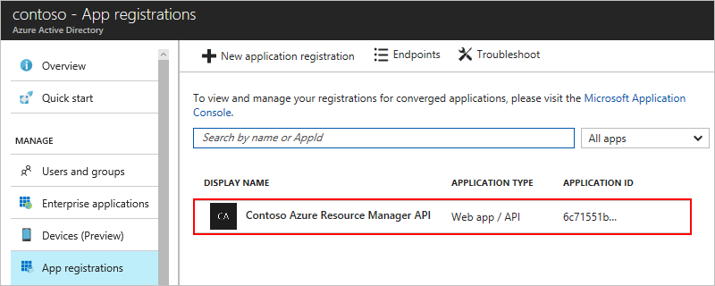

# Authenticate custom connectors with Azure Active Directory (Azure AD) for Azure Logic Apps

**NEED INFO FOR LOGIC APPS, DUPLICATES CONTEN FROM WEB APP TUTORIAL????**

This tutorial demonstrates how to enable authentication in Azure Active Directory, register one of the ARM APIs as a custom connector, and then connect to it in Microsoft Flow. This would be useful if you want to manage Azure resources as part of a flow. For more information about ARM, see [Azure Resource Manager Overview](https://docs.microsoft.com/azure/azure-resource-manager/resource-group-overview).

This tutorial shows how to set up Azure AD authentication for your custom connector 
and uses the Azure Resource Manager API as a custom connector 
register your 
register an , 
and then connect to the API in Azure Logic Apps.

Azure Resource Manager (ARM) enables you to manage the components of a solution on Azure - components like databases, virtual machines, and web apps. 

You might find useful when you want to manage Azure resources in your logic app workflow. 
For more information, see [Azure Resource Manager Overview](../azure-resource-manager/resource-group-overview.md).

## Prerequisites

* An Azure subscription. If you don't have a subscription, 
you can start with a [free Azure account](https://azure.microsoft.com/free/). 
Otherwise, sign up for a [Pay-As-You-Go subscription](https://azure.microsoft.com/pricing/purchase-options/).

* The [sample OpenAPI file](http://pwrappssamples.blob.core.windows.net/samples/AzureResourceManager.json) 
for this tutorial

## Set up authentication with Azure Active Directory

First, create an Azure Active Directory (Azure AD) app that performs 
authentication when calling the Azure Resource Manager API endpoint.

1. Sign in to the [Azure portal](https://portal.azure.com). 
If you have more than one Azure Active Directory tenant, 
confirm that you're signed in to the correct directory by 
checking the directory under your username. 

   

   > [!TIP]
   > To change directories, choose your user name so that you can 
   > select the directory that you want.

2. On the main Azure menu, choose **Azure Active Directory** 
so you can view your current directory.

   

   > [!TIP]
   > If the main Azure menu doesn't show **Azure Active Directory**, 
   > choose **More services**. In the **Filter** box, 
   > type "Azure Active Directory" as your filter, 
   > then choose **Azure Active Directory**.

3. On the directory menu, under **Manage**, choose **App registrations**. 
In the registered apps list, choose **+ New application registration**.

   

4. Under **Create**, provide a name for your Azure AD app, 
and keep **Application type** set to **Web app / API**. 
In the **Sign-on URL** box, type `https://login.windows.net`, 
and choose **Create**.  

   

5. In the registered apps list, select your Azure AD app.

   

6. When the app's settings page appears, 
save the app's **Application ID** somewhere safe for later use.

   

   If the **Settings** menu didn't appear too, choose **Settings**.

   

8. In the Settings menu, choose **Reply URLs**. 
Add `https://msmanaged-na.consent.azure-apim.net/redirect` and click **Save**.

    

9. Back on the Settings blade, click **Required permissions**.  On the Required permissions blade, click **Add**.

    

    The Add API access blade opens.

10. Click **Select an API**. In the blade that opens, click the option for the Azure Service Management API and click **Select**.

    

11. Click **Select permissions**.  Under *Delegated permissions*, click **Access Azure Service Management as organization users**, and then click **Select**.

    

12. On the Add API access blade, click **Done**.

13. Back on the Settings blade, click **Keys**.  In the Keys blade, type a description for your key, select an expiration period, and then click **Save**.  Your new key will be displayed.  Make note of the key value, as we will need that later, too.  You may now close the Azure portal.

    

## Add the connection in Microsoft Flow

Now that the AAD application is configured, let's add the custom connector.

1. In the [Microsoft Flow web app](https://flow.microsoft.com/), click the **Settings** button at the upper right of the page (it looks like a gear).  Then click **custom connectors**.

	  

2. Click **Create custom connector**.  

	You will be prompted for the properties of your API.  

	| Property | Description |
	|----------|-------------|
	| Name | At the top of the page, click **Untitled** and give your flow a name. |
	| OpenAPI file | Browse to the [sample ARM OpenAPI file](http://pwrappssamples.blob.core.windows.net/samples/AzureResourceManager.json). |
	| Upload API icon | Cick **Upload icon** to select an image file for the icon. Any PNG or JPG image less than 1 MB in size will work. |
	| Description | Type a description of your custom connector (optional). |

	  

	Select **Continue**.

3. On the next screen, because the OpenAPI file uses our AAD application for authentication, we need to give Flow some information about our application.  Under **Client id**, type the AAD **Application ID** you noted earlier.  For client secret, use the **key**.  And finally, for **Resource URL**, type `https://management.core.windows.net/`.

    >[AZURE.IMPORTANT] Be sure to include the Resource URL exactly as written above, including the trailing slash.

    

	After entering security information, click the check mark (**&#x2713;**) next to the flow name at the top of the page to create the custom connector.
	
4. Your custom connector is now displayed under **custom connectors**.
	
	  

5. Now that the custom connector is registered, you must create a connection to the custom connector so it can be used in your apps and flows.  Click the **+** to the right of the name of your custom connector and then complete complete the sign-on screen.

>[AZURE.NOTE] The sample OpenAPI does not define the full set of ARM operations and currently only contains the [List all subscriptions](https://msdn.microsoft.com/library/azure/dn790531.aspx) operation.  You can edit this OpenAPI or create another OpenAPI file using the [online OpenAPI editor](http://editor.swagger.io/).
>
>This process can be used to access any RESTful API authenticated using AAD.

## Next steps

For more detailed information about how to create a flow, see [Start to build with Microsoft Flow](get-started-logic-flow.md).

To ask questions or make comments about custom connectors, [join our community](https://aka.ms/flow-community).
