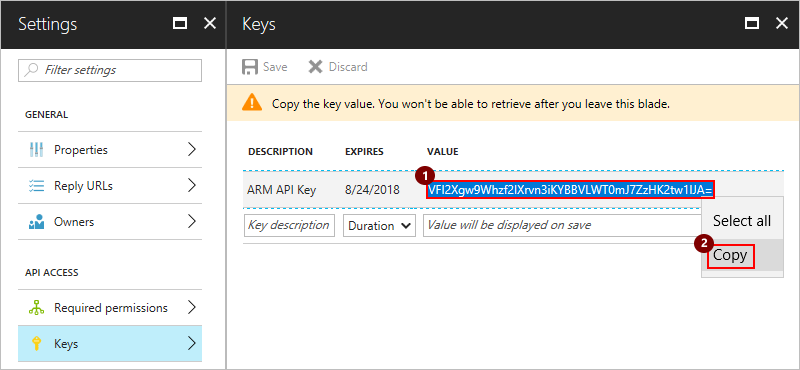

# Authenticate custom connectors with Azure Active Directory (Azure AD) for Azure Logic Apps

**NEED INFO FOR LOGIC APPS, DUPLICATES CONTEN FROM WEB APP TUTORIAL????**

This tutorial demonstrates how to enable authentication in Azure Active Directory, register one of the ARM APIs as a custom connector, and then connect to it in 
Microsoft Flow. This would be useful if you want to manage Azure resources as 
part of a flow. For more information about ARM, see [Azure Resource Manager Overview](https://docs.microsoft.com/azure/azure-resource-manager/resource-group-overview).

This tutorial shows how to set up Azure AD authentication for your 
custom connector by using the Azure Resource Manager API as an 
example custom connector, register your register an , 
and then connect to the API in Azure Logic Apps.

Azure Resource Manager (ARM) enables you to manage the components of a solution on Azure - components like databases, virtual machines, and web apps. 

You might find useful when you want to manage Azure resources in your logic app workflow. 
For more information, see [Azure Resource Manager Overview](../azure-resource-manager/resource-group-overview.md).

## Prerequisites

* An Azure subscription. If you don't have a subscription, 
you can start with a [free Azure account](https://azure.microsoft.com/free/). 
Otherwise, sign up for a [Pay-As-You-Go subscription](https://azure.microsoft.com/pricing/purchase-options/).

* The [sample OpenAPI file](http://pwrappssamples.blob.core.windows.net/samples/AzureResourceManager.json) 
for this tutorial

## Set up authentication with Azure Active Directory

Now create an Azure Active Directory (Azure AD) app that performs authentication 
when your custom connector calls the Azure Resource Manager API endpoint.

### Create your Azure AD app for authentication

1. Sign in to the [Azure portal](https://portal.azure.com). 
If you have more than one Azure Active Directory tenant, 
confirm that you're signed in to the correct directory by 
checking the directory under your username. 

   

   > [!TIP]
   > To change directories, choose your user name so that you can 
   > select the directory that you want.

2. On the main Azure menu, choose **Azure Active Directory** 
so you can view your current directory.

   

   > [!TIP]
   > If the main Azure menu doesn't show **Azure Active Directory**, 
   > choose **More services**. In the **Filter** box, 
   > type "Azure Active Directory" as your filter, 
   > then choose **Azure Active Directory**.

3. On the directory menu, under **Manage**, choose **App registrations**. 
In the registered apps list, choose **+ New application registration**.

   

4. Under **Create**, provide a name for your Azure AD app, 
and keep **Application type** set to **Web app / API**. 
In the **Sign-on URL** box, type `https://login.windows.net`, 
and choose **Create**.  

   
 
   Now continue on so you can configure your Azure AD apps' settings. 

### Set up your Azure AD app's settings

1. In your directory's **App registrations** list, 
select your Azure AD app.

   

2. When the app's settings page appears, 
save the app's **Application ID** somewhere safe for later use.

   

3. Now provide a reply URL for the app. 
In the app's **Settings** menu, choose **Reply URLs**. 
Enter this URL, then choose **Save**: 

   `https://msmanaged-na.consent.azure-apim.net/redirect`

   

   > [!TIP]
   > If the **Settings** menu didn't previously appear, 
   > choose **Settings** here:
   >
   > 

4. Back in the **Settings** menu, choose **Required permissions** > **Add**.

   

5. When the **Add API access** menu opens, choose **Select an API** > 
**Azure Service Management API** > **Select**.

   

6. Back under **Add API access**, choose **Select permissions**. 
Under **Delegated permissions**, choose **Access Azure Service Management as organization users** > **Select**.

   

7. Back on the **Add API access** menu, choose **Done**.

   

8. Now add a *client key*, or "secret", for your Azure AD app. 

   1. Back on the **Settings** menu, choose **Keys**. 
   Provide a name for your key with 16 or fewer characters, 
   select an expiration period, and then choose **Save**.

      

   2. When your created key appears, immediately copy and save that key somewhere 
   safe for later use. *You can't retrieve the key after you close the **Keys** page.*
    
      

9. After saving your key, you can safely close the **Settings** menu.

## Next steps

* Register your connector in Azure Logic Apps