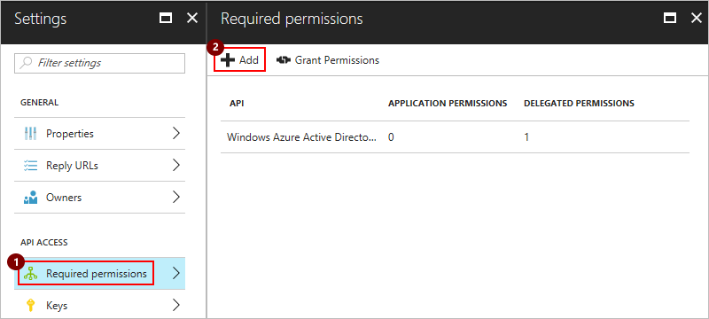
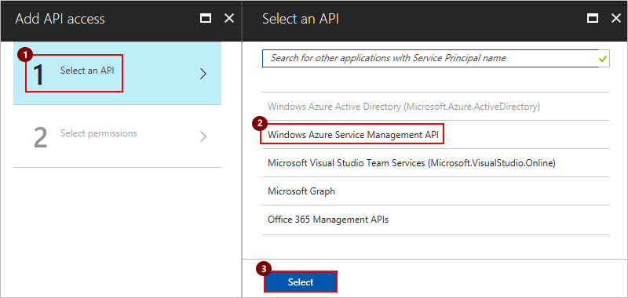
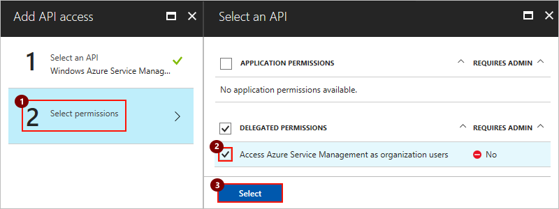
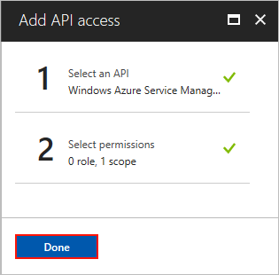
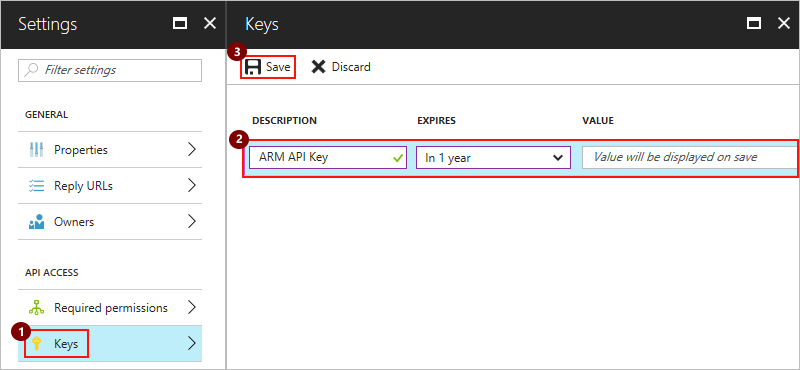

# Authenticate custom connectors with Azure Active Directory (Azure AD) for Azure Logic Apps

**NEED INFO FOR LOGIC APPS, DUPLICATES CONTEN FROM WEB APP TUTORIAL????**

This tutorial demonstrates how to enable authentication in Azure Active Directory, register one of the ARM APIs as a custom connector, and then connect to it in 
Microsoft Flow. This would be useful if you want to manage Azure resources as 
part of a flow. For more information about ARM, see [Azure Resource Manager Overview](https://docs.microsoft.com/azure/azure-resource-manager/resource-group-overview).

This tutorial shows how to set up Azure AD authentication for your 
custom connector by using the Azure Resource Manager API as an 
example custom connector, register your register an , 
and then connect to the API in Azure Logic Apps.

Azure Resource Manager (ARM) enables you to manage the components of a solution on Azure - components like databases, virtual machines, and web apps. 

You might find useful when you want to manage Azure resources in your logic app workflow. 
For more information, see [Azure Resource Manager Overview](../azure-resource-manager/resource-group-overview.md).

## Prerequisites

* An Azure subscription. If you don't have a subscription, 
you can start with a [free Azure account](https://azure.microsoft.com/free/). 
Otherwise, sign up for a [Pay-As-You-Go subscription](https://azure.microsoft.com/pricing/purchase-options/).

* The [sample OpenAPI file](http://pwrappssamples.blob.core.windows.net/samples/AzureResourceManager.json) 
for this tutorial

## Set up authentication with Azure Active Directory

Now create an Azure Active Directory (Azure AD) app that performs authentication 
when your custom connector calls the Azure Resource Manager API endpoint.

### Create your Azure AD app for authentication

1. Sign in to the [Azure portal](https://portal.azure.com). 
If you have more than one Azure Active Directory tenant, 
confirm that you're signed in to the correct directory by 
checking the directory under your username. 

   

   > [!TIP]
   > To change directories, choose your user name so that you can 
   > select the directory that you want.

2. On the main Azure menu, choose **Azure Active Directory** 
so you can view your current directory.

   

   > [!TIP]
   > If the main Azure menu doesn't show **Azure Active Directory**, 
   > choose **More services**. In the **Filter** box, 
   > type "Azure Active Directory" as your filter, 
   > then choose **Azure Active Directory**.

3. On the directory menu, under **Manage**, choose **App registrations**. 
In the registered apps list, choose **+ New application registration**.

   

4. Under **Create**, provide a name for your Azure AD app, 
and keep **Application type** set to **Web app / API**. 
In the **Sign-on URL** box, type `https://login.windows.net`, 
and choose **Create**.  

   
 
   Now continue on so you can configure your Azure AD apps' settings. 

### Set up your Azure AD app's settings

1. In your directory's **App registrations** list, 
select your Azure AD app.

   

2. When the app's settings page appears, 
save the app's **Application ID** somewhere safe for later use.

   

3. Now provide a reply URL for the app. 
In the app's **Settings** menu, choose **Reply URLs**. 
Enter this URL, then choose **Save**: 

   `https://msmanaged-na.consent.azure-apim.net/redirect`

   

   > [!TIP]
   > If the **Settings** menu didn't previously appear, 
   > choose **Settings** here:
   >
   > 

4. Back in the **Settings** menu, choose **Required permissions** > **Add**.

   

5. When the **Add API access** menu opens, choose **Select an API** > 
**Azure Service Management API** > **Select**.

   

6. Back under **Add API access**, choose **Select permissions**. 
Under **Delegated permissions**, choose **Access Azure Service Management as organization users** > **Select**.

   

7. Back on the **Add API access** menu, choose **Done**.

   

8. Now add a *client key*, or "secret", for your Azure AD app. 

   1. Back on the **Settings** menu, choose **Keys**. 
   Provide a description for your key, select an expiration period, 
   and then choose **Save**.

      

   2. When your created key appears, immediately copy and save that key somewhere 
   safe for later use. *You can't retrieve the key after you close the **Keys** page.*
    
      

9. After saving your key, you can safely close the **Settings** menu.

## Add your connector to Azure Logic Apps

Now that you configured your Azure AD app, add your connector. 
Make sure that you have your API's properties ready so that 
you can provide them when prompted. 

1. In the Azure portal, on the main Azure menu, choose **New**. 
In the search box, enter "logic apps connector" as your filter, 
and press Enter. From the results list, choose **Logic Apps Connector** > **Create**.

2. Provide the details for creating your connector 
as described in the table. When you're done, 
choose **Pin to dashboard** > **Create**.

   |Property|Suggested value|Description|
   |:-------|:--------------|:----------|
   |**Name**|*{custom-connector-name}*|Provide a name for your connector.| 
   |**Subscription**|*{your-Azure-subscription-name}*|Select your Azure subscription.| 
   |**Resource group**|*{Azure-resource-group-name}*|Create or select an Azure group for organizing your Azure resources.| 
   |**Location**|*{your-selected-region}*|Select a deployment region for your connector.| 
   |||| 

3. From your connector's menu, choose **Logic Apps Connector** > **Edit**.

4. On the **General** pane, provide more details about your connector:

   |Setting|Suggested value|Description|
   |:------|:--------------|:----------|
   |**Custom connectors**|**Upload an OpenAPI file**: 
**Use an OpenAPI URL**: 
**Upload Postman collection V1**: |Select the appropriate option so you can provide the Swagger file that describes your API.| 
   |**General information**|||

On the **Edit Logic App custom connector** page, 
in the **Custom connectors** section, select the option for creating your connector, and provide the location and Swagger file that describes your API. 
For this tutorial, you can use this [sample Azure Resources Manager OpenAPI file](http://pwrappssamples.blob.core.windows.net/samples/AzureResourceManager.json).

because the OpenAPI file uses our AAD application for authentication, we need to give Flow some information about our application.  Under **Client id**, type the AAD **Application ID** you noted earlier.  For client secret, use the **key**.  And finally, for **Resource URL**, type `https://management.core.windows.net/`.

    > [!IMPORTANT] Be sure to include the Resource URL exactly as written above, including the trailing slash.

5. Now that the custom connector is registered, you must create a connection to the custom connector so that you can use it in your logic apps. 

> [!NOTE] The sample OpenAPI does not define the full set of ARM operations 
> and currently only contains the [List all subscriptions](https://msdn.microsoft.com/library/azure/dn790531.aspx) operation. 
> You can edit this OpenAPI or create another OpenAPI file 
> using the [online OpenAPI editor](http://editor.swagger.io/).
>
> This process can be used to access any RESTful API authenticated using Azure AD.

## Next steps
