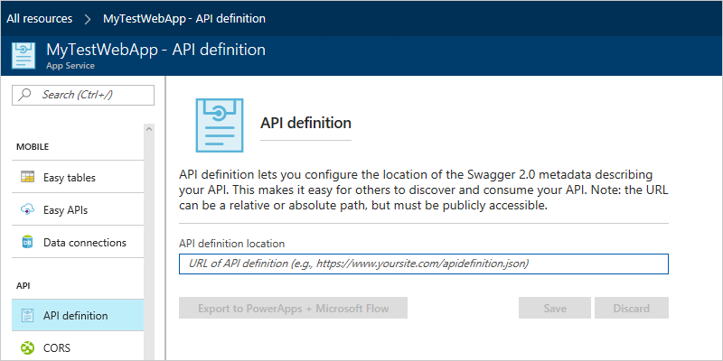
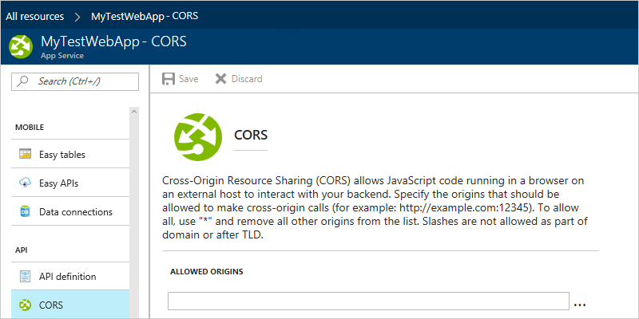

# Deploy and call custom APIs for logic apps

After you [create custom APIs](./logic-apps-create-api-app.md) 
that provide actions or triggers to use in logic apps workflows, 
you must deploy your APIs before you can call them. 
And although you can call any API from a logic app, 
for the best experience, add [Swagger metadata](http://swagger.io/specification/) 
that describes your API's operations and parameters. 
This Swagger file helps your API work better and integrate more easily with logic apps.

You can deploy your APIs as [web apps](../app-service-web/app-service-web-overview.md), 
but consider deploying your APIs as [API apps](../app-service-api/app-service-api-apps-why-best-platform.md), 
which can make your job easier when you build, host, and consume APIs 
in the cloud and on premises. You don't have to change any code in your 
APIs -- just deploy your code to an API app. You can host your APIs on 
[Azure App Service](../app-service/app-service-value-prop-what-is.md), 
a platform-as-a-service (PaaS) offering that provides one of the best, easiest, 
and most scalable ways for API hosting.

## Deploy your API as a web app or API app

Before you can call your custom API from a logic app, 
deploy your API as a web app or API app to Azure App Service. 
Also, to make your Swagger document readable by the Logic App Designer, 
set the API definition properties and turn on 
[cross-origin resource sharing (CORS)](../app-service-api/app-service-api-cors-consume-javascript.md#corsconfig) 
for your web app or API app.

1. In the Azure portal, select your web app or API app.

2. In the blade that opens, 
under **API**, choose **API definition**. 
Set the **API definition location** 
to the URL for your swagger.json file.

   Usually, the URL appears in this format: 
   `https://{name}.azurewebsites.net/swagger/docs/v1)`

   

3. Under **API**, choose **CORS**. 
Set the CORS policy for **Allowed origins** to **'*'** (allow all).

   This setting permits requests from Logic App Designer.

   

For more information, see these articles:

* [Add Swagger metadata for ASP.NET web APIs](../app-service-api/app-service-api-dotnet-get-started.md#use-swagger-api-metadata-and-ui)
* [Deploy ASP.NET web APIs to Azure App Service](../app-service-api/app-service-api-dotnet-get-started.md)

## Call your custom API from logic app workflows

After you set up the API definition properties and CORS, 
your custom API's triggers and actions should become available 
for you to include in your logic app workflow. 

*  To view the websites that have Swagger URLs, 
you can browse your subscription websites in the Logic Apps Designer.

*  To view available actions and inputs by pointing at a Swagger document, 
use the [HTTP + Swagger action](../connectors/connectors-native-http-swagger.md).

*  To call any API, including APIs that don't have or expose a Swagger document, 
you can always create a request with the [HTTP action](../connectors/connectors-native-http.md).

## Next steps

* [Custom connectors overview](../logic-apps/custom-connector-overview.md)