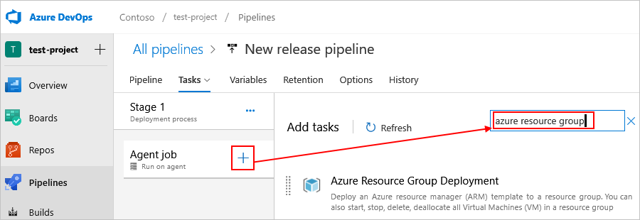

# Deploy Azure Resource Manager templates for Azure Logic Apps

After you create an Azure Resource Manager template for your logic app, you can deploy your template in these ways:

* [Azure portal](#portal)
* [Visual Studio](#visual-studio)
* [Azure PowerShell](#powershell)
* [Azure CLI](#cli)
* [Azure Resource Manager REST API](../azure-resource-manager/resource-group-template-deploy-rest.md)
* [Azure DevOps Azure Pipelines](#azure-pipelines)

<a name="portal"></a>

## Deploy through Azure portal

To automatically deploy a logic app template to Azure, you can choose the following **Deploy to Azure** button, which signs you in to the Azure portal and prompts you for information about your logic app. You can then make any necessary changes to the logic app template or parameters.

[](https://portal.azure.com/#create/Microsoft.Template/uri/https%3A%2F%2Fraw.githubusercontent.com%2FAzure%2Fazure-quickstart-templates%2Fmaster%2F101-logic-app-create%2Fazuredeploy.json)

For example, you're prompted for this information after you sign in to the Azure portal:

* Azure subscription name
* Resource group that you want to use
* Logic app location
* The name for your logic app
* A test URI
* Acceptance of the specified terms and conditions

For more information, see these topics:

* [Overview: Automate deployment for logic apps with Azure Resource Manager templates](logic-apps-azure-resource-manager-templates-overview.md)
* [Deploy resources with Azure Resource Manager templates and the Azure portal](../azure-resource-manager/resource-group-template-deploy-portal.md).

<a name="visual-studio"></a>

## Deploy with Visual Studio

To deploy a logic app template from an Azure Resource Group project that you created by using Visual Studio, follow these [steps to manually deploy your logic app](../logic-apps/quickstart-create-logic-apps-with-visual-studio.md#deploy-logic-app-to-azure) to Azure.

<a name="powershell"></a>

## Deploy with Azure PowerShell

To deploy to a specific Azure resource group, use this command:

```powershell
New-AzResourceGroupDeployment -ResourceGroupName <Azure-resource-group-name> -TemplateUri https://raw.githubusercontent.com/Azure/azure-quickstart-templates/master/101-logic-app-create/azuredeploy.json
```

For more information, see these topics:

* [Deploy resources with Resource Manager templates and Azure PowerShell](https://docs.microsoft.com/azure/azure-resource-manager/resource-group-template-deploy)
* [`New-AzResourceGroupDeployment`](https://docs.microsoft.com/powershell/module/azurerm.resources/new-azurermresourcegroupdeployment)

<a name="cli"></a>

## Deploy with Azure CLI

To deploy to a specific *Azure resource group*, use this command:

```azurecli
az group deployment create -g <Azure-resource-group-name> --template-uri https://raw.githubusercontent.com/Azure/azure-quickstart-templates/master/101-logic-app-create/azuredeploy.json
```

For more information, see these topics:

* [Deploy resources with Resource Manager templates and Azure CLI](../azure-resource-manager/resource-group-template-deploy-cli.md) 
* [`az group deployment create`](https://docs.microsoft.com/cli/azure/group/deployment?view=azure-cli-latest#az-group-deployment-create)

<a name="azure-pipelines"></a>

## Deploy with Azure DevOps

To deploy logic app templates and manage environments, teams commonly use a tool such as [Azure Pipelines](https://docs.microsoft.com/azure/devops/pipelines/get-started/what-is-azure-pipelines) in [Azure DevOps](https://docs.microsoft.com/azure/devops/user-guide/what-is-azure-devops-services). Azure Pipelines provides an [Azure Resource Group Deployment task](https://github.com/Microsoft/azure-pipelines-tasks/tree/master/Tasks/AzureResourceGroupDeploymentV2) that you can add to any build or release pipeline. For authorization to deploy and generate the release pipeline, you also need an Azure Active Directory (AD) [service principal](../active-directory/develop/app-objects-and-service-principals.md). Learn more about [using service principals with Azure Pipelines](https://docs.microsoft.com/azure/devops/pipelines/library/connect-to-azure).

For more information about continuous integration and continuous deployment (CI/CD) for Azure Resource Manager templates with Azure Pipelines, see these topics:

* [Integrate Resource Manager templates with Azure Pipelines](../azure-resource-manager/vs-resource-groups-project-devops-pipelines.md)
* [Tutorial: Continuous integration for Azure Resource Manager templates with Azure Pipelines](../azure-resource-manager/resource-manager-tutorial-use-azure-pipelines.md)

Here are general high-level steps for using Azure Pipelines:

1. In Azure Pipelines, create an empty pipeline.

1. Choose the resources you need for the pipeline, such as your logic app template and template parameters files, which you generate manually or as part of the build process.

1. For your agent job, find and add the **Azure Resource Group Deployment** task.

   

1. Configure with a [service principal](https://docs.microsoft.com/azure/devops/pipelines/library/connect-to-azure).

1. Add references to your logic app template and template parameters files.

1. Continue to build out steps in the release process for any other environment, automated test, or approvers as needed.

<a name="authorize-oauth-connections"></a>

## Authorize OAuth connections

After deployment, your logic app works end-to-end with valid parameters. However, you must still authorize any OAuth connections to generate valid access tokens for [authenticating your credentials](../active-directory/develop/authentication-scenarios.md). Here are ways that you can authorize OAuth connections:

* For automated deployments, you can use a script that provides consent for each OAuth connection. Here's an example script in GitHub in the [LogicAppConnectionAuth](https://github.com/logicappsio/LogicAppConnectionAuth) project.

* To manually authorize OAuth connections, open your logic app in Logic App Designer, either in the Azure portal or in Visual Studio. In the designer, authorize any required connections.

If you use an Azure Active Directory (Azure AD) [service principal](../active-directory/develop/app-objects-and-service-principals.md) instead to authorize connections, learn how to [specify service principal parameters in your logic app template](../logic-apps/logic-apps-azure-resource-manager-templates-overview.md#authenticate-connections).

## Next steps

> [!div class="nextstepaction"]
> [Monitor logic apps](../logic-apps/logic-apps-monitor-your-logic-apps.md)
