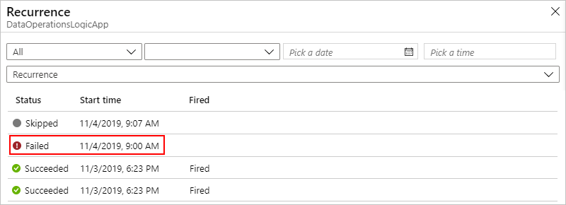
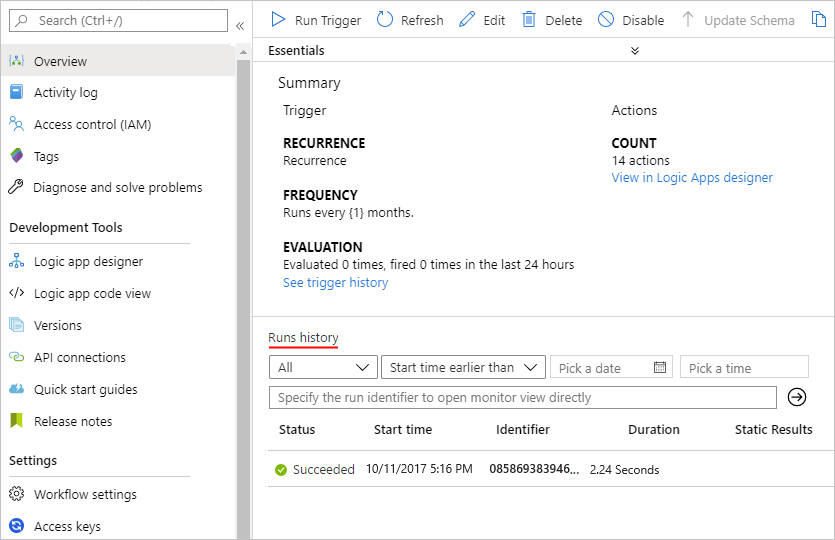
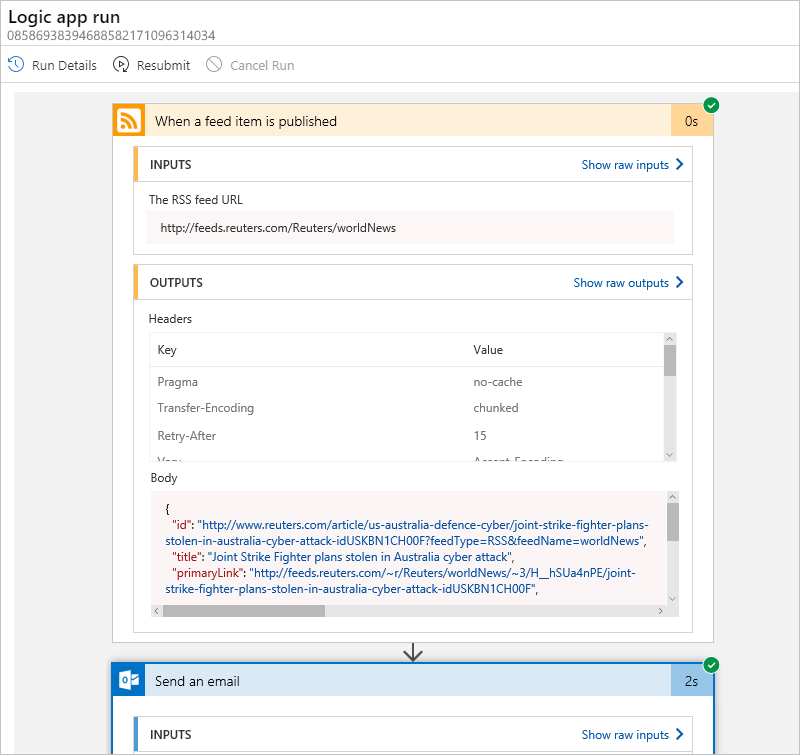

# Troubleshoot and diagnose workflow failures in Azure Logic Apps

Your logic app generates information that can help you diagnose and debug problems in your app. You can diagnose a logic app by reviewing each step in the workflow through the Azure portal. Or, you can add some steps to a workflow for runtime debugging.

## Check trigger history

Each logic app run starts with a trigger attempt, so if the trigger doesn't fire, follow these steps:

1. Check the trigger's status by [checking the trigger history](../logic-apps/logic-apps-monitor-your-logic-app.md#review-trigger-history). To view more information about the trigger attempt, select that trigger event, for example:

   

1. Check the trigger's inputs to confirm that they appear as you expect. Under **Inputs link**, select the link, which shows the **Inputs** pane.

   Trigger inputs include the data that the trigger expects and requires to start the workflow. Reviewing these inputs can help you determine whether the trigger inputs are correct and whether the condition was met so that the workflow can continue.

   For example, the `feedUrl` property here has an incorrect RSS feed value:

   

1. Check the triggers outputs, if any, to confirm that they appear as you expect.

   Trigger outputs include the data that the trigger passes to the next step in your workflow. Reviewing these outputs can help you determine whether the correct or expected values passed on to the next step in your workflow, for example:

   

   > [!TIP]
   > If you find any content that you don't recognize, learn more about 
   > [different content types](../logic-apps/logic-apps-content-type.md) in Azure Logic Apps.

## Check run history

Each trigger that fires starts a logic app instance that runs the workflow. You can review what happened during that run, including the status for each step in the workflow, plus the inputs and outputs for each step.

1. On the logic app menu, choose **Overview**. Under **Runs history**, review the run for the fired trigger.

   > [!TIP]
   > If you don't see the logic app menu, 
   > try returning to the Azure dashboard, 
   > and reopen your logic app.

   

   > [!TIP]
   > * If you don't find the data that you expect, 
   > try selecting **Refresh** on the toolbar.
   > * If the list shows many runs, 
   > and you can't find the entry you want, 
   > try filtering the list.

   Here are the possible statuses for a run:

   | Status | Description | 
   | ------ | ----------- | 
   | **Succeeded** | All actions succeeded. 
If any failures happened in a specific action, a following action in the workflow handled that failure. | 
   | **Failed** | At least one action failed, and no later actions in the workflow were set up to handle the failure. | 
   | **Cancelled** | The workflow was running but received a cancel request. | 
   | **Running** | The workflow is currently running. 
This status might happen for throttled workflows, or due to the current pricing plan. For more information, see the [action limits on the pricing page](https://azure.microsoft.com/pricing/details/logic-apps/). If you set up [diagnostics logging](../logic-apps/logic-apps-monitor-your-logic-apps.md), you can also get information about any throttle events that happen. | 
   ||| 

2. Review the details for each step in a specific run. 
Under **Runs history**, select the run that you want to examine.

   

   Whether the run itself succeeded or failed, 
   the Run Details view shows each step and whether 
   they succeeded or failed.

   

3. To examine the inputs, outputs, and any error messages for a specific step, choose that step so that the shape expands and shows the details. For example:

   

## Perform runtime debugging

To help with debugging, you can add diagnostic steps to a workflow, 
along with reviewing the trigger and runs history. For example, 
you can add steps that use the [Webhook Tester](https://webhook.site/) 
service so that you can inspect HTTP requests and determine 
their exact size, shape, and format.

1. Visit [Webhook Tester](https://webhook.site/) and copy the unique URL created

2. In your logic app, add an HTTP POST action with the 
body content that you want to test, 
for example, an expression or another step output.

3. Paste the URL for your Webhook Tester into the HTTP POST action.

4. To review how a request is formed when generated from the Logic Apps engine, 
run the logic app, and see Webhook Tester for details.

## Next steps

[Monitor your logic app](../logic-apps/logic-apps-monitor-your-logic-apps.md)
