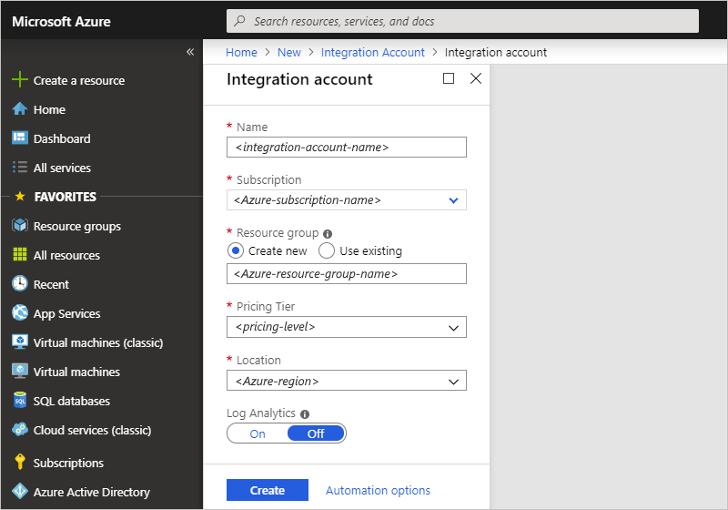
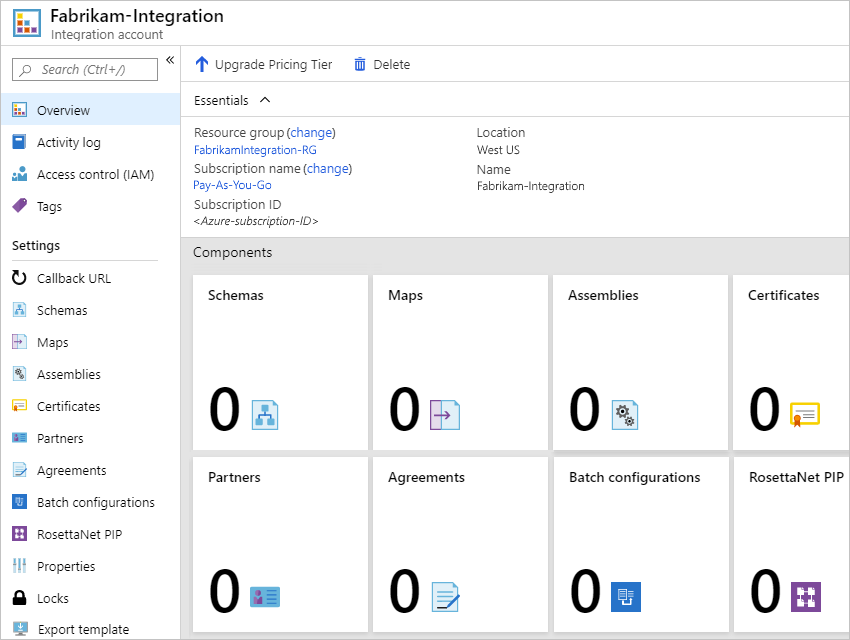

# Create and manage integration accounts for B2B solutions with logic apps

To build [enterprise integration and B2B solutions](../logic-apps/logic-apps-enterprise-integration-overview.md) 
with [Azure Logic Apps](../logic-apps/logic-apps-overview.md), 
you must first have an integration account where you can create, 
store, and manage B2B artifacts, such as trading partners, agreements, 
maps, schemas, certificates, and so on. This article shows you how 
to perform these tasks:

* Create your integration account.
* Link your integration account to a logic app.
* Move your integration account to another Azure resource group or subscription.
* Delete your integration account.

Before your logic app can work with the artifacts in your integration 
account and use the Logic Apps B2B connectors, such as XML validation, 
you must [link your integration account](#link-account) 
to your logic app. Both your integration account and 
logic app must exist the *same* Azure location, or region.

If you don't have an Azure subscription, 
<a href="https://azure.microsoft.com/free/" target="_blank">sign up for a free Azure account</a>.

## Sign in to the Azure portal

Sign in to the <a href="https://portal.azure.com" target="_blank">Azure portal</a> 
with your Azure account credentials.

## Create an integration account

1. From the main Azure menu, select **All services**. 
In the search box, enter "integration accounts" as your filter, 
and select **Integration accounts**.

   

2. Under **Integration accounts**, choose **Add**.

   

3. Provide information about your integration account: 

   

   | Property | Required | Example value | Description | 
   |----------|----------|---------------|-------------|
   | Name | Yes | test-integration-account | The name for your integration account. For this example, use the specified name. | 
   | Subscription | Yes | <*Azure-subscription-name*> | The name for the Azure subscription to use | 
   | Resource group | Yes | test-integration-account-rg | The name for the [Azure resource group](../azure-resource-manager/resource-group-overview.md) used to organize related resources. For this example, create a new resource group with the specified name. | 
   | Pricing Tier | Yes | Free | The pricing tier that you want to use. For this example, select **Free**. | 
   | Location | Yes | West US | The region where to store your integration account information. Either select the same location as your logic app, or create a logic app in the same location as your integration account. For this example, | 
   | Log Analytics | No | Off | Keep the **Off** setting for diagnostic logging. | 
   ||||| 

4. When you're ready, select **Pin to dashboard**, and choose **Create**.

   After Azure deploys your integration account to the 
   selected location, which usually finishes within one minute, 
   your integration account opens.

   

Now, before your logic app can use your integration account, 
you must link the integration account to your logic app.

## Link integration account to your logic app

To give your logic apps access to an integration account that contains 
your B2B artifacts, such as trading partners, agreements, maps, 
and schemas, you must link your integration account to your logic app. 

> [!NOTE]
> Your integration account and logic app must exist in the same region.

1. In the Azure portal, find and open your logic app.

2. On your logic app's menu, under **Settings**, 
select **Workflow settings**. In the 
**Select an Integration account** list, 
select the integration account to link to your logic app.

   

3. To finish linking, choose **Save**.

   

   When your integration account is successfully linked, 
   Azure shows a confirmation message. 

   

Now your logic app can use any and all the artifacts in your 
integration account plus the B2B connectors, 
such as XML validation and flat file encoding or decoding.  

## Move your integration account

You can move your integration account to 
another Azure subscription or resource group.

1. On the main Azure menu, select **All services**. 
In the search box, enter "integration accounts" as your filter, 
and select **Integration accounts**.

   

2. Under **Integration accounts**, select the integration 
account that you want to move. On your integration account menu, 
under **Settings**, choose **Properties**.

   

3. Change either the Azure resource group or subscription for your integration account.

   

 4. When you're done, make sure that you update any and all 
 scripts with the new resource IDs for your artifacts.  

## Delete your integration account

1. On the main Azure menu, select **All services**. 
In the search box, enter "integration accounts" as your filter, 
and select **Integration accounts**.

   

2. Under **Integration accounts**, select the integration 
account that you want to delete. On the integration account menu, 
choose **Overview**, then choose **Delete**. 

   

3. To confirm that you want to delete your integration account, choose **Yes**.

   

## Next steps

* [Create trading partners](../logic-apps/logic-apps-enterprise-integration-partners.md)
* [Create agreements](../logic-apps/logic-apps-enterprise-integration-agreements.md)