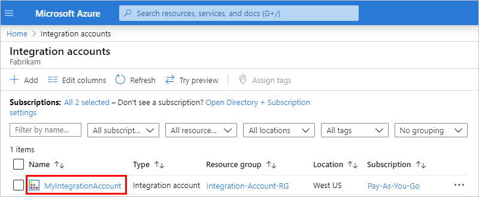
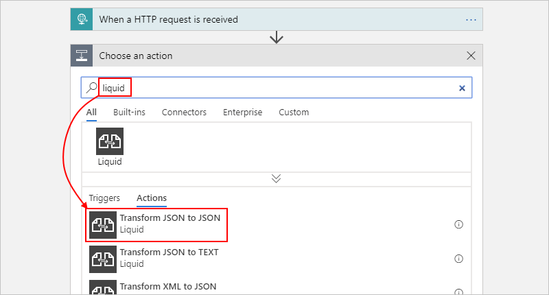
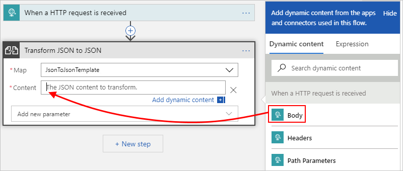

# Enterprise integration with liquid template
## Overview
Logic Apps support basic JSON transformations through native Data Operation actions like Compose or Parse JSON. Logic Apps now also support advanced json transformations via Liquid templates. [Liquid](https://shopify.github.io/liquid/) is an open-source, safe, customer-facing template language for flexible web apps.
 
In this document, we are going to cover Liquid action, which uses liquid maps or templates to support more complex json transformations, such as iteration, control flow, variables etc. To use liquid action in your logic app, you need to define JSON to JSON mapping through a liquid map, and store it in the Integration Account. 


### Prerequisites
Here are the prerequisites to use the liquid action:

* An Azure subscription. If you don't have a subscription, you can 
[start with a free Azure account](https://azure.microsoft.com/free/). 
Otherwise, you can [sign up for a Pay-As-You-Go subscription](https://azure.microsoft.com/pricing/purchase-options/).

* Basic knowledge about [how to create logic apps](../logic-apps/logic-apps-create-a-logic-app.md). 

* Basic [Integration Account](logic-apps-enterprise-integration-create-integration-account.md).


### Upload liquid template or map to integration account

* Follow the steps below to select your integration account
  * Choose **All services**.
  * Provide your integration account name in the text box, which is myintegrationaccount in this example.
  * Select your integration account.

    

* On the integration account tile, select **Maps**.

  

* Choose **Add** and provide the Map details
  * **Name**: The name used to identify the map, which is JsontoJsonTemplate in this example.
  * **Map type**: The type of map, which must be liquid for JSON to JSON transformation
  * **Map**: The liquid map or template for transformation. Use file picker to select the file, which is SimpleJsonToJsonTemplate.liquid in this example.

    

    Liquid template defines how you want to transform JSON input. Here are the content of Map used in previous step.

    ```
    
    {
        "fullName": "{{content.firstName | Append: ' ' | Append: content.lastName}}",
        "firstNameUpperCase": "{{content.firstName | Upcase}}",
        "phoneAreaCode": "{{content.phone | Slice: 1, 3}}",
        "devices" : [
        
            
            "{{device}}"
            
            "{{device}}",
            
        
        ]
    }
    ```
    > [!NOTE]
    > If you are using any [filters](https://shopify.github.io/liquid/basics/introduction/#filters) in liquid template, they must start with an upper case. 


### Use Liquid action for JSON to JSON transformation

* [Create a logic app](logic-apps-create-a-logic-app.md).

* Add [Request trigger](../connectors/connectors-native-reqres.md#use-the-http-request-trigger) to your logic app.

* Choose **+ New step > Add an action**. Search for *liquid* in the search box. Select **Liquid - Transform JSON to JSON**.

  

* In the **Content** , select **Body** from Dynamic content picker. 
  
  
 
* In the **Map**, select your map from the drop-down, which is JsonToJsonTemplate in this example. Select **Save** to save your logic app.

  

   If the drop-down is empty, you likely do not have an integration account associated to the logic app. Follow these steps to link the logic app to your integration account that contains the liquid template or map.

   * For your logic app, select **Workflow settings**. 
   * In **Integration Account** drop down, select your integration account name and then choose **Save**.

     


### Results
* To test your logic app, post JSON input to your logic app from [Postman](https://www.getpostman.com/postman) or similar tool. 
You should see the transformed JSON in the output, like the example below.
  
  


## Learn more
* [Learn more about the Enterprise Integration Pack](../logic-apps/logic-apps-enterprise-integration-overview.md "Learn about Enterprise Integration Pack")  
* [Learn more about maps](../logic-apps/logic-apps-enterprise-integration-maps.md "Learn about enterprise integration maps")  

