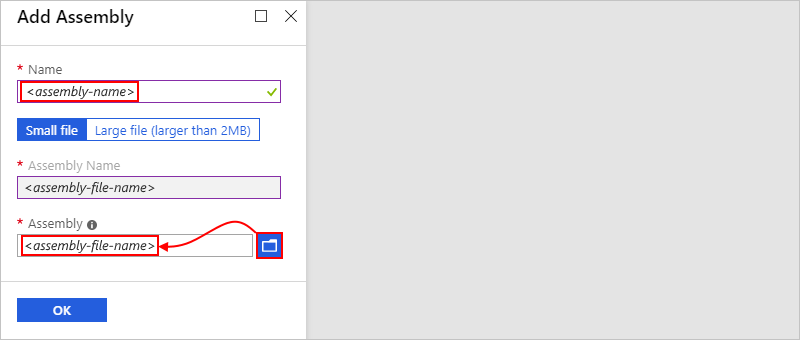

# Transform XML with maps in Azure Logic Apps with Enterprise Integration Pack

To transfer XML data between formats in enterprise integration scenarios, 
logic apps linked to integration accounts can use maps, or more specifically, 
Extensible Stylesheet Language Transformations (XSLT) maps. A map is an XML 
document that describes how to transform data in a document into another format. 

When and why do you use maps? Suppose that you regularly receive B2B orders 
or invoices from a customer who uses the YYYMMDD date format. However, 
your organization uses the MMDDYYY date format. You can define and use a map 
that transforms the YYYMMDD date format to the MMDDYYY format before storing 
the order or invoice details in your customer activity database.

## Prerequisites

* An Azure subscription. If you don't have a subscription, 
<a href="https://azure.microsoft.com/free/" target="_blank">sign up for a free Azure account</a>.

* A basic [integration account](../logic-apps/logic-apps-enterprise-integration-create-integration-account.md) 
where you want to store your maps 

Before you can use your integration account and map in your logic app, 
your logic app needs a link to that integration account. Learn 
[how to link logic apps to integration accounts](logic-apps-enterprise-integration-create-integration-account.md#link-account). 
If you don't have a logic app yet, learn [how to create logic apps](../logic-apps/quickstart-create-first-logic-app-workflow.md). 

## Create maps

To create an XSLT document you can use as a map, 
you can use Visual Studio 2015 for creating a 
BizTalk Integration project by using the 
[Enterprise Integration Pack](logic-apps-enterprise-integration-overview.md). 
In this project, you can build an integration map file, 
which lets you visually map items between two XML schema files. 
After you build this project, you get an XSLT document.

If your map references an external assembly, you have to upload 
*both the assembly and the map* to your integration account. 
Make sure you upload the assembly first, and then upload the 
map that references the assembly.

## Add referenced assemblies

1. Sign in to the <a href="https://portal.azure.com" target="_blank">Azure portal</a> 
with your Azure account credentials.

1. To find and open your integration account, 
on the main Azure menu, select **All services**. 
In the search box, enter "integration account". 
Select **Integration accounts**.

   

1. Select the integration account where you want to add your assembly, 
for example:

   

1. On your integration account's **Overview** page, 
under **Components**, select the **Assemblies** tile.

   

1. Under **Assemblies**, choose **Add**. 

   

1. Upload your assembly by following these steps:

   1. Under **Add Assembly**, enter a name for your assembly. 

   1. For assembly files that are 2 MB or smaller, leave **Small file** selected. 
   Otherwise, choose **Large file (larger than 2 MB)**.

   1. Next to the **Assembly** box, choose the folder icon.

   1. Find and select the assembly you're uploading. 

      In the **Assembly Name** property, the assembly's file 
      name appears automatically after you select the assembly.

      

   1. When you're ready, choose **OK**. 
   After your assembly file finishes uploading, 
   the assembly appears in the **Assemblies** list.

      

      On your integration account's **Overview** page, 
	  under **Components**, the **Assemblies** tile now 
	  shows the number of uploaded assemblies, for example:

      

## Add maps

After you upload any assemblies that your map references, 
you can now upload your map.

1. If you haven't signed in already, sign in to the 
<a href="https://portal.azure.com" target="_blank">Azure portal</a> 
with your Azure account credentials. 

1. If your integration account isn't already open, 
on the main Azure menu, select **All services**. 
In the search box, enter "integration account". 
Select **Integration accounts**.

   

1. Select the integration account where you want to add your map, 
for example:

   

1. On your integration account's **Overview** page, 
under **Components**, select the **Maps** tile.

   

1. After the Maps page opens, choose **Add**.

	  

1. Enter a **Name** for your map. To upload the map file, 
choose the folder icon on the right side of the **Map** text box. 
After the upload process completes, choose **OK**.

	

1. After Azure adds the map to your integration account, 
you get an onscreen message that shows whether your map file 
was added or not. After you get this message, 
choose the **Maps** tile so you can view the newly added map.

	

## Edit maps

You must upload a new map file with the changes that you want. 
You can first download the map for editing.

To upload a new map that replaces the existing map, 
follow these steps.

1. Choose the **Maps** tile.

2. After the Maps page opens, select the map that you want to edit.

3. On the **Maps** page, choose **Update**.

	

4. In the file picker, select the map file that you want to upload, 
then select **Open**.

	

## Delete maps

1. Choose the **Maps** tile.

1. After the Maps page opens, select the map you want to delete.

1. Choose **Delete**.

   

1. Confirm that you want to delete the map.

   

## Next Steps

* [Learn more about the Enterprise Integration Pack](logic-apps-enterprise-integration-overview.md "Learn about Enterprise Integration Pack")  
* [Learn more about agreements](../logic-apps/logic-apps-enterprise-integration-agreements.md "Learn about enterprise integration agreements")  
* [Learn more about transforms](logic-apps-enterprise-integration-transform.md "Learn about enterprise integration transforms")  

