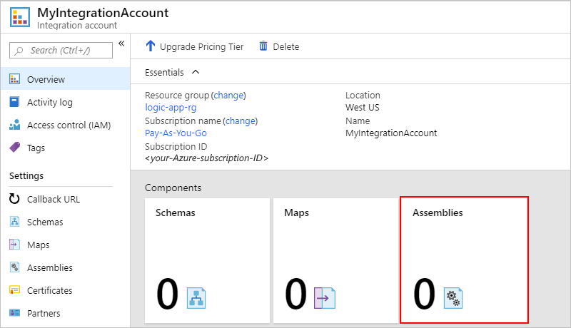
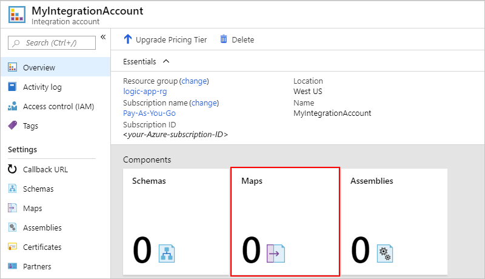
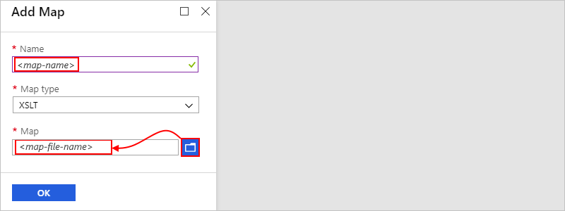

# Transform XML with maps in Azure Logic Apps with Enterprise Integration Pack

To transfer XML data between formats for enterprise integration scenarios 
in Azure Logic Apps, your logic app can use maps, or more specifically, 
Extensible Stylesheet Language Transformations (XSLT) maps. A map is an XML 
document that describes how to convert data from an XML document into another format. 

For example, suppose you regularly receive B2B orders or invoices from 
a customer who uses the YYYMMDD date format. However, your organization 
uses the MMDDYYY date format. You can define and use a map that transforms 
the YYYMMDD date format to the MMDDYYY format before storing the order or 
invoice details in your customer activity database.

For limits related to integration accounts and artifacts such as maps, 
see [Limits and configuration information for Azure Logic Apps](../logic-apps/logic-apps-limits-and-config.md#integration-account-limits).

## Prerequisites

* An Azure subscription. If you don't have a subscription, 
<a href="https://azure.microsoft.com/free/" target="_blank">sign up for a free Azure account</a>.

* An [integration account](../logic-apps/logic-apps-enterprise-integration-create-integration-account.md) 
where you store your maps and other artifacts for enterprise 
integration and business-to-business (B2B) solutions.

You don't need a logic app when creating and adding maps. However, 
to use a map, your logic app needs linking to an integration account 
where you store that map. Learn 
[how to link logic apps to integration accounts](../logic-apps/logic-apps-enterprise-integration-create-integration-account.md#link-account). 
If you don't have a logic app yet, learn [how to create logic apps](../logic-apps/quickstart-create-first-logic-app-workflow.md). 

## Create maps

To create an XSLT document you can use as a map, 
you can use Visual Studio 2015 for creating a 
BizTalk Integration project by using the 
[Enterprise Integration Pack](logic-apps-enterprise-integration-overview.md). 
In this project, you can build an integration map file, 
which lets you visually map items between two XML schema files. 
After you build this project, you get an XSLT document.

If your map references an external assembly, you have to upload 
*both the assembly and the map* to your integration account. 
Make sure you upload the assembly first, and then upload the 
map that references the assembly.

## Add referenced assemblies

1. Sign in to the <a href="https://portal.azure.com" target="_blank">Azure portal</a> 
with your Azure account credentials.

1. To find and open your integration account, 
on the main Azure menu, select **All services**. 
In the search box, enter "integration account". 
Select **Integration accounts**.

   

1. Select the integration account where you want to add your assembly, 
for example:

   

1. On your integration account's **Overview** page, 
under **Components**, select the **Assemblies** tile.

   

1. After the **Assemblies** page opens, choose **Add**.

   

1. Upload the assembly by following these steps:

   1. Under **Add Assembly**, enter a name for your assembly.

   1. For assembly files that are 2 MB or smaller, leave **Small file** selected. 
   Otherwise, choose **Large file (larger than 2 MB)**.

   1. Next to the **Assembly** box, choose the folder icon.

   1. Find and select the assembly you're uploading, for example: 

      

      In the **Assembly Name** property, the assembly's file 
      name appears automatically after you select the assembly.

   1. When you're ready, choose **OK**. 
   After your assembly file finishes uploading, 
   the assembly appears in the **Assemblies** list.

      

      On your integration account's **Overview** page, 
      under **Components**, the **Assemblies** tile now 
      shows the number of uploaded assemblies, for example:

      

      For limits on assembly quantities in integration accounts, see 
      [Limits and configuration for Azure Logic Apps](../logic-apps/logic-apps-limit-and-config.md#artifact-capacity-limits.md#artifact-number-limits).

## Add maps

After you upload any assemblies that your map references, 
you can now upload your map.

1. If you haven't signed in already, sign in to the 
<a href="https://portal.azure.com" target="_blank">Azure portal</a> 
with your Azure account credentials. 

1. If your integration account isn't already open, 
on the main Azure menu, select **All services**. 
In the search box, enter "integration account". 
Select **Integration accounts**.

   

1. Select the integration account where you want to add your map, 
for example:

   

1. On your integration account's **Overview** page, 
under **Components**, select the **Maps** tile.

   

1. After the **Maps** page opens, choose **Add**.

     

1. Upload your map by following these steps:

   1. Under **Add Map**, enter a name for your map.

   1. Under **Map type**, select the type, for example: 
   **Liquid**, **XSLT**, **XSLT 2.0**, or **XSLT 3.0**.

   1. Next to the **Map** box, choose the folder icon.

   1. Find and select the map file you're uploading, for example:

      

      If you left the **Name** property empty, the map's file name automatically 
      appears in that property automatically after you select the map file. 
      However, you can use any unique name.

      For limits on map sizes, see [Limits and configuration for Azure Logic Apps](../logic-apps/logic-apps-limit-and-config.md#artifact-capacity-limits).

   1. When you're ready, choose **OK**. 
   After your map file finishes uploading, 
   the map appears in the **Maps** list.

      

      On your integration account's **Overview** page, 
      under **Components**, the **Maps** tile now 
      shows the number of uploaded maps, for example:

      

      For limits on map quantities in integration accounts, see 
      [Limits and configuration for Azure Logic Apps](../logic-apps/logic-apps-limit-and-config.md#artifact-capacity-limits.md#artifact-number-limits).

## Edit maps

To update an existing map, you have to upload a new 
map file that has the changes you want. However, 
you can first download the existing map for editing.

1. In the <a href="https://portal.azure.com" target="_blank">Azure portal</a>, 
find and open your integration account, if not already open.

1. On the main Azure menu, select **All services**. 
In the search box, enter "integration account". 
Select **Integration accounts**.

   

1. Select the integration account where you want to update your map, 
for example:

   

1. On your integration account's **Overview** page, 
under **Components**, select the **Maps** tile.

   

1. After the **Maps** page opens, select your map. 
To download and edit the map first, choose **Download**, 
and save the map.

     

1. When you're ready to upload the updated map, on the **Maps** page, 
select the map you want to update, and choose **Update**.

   

1. Find and select the updated map you want to upload. 
After your map file finishes uploading, 
the updated map appears in the **Maps** list.

## Delete maps

1. In the <a href="https://portal.azure.com" target="_blank">Azure portal</a>, 
find and open your integration account, if not already open.

1. On the main Azure menu, select **All services**. 
In the search box, enter "integration account". 
Select **Integration accounts**.

   

1. Select the integration account where you want to update your map, 
for example:

   

1. On your integration account's **Overview** page, 
under **Components**, select the **Maps** tile.

   

1. After the **Maps** page opens, select your map, 
and choose **Delete**.

   

1. To confirm you want to delete the map, choose **Yes**.

   

## Next steps

* [Learn more about the Enterprise Integration Pack](logic-apps-enterprise-integration-overview.md "Learn about Enterprise Integration Pack")  
* [Learn more about agreements](../logic-apps/logic-apps-enterprise-integration-agreements.md "Learn about enterprise integration agreements")  
* [Learn more about transforms](logic-apps-enterprise-integration-transform.md "Learn about enterprise integration transforms")  

