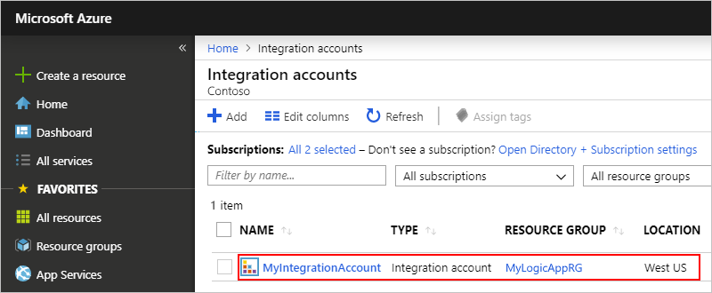
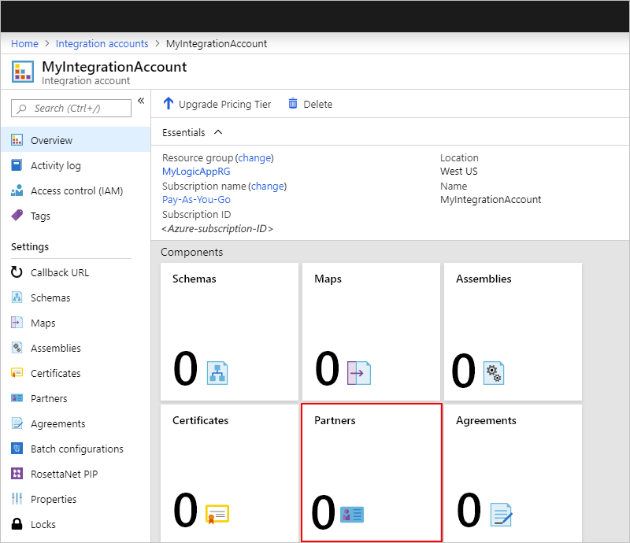
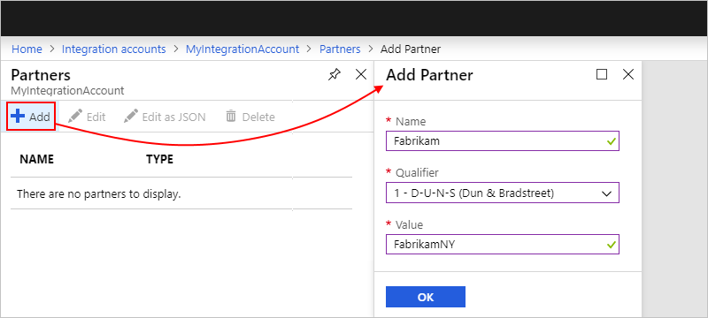
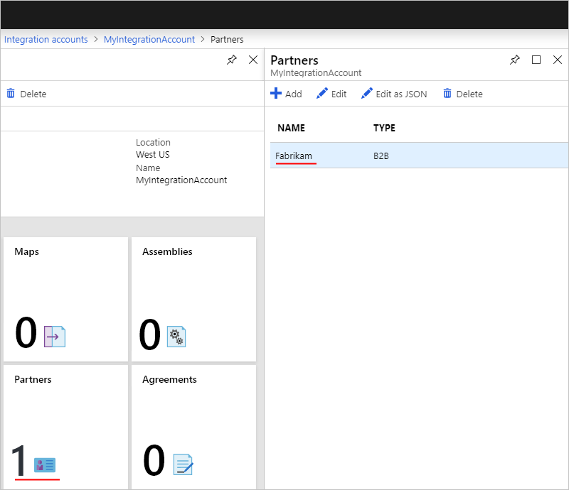
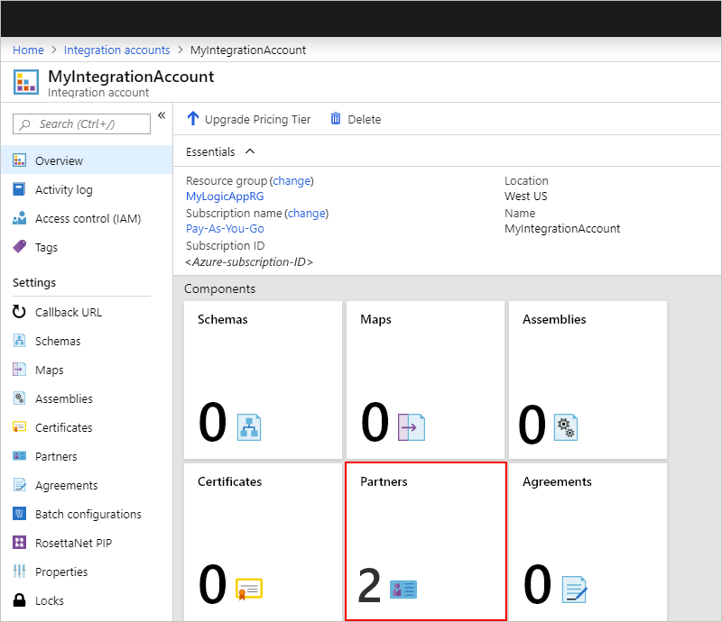
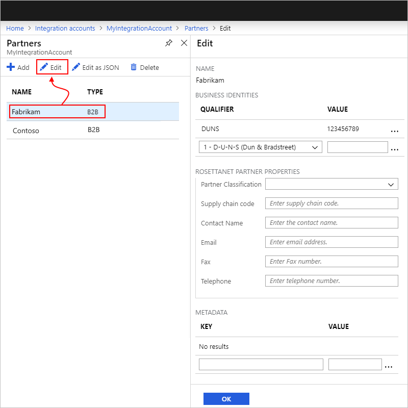
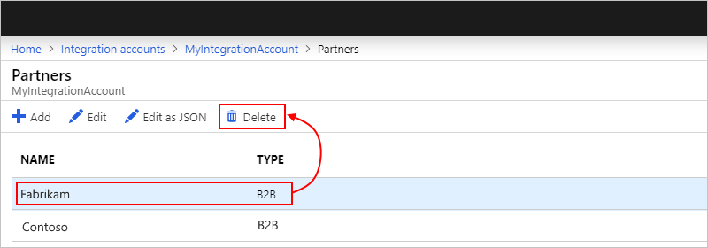

# Add trading partners to integration accounts for Azure Logic Apps

In [Azure Logic Apps](../logic-apps/logic-apps-overview.md), you can create automated business-to-business (B2B) integration workflows by using an [integration account](../logic-apps/logic-apps-enterprise-integration-create-integation-account.md) with your logic apps. To represent your organization and others, you create and add trading partners as artifacts to your integration account. Partners are entities that participate in B2B transactions and exchange messages with each other.

Before creating these partners, make sure to discuss and share information with your partners about how to identify and validate the messages that the other sends. After you agree on these details, you're ready to create partners in your integration account.

## Partner roles in integration accounts

To define the details about the messages exchanged with your partners, you create and add [agreements](../logic-apps/logic-apps-enterprise-integration-agreements.md) as artifacts to your integration account. Agreements require at least two partners in your integration account. Your organization is always the *host partner* in the agreement. The organization that exchanges messages with your organization is the *guest partner*. A guest partner can be another company, or even a department in your own organization. After you add these partners, you can create an agreement.

In an agreement, you specify the details for handling incoming and outgoing messages from the host partner's perspective. For incoming messages, the **Receive Settings** specify how the host partner receives messages from the guest partner in the agreement. For outgoing messages, the **Send Settings** specify how the host partner sends messages to the guest partner.

## Create partner

1. Sign in to the [Azure portal](https://portal.azure.com).

1. On the main Azure menu, select **All services**. In the search box, enter "integration", and select **Integration accounts**.

   

1. Under **Integration Accounts**, select the integration account where you want to add your partners.

   

1. Choose the **Partners** tile.

   

1. Under **Partners**, choose **Add**. Under **Add Partner**, provide the partner's details as described by the table below.

   

   | Property | Required | Description |
   |----------|----------|-------------|
   | **Name** | Yes | The partner's name |
   | **Qualifier** | Yes | The authenticating body that provides unique business identities to organizations. For example, **D-U-N-S (Dun & Bradstreet)**. 
Partners can opt for a mutually defined business identity. For these scenarios, select **Mutually Defined** for EDIFACT or **Mutually Defined (X12)** for X12. 
For RosettaNet, select only **DUNS**, which is the standard. |
   | **Value** | Yes | A value that identifies the documents that your logic apps receive. 
For RosettaNet, this value must be a nine digit number that corresponds to the DUNS number. |
   ||||

   > [!NOTE]
   > For partners that use RosettaNet, you can specify additional information by first creating these partners and then [editing them afterwards](#edit-partner).

1. When you're done, choose **OK**.

   Your new partner now appears on the **Partners** list. Also, the **Partners** tile updates the current number of partners.

   

## Edit partner

1. In the [Azure portal](https://portal.azure.com), find and select your integration account.
Choose the **Partners** tile.

   

1. Under **Partners**, select the partner that you want to edit, and choose **Edit**. Under **Edit**, make your changes.

   

   For RosettaNet, under **RosettaNet Partner Properties**, you can specify this additional information:

   | Property | Required | Description |
   |----------|----------|-------------|
   | **Partner Classification** | No | The partner's organization type |
   | **Supply chain code** | No | The partner's supply chain code, for example, "Information Technology" or "Electronic Components" |
   | **Contact Name** | No | The partner's contact name |
   | **Email** | No | The partner's email address |
   | **Fax** | No | The partner's fax number |
   | **Telephone** | No | The partner's phone number |
   ||||

1. When you're done, choose **OK** to save your changes.

## Delete partner

1. In the [Azure portal](https://portal.azure.com), find and select your integration account. Choose the **Partners** tile.

   

1. Under **Partners**, select the partner that you want to delete. Choose **Delete**.

   

## Next steps

* Learn more about [agreements](../logic-apps/logic-apps-enterprise-integration-agreements.md)